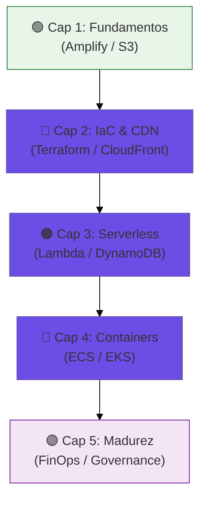
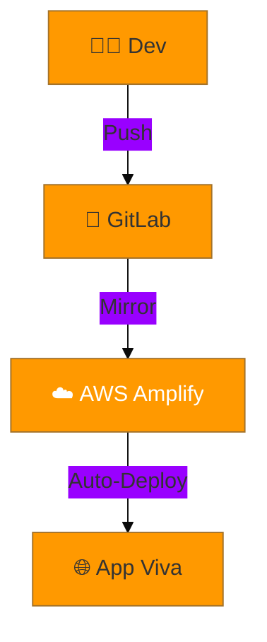
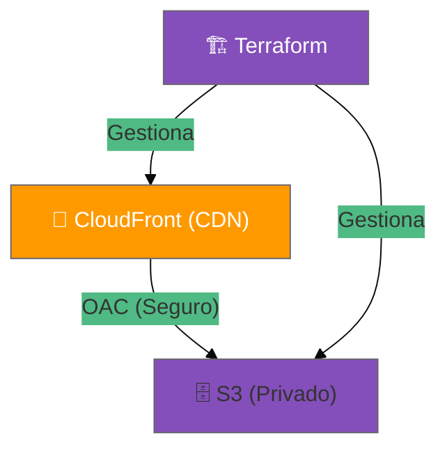
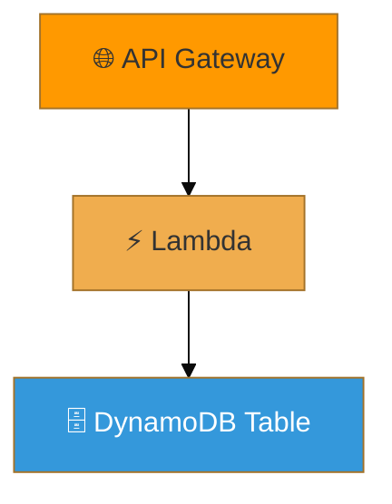
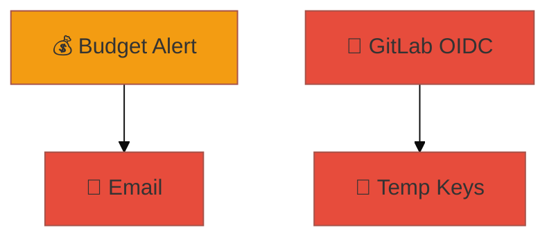

# 📖 AWS Cloud Journey: El Libro del Repositorio

> **Autor**: Vladimir Acuña  
> **Enfoque**: Evolución técnica desde hosting estático hasta gobernanza empresarial.

---

## 🗺️ Mapa de la Jornada

Este "libro" técnico consolida el conocimiento de todos los casos de estudio de este monorepo. No es solo un manual; es una narración de cómo una arquitectura simple evoluciona bajo presión de seguridad, escalabilidad y costos.

---

## 📜 Tabla de Contenidos

1. [Introducción: La Filosofía del Monorepo](#introducción)
2. [Capítulo 1: Los Fundamentos (ClickOps y S3)](#capítulo-1)
3. [Capítulo 2: El Poder de Terraform y CloudFront](#capítulo-2)
4. [Capítulo 3: Backend Reactivo (Serverless Pro)](#capítulo-3)
5. [Capítulo 4: Orquestación a Gran Escala (ECS y EKS)](#capítulo-4)
6. [Capítulo 5: Excelencia Operativa (FinOps)](#capítulo-5)
7. [Conclusión: El Futuro de la Nube](#conclusión)

---

## Introducción

Este repositorio nació para resolver una pregunta común: *¿Cómo paso de un prototipo a una infraestructura de producción?*. A lo largo de estas páginas, veremos cómo cada tecnología resuelve un problema específico del "Capítulo" anterior.

---

## Capítulo 1: Los Fundamentos (ClickOps y S3)

### La Simplicidad de AWS Amplify (Caso A)
La jornada comienza con **Amplify**. Es la entrada más rápida a la nube. Ideal para desarrolladores que quieren delegar la infraestructura y enfocarse en el código.

**Arquitectura:**

### Hosting en S3 con Pipelines (Caso B)
Aquí quitamos las "ruedas de entrenamiento". Aprendemos que Amplify usa **S3** por debajo. En este nivel, gestionamos nuestro propio bucket y el flujo de `aws s3 sync`.

---

## Capítulo 2: El Poder de Terraform y CloudFront (Caso C)

### De ClickOps a IaC
El problema del Capítulo 1 es que si borras el bucket, tienes que recrearlo a mano. Con **Terraform**, la infraestructura es código. Es representable, auditable y destruible.

**El Salto de Seguridad (OAC):**
A diferencia del Caso B, aquí el bucket es **privado**. Usamos **CloudFront** (CDN) para entregar el contenido.

---

## Capítulo 3: Backend Reactivo (Serverless Pro)

### La Magia de Lambda y SAM (Caso D)
Ya no solo servimos archivos estáticos. Ahora tenemos lógica. **AWS Lambda** nos permite ejecutar backend solo cuando alguien lo pide. Costo: $0 si nadie entra.

### Persistencia Single-Table (Caso E)
El modelado de datos evoluciona. Ya no usamos tablas relacionales pesadas; usamos **DynamoDB** con una sola tabla para maximizar la velocidad.

**Flujo de Datos:**

---

## Capítulo 4: Orquestación a Gran Escala (ECS y EKS)

### ECS Fargate (Caso J)
Cuando el backend es complejo o requiere dependencias de sistema específicas, pasamos a **Contenedores**. Fargate es "Serverless containers".

### Kubernetes EKS (Caso K)
El nivel máximo. Si tu flota de microservicios es inmensa, EKS te da el control total con el estándar de la industria.

---

## Capítulo 5: Excelencia Operativa (FinOps)

### Gobernanza y Zero-Trust (Caso L)
Finalmente, aprendemos que la tecnología sin control es un riesgo.
- **OIDC**: Eliminamos las llaves permanentes (IAM Keys).
- **FinOps**: Ponemos límites de costo para no llevarnos sorpresas al final del mes.

---

## Conclusión

Esta trayectoria desde el **Caso A** hasta el **Caso L** representa el crecimiento de un Ingeniero de Cloud. De "funciona en mi máquina" a "está gobernado, escalado y asegurado en la nube".

---
*Fin del Libro — [Volver al README](README.md)*
