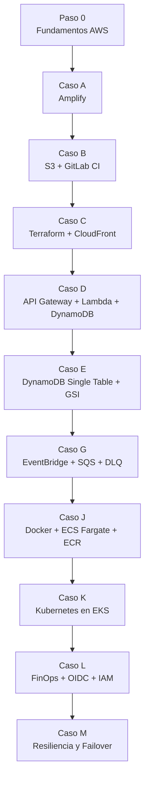

# AWS Cloud Journey

> Autor: Vladimir Acuna
> Edicion: 3.0 - Author's Cut
> Proposito: construir un libro propio, con criterio tecnico, caracter editorial y una lectura progresiva sobre madurez cloud en AWS.
> Base documental: este repositorio, su documentacion interna y referencias oficiales de AWS.
> Ultima actualizacion documental: 12 de marzo de 2026

---

## Manifiesto

Este libro no intenta competir con la documentacion oficial de AWS ni reemplazar los grandes libros de arquitectura cloud. Su valor es otro: convertir experiencia practica, decisiones reales y errores evitados en una narrativa propia.

Lo distintivo de este material es que no parte desde teoria abstracta, sino desde un repositorio vivo que evoluciona por niveles:

- primero aprender a publicar,
- luego automatizar,
- despues modelar datos y backend,
- mas tarde operar contenedores,
- y finalmente gobernar costo, seguridad y resiliencia.

Ese recorrido le da identidad. No es un libro generico sobre AWS. Es un libro sobre como se construye criterio tecnico en AWS.

---

## Como leer este libro

Hay tres formas validas de recorrerlo:

### Ruta 1: aprendizaje progresivo

Ideal para quienes vienen subiendo de nivel en cloud engineering.

1. Fundamentos de AWS
2. Hosting estatico
3. IaC y CDN
4. Serverless
5. DynamoDB y modelado
6. Contenedores
7. Kubernetes
8. FinOps, IAM y resiliencia

### Ruta 2: lectura ejecutiva

Ideal para reclutadores, lideres tecnicos o gerencia.

- leer el resumen ejecutivo,
- revisar la tabla de madurez,
- saltar a los casos `C`, `E`, `L` y `M`.

### Ruta 3: lectura de arquitecto

Ideal para comparar trade-offs.

- leer principios de diseno,
- revisar las decisiones por caso,
- terminar con los patrones transversales y la hoja de evolucion.

---

## Resumen ejecutivo

Este repositorio demuestra una progresion realista de madurez cloud sobre AWS:

| Etapa | Capacidad principal | Servicios clave | Leccion central |
|---|---|---|---|
| Fundamentos | Entender la nube antes de operar | IAM, Regions, AZ, VPC | Sin contexto, cualquier despliegue es fragil |
| Hosting | Publicar rapido y con criterio | Amplify, S3 | La velocidad sirve, pero el control importa |
| Profesionalizacion | Hacer infraestructura repetible | Terraform, CloudFront, DynamoDB state lock | Lo manual no escala ni audita bien |
| Serverless | Backend elastico y eventos | API Gateway, Lambda, DynamoDB, SAM | Menos servidores no significa menos arquitectura |
| Datos | Modelar por patrones de acceso | DynamoDB, GSI, TransactWriteItems | El diseño de datos define el rendimiento |
| Contenedores | Portabilidad y ejecucion durable | Docker, ECR, ECS Fargate, ALB | Contenerizar es estandarizar |
| Orquestacion | Operar plataformas mas complejas | EKS, kubectl, YAML, Terraform | Kubernetes aporta poder y tambien costo operativo |
| Gobernanza | Controlar riesgo y gasto | IAM, OIDC, Budgets, Cost Explorer | Seniority tambien es operar con responsabilidad |
| Resiliencia | Prepararse para fallos reales | Route 53, health checks, Multi-AZ, failover | La continuidad se diseña y se ensaya |

---

## Tesis central del libro

La nube no se domina memorizando servicios. Se domina cuando cada decision tecnica ya incorpora cuatro preguntas desde el principio:

1. Es seguro.
2. Es operable.
3. Es financieramente razonable.
4. Resiste fallos acordes al contexto del negocio.

Si una arquitectura despliega pero no responde esas cuatro preguntas, todavia no es una arquitectura madura.

---

## Mapa de la jornada

---

## Principios de diseno que atraviesan todo el repositorio

### 1. Servicios administrados primero

Siempre que la necesidad lo permite, conviene delegar undifferentiated heavy lifting a AWS. Esto aparece con claridad en Amplify, CloudFront, Lambda, DynamoDB, Fargate y el control plane de EKS.

### 2. Seguridad desde el primer diseno

La seguridad no aparece como apendice. Se ve en el paso de buckets publicos a origen privado con CloudFront, en el uso de IAM de minimo privilegio y en la transicion desde access keys permanentes hacia OIDC.

### 3. Infraestructura declarativa sobre operacion manual

El paso desde consola hacia Terraform y SAM no es estetico. Es una mejora en auditabilidad, repetibilidad y control del cambio.

### 4. Cost awareness continuo

El repositorio no romantiza AWS. Expone claramente que ALB, NAT Gateway, Fargate y EKS tienen costos reales. Por eso FinOps no aparece al final como un capitulo financiero, sino como un criterio de arquitectura.

### 5. Evolucion por capas, no por moda

El repositorio no salta de HTML a Kubernetes por vanidad tecnica. Cada etapa agrega una necesidad nueva y eso le da legitimidad a la complejidad siguiente.

---

## Fundamentos que deben quedar claros antes de cualquier despliegue

### Modelo de responsabilidad compartida

AWS protege la infraestructura global; el cliente protege configuraciones, identidades, cifrado, datos, politicas y exposicion publica. Este repo lo prueba con ejemplos concretos:

- en `Caso B`, un bucket mal configurado expone contenido,
- en `Caso C`, CloudFront + OAC reduce esa superficie,
- en `Caso L`, OIDC elimina una parte importante del riesgo asociado a secretos de larga duracion,
- en `Caso M`, la resiliencia depende del diseno del cliente, no de una promesa generica del proveedor.

### Regiones, AZ y diseno de disponibilidad

Una region no es una zona de disponibilidad. Una AZ no es una estrategia de disaster recovery. Y un servicio administrado no garantiza por si solo continuidad operacional multi-region.

### IAM como lenguaje de control

IAM no es solo un requisito de acceso; es el lenguaje con el que se expresa la politica de seguridad del sistema. En este libro, IAM aparece como base de deploy, gobierno, OIDC, limitacion regional y minimo privilegio.

---

## Capitulo I. Fundamentos y hosting

### Caso A: AWS Amplify

#### Lo que demuestra

`Caso A` demuestra el camino de menor friccion para publicar rapido un frontend moderno conectado a un repositorio.

#### Aprendizajes tecnicos

- Amplify acelera la salida a produccion para frontends estaticos o JAMstack.
- La integracion con branches y previews mejora feedback de cambios.
- La abstraccion de hosting, certificados y CDN reduce tiempo operativo.

#### Trade-off real

Lo que se gana en velocidad se pierde en control fino. Para muchos casos de portfolio, laboratorio o MVP, eso es correcto. Para entornos con requisitos estrictos de networking, compliance o personalizacion de borde, suele ser insuficiente.

#### Leccion editorial del libro

La madurez tecnica no consiste en despreciar soluciones sencillas. Consiste en saber cuando una solucion sencilla ya cumplio su trabajo.

Referencias AWS:

- [Web previews for pull requests - AWS Amplify Hosting](https://docs.aws.amazon.com/amplify/latest/userguide/pr-previews.html)
- [Deploying a static website to AWS Amplify Hosting from an S3 bucket](https://docs.aws.amazon.com/AmazonS3/latest/userguide/website-hosting-amplify.html)

---

### Caso B: S3 + GitLab CI

#### Lo que demuestra

`Caso B` lleva el control del despliegue a un pipeline visible y manualmente entendible.

#### Aprendizajes tecnicos

- `aws s3 sync --delete` ayuda a mantener consistencia entre fuente y destino.
- El pipeline revela la mecanica real de credenciales, permisos y jobs de deploy.
- El hosting estatico nativo de S3 es excelente para aprender fundamentos de publicacion web en AWS.

#### Riesgo y realidad

Este caso tambien deja una leccion importante: S3 website hosting expone limitaciones claras para usos mas serios, especialmente si se necesita HTTPS robusto, menor exposicion publica o mejores practicas de seguridad.

#### Anti-patron identificado

Persistir con access keys largas en CI cuando ya existe OIDC.

Referencias AWS:

- [Tutorial: Configuring a static website on Amazon S3](https://docs.aws.amazon.com/AmazonS3/latest/userguide/HostingWebsiteOnS3Setup.html)
- [Enabling website hosting](https://docs.aws.amazon.com/AmazonS3/latest/userguide/EnableWebsiteHosting.html)

---

## Capitulo II. Infraestructura como codigo y distribucion segura

### Caso C: Terraform + CloudFront + S3 privado

#### Lo que demuestra

Este caso marca la salida definitiva del ClickOps como estrategia principal.

#### Aprendizajes tecnicos

- Terraform convierte infraestructura en un activo versionable.
- State remoto y locking reducen riesgo de corrupcion operativa.
- CloudFront delante de S3 privado mejora seguridad, entrega global y control de cache.
- OAC representa una postura moderna respecto del acceso a origen S3.

#### Decision de arquitectura destacada

Pasar de bucket web publico a bucket privado con distribucion en CloudFront es una mejora tecnica y conceptual. Ya no se trata solo de publicar; se trata de publicar bien.

#### Profesionalismo real

Aqui aparece algo clave para un libro propio: explicar no solo que se hizo, sino por que es mejor que la etapa anterior.

Referencias AWS:

- [Restrict access to an AWS origin - CloudFront](https://docs.aws.amazon.com/AmazonCloudFront/latest/DeveloperGuide/private-content-restricting-access-to-origin.html)
- [Restrict access to an Amazon S3 origin - CloudFront](https://docs.aws.amazon.com/AmazonCloudFront/latest/DeveloperGuide/private-content-restricting-access-to-s3.html)

---

## Capitulo III. Serverless y backend elastico

### Caso D: API Gateway + Lambda + DynamoDB con SAM

#### Lo que demuestra

Este caso introduce backend sin gestionar servidores permanentes y obliga a pensar en integracion, permisos, latencia, costo y ciclo de vida de datos.

#### Aprendizajes tecnicos

- SAM simplifica despliegues de Lambda y APIs.
- Lambda encaja muy bien cuando la carga es variable o intermitente.
- DynamoDB `PAY_PER_REQUEST` reduce sobredimensionamiento en laboratorios y demos.
- TTL ayuda a evitar residuos de datos y costos innecesarios.

#### Trade-off real

Serverless simplifica servidores, pero no elimina complejidad. La complejidad se mueve a IAM, eventos, idempotencia, limites de servicio y observabilidad.

#### Nota de madurez

Este caso es donde muchos equipos descubren que "serverless" no significa "sin decisiones de arquitectura".

Referencias AWS:

- [Best practices for working with AWS Lambda functions](https://docs.aws.amazon.com/lambda/latest/dg/best-practices.html)
- [What is AWS SAM?](https://docs.aws.amazon.com/serverless-application-model/latest/developerguide/what-is-sam.html)

---

## Capitulo IV. Datos y modelado de alto criterio

### Caso E: DynamoDB single table y patrones de acceso

#### Lo que demuestra

Este es uno de los capitulos mas importantes del libro porque aqui aparece criterio senior de backend cloud.

#### Aprendizajes tecnicos

- una sola tabla puede representar multiples entidades si el modelo parte por patrones de acceso,
- `pk/sk` permite organizar jerarquias de lectura,
- los GSI habilitan consultas especificas sin recurrir a scans globales,
- `TransactWriteItems` ayuda a mantener consistencia entre orden y auditoria,
- TTL permite limpieza automatica cuando el caso lo requiere.

#### Cambio de mentalidad

En DynamoDB no se diseña a partir de tablas normalizadas. Se diseña a partir de preguntas:

- que debo leer,
- con que frecuencia,
- con que latencia,
- y a que costo.

#### Aporte de autor

Si este libro quiere tener caracter, este capitulo debe defender una idea fuerte: modelar datos por access patterns no es un truco de DynamoDB; es una forma mas disciplinada de pensar el producto.

Referencias AWS:

- [Data modeling building blocks in DynamoDB](https://docs.aws.amazon.com/amazondynamodb/latest/developerguide/data-modeling-blocks.html)
- [Using time to live (TTL) in DynamoDB](https://docs.aws.amazon.com/amazondynamodb/latest/developerguide/TTL.html)
- [Best practices for DynamoDB](https://docs.aws.amazon.com/amazondynamodb/latest/developerguide/best-practices.html)

---

## Capitulo V. Contenedores y plataformas de ejecucion

### Caso G: EventBridge + SQS + DLQ

#### Lo que demuestra

`Caso G` convierte la arquitectura serverless en una plataforma mas madura: la API deja de
hacer todo en linea y pasa a aceptar eventos de negocio para procesarlos fuera de banda.

#### Aprendizajes tecnicos

- EventBridge permite publicar hechos de negocio sin acoplar productor y consumidor.
- SQS absorbe picos de carga y desacopla el ritmo entre ingreso y procesamiento.
- La DLQ evita perder mensajes cuando una Lambda falla repetidamente.
- SNS agrega una salida simple para notificaciones o extensiones futuras.
- Una landing en `/` ayuda a explicar el caso y a demostrarlo en vivo.

#### Trade-off real

La asincronia mejora resiliencia y escalabilidad, pero obliga a pensar en contratos de eventos,
idempotencia, debugging distribuido y consistencia eventual.

#### Valor editorial del libro

Este capitulo importa porque marca una idea central: la nube madura no se mide solo por cuantos
servicios usas, sino por como separas responsabilidades sin romper la experiencia del cliente.

Referencias AWS:

- [What is Amazon EventBridge?](https://docs.aws.amazon.com/eventbridge/latest/userguide/eb-what-is.html)
- [Amazon SQS dead-letter queues](https://docs.aws.amazon.com/AWSSimpleQueueService/latest/SQSDeveloperGuide/sqs-dead-letter-queues.html)
- [Invoking Lambda with Amazon SQS](https://docs.aws.amazon.com/lambda/latest/dg/with-sqs.html)

---

## Capitulo VI. Contenedores y plataformas de ejecucion

### Caso J: Docker + ECR + ECS Fargate

#### Lo que demuestra

`Caso J` muestra el paso desde funciones y sitios estaticos hacia aplicaciones empaquetadas y de vida mas durable.

#### Aprendizajes tecnicos

- Docker estandariza empaquetado y portabilidad.
- ECR profesionaliza almacenamiento y distribucion de imagenes.
- ECS Fargate evita administrar instancias EC2 para ejecutar contenedores.
- ALB agrega una capa clara de exposicion HTTP y health checks.

#### Trade-off real

Fargate reduce gestion de servidores, pero no vuelve gratis la plataforma. Persisten decisiones de red, capacidad, despliegue, seguridad, balanceo y costo.

#### Anti-patron identificado

Mantener recursos always-on despues de validar una demo sin estrategia de apagado.

Referencias AWS:

- [Use load balancing to distribute Amazon ECS service traffic](https://docs.aws.amazon.com/AmazonECS/latest/developerguide/service-load-balancing.html)
- [Balancing an Amazon ECS service across Availability Zones](https://docs.aws.amazon.com/AmazonECS/latest/developerguide/service-rebalancing.html)
- [Scan images for software vulnerabilities in Amazon ECR](https://docs.aws.amazon.com/AmazonECR/latest/userguide/image-scanning.html)

---

### Caso K: Kubernetes en AWS con EKS

#### Lo que demuestra

`Caso K` representa el salto hacia orquestacion industrial y plataforma mas compleja.

#### Aprendizajes tecnicos

- EKS entrega control plane administrado, pero no elimina las responsabilidades del operador.
- Kubernetes agrega flexibilidad, pero tambien una superficie operativa mucho mayor.
- La seguridad en EKS exige pensar en nodos, imagenes, red, acceso, runtime y observabilidad.
- El costo fijo del cluster obliga a justificar su uso.

#### Decision de arquitectura

EKS no es la evolucion natural de ECS para todos los equipos. Es una eleccion valida cuando se necesita el ecosistema Kubernetes o cuando el contexto organizacional ya lo exige.

#### Leccion con caracter

No todo lo enterprise es mejor; a veces solo es mas caro y mas dificil. El valor del arquitecto esta en distinguir necesidad real de prestigio tecnico.

Referencias AWS:

- [Amazon EKS Best Practices Guide](https://docs.aws.amazon.com/eks/latest/best-practices/introduction.html)
- [Best Practices for Security - Amazon EKS](https://docs.aws.amazon.com/eks/latest/best-practices/security.html)
- [Best Practices for Cost Optimization - Amazon EKS](https://docs.aws.amazon.com/eks/latest/best-practices/cost-opt.html)
- [Image security - Amazon EKS](https://docs.aws.amazon.com/eks/latest/best-practices/image-security.html)

---

## Capitulo VII. Gobernanza, FinOps y seguridad operativa

### Caso L: FinOps, OIDC e IAM governance

#### Lo que demuestra

Este caso expresa una idea central del libro: el seniority tecnico no termina cuando el deploy funciona; empieza cuando el sistema deja de ser riesgoso para la organizacion.

#### Aprendizajes tecnicos

- OIDC elimina la necesidad de distribuir access keys permanentes al pipeline.
- STS y `AssumeRoleWithWebIdentity` entregan credenciales efimeras y mas seguras.
- AWS Budgets transforma el costo en una señal operativa temprana.
- Guardrails regionales y politicas IAM elevan el nivel de gobierno.

#### Trade-off real

La gobernanza agrega friccion inicial, pero reduce deuda futura. Ese intercambio casi siempre vale la pena.

#### Idea editorial fuerte

FinOps no es una planilla. Es una disciplina de arquitectura. Cada servicio elegido compromete gasto futuro, complejidad futura y hasta decisiones de equipo.

Referencias AWS:

- [AssumeRoleWithWebIdentity - AWS STS](https://docs.aws.amazon.com/STS/latest/APIReference/API_AssumeRoleWithWebIdentity.html)
- [Creating a budget](https://docs.aws.amazon.com/cost-management/latest/userguide/budgets-create.html)
- [Creating a cost budget](https://docs.aws.amazon.com/cost-management/latest/userguide/create-cost-budget.html)

---

## Capitulo VIII. Resiliencia, continuidad y fallos reales

### Caso M: resiliencia, failover y operacion de verdad

#### Estado del caso

El caso todavia esta en fase de consolidacion, pero su valor documental ya es alto porque introduce runbooks, roadmap e intencion arquitectonica clara.

#### Aprendizajes tecnicos

- Multi-AZ mejora disponibilidad local.
- Multi-region entra en la conversacion cuando se piensa en continuidad real.
- Route 53 failover funciona muy bien para escenarios activo-pasivo compatibles con el comportamiento DNS.
- Global Accelerator puede reducir tiempos de conmutacion, aunque con costo base mayor.

#### Lo que este capitulo aporta al libro

Aqui el texto deja de hablar solo de despliegue y empieza a hablar de responsabilidad operacional. RTO, RPO, DNS TTL, warm standby y pruebas de GameDay son lenguaje de sistemas reales.

#### Idea de autor

Una demo muestra que algo funciona. Un runbook demuestra que algo puede fallar sin destruir al equipo.

Referencias AWS:

- [Failover routing - Amazon Route 53](https://docs.aws.amazon.com/Route53/latest/DeveloperGuide/routing-policy-failover.html)
- [Active-active and active-passive failover - Amazon Route 53](https://docs.aws.amazon.com/Route53/latest/DeveloperGuide/dns-failover-types.html)
- [Configuring failover in a private hosted zone](https://docs.aws.amazon.com/Route53/latest/DeveloperGuide/dns-failover-private-hosted-zones.html)

---

## Patrones transversales que este repositorio enseña

### Seguridad

- minimo privilegio,
- menor cantidad de secretos permanentes,
- reduccion de superficie publica,
- y preferencia por controles reproducibles.

### Costo

- preferir servicios on-demand donde la carga es variable,
- destruir laboratorios costosos despues de validar,
- evitar romantizar servicios caros para necesidades pequenas,
- hacer visible el costo como parte del diseno.

### Operacion

- el despliegue necesita evidencia,
- la infraestructura necesita versionado,
- el sistema necesita validacion,
- y la documentacion necesita reflejar estado real, no aspiracional.

### Arquitectura

- complejidad justificada,
- no complejidad estetica,
- evolucion incremental,
- y decisiones explicadas por trade-offs.

---

## Anti-patrones identificados a lo largo del viaje

Este libro gana profesionalismo cuando no solo celebra aciertos, sino que nombra anti-patrones con claridad:

1. Confiar demasiado en ClickOps para infraestructura estable.
2. Exponer buckets publicos cuando se puede privatizar el origen.
3. Mantener access keys permanentes en CI/CD.
4. Adoptar Kubernetes sin necesidad clara.
5. Ignorar costos de NAT Gateway, ALB, Fargate o EKS en laboratorios.
6. Confundir alta disponibilidad con disaster recovery.
7. Documentar arquitecturas futuras como si ya estuvieran operativas.

---

## Matriz de seleccion de runtime

| Criterio | Lambda | ECS Fargate | EKS |
|---|---|---|---|
| Carga ideal | Intermitente o event-driven | Servicios web o workers durables | Plataformas complejas o ecosistema K8s |
| Operacion | Baja | Media | Alta |
| Costo base | Muy bajo en reposo | Medio | Alto |
| Tiempo de entrada | Rapido | Medio | Alto |
| Control | Bajo a medio | Medio | Alto |
| Cuadro recomendado | APIs, eventos, automatizacion | Apps containerizadas sin gestionar nodos | Necesidad real de Kubernetes |

---

## Evolucion de mentalidad tecnica

La madurez que propone este libro es esta:

1. aprender a publicar,
2. aprender a repetir,
3. aprender a modelar,
4. aprender a operar,
5. aprender a gobernar,
6. aprender a resistir fallos.

Dicho de otra forma:

- primero se despliega,
- luego se diseña,
- despues se sostiene,
- y finalmente se protege el negocio.

---

## Hoja editorial para futuras versiones del libro

Si quieres que este libro tenga aun mas nivel profesional, estas son las mejoras con mayor impacto:

1. Agregar una apertura por capitulo con problema, contexto y decision.
2. Incluir una seccion fija por caso: objetivo, arquitectura, trade-offs, costo, riesgos y recomendacion de uso.
3. Añadir diagramas mas limpios y consistentes visualmente.
4. Crear estudios comparativos: Amplify vs S3, Lambda vs ECS, ECS vs EKS, OIDC vs access keys.
5. Incorporar un glosario autoral, no solo definiciones tecnicas.
6. Agregar sidebars con "errores que este caso evita".
7. Cerrar cada capitulo con una leccion de seniority.
8. Añadir un apendice de costos orientativos por laboratorio.
9. Sumar una bibliografia comentada, no solo listada.
10. Convertir el documento en una primera edicion con tono, portada, prefacio y roadmap de siguientes capitulos.

---

## Conclusiones

Este libro ya no debe verse solo como resumen del repositorio. Debe verse como una posicion tecnica propia.

La idea que sostiene toda la obra es esta:

> La madurez cloud aparece cuando seguridad, costo, operacion y resiliencia se consideran desde el diseño, no cuando el sistema ya esta en problemas.

Si esa frase se mantiene viva en cada capitulo, el libro tendra identidad propia.

---

## Bibliografia oficial de AWS usada para enriquecer este documento

- [AWS Well-Architected Framework](https://docs.aws.amazon.com/wellarchitected/latest/framework/welcome.html)
- [Shared Responsibility Model](https://docs.aws.amazon.com/whitepapers/latest/aws-risk-and-compliance/shared-responsibility-model.html)
- [AWS Amplify Hosting - PR previews](https://docs.aws.amazon.com/amplify/latest/userguide/pr-previews.html)
- [Deploying a static website to AWS Amplify Hosting from an S3 bucket](https://docs.aws.amazon.com/AmazonS3/latest/userguide/website-hosting-amplify.html)
- [Amazon S3 static website tutorial](https://docs.aws.amazon.com/AmazonS3/latest/userguide/HostingWebsiteOnS3Setup.html)
- [Enabling website hosting](https://docs.aws.amazon.com/AmazonS3/latest/userguide/EnableWebsiteHosting.html)
- [CloudFront - Restrict access to an S3 origin](https://docs.aws.amazon.com/AmazonCloudFront/latest/DeveloperGuide/private-content-restricting-access-to-s3.html)
- [Lambda best practices](https://docs.aws.amazon.com/lambda/latest/dg/best-practices.html)
- [AWS SAM developer guide](https://docs.aws.amazon.com/serverless-application-model/latest/developerguide/what-is-sam.html)
- [DynamoDB data modeling building blocks](https://docs.aws.amazon.com/amazondynamodb/latest/developerguide/data-modeling-blocks.html)
- [DynamoDB TTL](https://docs.aws.amazon.com/amazondynamodb/latest/developerguide/TTL.html)
- [Best practices for DynamoDB](https://docs.aws.amazon.com/amazondynamodb/latest/developerguide/best-practices.html)
- [Amazon ECS service load balancing](https://docs.aws.amazon.com/AmazonECS/latest/developerguide/service-load-balancing.html)
- [Amazon ECS Availability Zone rebalancing](https://docs.aws.amazon.com/AmazonECS/latest/developerguide/service-rebalancing.html)
- [Amazon ECR image scanning](https://docs.aws.amazon.com/AmazonECR/latest/userguide/image-scanning.html)
- [Amazon EKS Best Practices Guide](https://docs.aws.amazon.com/eks/latest/best-practices/introduction.html)
- [Amazon EKS security best practices](https://docs.aws.amazon.com/eks/latest/best-practices/security.html)
- [Amazon EKS cost optimization best practices](https://docs.aws.amazon.com/eks/latest/best-practices/cost-opt.html)
- [AWS STS AssumeRoleWithWebIdentity](https://docs.aws.amazon.com/STS/latest/APIReference/API_AssumeRoleWithWebIdentity.html)
- [AWS Budgets - creating budgets](https://docs.aws.amazon.com/cost-management/latest/userguide/budgets-create.html)
- [AWS Budgets - creating a cost budget](https://docs.aws.amazon.com/cost-management/latest/userguide/create-cost-budget.html)
- [Route 53 failover routing](https://docs.aws.amazon.com/Route53/latest/DeveloperGuide/routing-policy-failover.html)
- [Active-active and active-passive failover - Amazon Route 53](https://docs.aws.amazon.com/Route53/latest/DeveloperGuide/dns-failover-types.html)

---

Fin del documento. Volver a [README.md](./README.md).
