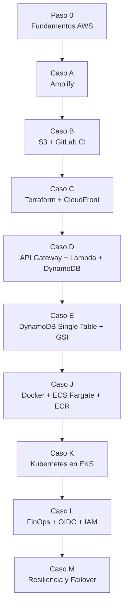

# AWS Cloud Journey

> Autor: Vladimir Acuna
> Proposito: resumir todo lo aprendido en este repositorio, conectando cada caso con practicas reales de AWS y con la documentacion oficial.
> Ultima actualizacion documental: 12 de marzo de 2026

---

## 1. Que representa este repositorio

Este monorepo no es una coleccion de demos aisladas. Es una ruta de madurez cloud:

1. Empezar con hosting estatico y despliegues simples.
2. Pasar a automatizacion reproducible con IaC.
3. Incorporar backend serverless y persistencia NoSQL.
4. Subir a contenedores y orquestacion.
5. Terminar en gobierno, costo, seguridad y resiliencia.

La idea central aprendida aqui es simple: en AWS no gana quien "levanta mas servicios", sino quien elige el servicio correcto, reduce operacion manual y mantiene seguridad, costo y confiabilidad bajo control.

---

## 2. Mapa de la jornada

---

## 3. Fundamentos que se consolidan en toda la documentacion

### 3.1 Modelo de responsabilidad compartida

AWS asegura la infraestructura global, pero la configuracion de permisos, cifrado, exposicion publica, politicas, redes y datos sigue siendo responsabilidad del cliente. Este repositorio lo demuestra varias veces:

- En `Caso B`, un bucket S3 mal expuesto deja la aplicacion publica sin controles adicionales.
- En `Caso C`, CloudFront + OAC reduce esa exposicion.
- En `Caso L`, OIDC reemplaza llaves permanentes, que son uno de los riesgos mas comunes en pipelines.
- En `Caso M`, la alta disponibilidad no aparece sola: se disena, se prueba y se documenta.

### 3.2 Region, AZ y eleccion del servicio

Otra leccion fuerte del repo es que la arquitectura no se decide solo por tecnologia, sino por tipo de carga:

- `Amplify` y `S3` sirven muy bien para frontends estaticos.
- `Lambda` funciona mejor para trafico intermitente y eventos.
- `ECS Fargate` es adecuado para contenedores sin querer administrar nodos.
- `EKS` se justifica cuando se necesita Kubernetes real, estandares enterprise o portabilidad del ecosistema.

### 3.3 Well-Architected en la practica

Aunque no todos los casos lo nombren explicitamente, el repositorio toca los pilares clasicos:

- Excelencia operativa: CI/CD, runbooks, validaciones, destruccion controlada.
- Seguridad: IAM, OIDC, minimo privilegio, buckets privados, politicas.
- Confiabilidad: Multi-AZ, health checks, failover planeado.
- Eficiencia de desempeno: CDN, serverless, autoscaling, patrones de acceso en DynamoDB.
- Optimizacion de costos: Budgets, PAY_PER_REQUEST, limpieza de laboratorios costosos.
- Sostenibilidad: uso de servicios administrados y apagado de recursos no esenciales.

---

## 4. Lo aprendido por etapa

### 4.1 Paso 0: comprender AWS antes de desplegar

Antes de usar servicios, el repo obliga a entender conceptos base:

- Regiones y zonas de disponibilidad no son lo mismo.
- IAM define quien puede hacer que accion sobre que recurso.
- VPC y subredes importan cuando se entra a ECS, EKS o arquitecturas resilientes.
- DNS, CDN, certificados y endpoints no son "extras"; son parte del producto final.

Aprendizaje real:

- No conviene empezar por Kubernetes ni por multi-region.
- Primero se domina el camino corto: contenido estatico, permisos, despliegue, observabilidad basica.

Referencias AWS:

- [AWS Well-Architected Framework](https://docs.aws.amazon.com/wellarchitected/latest/framework/welcome.html)
- [Shared Responsibility Model](https://docs.aws.amazon.com/whitepapers/latest/aws-risk-and-compliance/shared-responsibility-model.html)

---

### 4.2 Caso A: AWS Amplify

#### Que se construyo

Un despliegue rapido de frontend conectado al repo, con build administrado y hosting gestionado.

#### Que se aprendio

- Amplify acelera el time-to-market.
- AWS recomienda Amplify como opcion moderna para hosting estatico seguro sobre CDN.
- La experiencia de ramas y previews es muy util para equipos pequenos y validacion rapida.

#### Lo importante tecnicamente

- Amplify abstrae S3, CloudFront y certificados.
- La simplicidad tiene un costo: menos control fino sobre la infraestructura.
- Sirve muy bien para portfolio, prototipos y frontends desacoplados.

#### Criterio de seniority

La madurez no esta en evitar Amplify, sino en saber cuando usarlo y cuando migrar a un stack mas controlado.

Referencias AWS:

- [Web previews for pull requests - AWS Amplify Hosting](https://docs.aws.amazon.com/amplify/latest/userguide/pr-previews.html)
- [Hosting a static website using Amazon S3](https://docs.aws.amazon.com/console/s3/hostingstaticwebsite)
- [Deploying a static website to AWS Amplify Hosting from an S3 bucket](https://docs.aws.amazon.com/AmazonS3/latest/userguide/website-hosting-amplify.html)

---

### 4.3 Caso B: S3 + GitLab CI

#### Que se construyo

Un pipeline artesanal que publica archivos estaticos en S3 usando `aws s3 sync`.

#### Que se aprendio

- Aqui se entiende que CI/CD real no es magia: son credenciales, permisos, sincronizacion y errores de despliegue.
- `aws s3 sync --delete` deja el bucket alineado con el repo, lo que reduce drift en contenido.
- El hosting web nativo de S3 funciona, pero implica aceptar endpoints HTTP y normalmente acceso publico.

#### Leccion clave

AWS hoy recomienda usar Amplify o CloudFront delante de S3 cuando se necesita hosting seguro con HTTPS. Este caso sigue siendo valioso porque ensena los fundamentos, pero no es el destino final para un entorno serio.

#### Riesgos aprendidos

- Desactivar Block Public Access sin una razon clara es un riesgo.
- Guardar access keys largas en CI es una deuda de seguridad.
- S3 website endpoint es util para aprender, no para todos los casos productivos.

Referencias AWS:

- [Tutorial: Configuring a static website on Amazon S3](https://docs.aws.amazon.com/AmazonS3/latest/userguide/HostingWebsiteOnS3Setup.html)
- [Enabling website hosting](https://docs.aws.amazon.com/AmazonS3/latest/userguide/EnableWebsiteHosting.html)
- [Tutorial: Configuring a static website using a custom domain registered with Route 53](https://docs.aws.amazon.com/AmazonS3/latest/userguide/website-hosting-custom-domain-walkthrough.html)

---

### 4.4 Caso C: Terraform + CloudFront + S3 privado

#### Que se construyo

Infraestructura declarativa para publicar un sitio con S3 privado, CloudFront y estado remoto de Terraform.

#### Que se aprendio

- IaC elimina la dependencia de memoria humana y de ClickOps repetitivo.
- El estado remoto compartido evita despliegues caoticos.
- El bloqueo del state evita corrupcion cuando varias personas actuan sobre la misma infraestructura.
- CloudFront + S3 privado es mucho mejor patron que S3 website publico para servir contenido con HTTPS.

#### OAC vs OAI

Una mejora especialmente importante del repositorio es adoptar `Origin Access Control (OAC)`:

- AWS recomienda OAC por sobre OAI.
- OAC soporta regiones modernas, SSE-KMS y peticiones firmadas.
- Si el origen es el endpoint web de S3, OAC no aplica; para usar OAC se necesita el bucket S3 como origen privado normal.

#### Leccion de arquitectura

Este caso marca el paso de "subir archivos" a "definir una plataforma repetible". Es el punto donde el repositorio empieza a parecerse a una practica profesional.

Referencias AWS:

- [Restrict access to an AWS origin - CloudFront](https://docs.aws.amazon.com/AmazonCloudFront/latest/DeveloperGuide/private-content-restricting-access-to-origin.html)
- [Restrict access to an Amazon S3 origin - CloudFront](https://docs.aws.amazon.com/AmazonCloudFront/latest/DeveloperGuide/private-content-restricting-access-to-s3.html)

---

### 4.5 Caso D: API Gateway + Lambda + DynamoDB con SAM

#### Que se construyo

Un backend serverless con API Gateway, Lambda y DynamoDB, desplegado con AWS SAM.

#### Que se aprendio

- Serverless reduce operacion cuando la carga es intermitente.
- `SAM` simplifica plantillas de CloudFormation y acelera el ciclo build/deploy.
- `DynamoDB PAY_PER_REQUEST` es ideal para demos y trafico variable.
- `TTL` es util para datos efimeros y para evitar basura operativa.

#### Lo que AWS recomienda y aqui importa

- Reutilizar el entorno de ejecucion de Lambda para mejorar rendimiento.
- Mantener configuracion por variables de entorno.
- Escribir funciones idempotentes.
- Entender limites de escalado aguas abajo, porque Lambda escala mas rapido que muchos servicios conectados.

#### Leccion de diseno

Serverless no significa "sin arquitectura". Significa que el foco cambia desde servidores a eventos, limites, IAM, observabilidad y consistencia.

Referencias AWS:

- [Best practices for working with AWS Lambda functions](https://docs.aws.amazon.com/lambda/latest/dg/best-practices.html)
- [What is AWS SAM?](https://docs.aws.amazon.com/serverless-application-model/latest/developerguide/what-is-sam.html)

---

### 4.6 Caso E: DynamoDB single table y patrones de acceso

#### Que se construyo

Una API serverless con:

- tabla unica,
- claves `pk/sk`,
- GSI para consultas operativas,
- `TransactWriteItems`,
- TTL,
- y una landing publica para probar la API real.

#### Que se aprendio

Este es uno de los saltos de seniority mas claros del repo.

En DynamoDB no se modela pensando en joins; se modela pensando en preguntas de negocio:

- ordenar datos para leer por cliente,
- consultar por estado,
- consultar por producto,
- y registrar auditoria sin scans completos.

#### Conceptos reforzados por AWS

- `Composite sort key` para jerarquias logicas.
- `Sparse indexes` cuando no todos los items deben aparecer en un indice.
- `TTL` para expiracion automatica.
- El diseno debe partir por access patterns, no por un diagrama relacional tradicional.

#### Leccion fuerte

El valor del Caso E no es "usar DynamoDB", sino demostrar criterio de modelado y consistencia en escritura.

Referencias AWS:

- [Data modeling building blocks in DynamoDB](https://docs.aws.amazon.com/amazondynamodb/latest/developerguide/data-modeling-blocks.html)
- [Using time to live (TTL) in DynamoDB](https://docs.aws.amazon.com/amazondynamodb/latest/developerguide/TTL.html)
- [Best practices for DynamoDB](https://docs.aws.amazon.com/amazondynamodb/latest/developerguide/best-practices.html)

---

### 4.7 Caso J: Docker + ECR + ECS Fargate

#### Que se construyo

Una aplicacion containerizada publicada en ECR y ejecutada en ECS Fargate detras de un ALB.

#### Que se aprendio

- Docker resuelve portabilidad; AWS resuelve ejecucion gestionada.
- `ECR -> ECS Fargate -> ALB` es un patron muy comun para aplicaciones web containerizadas.
- Fargate elimina la administracion directa de EC2, pero no elimina la necesidad de definir red, roles, puertos, health checks y costos.

#### Lo que AWS enfatiza y se refleja en este caso

- ECS integra muy bien con ALB para trafico HTTP/HTTPS.
- El escaneo de imagenes en ECR debe formar parte del flujo serio de despliegue.
- Servicios multi-task deben distribuirse en multiples AZ cuando se busca alta disponibilidad.

#### Leccion de madurez

Contenerizar no es "modernidad cosmetica". Es estandarizar ejecucion, empaquetado, versionado y promotion path entre entornos.

Referencias AWS:

- [Use load balancing to distribute Amazon ECS service traffic](https://docs.aws.amazon.com/AmazonECS/latest/developerguide/service-load-balancing.html)
- [Balancing an Amazon ECS service across Availability Zones](https://docs.aws.amazon.com/AmazonECS/latest/developerguide/service-rebalancing.html)
- [Scan images for software vulnerabilities in Amazon ECR](https://docs.aws.amazon.com/AmazonECR/latest/userguide/image-scanning.html)

---

### 4.8 Caso K: Kubernetes en AWS con EKS

#### Que se construyo

Un cluster EKS con despliegue de aplicacion y evidencia de operacion real.

#### Que se aprendio

- EKS no reemplaza a ECS por defecto; responde a otra necesidad.
- AWS gestiona el control plane, pero el cliente sigue siendo responsable de seguridad en nodos, pods, red, secretos y acceso.
- Kubernetes agrega poder, pero tambien multiplica decisiones operativas.

#### Lecciones importantes

- EKS tiene un costo base real, por lo que no conviene usarlo solo "porque si".
- La seguridad en EKS exige pensar en IAM, runtime, networking, image security y observabilidad.
- Para laboratorios, destruir a tiempo es parte del diseno.

#### Criterio arquitectonico

Usar EKS tiene sentido cuando:

- se requiere ecosistema Kubernetes,
- hay necesidad de portabilidad de manifiestos,
- se trabaja con patrones avanzados de plataforma,
- o la organizacion ya opera sobre estandares Kubernetes.

Referencias AWS:

- [Amazon EKS Best Practices Guide](https://docs.aws.amazon.com/eks/latest/best-practices/introduction.html)
- [Best Practices for Security - Amazon EKS](https://docs.aws.amazon.com/eks/latest/best-practices/security.html)
- [Best Practices for Cost Optimization - Amazon EKS](https://docs.aws.amazon.com/eks/latest/best-practices/cost-opt.html)
- [Image security - Amazon EKS](https://docs.aws.amazon.com/eks/latest/best-practices/image-security.html)

---

### 4.9 Caso L: FinOps, OIDC e IAM governance

#### Que se construyo

Guardrails de costo y seguridad usando:

- AWS Budgets,
- GitLab OIDC,
- IAM con minimo privilegio,
- restricciones regionales,
- y despliegue sin access keys permanentes.

#### Que se aprendio

- El verdadero nivel senior aparece cuando se controla el riesgo operativo, no solo cuando se despliega.
- Las llaves IAM permanentes en CI/CD son una mala practica cuando se puede usar federacion OIDC.
- Los presupuestos no son "tema financiero": son un control tecnico de supervivencia para laboratorios y cuentas reales.

#### Lo que AWS documenta y aqui se vuelve practico

- `AssumeRoleWithWebIdentity` entrega credenciales temporales.
- AWS Budgets permite alertas reales y forecast.
- Cost Explorer y Budgets pueden alimentar dashboards y decisiones operativas.

#### Leccion fuerte

FinOps no es solo pagar menos. Es hacer visible el costo tecnico de cada decision de arquitectura.

Referencias AWS:

- [AssumeRoleWithWebIdentity - AWS STS](https://docs.aws.amazon.com/STS/latest/APIReference/API_AssumeRoleWithWebIdentity.html)
- [Creating a budget](https://docs.aws.amazon.com/cost-management/latest/userguide/budgets-create.html)
- [Creating a cost budget](https://docs.aws.amazon.com/cost-management/latest/userguide/create-cost-budget.html)

---

### 4.10 Caso M: resiliencia, failover y operacion de verdad

#### Estado del caso

Este caso esta planificado y documentado, con scaffold, roadmap y runbooks.

#### Que se aprende aunque aun no este completo

- La resiliencia no se declara, se ensaya.
- Multi-AZ cubre fallas locales; multi-region cubre desastres regionales.
- Route 53 failover es una opcion valida para activo-pasivo cuando el RTO tolera el comportamiento DNS.
- Global Accelerator puede mejorar RTO, pero con costo fijo superior.

#### Lecciones de arquitectura

- RTO y RPO deben definirse antes del diseno.
- TTL de DNS, health checks y warm standby importan tanto como el codigo.
- Tener runbook es tan importante como tener Terraform.

#### Leccion de negocio

Este caso muestra la diferencia entre una demo funcional y una plataforma preparada para continuidad operacional.

Referencias AWS:

- [Failover routing - Amazon Route 53](https://docs.aws.amazon.com/Route53/latest/DeveloperGuide/routing-policy-failover.html)
- [Active-active and active-passive failover - Amazon Route 53](https://docs.aws.amazon.com/Route53/latest/DeveloperGuide/dns-failover-types.html)
- [Configuring failover in a private hosted zone](https://docs.aws.amazon.com/Route53/latest/DeveloperGuide/dns-failover-private-hosted-zones.html)

---

## 5. Aprendizajes transversales del repositorio

### 5.1 Seguridad

Lo que mas se repite en el repo es que seguridad no se agrega al final:

- IAM minimo privilegio desde el principio.
- Preferencia por credenciales efimeras con OIDC.
- Evitar buckets publicos si el caso permite usar CloudFront + OAC.
- Escanear imagenes y revisar permisos antes de desplegar.

### 5.2 Costo

El repositorio es muy claro en algo que muchos laboratorios ocultan: varios servicios de AWS cobran aunque "solo estes probando".

Lecciones concretas:

- `Lambda` y `DynamoDB PAY_PER_REQUEST` son excelentes para cargas pequenas y variables.
- `ALB`, `Fargate`, `NAT Gateway` y `EKS` pueden disparar costos rapido.
- destruir infraestructura es una practica operacional, no una tarea opcional.

### 5.3 Operacion

Tambien queda claro que desplegar una vez no basta:

- hacen falta pipelines,
- hace falta invalidar cache cuando corresponde,
- hace falta evidencia,
- hace falta documentacion operativa,
- y hace falta saber cerrar recursos.

### 5.4 Arquitectura

El gran aprendizaje del repo es pasar de "servicios AWS" a "decisiones de arquitectura":

- cuando usar un servicio totalmente administrado,
- cuando aceptar mas complejidad a cambio de mas control,
- cuando optimizar por costo,
- y cuando optimizar por resiliencia.

---

## 6. Como evoluciona la mentalidad tecnica a traves del repo

La progresion real del aprendizaje es esta:

1. `Caso A-B`: aprender a publicar.
2. `Caso C`: aprender a definir infraestructura de forma repetible.
3. `Caso D-E`: aprender a modelar backend y datos con criterio.
4. `Caso J-K`: aprender a ejecutar aplicaciones de larga vida en contenedores.
5. `Caso L-M`: aprender a operar con responsabilidad, presupuesto y continuidad.

En otras palabras:

- primero se aprende a desplegar,
- luego a disenar,
- despues a operar,
- y finalmente a gobernar.

---

## 7. Recomendaciones para seguir mejorando este documento y el repo

Con base en la documentacion del repo y la documentacion oficial de AWS, los siguientes pasos naturales son:

1. Completar los casos `F`, `G`, `H` e `I` para cerrar seguridad, eventos, observabilidad y GenAI.
2. Agregar una seccion de "trade-offs" por caso: cuando usarlo, cuando no usarlo y costo aproximado.
3. Incorporar observabilidad real en `D`, `E`, `J` y `K` con CloudWatch y alarmas.
4. Documentar mejor limites y quotas de cada servicio usado.
5. Convertir este archivo en una guia de estudio con checklist por nivel.

---

## 8. Conclusiones

Este repositorio ensena una leccion muy valiosa: aprender AWS no es memorizar servicios, sino entender patrones.

El recorrido completo va desde:

- hosting simple,
- pasando por automatizacion e infraestructura declarativa,
- luego backend serverless y modelado NoSQL,
- despues contenedores y Kubernetes,
- y finalmente FinOps, identidad federada y resiliencia.

Si hubiera que resumir "todo lo aprendido" en una sola frase, seria esta:

> La madurez cloud aparece cuando cada despliegue ya considera seguridad, costo, operacion y continuidad desde el diseno, no como un parche posterior.

---

## 9. Bibliografia oficial de AWS usada para enriquecer este documento

- [AWS Amplify Hosting - PR previews](https://docs.aws.amazon.com/amplify/latest/userguide/pr-previews.html)
- [Amazon S3 static website hosting overview](https://docs.aws.amazon.com/console/s3/hostingstaticwebsite)
- [Amazon S3 static website tutorial](https://docs.aws.amazon.com/AmazonS3/latest/userguide/HostingWebsiteOnS3Setup.html)
- [CloudFront - Restrict access to an S3 origin](https://docs.aws.amazon.com/AmazonCloudFront/latest/DeveloperGuide/private-content-restricting-access-to-s3.html)
- [Lambda best practices](https://docs.aws.amazon.com/lambda/latest/dg/best-practices.html)
- [AWS SAM developer guide](https://docs.aws.amazon.com/serverless-application-model/latest/developerguide/what-is-sam.html)
- [DynamoDB data modeling building blocks](https://docs.aws.amazon.com/amazondynamodb/latest/developerguide/data-modeling-blocks.html)
- [DynamoDB TTL](https://docs.aws.amazon.com/amazondynamodb/latest/developerguide/TTL.html)
- [Amazon ECS service load balancing](https://docs.aws.amazon.com/AmazonECS/latest/developerguide/service-load-balancing.html)
- [Amazon ECS Availability Zone rebalancing](https://docs.aws.amazon.com/AmazonECS/latest/developerguide/service-rebalancing.html)
- [Amazon ECR image scanning](https://docs.aws.amazon.com/AmazonECR/latest/userguide/image-scanning.html)
- [Amazon EKS Best Practices Guide](https://docs.aws.amazon.com/eks/latest/best-practices/introduction.html)
- [Amazon EKS security best practices](https://docs.aws.amazon.com/eks/latest/best-practices/security.html)
- [Amazon EKS cost optimization best practices](https://docs.aws.amazon.com/eks/latest/best-practices/cost-opt.html)
- [AWS STS AssumeRoleWithWebIdentity](https://docs.aws.amazon.com/STS/latest/APIReference/API_AssumeRoleWithWebIdentity.html)
- [AWS Budgets - creating budgets](https://docs.aws.amazon.com/cost-management/latest/userguide/budgets-create.html)
- [AWS Budgets - creating a cost budget](https://docs.aws.amazon.com/cost-management/latest/userguide/create-cost-budget.html)
- [Route 53 failover routing](https://docs.aws.amazon.com/Route53/latest/DeveloperGuide/routing-policy-failover.html)

---

Fin del documento. Volver a [README.md](./README.md).
