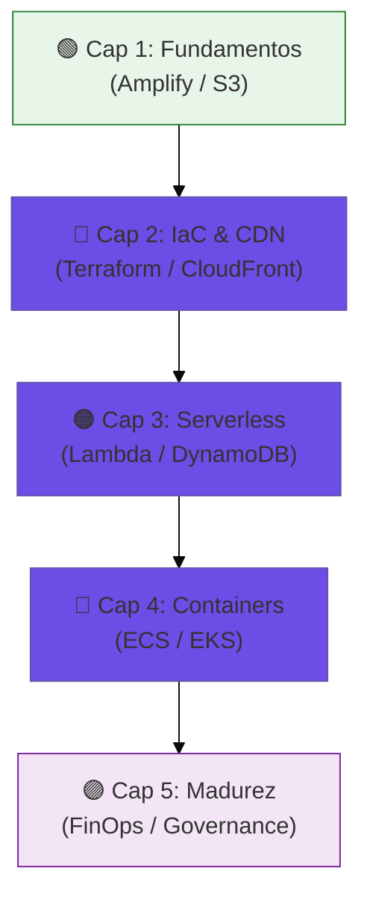
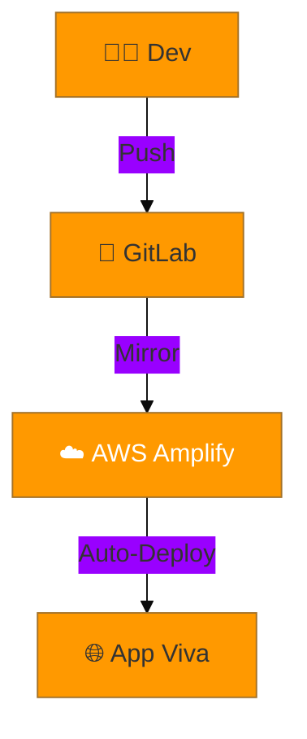
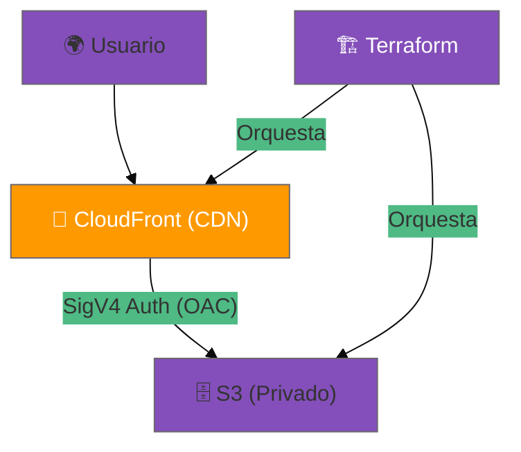
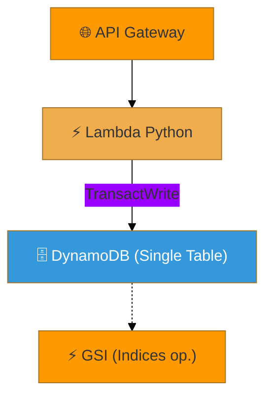
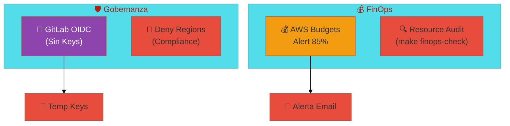

# 📖 AWS Cloud Journey: El Libro del Repositorio

> **Autor**: Vladimir Acuña  
> **Enfoque**: Evolución técnica desde hosting estático hasta gobernanza empresarial.

---

## 🗺️ Mapa de la Jornada

Este "libro" técnico consolida el conocimiento de todos los casos de estudio de este monorepo. No es solo un manual; es una narración de cómo una arquitectura simple evoluciona bajo presión de seguridad, escalabilidad y costos.

---

## 📜 Tabla de Contenidos

1. [Introducción: La Filosofía del Monorepo](#introducción)
2. [Capítulo 1: Los Fundamentos (ClickOps y S3)](#capítulo-1)
3. [Capítulo 2: El Poder de Terraform y CloudFront](#capítulo-2)
4. [Capítulo 3: Backend Reactivo (Serverless Pro)](#capítulo-3)
5. [Capítulo 4: Orquestación a Gran Escala (ECS y EKS)](#capítulo-4)
6. [Capítulo 5: Excelencia Operativa (FinOps)](#capítulo-5)
7. [Conclusión: El Futuro de la Nube](#conclusión)

---

## Introducción

Este repositorio nació para resolver una pregunta común: *¿Cómo paso de un prototipo a una infraestructura de producción?*. A lo largo de estas páginas, veremos cómo cada tecnología resuelve un problema específico del "Capítulo" anterior.

---

## Capítulo 1: Los Fundamentos (ClickOps y S3)

### La Simplicidad de AWS Amplify (Caso A)
La jornada comienza con **Amplify**. Es la entrada más rápida a la nube. Ideal para desarrolladores que quieren delegar la infraestructura y enfocarse en el código.

**Detalles Técnicos:**
- **CI/CD Nativo**: Amplify escucha cambios en la rama `main` y autodetecta el stack.
- **Configuración (`amplify.yml`)**: Define las fases de `preBuild`, `build` y `artifacts`.
- **Hosting Global**: Gestiona automáticamente CloudFront y certificados SSL sin intervención del usuario.

**Arquitectura:**

### Hosting en S3 con Pipelines (Caso B)
Aquí quitamos las "ruedas de entrenamiento". Aprendemos que Amplify usa **S3** por debajo. En este nivel, gestionamos nuestro propio bucket y el flujo de `aws s3 sync`.

**Conceptos Clave:**
- **GitLab Runners**: Usamos imágenes de Docker con `aws-cli` para automatizar el comando `sync`.
- **Políticas de Bucket**: Primera aproximación a los permisos. El bucket se configura como "Static Website Hosting".
- **Access Keys**: Uso de variables de entorno protegidas en GitLab para la autenticación (AWS_ACCESS_KEY_ID).

---

## Capítulo 2: El Poder de Terraform y CloudFront (Caso C)

### De ClickOps a IaC (Infraestructura como Código)
El problema de los capítulos anteriores es la falta de repetibilidad. Con **Terraform**, la infraestructura se define en archivos `.tf`.
- **Estado Remoto**: Guardamos el `terraform.tfstate` en S3 con bloqueo en **DynamoDB** para evitar condiciones de carrera entre desarrolladores.
- **Modularidad**: Parametrizamos variables como la región y el nombre del bucket para mayor flexibilidad.

### El Salto de Seguridad: OAC vs OAI
A diferencia del Caso B, aquí el bucket es **estrictamente privado**. Usamos **CloudFront** (CDN) para entregar el contenido utilizando **Origin Access Control (OAC)**.

**¿Por qué OAC?**
- Soporta **SigV4**, lo que permite cifrar el tráfico entre CloudFront y S3.
- Es más moderno y seguro que el antiguo OAI (Origin Access Identity).
- Permite que CloudFront acceda a buckets en cualquier región de AWS cómodamente.

---

## Capítulo 3: Backend Reactivo (Serverless Pro)

### La Magia de Lambda y SAM (Caso D)
Ya no solo servimos archivos estáticos. Ahora tenemos lógica. **AWS Lambda** nos permite ejecutar backend solo cuando alguien lo pide. Costo: $0 si nadie entra.
- **Micro-servicios Event-Driven**: API Gateway actúa como el disparador (trigger) que despierta a la Lambda.
- **AWS SAM (Serverless Application Model)**: Usamos una extensión de CloudFormation optimizada para serverless para desplegar rápidamente.

### Persistencia Single-Table (Caso E)
El modelado de datos evoluciona drásticamente. En NoSQL, no buscamos normalizar, buscamos **rendimiento**.

**Técnicas de Single Table Design:**
- **PK y SK**: Uso de Partition Keys y Sort Keys para agrupar datos relacionados (Customer + Orders).
- **GSI (Global Secondary Index)**: Permite pivotar la tabla para responder nuevas preguntas (ej: "buscar órdenes por estado") sin escaneos costosos.
- **Escritura Transaccional**: Uso de `TransactWriteItems` para asegurar que al crear una orden, se cree también un registro de auditoría de forma atómica.

**Flujo de Datos:**

---

## Capítulo 4: Orquestación a Gran Escala (ECS y EKS)

### ECS Fargate (Caso J)
Cuando el servidor necesita persistencia en memoria, sockets de larga duración o dependencias binarias complejas, usamos contenedores.
- **Serverless Containers**: Fargate elimina la necesidad de gestionar parches de SO en las instancias EC2.
- **Elastic Container Registry (ECR)**: Almacenamos nuestras imágenes Docker versionadas por SHA para despliegues inmutables.

### Kubernetes EKS (Caso K)
El estándar de facto para la "Cloud Native Computing Foundation". EKS gestiona el plano de control (Master nodes) por nosotros.
- **Self-Healing**: Kubernetes vigila los Pods. Si uno muere (Crash), lo reinicia en 15 segundos.
- **Rolling Updates**: Despliegues con cero tiempo de inactividad. K8s levanta la versión v2, espera a que esté lista (`Readiness Probe`) y recién ahí apaga la v1.

**Escalabilidad:**
Usamos el **Horizontal Pod Autoscaler (HPA)** para clonar pods automáticamente cuando la CPU sube del 70%.

---

## Capítulo 5: Excelencia Operativa (FinOps)

### Gobernanza y Zero-Trust (Caso L)
Finalmente, aprendemos que la tecnología sin control es un riesgo. La madurez de un arquitecto se mide por su capacidad de asegurar la cuenta y predecir los costos.

**Innovaciones en Seguridad:**
- **OIDC (OpenID Connect)**: Eliminamos el uso de `AWS_ACCESS_KEY_ID` permanentes. GitLab CI se autentica con AWS mediante tokens temporales y efímeros (Zero-Trust).
- **IAM Governance**: Implementamos políticas que restringen el despliegue a regiones específicas (ej: `us-east-1`) para evitar cargos en regiones costosas o no autorizadas.

**Estrategia FinOps:**
- **AWS Budgets**: Configuramos alertas proactivas que disparan correos cuando el gasto acumulado llega al 85% del presupuesto.
- **Auditoría de Recursos**: Usamos scripts personalizados (`make finops-check`) para detectar recursos "fantasma" como NAT Gateways o clusters EKS que quedaron encendidos por error.

**Visualización de Costos:**
Consultamos la API de **Cost Explorer** mediante Python y Boto3 para generar un dashboard dinámico alojado en S3.

---

## Conclusión

Esta trayectoria desde el **Caso A** hasta el **Caso L** representa el crecimiento de un Ingeniero de Cloud. De "funciona en mi máquina" a "está gobernado, escalado y asegurado en la nube".

---
*Fin del Libro — [Volver al README](README.md)*
