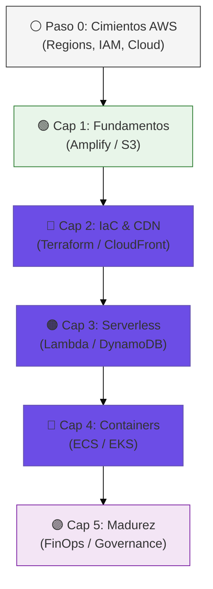

# 📖 AWS Cloud Journey: El Libro del Repositorio

> **Autor**: Vladimir Acuña  
> **Enfoque**: Evolución técnica desde los cimientos de la nube hasta la gobernanza empresarial.
> **Versión**: 2.0 (The Ultimate Edition)

---

## 🗺️ Mapa de la Jornada

Este libro técnico no es solo un manual; es una narración de cómo una arquitectura simple evoluciona bajo presión de seguridad, escalabilidad y costos.

---

## 📜 Tabla de Contenidos

1. [Paso 0: Introducción a la Nube y AWS](#paso-0-introducción-a-la-nube-y-aws)
2. [Capítulo 1: Los Fundamentos (ClickOps y S3)](#capítulo-1-los-fundamentos-clickops-y-s3)
3. [Capítulo 2: El Poder de Terraform y CloudFront](#capítulo-2-el-poder-de-terraform-y-cloudfront)
4. [Capítulo 3: Backend Reactivo (Serverless Pro)](#capítulo-3-backend-reactivo-serverless-pro)
5. [Capítulo 4: Orquestación a Gran Escala (ECS y EKS)](#capítulo-4-orquestación-a-gran-escala-ecs-y-eks)
6. [Capítulo 5: Excelencia Operativa (FinOps & Security)](#capítulo-5-excelencia-operativa-finops--security)
7. [Glossary: Glosario de Conceptos Técnicos](#glossary-glosario-de-conceptos-técnicos)
8. [Conclusión: El Futuro de la Nube](#conclusión-el-futuro-de-la-nube)

---

## Paso 0: Introducción a la Nube y AWS

Antes de tocar el primer servidor, debemos entender dónde estamos trabajando. AWS no es solo "otros ordenadores"; es una plataforma masiva de servicios integrados.

### ¿Qué es el Cloud Computing?
Es la entrega de recursos de TI bajo demanda a través de Internet con un modelo de precios de pago por uso. En lugar de comprar hardware, "alquilamos" capacidad infinita.

### Los 4 Pilares Fundamentales de AWS
1. **Infraestructura Global**:
   - **Regiones**: Ubicaciones físicas en el mundo (ej: `us-east-1`). Cada una es independiente.
   - **AZ (Zonas de Disponibilidad)**: Uno o más centros de datos dentro de una región. Se usan para **Alta Disponibilidad**.
2. **IAM (Identity and Access Management)**: El corazón de la seguridad. Define **quién** (Principal) puede hacer **qué** (Action) en **dónde** (Resource).
3. **VPC (Virtual Private Cloud)**: Tu red privada lógica en la nube. Aquí defines tus propias subredes, tablas de ruteo y firewalls.
4. **Modelo de Responsabilidad Compartida**: AWS asegura el "hierro" y la infraestructura global; tú aseguras tus datos, configuraciones y el código que subes.

---

## Capítulo 1: Los Fundamentos (ClickOps y S3)

### La Simplicidad de AWS Amplify (Caso A)
La jornada comienza con **Amplify**. Ideal para el "Time-to-Market" agresivo.
- **Bajo el capó**: Amplify gestiona automáticamente un bucket de S3, una distribución de CloudFront y certificados SSL mediante ACM.
- **Friendly Tip**: Es genial para prototipos, pero pierdes el control granular de cada recurso.

### Hosting en S3 con Pipelines (Caso B)
Aquí aprendemos a ensuciarnos las manos. Usamos **S3 Website Hosting**.
- **Seguridad**: Por defecto, este método requiere que el bucket sea **público**, lo cual es un riesgo si no se gestiona bien.
- **Sincronización profesional**: Usamos `aws s3 sync --delete` para que el bucket sea un espejo exacto de nuestra carpeta local.

---

## Capítulo 2: El Poder de Terraform y CloudFront (Caso C)

### De ClickOps a IaC (Infraestructura como Código)
Dejamos de usar la consola web para crear recursos. Usamos **Terraform**.
- **State Locking**: Usamos una tabla de DynamoDB para que, si dos personas intentan desplegar al mismo tiempo, el sistema bloquee al segundo y evite corromper la infraestructura.
- **Declarativo**: No dices "crea un bucket", dices "el estado deseado es que exista este bucket".

### El Salto de Seguridad: OAC vs OAI
Aquí privatizamos el bucket S3. Nadie puede entrar, excepto **CloudFront**.
- **OAC (Origin Access Control)**: La tecnología más moderna. Permite firmar peticiones (SigV4), lo que lo hace compatible con todas las regiones y mucho más seguro que el antiguo OAI.

---

## Capítulo 3: Backend Reactivo (Serverless Pro)

### La Magia de Lambda y SAM (Caso D)
Backend sin servidores permanentes. Pagas solo por milisegundos de ejecución.
- **AWS SAM**: Una extensión de CloudFormation que simplifica el despliegue de Lambdas y APIs con menos líneas de YAML.

### Persistencia Single-Table (Caso E)
Aquí es donde se separan los juniors de los seniors. Usamos **DynamoDB** con una sola tabla.
- **Consultas Predictivas**: No modelamos datos por su relación, sino por **cómo la aplicación va a preguntar por ellos**.
- **GSI (Indices Globales)**: Creamos "vistas" de la tabla para buscar por atributos que no son la clave primaria (ej: buscar por `status` de la orden).

---

## Capítulo 4: Orquestación a Gran Escala (ECS y EKS)

### ECS Fargate (Caso J)
Cuando necesitas control total sobre el sistema operativo o aplicaciones de larga duración (ej: WebSockets).
- **Fargate**: Cómputo serverless para contenedores. "Dale una imagen Docker y olvídate del servidor".

### Kubernetes EKS (Caso K)
La solución enterprise para microservicios masivos.
- **Control Plane managed**: AWS gestiona la complejidad de Kubernetes Master, tú solo gestionas los Nodos y los Pods.
- **HPA (Autoscaling)**: El sistema clona tus contenedores si detecta mucho tráfico en tiempo real.

---

## Capítulo 5: Excelencia Operativa (FinOps & Security)

### Gobernanza y Zero-Trust (Caso L)
- **OIDC (OpenID Connect)**: Eliminamos las Access Keys permanentes. GitLab CI usa un token temporal que AWS valida y le entrega llaves que mueren en 1 hora.
- **Gobernanza de Región**: Bloqueamos mediante políticas de IAM el despliegue en regiones caras o no autorizadas.
- **FinOps**: Configuración de **AWS Budgets** con alertas al 85% del presupuesto para dormir tranquilos.

---

## Glossary: Glosario de Conceptos Técnicos

- **ARN (Amazon Resource Name)**: El ID único de cualquier cosa en AWS.
- **Bucket**: Un contenedor de archivos en S3.
- **CDN**: Servidores en todo el mundo que copian tu web para que cargue rápido (CloudFront).
- **IaC**: Escribir tu infraestructura como si fuera código fuente (Terraform).
- **PaaS**: Plataforma como Servicio (ej: Amplify).
- **SRE (Site Reliability Engineering)**: El arte de hacer que los sistemas sean confiables y escalables.

---

## Conclusión: El Futuro de la Nube

Hemos pasado de un simple archivo HTML en **Amplify** a un clúster de **Kubernetes** gobernado por **FinOps**. Esta evolución no es solo técnica, es de mentalidad. El Cloud no se trata de servidores, se trata de **servicios gestionados al servicio del negocio**.

---
*Fin del Libro — [Volver al README](README.md)*
