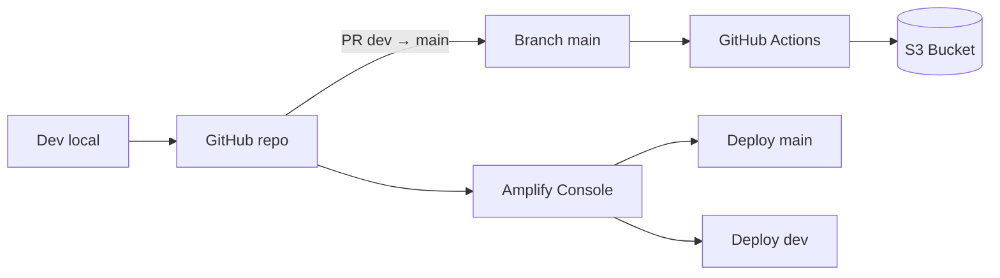

# 🚀 Cloud Portfolio: Proyectos AWS (Monorepo)

**Monorepo de portafolio con despliegues reales en AWS** para demostrar prácticas modernas de **CI/CD**, separación de **entornos por rama**, y documentación clara de infraestructura.

**TL;DR (30s):**

- ✅ CI/CD real: cambios en Git → despliegue automático (S3 + GitHub Actions / Amplify por ramas)
- ✅ Trabajo profesional con `dev → PR → main` y trazabilidad completa
- ✅ Enfoque de portafolio: documentación + demos + estructura profesional
- 👨‍💼 **Para Reclutadores:** Ver [Guía para Reclutadores](docs/RECRUITER.md) para un resumen del valor de negocio.

---

## 🌐 Demos en Vivo

### 1) AWS S3 + GitHub Actions (Deploy Automatizado)

- **Estado:** ✅ Operativo  
- **Stack:** S3, IAM, GitHub Actions (YAML)  
- **Carpeta:** `aws-s3-scrum-mi-sitio-1/`  
- **Demo:** https://mi-pagina-scrum-123.s3.us-east-2.amazonaws.com/index.html

### 2) AWS Amplify – Continuous Deployment por Rama

- **Estado:** ✅ Operativo  
- **Stack:** AWS Amplify Console, SSL automático  
- **Carpeta:** `aws-amplify-mi-sitio-1/`  
- **Demo Main:** https://main.d3r1wuymolxagh.amplifyapp.com/  
- **Demo Dev:**  https://dev.d20m8tc0banvg.amplifyapp.com/

---

## 🧭 Flujo Profesional (Local → GitHub → AWS)

1. **Local (VS Code):** editas, pruebas y validas cambios.
2. **GitHub:** trabajas en `dev`, haces commits y creas **Pull Request** a `main`.
3. **AWS:**
   - **Amplify** despliega automáticamente por rama (`dev` / `main`).
   - **S3 + GitHub Actions** sincroniza el bucket desde `main` según workflow.

---

## 🛠️ Tooling Layer (Opcional)

Este repositorio incluye una **capa de tooling profesional** con Docker, Kubernetes y validaciones automatizadas. Es completamente opcional y no afecta los proyectos existentes.

### Quick Start

```bash
# 1. Construir imagen de tooling
make tooling-build

# 2. Ejecutar validaciones
make tooling-validate

# 3. Listar proyectos
./hub.sh list-projects      # Linux/Mac
.\hub.ps1 list-projects     # Windows

# 4. Demo en Kubernetes (requiere kind)
make k8s-demo
```

### Características

- ✅ **Docker:** Imagen con AWS CLI, Terraform, Checkov, linters
- ✅ **Kubernetes:** Demo con Job, SecurityContext, NetworkPolicy
- ✅ **Makefile:** Comandos estandarizados para tooling
- ✅ **Hub CLI:** Scripts bash/PowerShell para gestión de proyectos
- ✅ **Seguridad:** Pre-commit hooks, secret scanning, dependency scanning

### Documentación

- 📖 [Guía de Tooling](docs/TOOLING.md) - Documentación completa
- 🔒 [Security Checklist](docs/SECURITY_CHECKLIST.md) - Auditoría de seguridad
- ❌ [Killed Practices](docs/killed.md) - Prácticas prohibidas

---

## 🏗️ Arquitectura (alto nivel)



---

## 🔒 Seguridad

Este repositorio implementa múltiples capas de seguridad:

- 🔐 **Pre-commit hooks** con `detect-secrets`
- 🔍 **GitHub Actions** para secret scanning y dependency scanning
- 🐳 **Docker** con usuario no-root y tags fijos
- ☸️ **Kubernetes** con SecurityContext y NetworkPolicy
- 📋 **Documentación** de prácticas seguras (OIDC, IAM roles)

Ver [SECURITY.md](SECURITY.md) para más detalles.

---

## 📚 Documentación Adicional

- [👨‍💼 Guía para Reclutadores](docs/RECRUITER.md) - Valor de negocio y resumen técnico
- [🔒 SECURITY.md](SECURITY.md) - Política de seguridad
- [🤝 CONTRIBUTING.md](CONTRIBUTING.md) - Guía de contribución
- [📅 ROADMAP.md](ROADMAP.md) - Roadmap del proyecto
- [🛠️ docs/TOOLING.md](docs/TOOLING.md) - Guía de tooling
- [❌ docs/killed.md](docs/killed.md) - Prácticas prohibidas
