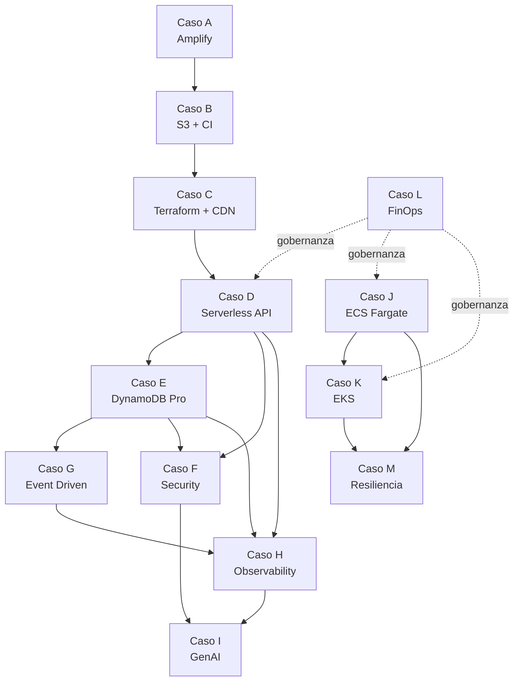

# GitLab → AWS Monorepo (DevOps Training Suite) ☁️ 🚀

[]()
[](https://gitlab.com/vladimir.acuna.dev-group/proyectos-aws-gitlab/-/pipelines)
[]()
[]()
[]()

Este monorepo es una suite educativa avanzada diseñada para modernizar y automatizar el flujo de despliegue en la nube. Desde el alojamiento estático hasta la orquestación industrial de contenedores en AWS, exploramos cómo construir infraestructuras seguras, escalables y profesionales.

---

### 📖 Recurso Destacado
👉 [**Libro: AWS Cloud Journey**](./AWS_CLOUD_JOURNEY.md) — **¡NUEVO!** El compendio técnico definitivo de este repositorio. Una narración paso a paso desde el nivel 0 hasta arquitectura enterprise.

---

## 🌐 Portal de Documentación (PWA)
¡Nuevo! Hemos lanzado un portal web interactivo para explorar este repositorio con un diseño moderno y premium (**Glassmorphism**).

*   **Acceso Local**: Abre `index.html` usando un servidor local (ej: `npx serve .`).
*   **Experiencia PWA**: Instálalo en tu móvil o escritorio para acceso rápido y soporte offline.
*   **Contraste**: Navega por todas las guías, diagramas y especificaciones de forma dinámica.

---

## ⚡ Inicio Inmediato (Quick Start)

Este proyecto incluye un **Makefile** para simplificar tus tareas. No necesitas memorizar comandos largos.

```bash
# 1. Instalar todo lo necesario
make install

# 2. Verificar calidad y seguridad
make lint
make tf-security

# 3. Ver todos los comandos disponibles
make help
```

---

## 📖 Documentación Avanzada
Hemos organizado la base de conocimientos para que sea fácil de navegar:

### 🎯 Inicio Rápido
- 🚀 **[Guía de Instalación](docs/INSTALL.md)**: Docker (DevContainers) vs Manual.
- 📘 **[Guía para Principiantes](docs/BEGINNERS_GUIDE.md)**: Glosario y conceptos básicos.
- 🧭 **[Guía de Casos Completados](docs/COMPLETED_CASES_GUIDE.md)**: Qué demuestra cada caso ya validado y cómo leerlo.
- ⚡ **[Referencia Rápida](docs/QUICK_REFERENCE.md)**: Comandos esenciales y atajos.
- 🗺️ **[De IT Tradicional a la Nube](docs/CONCEPTOS_NUBE.md)**: Mapeo de conceptos IT conocidos a terminología y productos AWS, con retroalimentación por caso.

### 🏗️ Arquitectura y Stack
- 📂 **[Estructura de Archivos](docs/FILE_STRUCTURE.md)**: Mapa detallado de carpetas y archivos del sistema.
- 🏗️ **[Arquitectura](docs/ARCHITECTURE.md)**: Visión técnica, diagramas Mermaid y stack.
- 🛠️ **[Especificaciones Técnicas](docs/TECHNICAL_SPECS.md)**: Requerimientos de hardware y software.
- 🔧 **[Tooling](docs/TOOLING.md)**: Docker, Kubernetes, Makefile y validaciones.
- 📊 **[Resumen de Implementación](docs/IMPLEMENTATION_SUMMARY.md)**: Overview del tooling y seguridad.
### 🧠 Skills de Claude Code

> Invoca cualquier skill escribiendo `/nombre-del-skill` en una sesión de Claude Code.

| Skill | Cuándo usarlo |
|---|---|
| [`/aws-case-scaffolder`](skills/aws-case-scaffolder/SKILL.md) | Crear un caso nuevo |
| [`/sam-serverless-workflow`](skills/sam-serverless-workflow/SKILL.md) | Build / deploy / test con AWS SAM |
| [`/lambda-test-patterns`](skills/lambda-test-patterns/SKILL.md) | Escribir o corregir tests de Lambda |
| [`/architecture-doc-standard`](skills/architecture-doc-standard/SKILL.md) | Crear o revisar `docs/architecture.md` |
| [`/caso-completion-checklist`](skills/caso-completion-checklist/SKILL.md) | Promover un caso de PROYECTADO a COMPLETADO |
| [`/visualizacion-evidencia`](skills/visualizacion-evidencia/SKILL.md) | Demo en Vivo vs Reporte de Evidencia por costo |
| [`/docs-portal-sync`](skills/docs-portal-sync/SKILL.md) | Sincronizar docs, portal y wiki tras cambios |
| [`/gitlab-aws-pipeline-editor`](skills/gitlab-aws-pipeline-editor/SKILL.md) | Editar `.gitlab-ci.yml` y pipelines |
| [`/terraform-aws-demo-patterns`](skills/terraform-aws-demo-patterns/SKILL.md) | Crear o actualizar infraestructura Terraform |
| [`/finops-audit-and-budgeting`](skills/finops-audit-and-budgeting/SKILL.md) | Costos, auditoría y dashboards FinOps |

📖 Ver catálogo completo: **[docs/SKILLS.md](docs/SKILLS.md)**

### 🛡️ Seguridad
- 🛡️ **[Seguridad IAM](docs/IAM_SECURITY.md)**: Políticas de acceso y privilegios mínimos.
- ✅ **[Security Checklist](docs/SECURITY_CHECKLIST.md)**: Lista de verificación completa de seguridad.
- 🔐 **[Secretos Comprometidos](docs/killed.md)**: Registro de secretos rotados.

### 💰 FinOps & Auditoría
- 💰 **[Costos por Caso Completado](docs/FINOPS_COSTOS.md)**: Análisis detallado para los 11 casos: free tier, provisioned, estrategias y tabla de riesgo financiero.
- 🔧 **[Manual de FinOps](docs/FINOPS_MANUAL.md)**: Auditoría rápida y semáforo de riesgo financiero.
- 📊 **[Análisis de Casos Proyectados](docs/PROYECTADOS_ANALISIS.md)**: Complejidad, costos y orden de implementación para casos futuros (I, M).
- 🧮 **Calculadora Interactiva de Costos**: Disponible en GitLab Pages — sección 💰 FinOps del portal.

### 👔 Para Reclutadores
- 👨‍💼 **[Guía para Reclutadores](docs/RECRUITER.md)**: Tour ejecutivo y valor de negocio.

### 📍 Estado y Hoja de Ruta
- 📍 **[Estado Actual y Roadmap](docs/ESTADO_Y_ROADMAP.md)**: Radiografía completa del repositorio — qué está sólido, qué falta, mejoras futuras con diagramas Mermaid y tabla de prioridades.

### 📚 Otros Recursos
- 🕒 **[Historial de Cambios](CHANGELOG.md)**: Registro detallado de versiones y mejoras.
- 🗺️ **[Roadmap](ROADMAP.md)**: Plan de desarrollo y próximos hitos.
- 📑 **[Wiki del Proyecto](wiki/home.md)**: Base de conocimientos colaborativa en GitLab.
- 🤝 **[Guía de Contribución](CONTRIBUTING.md)**: Cómo contribuir al proyecto.
- 📜 **[Código de Conducta](docs/CODE_OF_CONDUCT.md)**: Normas de la comunidad.
- 📄 **[Licencia](LICENSE)**: Términos de uso bajo licencia MIT.

---

## 💻 Desarrollo Local

Para previsualizar el portal y los entornos web de cada caso de forma consistente:

```powershell
# Usando Makefile (Recomendado)
make serve

# O directamente con Python
python -m http.server 8000
```
Acceso: [http://localhost:8000](http://localhost:8000)

### 📤 Subir Cambios al Repositorio

Para subir tus cambios de forma rápida:

```powershell
# Usando Makefile
make upload

# O directamente con Python
python -c "import os; os.system('git add .'); os.system('git commit -m \"Update\"'); os.system('git push')"
```

---

## 🏗️ Casos de Estudio y Dashboards

Cada carpeta representa un hito en la evolución de un Ingeniero Cloud. Aquí el detalle de cada módulo:

### 🟢 Nivel 1: Automatización y Hosting Estático

#### [📂 Caso A: AWS Amplify](./caso-a-amplify/index.html) `Nivel 0` `COMPLETADO`
*   **Stack**: AWS Amplify + GitLab Auto-Mirroring.
*   **Enfoque**: **Integración Continua nativa.** Ideal para prototipos rápidos. Aprende cómo AWS gestiona automáticamente el escalado, SSL y CDN.
*   🏗️ [Arquitectura (Mermaid)](caso-a-amplify/docs/architecture.md)
*   ☁️ [Guía Paso a Paso AWS](caso-a-amplify/AWS_PASO_A_PASO.md)
*   👉 [Ver Demo en Vivo](https://main.d1uybq9oui7h8c.amplifyapp.com/)

#### [📂 Caso B: S3 + GitLab CI](./caso-b-gitlab-s3/index.html) `Nivel 1` `COMPLETADO`
*   **Stack**: GitLab Runners + AWS CLI + S3 Website Hosting.
*   **Enfoque**: **Pipelines Artesanales.** Entiende qué pasa "bajo el capó". Aprendes sobre políticas de bucket, sincronización manual y gestión de secretos.
*   🏗️ [Arquitectura (Mermaid)](caso-b-gitlab-s3/docs/architecture.md)
*   ☁️ [Guía Paso a Paso AWS](caso-b-gitlab-s3/AWS_PASO_A_PASO.md)
*   👉 [Ver Demo en Vivo](http://vladimir-caso-b-site-2026.s3-website.us-east-2.amazonaws.com/)

### 🔵 Nivel 2: Profesionalización e Infraestructura como Código (IaC)

#### [📂 Caso C: Terraform + CloudFront](./caso-c-terraform-s3/index.html) `Nivel 2` `COMPLETADO`
*   **Stack**: Terraform + S3 (OAC) + CloudFront + Remote State.
*   **Enfoque**: **Infraestructura como Código (IaC).** Elimina el error humano. Aprende a centralizar el estado en la nube y proteger recursos con **Origin Access Control**.
*   🏗️ [Arquitectura (Mermaid)](caso-c-terraform-s3/docs/architecture.md)
*   ☁️ [Guía Paso a Paso AWS](caso-c-terraform-s3/AWS_PASO_A_PASO.md)
*   👉 [Ver Demo en Vivo](https://d3otfpeykrm536.cloudfront.net/)

#### [📂 Caso D: Serverless Basic (SAM)](./caso-d-serverless-basic/index.html) `Nivel 3` `COMPLETADO`
*   **Stack**: API Gateway + AWS Lambda + DynamoDB.
*   **Enfoque**: **Lógica Backend y Persistencia.** Añade vida a tus apps. Escalamiento a cero costos cuando no hay uso y potencia reactiva bajo demanda.
*   🏗️ [Arquitectura (Mermaid)](caso-d-serverless-basic/docs/architecture.md)
*   ☁️ [Guía Paso a Paso AWS](caso-d-serverless-basic/AWS_PASO_A_PASO.md)
*   👉 [Demo Portafolio](https://staging.d3oq987bpa7ls7.amplifyapp.com/) / [API Endpoint](https://tc78a6xibg.execute-api.us-east-2.amazonaws.com)

### 🟠 Nivel 3: Gestión de Aplicaciones y Datos (Senior)

#### [📂 Caso E: Persistence Pro](./caso-e-dynamodb-persistence/README.md) `Nivel 4` `COMPLETADO (VALIDADO)`
*   **Stack**: API Gateway + Lambda + DynamoDB (Single Table Design + GSI) + AWS SAM.
*   **Enfoque**: **Modelado NoSQL Senior.** Diseña por patrones de acceso, crea auditoría transaccional y consulta por cliente, estado y producto sin scans.
*   🏗️ [Arquitectura (Mermaid)](caso-e-dynamodb-persistence/docs/architecture.md)
*   ☁️ [Guía Paso a Paso AWS](caso-e-dynamodb-persistence/AWS_PASO_A_PASO.md)
*   👉 [API Endpoint](https://gqqm27j47c.execute-api.us-east-2.amazonaws.com)

#### [📂 Caso F: Security First](./caso-f-security-cognito/index.html) `Nivel 5` `COMPLETADO`
*   **Stack**: AWS Cognito User Pool + JWT Authorizer (API GW nativo) + WAF opcional + AWS SAM.
*   **Enfoque**: **Seguridad Perimetral.** Identidades con Cognito, tokens JWT validados por API Gateway sin código de criptografía en Lambda, y WAF opcional como primera capa de defensa.
*   🏗️ [Arquitectura (Mermaid)](caso-f-security-cognito/docs/architecture.md)
*   ☁️ [Guía Paso a Paso AWS](caso-f-security-cognito/AWS_PASO_A_PASO.md)

#### [📂 Caso G: Event Driven](./caso-g-event-driven/README.md) `Nivel 6` `COMPLETADO (VALIDADO)`
*   **Stack**: API Gateway + Lambda + EventBridge + SQS + SNS + AWS SAM.
*   **Enfoque**: **Arquitecturas Reactivas.** Desacopla productor y consumidor con eventos, reintentos y DLQ para absorber fallos sin bloquear la entrada.
*   🏗️ [Arquitectura (Mermaid)](caso-g-event-driven/docs/architecture.md)
*   ☁️ [Guía Paso a Paso AWS](caso-g-event-driven/AWS_PASO_A_PASO.md)
*   👉 [Landing y API pública](https://ajcjvroq0a.execute-api.us-east-2.amazonaws.com/)

#### [📂 Caso H: Observability & Health](./caso-h-observability/index.html) `Nivel 7` `COMPLETADO`
*   **Stack**: CloudWatch + X-Ray + CloudWatch Dashboard (IaC) + Lambda.
*   **Enfoque**: **Monitoreo Proactivo como Código.** Métricas custom, trazas X-Ray y dashboards definidos en CloudFormation. Detecta fallos antes que el usuario.
*   🏗️ [Arquitectura (Mermaid)](caso-h-observability/docs/architecture.md)
*   ☁️ [Guía Paso a Paso AWS](caso-h-observability/AWS_PASO_A_PASO.md)
*   👉 [Landing y API pública](https://z7evf8mrzf.execute-api.us-east-2.amazonaws.com/)

#### [📂 Caso I: GenAI Bedrock](./caso-i-genai-bedrock/index.html) `Nivel 8` `PROYECTADO`
*   **Stack**: Amazon Bedrock + LangChain + Lambda.
*   **Enfoque**: **Inteligencia Artificial Propia.** Integración de modelos LLM en tu infraestructura de forma privada y segura.

### 🔴 Nivel 4: Contenedores y Escalamiento Grado Industrial

#### [📂 Caso J: Dockerización de Microservicios](./caso-j-containers-ecs/README.md) `Nivel 9` `COMPLETADO`
*   **Stack**: Docker + ECS Fargate + ECR + Terraform.
*   **Enfoque**: **Portabilidad e Isolation.** Empaquetado industrial de apps para que corran igual en local y en la nube. Gestión de registros de imágenes.
*   🏗️ [Arquitectura (Mermaid)](caso-j-containers-ecs/docs/architecture.md)
*   ☁️ [Guía Paso a Paso AWS](caso-j-containers-ecs/AWS_PASO_A_PASO.md)
*   🖼️ [Reporte de Visualización y Resultados](caso-j-containers-ecs/VISUALIZATION.md)

#### [📂 Caso K: Kubernetes en AWS (EKS)](./caso-k-kubernetes-eks/README.md) `Nivel 10` `COMPLETADO (VALIDADO)`
*   **Stack**: AWS EKS + YAML + GitLab Kubernetes Agent.
*   **Enfoque**: **Orquestación Real en AWS.** Kubernetes directo en la nube. Gestiona flotas de contenedores, auto-sanación y balanceo masivo.
*   🏗️ [Arquitectura (Mermaid)](caso-k-kubernetes-eks/docs/architecture.md)
*   ☁️ [Guía Paso a Paso AWS](caso-k-kubernetes-eks/AWS_PASO_A_PASO.md)
*   🖼️ [Reporte de Visualización y Resultados](caso-k-kubernetes-eks/VISUALIZATION.md)

### 🟣 Nivel 5: Gobernanza, Integraciones y Optimizaciones

#### [📂 Caso L: FinOps & Governance](./caso-l-finops-optimization/README.md) `Nivel 11` `COMPLETADO`
*   **Stack**: AWS Budgets + GitLab OIDC + IAM Governance.
*   **Enfoque**: **Excelencia Operativa.** Integración profunda de GitLab con AWS, control de costos y políticas de gobernanza corporativa.
*   🏗️ [Arquitectura (Mermaid)](caso-l-finops-optimization/docs/architecture.md)
*   ☁️ [Guía Paso a Paso AWS (OIDC + Budgets)](caso-l-finops-optimization/AWS_PASO_A_PASO.md)
*   👉 [Ver Demo en Vivo](http://finops-vladimir-portfolio-case-l.s3-website.us-east-2.amazonaws.com)

### 🔴 Nivel 6: SRE Enterprise — Confiabilidad y Continuidad Operacional

#### [📂 Caso M: Resiliencia & Failover](./caso-m-resiliencia-failover/README.md) `Nivel 12` `FUTURO / PLANIFICADO`
*   **Stack**: ALB Multi-AZ + ECS Fargate + Route 53 Failover + (Fase 3) Global Accelerator.
*   **Enfoque**: **Confiabilidad y Recuperación ante Desastres (DR).** Esto es lo que diferencia un demo de un sistema profesional: la capacidad de detectar fallos y conmutar (failover) con runbooks y pruebas. Demuestra Alta Disponibilidad (Multi-AZ) y Recuperación ante Desastre (Multi-Región) con RTO < 120 segundos.
*   **Qué demuestra a un reclutador:** dominio de Reliability / Resilience / DR; estándar mínimo exigido en roles SRE/Cloud/Arquitectura a nivel empresa.
*   **Estado actual:** Fase 0 completada (scaffold + docs + plantillas IaC). La infraestructura real se activará en Fase 1-3.
*   **GameDay futuro:** el caso es completamente demostrable con una sesión de 2-3 horas.
*   🏗️ [Arquitectura Multi-AZ + Multi-Región](caso-m-resiliencia-failover/docs/architecture.md)
*   📋 [Runbook de Failover y Failback](caso-m-resiliencia-failover/docs/runbook-failover.md)
*   🗺️ [Roadmap por Fases (0→3)](caso-m-resiliencia-failover/docs/roadmap.md)
*   ☁️ [Guía Paso a Paso AWS](caso-m-resiliencia-failover/AWS_PASO_A_PASO.md)

---

## 🔗 Mapa de Relaciones entre Casos

Los casos no son ejercicios aislados: cada uno extiende, instrumenta o protege lo construido antes. Este mapa muestra las dependencias técnicas reales del monorepo.


```mermaid
graph TD
    A[Caso A<br/>Amplify] --> B[Caso B<br/>S3 + CI]
    B --> C[Caso C<br/>Terraform + CDN]
    C --> D[Caso D<br/>Serverless API]
    D --> E[Caso E<br/>DynamoDB Pro]
    E --> G[Caso G<br/>Event Driven]
    D --> F[Caso F<br/>Security]
    E --> F
    D --> H[Caso H<br/>Observability]
    E --> H
    G --> H
    J[Caso J<br/>ECS Fargate] --> K[Caso K<br/>EKS]
    J --> M[Caso M<br/>Resiliencia]
    K --> M
    F --> I[Caso I<br/>GenAI]
    H --> I
    L[Caso L<br/>FinOps] -. gobernanza .-> D
    L -. gobernanza .-> J
    L -. gobernanza .-> K
```

### Por qué están conectados así

| Relación | Justificación técnica |
|---|---|
| **A → B** | Amplify abstrae lo que B hace manualmente: S3 + CI + CDN. Entender B desmitifica A. |
| **B → C** | El pipeline manual de B se convierte en IaC reproducible con Terraform en C. |
| **C → D** | C introduce el estado remoto y OAC; D añade la primera Lambda sobre esa base de IaC. |
| **D → E** | E toma el DynamoDB básico de D y lo eleva a Single Table Design con GSIs y transacciones. |
| **E → G** | G extiende el patrón de E: en vez de persistir síncronamente, publica el hecho como evento en EventBridge. |
| **D + E → F** | F protege los endpoints ya existentes de D y E con Cognito (auth) y WAF (perimetral). |
| **D + E + G → H** | H instrumenta las Lambdas ya desplegadas en D, E y G: sus invocaciones generan las trazas X-Ray y métricas del dashboard. |
| **F + H → I** | GenAI necesita endpoints seguros (F) y observabilidad (H) antes de exponer modelos LLM en producción. |
| **J → K** | K es la evolución natural de J: misma imagen Docker, mayor orquestación con Kubernetes. |
| **J + K → M** | M replica el patrón ECS de J en multi-región con Route 53 Failover; K aporta el modelo de health checks. |
| **L → todos** | FinOps y OIDC son gobernanza transversal: aplican sobre cualquier recurso AWS del monorepo. |

### Capas de madurez

```
Capa 1 — Hosting y CI/CD básico       → A, B
Capa 2 — IaC y backend serverless     → C, D
Capa 3 — Datos, eventos, seguridad    → E, F, G
Capa 4 — Observabilidad y GenAI       → H, I
Capa 5 — Contenedores y orquestación  → J, K
Capa 6 — Gobernanza y resiliencia     → L, M
```

> Fuente: [`docs/PROYECTADOS_ANALISIS.md`](docs/PROYECTADOS_ANALISIS.md) · [`docs/ARCHITECTURE.md`](docs/ARCHITECTURE.md)

---

## 📌 Backlog & Roadmap

El repositorio sigue un plan de crecimiento incremental. El estado detallado de cada fase se encuentra en el [ROADMAP.md](ROADMAP.md) global.

| Caso | Estado | Próxima Acción |
|---|---|---|
| E — Persistence Pro (DynamoDB) | COMPLETADO (VALIDADO) | Operativo: API + landing + DynamoDB |
| F — Security First (Cognito) | COMPLETADO | Cognito + JWT Authorizer + WAF opcional |
| G — Event Driven (EventBridge) | COMPLETADO (VALIDADO) | Operativo: API + EventBridge + SQS + DLQ + SNS |
| H — Observability (CloudWatch) | COMPLETADO | Dashboard IaC + X-Ray + Alarmas |
| I — GenAI (Bedrock) | PROYECTADO | Fase 1: LLM Integration |
| **M — Resiliencia & Failover** | **FUTURO (Fase 0 ✅)** | **Fase 1: Multi-AZ + ALB** |

---

## 🤝 Comunidad y Contribución
¡Este proyecto está abierto a mejora continua! Revisa nuestras **[Normas de Conducta](./docs/CODE_OF_CONDUCT.md)** y la **[Guía de Contribución](./CONTRIBUTING.md)**.

---
> **Construido con ❤️ por Vladimir Acuña — Optimizado para Ingeniería Cloud Senior.**
