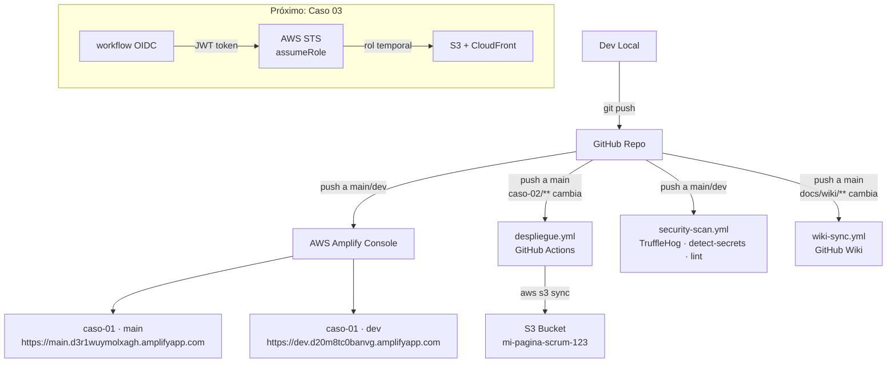

# GitHub Actions Journey — Proyectos AWS


**Monorepo de casos AWS progresivos**, donde cada caso demuestra un patrón específico de **GitHub Actions** aplicado a infraestructura real en AWS. Complementa el repositorio [proyectos-aws-gitlab](https://gitlab.com/vladimir.acuna.dev-group/proyectos-aws-gitlab), que documenta el viaje por servicios AWS usando GitLab CI.

> Narrativa completa: [GITHUB_ACTIONS_JOURNEY.md](GITHUB_ACTIONS_JOURNEY.md)

---

## Elige tu camino

| Si eres... | Lee... |
|:---|:---|
| **Reclutador / Manager** | [Guía Estratégica](docs/wiki/Recruiter-Guide.md) — valor de negocio y madurez técnica |
| **Dev / DevOps** | [Guía de Tooling](docs/wiki/Tooling-Guide.md) — Docker, K8s, Hub CLI |
| **Experto en Seguridad** | [Política de Seguridad](SECURITY.md) — OIDC, SAST, secret scanning |
| **Novato / Estudiante** | [Manual para Novatos](docs/wiki/Manual-Novatos.md) — analogías y conceptos base |

---

## Mapa de casos

| # | Caso | Servicio AWS | GitHub Actions | Estado | Demo |
|:---:|:---|:---|:---|:---:|:---|
| 01 | [Amplify Hosting](caso-01-amplify-hosting/README.md) | Amplify Console | Branch deploy nativo | ✅ | [main](https://main.d3r1wuymolxagh.amplifyapp.com/) · [dev](https://dev.d20m8tc0banvg.amplifyapp.com/) |
| 02 | [S3 + Actions Deploy](caso-02-s3-github-actions/README.md) | S3 | Workflow básico, `paths` filter | ✅ | [S3](https://mi-pagina-scrum-123.s3.us-east-2.amazonaws.com/index.html) |
| 03 | S3 + CloudFront + OIDC | S3, CloudFront | OIDC federation, sin credenciales | 🔜 Q2 2026 | — |
| 04 | Environments + Approvals | S3, CloudFront | GitHub Environments, required reviewers | 🔜 Q2 2026 | — |
| 05 | Lambda + API Gateway | Lambda, API GW | Multi-job: test → build → deploy | 🔜 Q2-Q3 | — |
| 06 | DynamoDB + Matrix | DynamoDB, Lambda | Matrix strategy (regiones / runtimes) | 🔜 Q3 2026 | — |
| 07 | Reusable Workflows | Múltiple | Reusable workflows, composite actions | 🔜 Q3 2026 | — |
| 08 | Containers + GHCR | ECS Fargate | GitHub Container Registry, Docker build | 🔜 Q3 2026 | — |
| 09 | FinOps + Scheduled | Cost Explorer | Cron workflows, reporting automático | 🔜 Q4 2026 | — |
| 10 | Multi-región + DR | S3, Route53 | Matrix regions, smoke tests, DNS failover | 🔜 Q4 2026 | — |
| 11 | EKS + GitOps | EKS, ECR | GitOps sobre K8s desde Actions | 🔜 Q4 2026 | — |

---

## Arquitectura del pipeline (casos completados)


```mermaid
flowchart TD
    dev[Dev Local] -->|git push| GH[GitHub Repo]

    GH -->|push a main/dev| AMP[AWS Amplify Console]
    AMP --> PROD[caso-01 · main\nhttps://main.d3r1wuymolxagh.amplifyapp.com]
    AMP --> DEV[caso-01 · dev\nhttps://dev.d20m8tc0banvg.amplifyapp.com]

    GH -->|push a main\ncaso-02/** cambia| WF[despliegue.yml\nGitHub Actions]
    WF -->|aws s3 sync| S3[S3 Bucket\nmi-pagina-scrum-123]

    GH -->|push a main/dev| SEC[security-scan.yml\nTruffleHog · detect-secrets · lint]
    GH -->|push a main\ndocs/wiki/** cambia| WKI[wiki-sync.yml\nGitHub Wiki]

    subgraph "Próximo: Caso 03"
        WF3[workflow OIDC] -->|JWT token| STS[AWS STS\nassumeRole]
        STS -->|rol temporal| S3C[S3 + CloudFront]
    end
```

---

## Pipeline de seguridad

| Capa | Herramienta | Trigger |
|:---|:---|:---|
| Pre-commit local | `detect-secrets`, YAML lint, Terraform validate | Cada commit local |
| Secret scanning | TruffleHog (historial completo) | Push a main/dev |
| Dependency review | `actions/dependency-review-action` | Pull Request |
| Detect secrets (CI) | `detect-secrets scan --baseline` | Push a main/dev |
| YAML + MD lint | `yamllint`, `markdownlint-cli` | Push a main/dev |
| IaC validation | Checkov (en tooling Docker) | `make tooling-validate` |
| Identidad (plan) | AWS OIDC | Caso 03 (Q2 2026) |

---

## Complementariedad con GitLab

```
proyectos-aws-gitlab (GitLab CI)          proyectos-aws (GitHub Actions)
════════════════════════════════          ══════════════════════════════
¿QUÉ hace cada servicio AWS?         ←→  ¿CÓMO orquesta GitHub Actions?
Casos A-L: Amplify, S3, Lambda,          Casos 01-11: mismos servicios,
           DynamoDB, Cognito,                         distinto eje de
           ECS, EKS, FinOps...                        aprendizaje

GitLab CI nativo con 5 etapas       ←→  GitHub Actions Marketplace
OIDC ya implementado                ←→  OIDC en Caso 03 (Q2 2026)
Terraform en cada caso              ←→  IaC incremental por caso
GitLab Pages                        ←→  GitHub Pages + Releases
```

---

## Quick Start

```bash
# Clonar
git clone https://github.com/vladimiracunadev-create/proyectos-aws.git
cd proyectos-aws

# Tooling (Docker + AWS CLI + Terraform + linters)
make tooling-build
make tooling-validate

# Seguridad local
make security-scan

# Demo K8s (requiere kind)
make k8s-demo

# Ver todos los comandos
make help
```

---

## Documentación

### Narrativa y casos
- [GitHub Actions Journey](GITHUB_ACTIONS_JOURNEY.md) — viaje técnico completo
- [Casos Completados](docs/CASOS_COMPLETADOS.md) — validación y detalles de los casos en producción
- [Roadmap](ROADMAP.md) — evolución trimestral con criterios de éxito

### Ingeniería
- [Arquitectura CI/CD](docs/wiki/CI-CD-Architecture.md) — workflows explicados
- [PWA Technical Deep Dive](docs/PWA_TECHNICAL_DEEP_DIVE.md) — Service Workers, caché
- [CI/CD Engineering Deep Dive](docs/CI_CD_ENGINEERING_DEEP_DIVE.md) — OIDC, JWT, deploy inmutable
- [File Architecture](FILE_ARCHITECTURE.md) — análisis del monorepo
- [Tooling Guide](docs/TOOLING.md) — Docker, K8s, Makefile

### Gobernanza
- [FinOps & Costos](docs/FINOPS_COSTOS.md) — desglose de costos por caso
- [Cobertura de Certificaciones](docs/CERT_COVERAGE.md) — mapeo SAA-C03, DVA-C02, SOA-C02
- [Security Policy](SECURITY.md) — defensa en profundidad
- [Security Checklist](docs/SECURITY_CHECKLIST.md) — auditoría por capas
- [Killed Practices](docs/killed.md) — lo que NO hacemos y por qué

### Onboarding
- [Environment Setup](ENVIRONMENT_SETUP.md) — guía para nuevos colaboradores
- [Contributing](CONTRIBUTING.md) — guía de contribución
- [Glossary](GLOSSARY.md) — terminología técnica
- [Changelog](CHANGELOG.md) — historial de versiones
