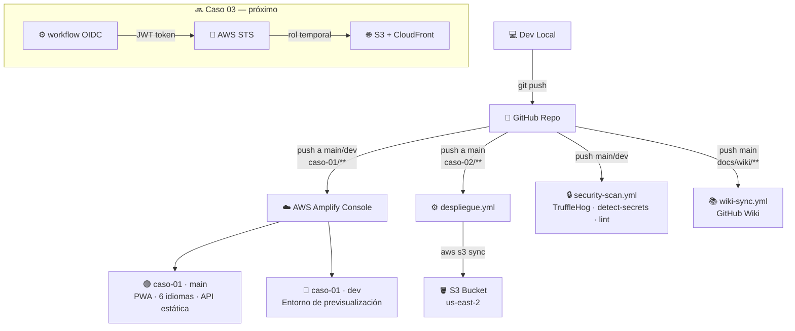

# GitHub Actions Journey — Proyectos AWS

[](https://github.com/vladimiracunadev-create/proyectos-aws/actions/workflows/security-scan.yml)
[](https://github.com/vladimiracunadev-create/proyectos-aws/actions/workflows/despliegue.yml)
[](https://github.com/vladimiracunadev-create/proyectos-aws/actions/workflows/wiki-sync.yml)


**11 casos progresivos** donde cada uno introduce un servicio AWS nuevo **y** una capacidad de GitHub Actions que no existía antes. Complementa [`proyectos-aws-gitlab`](https://gitlab.com/vladimir.acuna.dev-group/proyectos-aws-gitlab) — mientras GitLab documenta **qué hace cada servicio AWS**, este repositorio documenta **cómo GitHub Actions lo orquesta**.

> 📖 Narrativa completa: [**GITHUB_ACTIONS_JOURNEY.md**](GITHUB_ACTIONS_JOURNEY.md)

---

## 🧭 Elige tu camino

| Si eres... | Lee... |
|:---|:---|
| 💼 **Reclutador / Manager** | [Guía Estratégica](docs/wiki/Recruiter-Guide.md) — valor de negocio y madurez técnica |
| 🔒 **Experto en Seguridad** | [Política de Seguridad](SECURITY.md) — OIDC, SAST, secret scanning |
| 💻 **Dev / DevOps** | [Guía de Tooling](docs/wiki/Tooling-Guide.md) — Docker, K8s, Hub CLI |
| 🎓 **Certificaciones AWS** | [Cobertura DVA · SAA · SOA](docs/CERT_COVERAGE.md) — mapeo por caso |
| 🔰 **Novato / Estudiante** | [Manual para Novatos](docs/wiki/Manual-Novatos.md) — analogías y conceptos base |

---

## 🗺️ Mapa de los 11 casos

### ✅ Fase 1 — Fundamentos (Q1 2026 · Completada)

| # | Caso | Servicio AWS | GitHub Actions | Demo |
|:---:|:---|:---|:---|:---|
| [01](caso-01-amplify-hosting/README.md) | 🟢 **Amplify Hosting** | Amplify Console | Branch deploy nativo | [main](https://main.d3r1wuymolxagh.amplifyapp.com/) · [dev](https://dev.d20m8tc0banvg.amplifyapp.com/) |
| [02](caso-02-s3-github-actions/README.md) | 🟢 **S3 + Actions Deploy** | S3 | Workflow básico · `paths` filter | [S3](https://mi-pagina-scrum-123.s3.us-east-2.amazonaws.com/index.html) |

### 🔐 Fase 2 — Seguridad de Identidad (Q2 2026)

| # | Caso | Servicio AWS | GitHub Actions | Cert |
|:---:|:---|:---|:---|:---|
| [03](caso-03-cloudfront-oidc/README.md) | 🟡 **CloudFront + OIDC** | S3 · CloudFront · IAM | OIDC federation · sin secrets |   |
| [04](caso-04-environments-approvals/README.md) | 🟡 **Environments + Approvals** | S3 · CloudFront | GitHub Environments · aprobaciones |   |

### ⚡ Fase 3 — Serverless & Testing (Q2–Q3 2026)

| # | Caso | Servicio AWS | GitHub Actions | Cert |
|:---:|:---|:---|:---|:---|
| [05](caso-05-lambda-api-gateway/README.md) | 🟡 **Lambda + API Gateway** | Lambda · API GW · SAM | Multi-job · artifacts |   |
| [06](caso-06-dynamodb-matrix/README.md) | 🟡 **DynamoDB + Matrix** | DynamoDB · Lambda | Matrix strategy |   |

### 🏗️ Fase 4 — Plataforma GitHub (Q3 2026)

| # | Caso | Servicio AWS | GitHub Actions | Cert |
|:---:|:---|:---|:---|:---|
| [07](caso-07-reusable-workflows/README.md) | 🟡 **Reusable Workflows** | Múltiples | Reusable workflows · composite actions |   |
| [08](caso-08-containers-ghcr/README.md) | 🟡 **Containers + GHCR** | ECS Fargate · ECR | GHCR · Docker multi-platform |   |

### 🏛️ Fase 5 — Gobernanza & Resiliencia (Q4 2026)

| # | Caso | Servicio AWS | GitHub Actions | Cert |
|:---:|:---|:---|:---|:---|
| [09](caso-09-finops-scheduled/README.md) | 🟡 **FinOps + Scheduled** | Cost Explorer · Budgets | Cron workflows · auto-commit |   |
| [10](caso-10-multiregion-dr/README.md) | 🟡 **Multi-región + DR** | Route53 · S3 · CloudFront | Matrix regions · smoke tests · rollback |   |
| [11](caso-11-eks-gitops/README.md) | 🟡 **EKS + GitOps** | EKS · ECR · IRSA | GitOps K8s · OIDC para K8s API |   |

> 🟢 Completado · 🟡 Planificado

---

## 🔄 Arquitectura del pipeline (casos activos)


```mermaid
flowchart TD
    dev[💻 Dev Local] -->|git push| GH[🐙 GitHub Repo]

    GH -->|push a main/dev\ncaso-01/**| AMP[☁️ AWS Amplify Console]
    AMP --> PROD[🟢 caso-01 · main\nPWA · 6 idiomas · API estática]
    AMP --> DEV_ENV[🔵 caso-01 · dev\nEntorno de previsualización]

    GH -->|push a main\ncaso-02/**| WF2[⚙️ despliegue.yml]
    WF2 -->|aws s3 sync| S3[🪣 S3 Bucket\nus-east-2]

    GH -->|push main/dev| SEC[🔒 security-scan.yml\nTruffleHog · detect-secrets · lint]
    GH -->|push main\ndocs/wiki/**| WKI[📚 wiki-sync.yml\nGitHub Wiki]

    subgraph "🔜 Caso 03 — próximo"
        WF3[⚙️ workflow OIDC] -->|JWT token| STS[🔐 AWS STS]
        STS -->|rol temporal| CDN[🌐 S3 + CloudFront]
    end
```

---

## 🔒 Pipeline de seguridad (Defense in Depth)

| 🛡️ Capa | 🔧 Herramienta | ⚡ Trigger |
|:---|:---|:---|
| **Pre-commit local** | `detect-secrets` · YAML lint · Terraform fmt | Cada commit |
| **Secret scanning** | TruffleHog (historial completo) | Push main/dev |
| **Dependency review** | `actions/dependency-review-action` | Pull Request |
| **IaC validation** | Checkov (Docker tooling) | `make tooling-validate` |
| **Identidad** | AWS OIDC _(sin secrets estáticos)_ | 🔜 Caso 03 |

---

## 🔗 Complementariedad con GitLab

```
proyectos-aws-gitlab (GitLab CI)           proyectos-aws (GitHub Actions)
══════════════════════════════════         ══════════════════════════════════
 ❓ ¿QUÉ hace cada servicio AWS?      ←→   ❓ ¿CÓMO lo orquesta GitHub Actions?
 📚 11 casos A→L (Amplify→EKS→FinOps)      📚 11 casos 01→11 (mismo stack)
 🔧 GitLab CI nativo · OIDC · Terraform     🔧 Actions Marketplace · GHCR · Envs
 📊 FinOps stage con Cost Explorer         📊 Scheduled cron + auto-commit
 🐳 ECS/EKS via GitLab Runner              🐳 ECS/EKS via GHCR + IRSA
```

---

## ⚙️ Quick Start

```bash
# Clonar
git clone https://github.com/vladimiracunadev-create/proyectos-aws.git

# Tooling completo (AWS CLI + Terraform + Checkov + linters)
make tooling-build && make tooling-validate

# Seguridad local
make security-scan

# Demo K8s (requiere kind instalado)
make k8s-demo

# Ver todos los comandos disponibles
make help
```

---

## 📚 Documentación

| 📂 Categoría | 📄 Documento |
|:---|:---|
| 🗺️ **Narrativa** | [GitHub Actions Journey](GITHUB_ACTIONS_JOURNEY.md) · [Roadmap](ROADMAP.md) |
| ✅ **Casos** | [Casos Completados](docs/CASOS_COMPLETADOS.md) · README por carpeta de caso |
| 💰 **FinOps** | [Costos por caso](docs/FINOPS_COSTOS.md) |
| 🎓 **Certificaciones** | [DVA · SAA · SOA Coverage](docs/CERT_COVERAGE.md) |
| 🔒 **Seguridad** | [Security Policy](SECURITY.md) · [Security Checklist](docs/SECURITY_CHECKLIST.md) · [Killed Practices](docs/killed.md) |
| 🏗️ **Ingeniería** | [CI/CD Deep Dive](docs/CI_CD_ENGINEERING_DEEP_DIVE.md) · [PWA Deep Dive](docs/PWA_TECHNICAL_DEEP_DIVE.md) · [File Architecture](FILE_ARCHITECTURE.md) |
| 🛠️ **Tooling** | [Tooling Guide](docs/TOOLING.md) · [Environment Setup](ENVIRONMENT_SETUP.md) |
| 📖 **Referencia** | [Glossary](GLOSSARY.md) · [Changelog](CHANGELOG.md) · [Contributing](CONTRIBUTING.md) |
