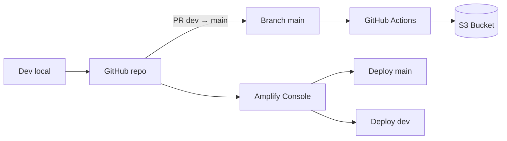

# 🚀 Cloud Portfolio: Proyectos AWS (Monorepo)


**Monorepo de portafolio con despliegues reales en AWS** para demostrar prácticas modernas de **CI/CD**, separación de **entornos por rama**, y documentación clara de infraestructura.

## ✨ Características Principales

- **✅ CI/CD de Alto Nivel:** Pipeline automatizado que integra S3, Amplify y GitHub Actions con estrategias de despliegue por rama.
- **✅ Seguridad Multi-capa:** Escaneos SAST, auditoría de secretos (TruffleHog, detect-secrets) y control de dependencias.
- **✅ Infraestructura Moderna:** Uso de Docker y Kubernetes para herramientas de validación, garantizando portabilidad absoluta.
- **✅ Documentación Viva:** Wiki automatizada que se sincroniza con el código (`Documentation as Code`).

---

## 🧭 ¿Por dónde empezar? (Elige tu camino)

| Si eres... | Te recomendamos leer... | ¿Qué aprenderás? |
| :--- | :--- | :--- |
| **💼 Reclutador / Manager** | [**Guía Estratégica**](docs/wiki/Recruiter-Guide.md) | Valor de negocio, seguridad y madurez técnica. |
| **🔰 Novato / Estudiante** | [**Manual para Novatos**](docs/wiki/Manual-Novatos.md) | Conceptos básicos de Cloud y CI/CD con analogías. |
| **💻 Desarrollador / DevOps** | [**Guía de Tooling**](docs/wiki/Tooling-Guide.md) | Uso del Hub CLI, Docker, K8s y validaciones. |
| **🔒 Experto en Seguridad** | [**Política de Seguridad**](SECURITY.md) | Detalles de SAST, Secret Scanning y OIDC. |

## 🌐 Demos en Vivo

### 1) AWS S3 + GitHub Actions (Deploy Automatizado)

- **Estado:** ✅ Operativo  
- **Stack:** S3, IAM, GitHub Actions (YAML)  
- **Carpeta:** `aws-s3-scrum-mi-sitio-1/`  
- **Demo:** https://mi-pagina-scrum-123.s3.us-east-2.amazonaws.com/index.html

### 2) AWS Amplify – Continuous Deployment por Rama

- **Estado:** ✅ Operativo  
- **Stack:** AWS Amplify Console, SSL automático  
- **Carpeta:** `aws-amplify-mi-sitio-1/`  
- **Demo Main:** https://main.d3r1wuymolxagh.amplifyapp.com/  
- **Demo Dev:**  https://dev.d20m8tc0banvg.amplifyapp.com/

---

## 🧭 Flujo Profesional (Local → GitHub → AWS)

1. **Local (VS Code):** editas, pruebas y validas cambios.
2. **GitHub:** trabajas en `dev`, haces commits y creas **Pull Request** a `main`.
3. **AWS:**
   - **Amplify** despliega automáticamente por rama (`dev` / `main`).
   - **S3 + GitHub Actions** sincroniza el bucket desde `main` según workflow.

---

## 🛠️ Tooling Layer (Opcional)

Este repositorio incluye una **capa de tooling profesional** con Docker, Kubernetes y validaciones automatizadas. Es completamente opcional y no afecta los proyectos existentes.

### Quick Start

```bash
# 1. Construir imagen de tooling
make tooling-build

# 2. Ejecutar validaciones
make tooling-validate

# 3. Listar proyectos
./hub.sh list-projects      # Linux/Mac
.\hub.ps1 list-projects     # Windows

# 4. Demo en Kubernetes (requiere kind)
make k8s-demo
```

### Características

- ✅ **Docker:** Imagen con AWS CLI, Terraform, Checkov, linters
- ✅ **Kubernetes:** Demo con Job, SecurityContext, NetworkPolicy
- ✅ **Makefile:** Comandos estandarizados para tooling
- ✅ **Hub CLI:** Scripts bash/PowerShell para gestión de proyectos
- ✅ **Seguridad:** Pre-commit hooks, secret scanning, dependency scanning

### Documentación

- 📖 [Guía de Tooling](docs/TOOLING.md) - Documentación completa
- 🔒 [Security Checklist](docs/SECURITY_CHECKLIST.md) - Auditoría de seguridad
- ❌ [Killed Practices](docs/killed.md) - Prácticas prohibidas

---

## 🏗️ Arquitectura (alto nivel)


```mermaid
flowchart LR
  A[Dev local] --> B[GitHub repo]
  B -->|PR dev → main| C[Branch main]
  C --> D[GitHub Actions]
  D --> E[(S3 Bucket)]
  B --> F[Amplify Console]
  F --> G[Deploy main]
  F --> H[Deploy dev]
```

---

## 🔒 Seguridad (Defense in Depth)

Este repositorio implementa un modelo de **Defensa en Profundidad**:

| Capa | Herramienta/Práctica | Propósito |
| :--- | :--- | :--- |
| **Local** | `pre-commit` | Validaciones rápidas antes de subir código. |
| **Estática** | `detect-secrets` | Auditoría de secretos accidentalmente commiteados. |
| **Dinámica** | `TruffleHog` | Verificación de secretos expuestos en el historial. |
| **Infra** | `K8s NetPol` | Aislamiento de red para trabajos de validación. |
| **Identidad** | `AWS OIDC` | Eliminación de Access Keys estáticas en CI. |

Ver [SECURITY.md](SECURITY.md) para la política completa.

---

## 📚 Documentación Adicional

- [👨‍💼 Guía para Reclutadores](docs/RECRUITER.md) - Valor de negocio y resumen técnico
- [🏢 Arquitectura de Archivos](FILE_ARCHITECTURE.md) - Análisis profundo del monorepo
- [🖥️ Especificaciones del Sistema](SYSTEM_SPECS.md) - Requisitos de Hardware/Software (Min/Max)
- [🛠️ Setup de Entorno](ENVIRONMENT_SETUP.md) - Guía para nuevos colaboradores
- [📖 Glosario Técnico](GLOSSARY.md) - Definiciones clave de infraestructura
- [📝 Changelog](CHANGELOG.md) - Historial detallado de versiones
- [🔒 SECURITY.md](SECURITY.md) - Política de seguridad
- [🤝 CONTRIBUTING.md](CONTRIBUTING.md) - Guía de contribución
- [📅 ROADMAP.md](ROADMAP.md) - Roadmap del proyecto
- [🛠️ docs/TOOLING.md](docs/TOOLING.md) - Guía de tooling
- [❌ docs/killed.md](docs/killed.md) - Prácticas prohibidas
