# GitHub Actions Journey — Proyectos AWS

[](https://github.com/vladimiracunadev-create/proyectos-aws/actions/workflows/security-scan.yml)
[](https://github.com/vladimiracunadev-create/proyectos-aws/actions/workflows/despliegue.yml)
[](https://github.com/vladimiracunadev-create/proyectos-aws/actions/workflows/wiki-sync.yml)


**11 casos progresivos** donde cada uno introduce un servicio AWS nuevo **y** una capacidad de GitHub Actions que no existía antes. Complementa [`proyectos-aws-gitlab`](https://gitlab.com/vladimir.acuna.dev-group/proyectos-aws-gitlab) — mientras GitLab documenta **qué hace cada servicio AWS**, este repositorio documenta **cómo GitHub Actions lo orquesta**.

> 📖 Narrativa completa: [**GITHUB_ACTIONS_JOURNEY.md**](GITHUB_ACTIONS_JOURNEY.md)

---

## 🧭 Elige tu camino

| Si eres... | Lee... |
|:---|:---|
| 💼 **Reclutador / Manager** | [Guía Estratégica](docs/wiki/Recruiter-Guide.md) — valor de negocio y madurez técnica |
| 🔒 **Experto en Seguridad** | [Política de Seguridad](SECURITY.md) — OIDC, SAST, secret scanning |
| 💻 **Dev / DevOps** | [Guía de Tooling](docs/wiki/Tooling-Guide.md) — Docker, K8s, Hub CLI |
| 🎓 **Certificaciones AWS** | [Cobertura DVA · SAA · SOA](docs/CERT_COVERAGE.md) — mapeo por caso |
| 🔰 **Novato / Estudiante** | [Manual para Novatos](docs/wiki/Manual-Novatos.md) — analogías y conceptos base |

---

## 🗺️ Mapa de los 11 casos

### ✅ Fase 1 — Fundamentos (Q1 2026 · Completada)

| # | Caso | Servicio AWS | GitHub Actions | Demo |
|:---:|:---|:---|:---|:---|
| [01](caso-01-amplify-hosting/README.md) | 🟢 **Amplify Hosting** | Amplify Console | Branch deploy nativo | [main](https://main.d3r1wuymolxagh.amplifyapp.com/) · [dev](https://dev.d20m8tc0banvg.amplifyapp.com/) |
| [02](caso-02-s3-github-actions/README.md) | 🟢 **S3 + Actions Deploy** | S3 | Workflow básico · `paths` filter | [S3](https://mi-pagina-scrum-123.s3.us-east-2.amazonaws.com/index.html) |

### 🔐 Fase 2 — Seguridad de Identidad (Q2 2026)

| # | Caso | Servicio AWS | GitHub Actions | Cert |
|:---:|:---|:---|:---|:---|
| [03](caso-03-cloudfront-oidc/README.md) | 🟡 **CloudFront + OIDC** | S3 · CloudFront · IAM | OIDC federation · sin secrets |   |
| [04](caso-04-environments-approvals/README.md) | 🟡 **Environments + Approvals** | S3 · CloudFront | GitHub Environments · aprobaciones |   |

### ⚡ Fase 3 — Serverless & Testing (Q2–Q3 2026)

| # | Caso | Servicio AWS | GitHub Actions | Cert |
|:---:|:---|:---|:---|:---|
| [05](caso-05-lambda-api-gateway/README.md) | 🟡 **Lambda + API Gateway** | Lambda · API GW · SAM | Multi-job · artifacts |   |
| [06](caso-06-dynamodb-matrix/README.md) | 🟡 **DynamoDB + Matrix** | DynamoDB · Lambda | Matrix strategy |   |

### 🏗️ Fase 4 — Plataforma GitHub (Q3 2026)

| # | Caso | Servicio AWS | GitHub Actions | Cert |
|:---:|:---|:---|:---|:---|
| [07](caso-07-reusable-workflows/README.md) | 🟡 **Reusable Workflows** | Múltiples | Reusable workflows · composite actions |   |
| [08](caso-08-containers-ghcr/README.md) | 🟡 **Containers + GHCR** | ECS Fargate · ECR | GHCR · Docker multi-platform |   |

### 🏛️ Fase 5 — Gobernanza & Resiliencia (Q4 2026)

| # | Caso | Servicio AWS | GitHub Actions | Cert |
|:---:|:---|:---|:---|:---|
| [09](caso-09-finops-scheduled/README.md) | 🟡 **FinOps + Scheduled** | Cost Explorer · Budgets | Cron workflows · auto-commit |   |
| [10](caso-10-multiregion-dr/README.md) | 🟡 **Multi-región + DR** | Route53 · S3 · CloudFront | Matrix regions · smoke tests · rollback |   |
| [11](caso-11-eks-gitops/README.md) | 🟡 **EKS + GitOps** | EKS · ECR · IRSA | GitOps K8s · OIDC para K8s API |   |

> 🟢 Completado · 🟡 Planificado

---

## 🔄 Arquitectura del pipeline (casos activos)

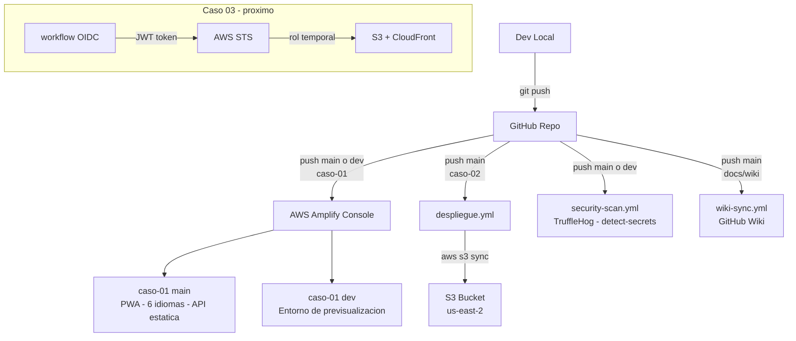
```mermaid
flowchart TD
    DEV[Dev Local] -->|git push| GH[GitHub Repo]

    GH -->|push main o dev\ncaso-01| AMP[AWS Amplify Console]
    AMP --> PROD[caso-01 main\nPWA - 6 idiomas - API estatica]
    AMP --> DEV_ENV[caso-01 dev\nEntorno de previsualizacion]

    GH -->|push main\ncaso-02| WF2[despliegue.yml]
    WF2 -->|aws s3 sync| S3[S3 Bucket\nus-east-2]

    GH -->|push main o dev| SEC[security-scan.yml\nTruffleHog - detect-secrets]
    GH -->|push main\ndocs/wiki| WKI[wiki-sync.yml\nGitHub Wiki]

    subgraph Caso03[Caso 03 - proximo]
        WF3[workflow OIDC] -->|JWT token| STS[AWS STS]
        STS -->|rol temporal| CDN[S3 + CloudFront]
    end
```

---

## 📋 Guía rápida por caso

<details>
<summary>✅ Caso 01 — Amplify Hosting · <em>en producción</em></summary>

**AWS Amplify Console** monitorea el repo y despliega automáticamente al hacer push, sin configurar runners ni pipelines.

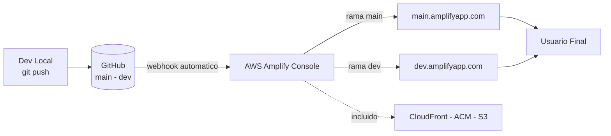
```mermaid
flowchart LR
    DEV[Dev Local\ngit push] --> GH[(GitHub\nmain - dev)]
    GH -->|webhook automatico| AMP[AWS Amplify Console]
    AMP -->|rama main| PROD[main.amplifyapp.com]
    AMP -->|rama dev| PREV[dev.amplifyapp.com]
    AMP -.->|incluido| CDN[CloudFront - ACM - S3]
    PROD --> USER[Usuario Final]
    PREV --> USER
```

**Pasos clave:**

1. Amplify Console → `New app → Host web app` → conectar repo GitHub
2. Configurar branch mappings (`main` → prod, `dev` → preview)
3. Añadir `amplify.yml` con `appRoot: caso-01-amplify-hosting`
4. `git push` → Amplify construye y despliega en ~2 min con SSL y CDN incluidos

📄 [README detallado](caso-01-amplify-hosting/README.md) · 📋 [Guia paso a paso](caso-01-amplify-hosting/AWS_PASO_A_PASO.md) · [Demo main](https://main.d3r1wuymolxagh.amplifyapp.com/) · [Demo dev](https://dev.d20m8tc0banvg.amplifyapp.com/)
</details>

<details>
<summary>✅ Caso 02 — S3 + GitHub Actions · <em>en producción</em></summary>

**GitHub Actions** controla cada paso del pipeline explícitamente; `aws s3 sync` despliega al bucket.

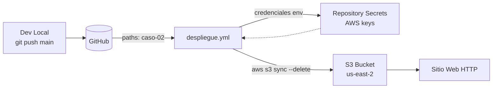
```mermaid
flowchart LR
    DEV[Dev Local\ngit push main] --> GH[(GitHub)]
    GH -->|paths: caso-02| WF[despliegue.yml]
    WF -->|credenciales env| SEC[Repository Secrets\nAWS keys]
    SEC -.-> WF
    WF -->|aws s3 sync --delete| S3[S3 Bucket\nus-east-2]
    S3 --> WEB[Sitio Web HTTP]
```

**Pasos clave:**

1. Crear bucket S3 → habilitar `Static website hosting`
2. Crear IAM User con política mínima (`s3:PutObject`, `s3:DeleteObject`, `s3:ListBucket`)
3. Añadir `AWS_ACCESS_KEY_ID` y `AWS_SECRET_ACCESS_KEY` en `Settings → Secrets → Actions`
4. Crear `despliegue.yml` con `paths: caso-02-s3-github-actions/**` y `aws s3 sync --delete`

📄 [README detallado](caso-02-s3-github-actions/README.md) · 📋 [Guia paso a paso](caso-02-s3-github-actions/AWS_PASO_A_PASO.md) · [Demo S3](https://mi-pagina-scrum-123.s3.us-east-2.amazonaws.com/index.html)
</details>

<details>
<summary>🔜 Caso 03 — CloudFront + OIDC · Q2 2026</summary>

Elimina las credenciales estáticas del Caso 02. OIDC emite un JWT efímero; AWS STS lo valida y devuelve credenciales temporales de 15 minutos.

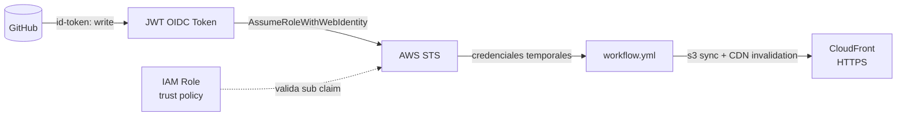
```mermaid
flowchart LR
    GH[(GitHub)] -->|id-token: write| JWT[JWT OIDC Token]
    JWT -->|AssumeRoleWithWebIdentity| STS[AWS STS]
    IAM[IAM Role\ntrust policy] -.->|valida sub claim| STS
    STS -->|credenciales temporales| WF[workflow.yml]
    WF -->|s3 sync + CDN invalidation| CDN[CloudFront\nHTTPS]
```

**Pasos clave proyectados:**

1. Crear OIDC Provider en IAM → URL: `token.actions.githubusercontent.com`
2. Crear IAM Role con trust policy restringida a `repo:owner/repo:ref:refs/heads/main`
3. Crear distribución CloudFront → origen S3 con OAC (sin acceso público directo)
4. Workflow: `permissions: id-token: write` + `role-to-assume` + step de `create-invalidation`

📄 [README detallado](caso-03-cloudfront-oidc/README.md)
</details>

<details>
<summary>🔜 Caso 04 — Environments + Approvals · Q2 2026</summary>

Staging se despliega automáticamente; producción pausa hasta que un revisor apruebe en GitHub UI.

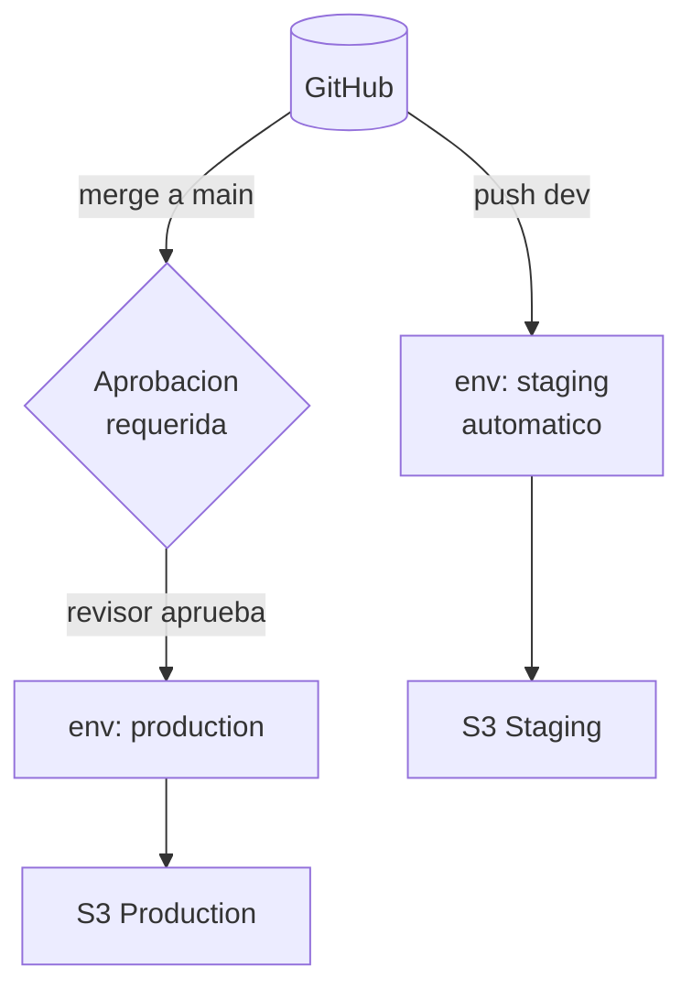
```mermaid
flowchart TB
    GH[(GitHub)] -->|push dev| STG[env: staging\nautomatico]
    GH -->|merge a main| GATE{Aprobacion\nrequerida}
    GATE -->|revisor aprueba| PRD[env: production]
    STG --> S3_S[S3 Staging]
    PRD --> S3_P[S3 Production]
```

📄 [README detallado](caso-04-environments-approvals/README.md)
</details>

<details>
<summary>🔜 Caso 05 — Lambda + API Gateway · Q2–Q3 2026</summary>

Primer backend real. Patrón **test → build → deploy** con jobs encadenados y artefactos compartidos.

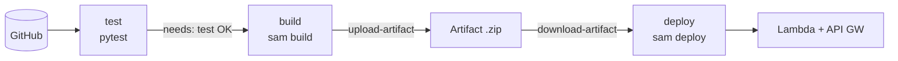
```mermaid
flowchart LR
    GH[(GitHub)] --> J1[test\npytest]
    J1 -->|needs: test OK| J2[build\nsam build]
    J2 -->|upload-artifact| ART[Artifact .zip]
    ART -->|download-artifact| J3[deploy\nsam deploy]
    J3 --> LAMBDA[Lambda + API GW]
```

📄 [README detallado](caso-05-lambda-api-gateway/README.md)
</details>

<details>
<summary>🔜 Caso 06 — DynamoDB + Matrix · Q3 2026</summary>

Persistencia real (DynamoDB) y matrix strategy: el mismo código probado en múltiples runtimes × regiones en paralelo.

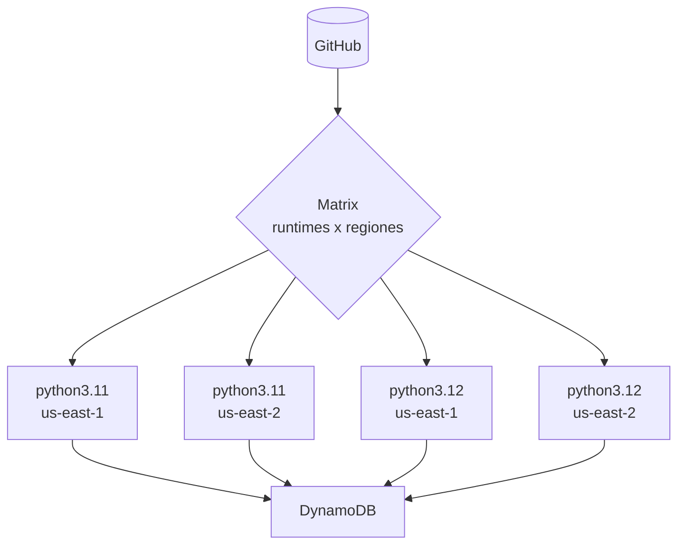
```mermaid
flowchart TB
    GH[(GitHub)] --> MAT{Matrix\nruntimes x regiones}
    MAT --> J1[python3.11\nus-east-1]
    MAT --> J2[python3.11\nus-east-2]
    MAT --> J3[python3.12\nus-east-1]
    MAT --> J4[python3.12\nus-east-2]
    J1 --> DDB[DynamoDB]
    J2 --> DDB
    J3 --> DDB
    J4 --> DDB
```

📄 [README detallado](caso-06-dynamodb-matrix/README.md)
</details>

<details>
<summary>🔜 Caso 07 — Reusable Workflows · Q3 2026</summary>

Extrae la lógica común de deploy a una librería interna de GitHub Actions reutilizable por todos los casos futuros.

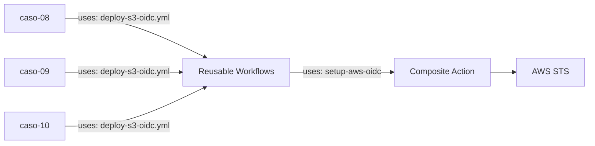
```mermaid
flowchart LR
    C8[caso-08] -->|uses: deploy-s3-oidc.yml| RW[Reusable Workflows]
    C9[caso-09] -->|uses: deploy-s3-oidc.yml| RW
    C10[caso-10] -->|uses: deploy-s3-oidc.yml| RW
    RW -->|uses: setup-aws-oidc| CA[Composite Action]
    CA --> STS[AWS STS]
```

📄 [README detallado](caso-07-reusable-workflows/README.md)
</details>

<details>
<summary>🔜 Caso 08 — Containers + GHCR · Q3 2026</summary>

Containerizar la app, publicarla en GitHub Container Registry (gratis) y desplegarla en ECS Fargate.

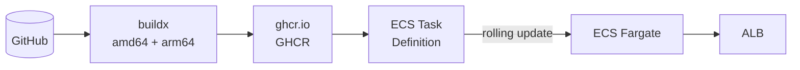
```mermaid
flowchart LR
    GH[(GitHub)] --> BUILD[buildx\namd64 + arm64]
    BUILD --> GHCR[ghcr.io\nGHCR]
    GHCR --> TASK[ECS Task\nDefinition]
    TASK -->|rolling update| FARGATE[ECS Fargate]
    FARGATE --> ALB[ALB]
```

📄 [README detallado](caso-08-containers-ghcr/README.md)
</details>

<details>
<summary>🔜 Caso 09 — FinOps + Scheduled · Q4 2026</summary>

Cron mensual que extrae costos reales de AWS Cost Explorer y actualiza `docs/FINOPS_COSTOS.md` automáticamente.

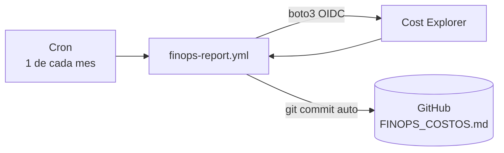
```mermaid
flowchart LR
    CRON[Cron\n1 de cada mes] --> WF[finops-report.yml]
    WF -->|boto3 OIDC| CE[Cost Explorer]
    CE --> WF
    WF -->|git commit auto| GH[(GitHub\nFINOPS_COSTOS.md)]
```

📄 [README detallado](caso-09-finops-scheduled/README.md)
</details>

<details>
<summary>🔜 Caso 10 — Multi-región + DR · Q4 2026</summary>

Deploy paralelo a dos regiones AWS con validación de salud antes de actualizar el DNS con Route53.

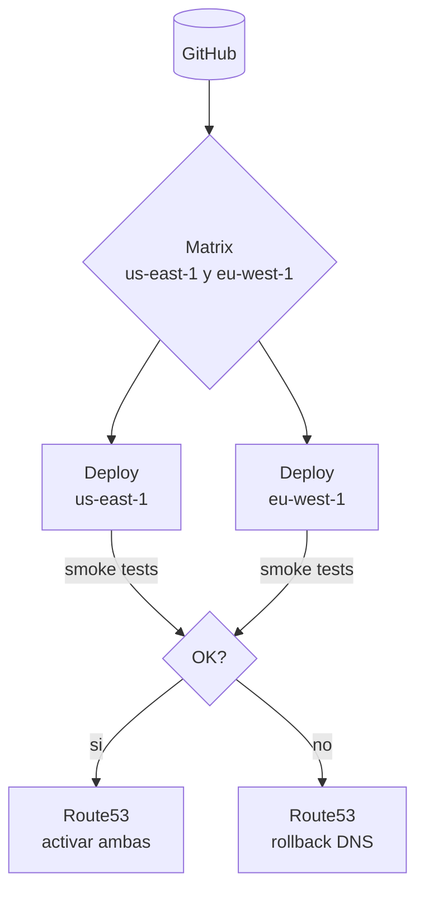
```mermaid
flowchart TB
    GH[(GitHub)] --> MAT{Matrix\nus-east-1 y eu-west-1}
    MAT --> D1[Deploy\nus-east-1]
    MAT --> D2[Deploy\neu-west-1]
    D1 -->|smoke tests| OK{OK?}
    D2 -->|smoke tests| OK
    OK -->|si| R53U[Route53\nactivar ambas]
    OK -->|no| R53R[Route53\nrollback DNS]
```

📄 [README detallado](caso-10-multiregion-dr/README.md)
</details>

<details>
<summary>🔜 Caso 11 — EKS + GitOps · Q4 2026</summary>

Cierre del viaje. GitHub Actions como controlador GitOps: manifiestos en el repo = estado del cluster EKS.

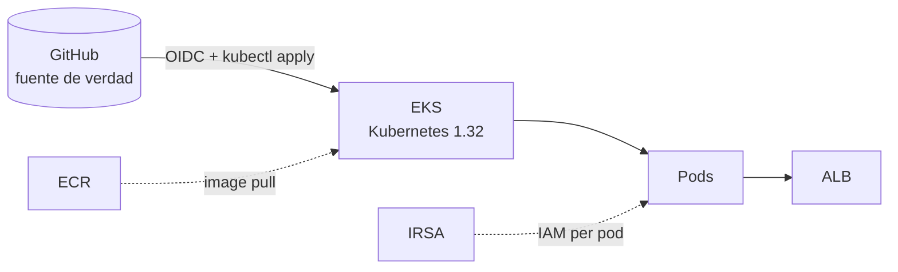
```mermaid
flowchart LR
    GH[(GitHub\nfuente de verdad)] -->|OIDC + kubectl apply| EKS[EKS\nKubernetes 1.32]
    EKS --> POD[Pods]
    POD --> ALB[ALB]
    ECR[ECR] -.->|image pull| EKS
    IRSA[IRSA] -.->|IAM per pod| POD
```

📄 [README detallado](caso-11-eks-gitops/README.md)
</details>

---

## 🔒 Pipeline de seguridad (Defense in Depth)

| 🛡️ Capa | 🔧 Herramienta | ⚡ Trigger |
|:---|:---|:---|
| **Pre-commit local** | `detect-secrets` · YAML lint · Terraform fmt | Cada commit |
| **Secret scanning** | TruffleHog (historial completo) | Push main/dev |
| **Dependency review** | `actions/dependency-review-action` | Pull Request |
| **IaC validation** | Checkov (Docker tooling) | `make tooling-validate` |
| **Identidad** | AWS OIDC _(sin secrets estáticos)_ | 🔜 Caso 03 |

---

## 🔗 Complementariedad con GitLab

```text
proyectos-aws-gitlab (GitLab CI)           proyectos-aws (GitHub Actions)
══════════════════════════════════         ══════════════════════════════════
 ❓ ¿QUÉ hace cada servicio AWS?      ←→   ❓ ¿CÓMO lo orquesta GitHub Actions?
 📚 11 casos A→L (Amplify→EKS→FinOps)      📚 11 casos 01→11 (mismo stack)
 🔧 GitLab CI nativo · OIDC · Terraform     🔧 Actions Marketplace · GHCR · Envs
 📊 FinOps stage con Cost Explorer         📊 Scheduled cron + auto-commit
 🐳 ECS/EKS via GitLab Runner              🐳 ECS/EKS via GHCR + IRSA
```

---

## ⚙️ Quick Start

```bash
# Clonar
git clone https://github.com/vladimiracunadev-create/proyectos-aws.git

# Tooling completo (AWS CLI + Terraform + Checkov + linters)
make tooling-build && make tooling-validate

# Seguridad local
make security-scan

# Demo K8s (requiere kind instalado)
make k8s-demo

# Ver todos los comandos disponibles
make help
```

---

## 📚 Documentación

| 📂 Categoría | 📄 Documento |
|:---|:---|
| 🗺️ **Narrativa** | [GitHub Actions Journey](GITHUB_ACTIONS_JOURNEY.md) · [Roadmap](ROADMAP.md) |
| ✅ **Casos** | [Casos Completados](docs/CASOS_COMPLETADOS.md) · README por carpeta de caso |
| 💰 **FinOps** | [Costos por caso](docs/FINOPS_COSTOS.md) |
| 🎓 **Certificaciones** | [DVA · SAA · SOA Coverage](docs/CERT_COVERAGE.md) |
| 🔒 **Seguridad** | [Security Policy](SECURITY.md) · [Security Checklist](docs/SECURITY_CHECKLIST.md) · [Killed Practices](docs/killed.md) |
| 🏗️ **Ingeniería** | [CI/CD Deep Dive](docs/CI_CD_ENGINEERING_DEEP_DIVE.md) · [PWA Deep Dive](docs/PWA_TECHNICAL_DEEP_DIVE.md) · [File Architecture](FILE_ARCHITECTURE.md) |
| 🛠️ **Tooling** | [Tooling Guide](docs/TOOLING.md) · [Environment Setup](ENVIRONMENT_SETUP.md) |
| 📖 **Referencia** | [Glossary](GLOSSARY.md) · [Changelog](CHANGELOG.md) · [Contributing](CONTRIBUTING.md) |
