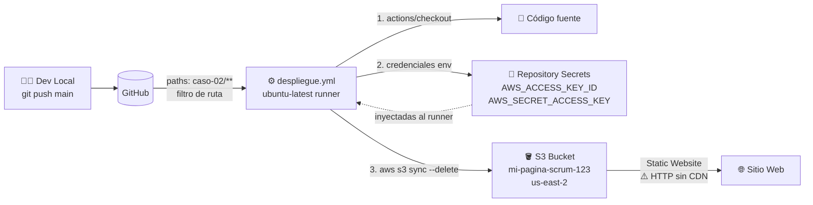

# Caso 02 — AWS S3: Deploy Automatizado con GitHub Actions

## Resumen

| Campo | Valor |
|:---|:---|
| **Caso** | 02 |
| **Servicio AWS** | Amazon S3 (Static Website Hosting) |
| **Patrón** | Push-triggered deployment via GitHub Actions |
| **GitHub Actions** | `despliegue.yml` — S3 sync en push a main |
| **Estado** | ✅ Completado — En producción |
| **Demo** | https://mi-pagina-scrum-123.s3.us-east-2.amazonaws.com/index.html |

---

## ¿Qué demuestra este caso?

**Problema resuelto:** Necesito control total sobre el pipeline de despliegue (añadir pasos, condiciones, notificaciones) sin depender de la lógica interna de Amplify.

**Solución:** Un workflow de GitHub Actions escucha cambios en la carpeta de este caso y ejecuta `aws s3 sync` directamente, demostrando el ciclo completo de CI/CD controlado desde GitHub.

**Flujo:**

```
Push a main (archivos en caso-02-s3-github-actions/**)
    └── .github/workflows/despliegue.yml se activa
        ├── Checkout del código
        ├── Diagnóstico: pwd + ls -R
        └── aws s3 sync → s3://mi-pagina-scrum-123 --delete
```

---

## 🏗️ Diagrama de arquitectura



---

## Stack Técnico

| Capa | Tecnología |
|:---|:---|
| **Hosting** | Amazon S3 (Static Website Hosting) |
| **CI/CD** | GitHub Actions (workflow YAML personalizado) |
| **Auth AWS** | AWS_ACCESS_KEY_ID + SECRET (⚠️ pendiente migrar a OIDC — Caso 03) |
| **Frontend** | HTML5, CSS3, Vanilla JS (idéntico al Caso 01) |
| **Región** | us-east-2 (Ohio) |

---

## Workflow actual (`.github/workflows/despliegue.yml`)

```yaml
name: Despliegue a S3 - Proyecto Scrum
on:
  push:
    branches: [main]
    paths:
      - 'caso-02-s3-github-actions/**'
  workflow_dispatch:

jobs:
  deploy:
    runs-on: ubuntu-latest
    steps:
      - uses: actions/checkout@v3
      - name: Sincronizar con AWS S3
        run: aws s3 sync ./caso-02-s3-github-actions s3://mi-pagina-scrum-123 --delete
        env:
          AWS_ACCESS_KEY_ID: ${{ secrets.AWS_ACCESS_KEY_ID }}
          AWS_SECRET_ACCESS_KEY: ${{ secrets.AWS_SECRET_ACCESS_KEY }}
          AWS_REGION: 'us-east-2'
```

---

## 📋 Pasos para reproducirlo desde cero

1. **Crear bucket S3** → habilitar `Static website hosting` → configurar `index.html` como documento raíz
2. **Política de bucket** → añadir `s3:GetObject` público (o con CloudFront OAC en el Caso 03)
3. **Crear IAM User** con política mínima: `s3:PutObject`, `s3:DeleteObject`, `s3:ListBucket` solo sobre este bucket
4. **Añadir secrets en GitHub** → `Settings → Secrets → Actions` → `AWS_ACCESS_KEY_ID` + `AWS_SECRET_ACCESS_KEY`
5. **Crear `.github/workflows/despliegue.yml`** con `paths: caso-02-s3-github-actions/**` y `aws s3 sync`
6. **`git push` a main** → el workflow se activa solo si hay cambios en esta carpeta
7. **Verificar** en S3 → `Properties → Static website hosting` → abrir la URL endpoint

> **Tiempo estimado:** 20 minutos. La deuda técnica (credenciales estáticas) se elimina en el Caso 03.

---

## Qué aprendí / Qué valida

1. **Control total del pipeline:** A diferencia del Caso 01, aquí cada paso es explícito y modificable.
2. **`paths` filter en GitHub Actions:** El workflow solo se activa si cambian archivos dentro de esta carpeta, evitando deploys innecesarios.
3. **`workflow_dispatch`:** Permite lanzar el deploy manualmente desde la UI de GitHub, útil para hotfixes.
4. **`--delete` en S3 sync:** Borra archivos del bucket que ya no existen en el repositorio, manteniendo el destino limpio.
5. **Deuda técnica identificada:** Las credenciales estáticas (`AWS_ACCESS_KEY_ID`) son el patrón antiguo. El Caso 03 las elimina con OIDC.

---

## Limitaciones actuales y evolución

| Limitación | Solución en caso futuro |
|:---|:---|
| Credenciales AWS estáticas como secrets | Caso 03: OIDC Federation |
| Sin CDN ni HTTPS propio | Caso 03: CloudFront |
| Sin invalidación de caché post-deploy | Caso 03: CloudFront invalidation step |
| Sin GitHub Environments (dev/staging/prod) | Caso 04: Environments con aprobaciones |
| Sin tests post-deploy | Caso 05: Smoke tests workflow |

---

## Diferencia con el Caso 01

| | Caso 01 (Amplify) | Caso 02 (S3 + Actions) |
|:---|:---|:---|
| **Quién hace el deploy** | Amplify Console (interno) | GitHub Actions (explícito) |
| **Visibilidad del pipeline** | Baja (caja negra) | Alta (YAML visible y versionado) |
| **Personalización** | Limitada | Total |
| **Costo estimado** | ~$0 (free tier Amplify) | ~$0.001/deploy (S3 + transfer) |

---

## Archivos principales

```
caso-02-s3-github-actions/
├── index.html              # Misma SPA que caso-01 (portafolio compartido)
├── app.js
├── styles.css
├── pwa.js
├── service-worker.js
├── manifest.webmanifest
├── robots.txt / sitemap.xml
├── llm.txt
├── api/v1/                 # Static JSON API
├── assets/                 # PDFs × 6 idiomas
└── experiencia-3d/         # Three.js WebGL gallery
```

> **Nota:** El contenido del sitio es idéntico al Caso 01. La diferencia está en el mecanismo de despliegue,
> que es el objetivo de aprendizaje de este caso. Los casos futuros (03+) tendrán contenido propio y diferenciado.
