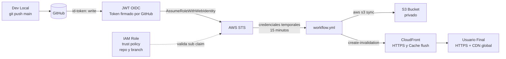

# Caso 03 — S3 + CloudFront + OIDC


---

## 🎯 Objetivo

Eliminar las credenciales AWS estáticas del pipeline y añadir una CDN real sobre S3.
Este caso cierra la deuda técnica más importante del Caso 02.

---

## 🔑 Lo que introduce

### En AWS

| Servicio | Para qué |
|:---|:---|
| **CloudFront** | CDN global, HTTPS propio, invalidación de caché controlada |
| **IAM Role** (OIDC) | Rol asumible solo por GitHub Actions — sin usuarios ni claves |
| **AWS STS** | Emite credenciales temporales (duración ≤ 1h) via `AssumeRoleWithWebIdentity` |

### En GitHub Actions

| Capacidad nueva | Descripción |
|:---|:---|
| `id-token: write` | Permiso que habilita la emisión del JWT OIDC por GitHub |
| `role-to-assume` | El workflow asume el rol IAM directamente, sin secrets |
| CloudFront invalidation step | `aws cloudfront create-invalidation` como step explícito |

---

## 🏗️ Arquitectura proyectada



## 🔄 Flujo (objetivo)

```text
GitHub push a main
  └── workflow activa id-token: write
      └── GitHub emite JWT firmado (sub: repo:owner/repo:ref:refs/heads/main)
          └── AWS STS valida el JWT contra la trust policy del rol
              └── Credenciales temporales (15 min)
                  ├── aws s3 sync → S3 bucket
                  └── aws cloudfront create-invalidation → CDN flush
```

---

## 📋 Implementación proyectada — pasos clave

1. **Crear OIDC Provider en IAM** → URL: `token.actions.githubusercontent.com` · Audience: `sts.amazonaws.com`
2. **Crear IAM Role** con trust policy que restrinja a `sub: repo:owner/repo:ref:refs/heads/main`
3. **Crear distribución CloudFront** → origen: S3 bucket con OAC (Origin Access Control) — sin acceso público directo al bucket
4. **Actualizar workflow** → añadir `permissions: id-token: write` + step `aws-actions/configure-aws-credentials@v4` con `role-to-assume`
5. **Añadir step de invalidación** → `aws cloudfront create-invalidation --distribution-id $CDN_ID --paths "/*"`
6. **Eliminar los secrets estáticos** de GitHub → `AWS_ACCESS_KEY_ID` y `AWS_SECRET_ACCESS_KEY` ya no son necesarios

> **Resultado:** Sin ningún secret en GitHub. El token existe ~15 segundos y es válido solo para este repo y rama.

---

## 🛡️ Por qué importa

En el Caso 02, si `AWS_ACCESS_KEY_ID` se filtrara (commit accidental, log expuesto),
un atacante tendría acceso permanente hasta revocar manualmente la clave.

Con OIDC, **no hay secreto que filtrar**. El token existe por milisegundos y solo es
válido para este repositorio, esta rama, en este momento.

---

## 📜 Certificaciones relevantes


| Certificación | Temas que cubre este caso |
|:---|:---|
| **DVA-C02** | IAM roles vs access keys, OIDC federation, STS `AssumeRole` |
| **SAA-C03** | CloudFront como CDN, certificados ACM, IAM least privilege |
| **SOA-C02** | Gestión de identidad en CI/CD, rotación de credenciales |

---

## ⬅️ Anterior · Siguiente ➡️

| | Caso |
|:---|:---|
| ⬅️ Completado | [Caso 02 — S3 + GitHub Actions](../caso-02-s3-github-actions/README.md) |
| ➡️ Siguiente | [Caso 04 — Environments + Approvals](../caso-04-environments-approvals/README.md) |
