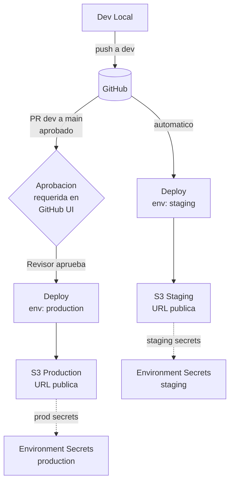

# Caso 04 — GitHub Environments + Aprobaciones


---

## 🎯 Objetivo

Añadir gobierno al pipeline: staging se despliega automáticamente,
producción requiere aprobación manual de un revisor en GitHub UI.

---

## 🔑 Lo que introduce

### En GitHub Actions

| Capacidad nueva | Descripción |
|:---|:---|
| `environment: staging` | Deploy automático sin intervención |
| `environment: production` | Pausa el workflow hasta que un revisor apruebe |
| `required_reviewers` | Lista de usuarios/equipos autorizados para aprobar |
| Secrets por entorno | `staging` y `production` tienen sus propios secrets (distintos buckets) |
| `deployment_status` | Trigger que se activa después de un deploy exitoso |

---

## 🏗️ Arquitectura proyectada



## 🔄 Flujo (objetivo)

```text
Push a dev
  └── Deploy automático → STAGING (sin aprobación)
      └── URL staging: https://staging.caso-04.example.com

PR dev → main aprobado
  └── Deploy → PRODUCTION (pausa aquí)
      └── 🔔 Notificación al revisor en GitHub
          └── Revisor aprueba en GitHub UI
              └── Deploy → PRODUCTION continúa
                  └── URL producción: https://caso-04.example.com
```

---

## 📋 Implementación proyectada — pasos clave

1. **Crear GitHub Environments** → `Settings → Environments → New environment` → `staging` y `production`
2. **Configurar protection rules** en `production` → `Required reviewers` → añadir tu usuario o equipo
3. **Secrets por entorno** → cada environment tiene su propio `BUCKET_NAME` apuntando a buckets distintos
4. **En el workflow** → `environment: staging` (se ejecuta sin pausa) · `environment: production` (pausa y espera aprobación)
5. **Push a `dev`** → staging se despliega automáticamente y genera URL de previsualización
6. **Abrir PR dev → main** → tras merge, el job de producción espera en GitHub UI hasta que un revisor apruebe

> **Diferencia clave vs Caso 03:** Aquí el control no es técnico (OIDC) sino de gobernanza humana (aprobación requerida).

---

## 🏷️ Etiquetas de entorno en el DOM

```javascript
// El workflow inyecta la variable de entorno
// El JS la lee y muestra la etiqueta visual
const env = process.env.DEPLOY_ENV || 'unknown';
document.body.dataset.env = env; // → CSS muestra banner "STAGING" o "PRODUCTION"
```

---

## 📜 Certificaciones relevantes


| Certificación | Temas que cubre este caso |
|:---|:---|
| **DVA-C02** | Deployment strategies, environment isolation, approval workflows |
| **SOA-C02** | Change management, deployment controls, environment separation |

---

## ⬅️ Anterior · Siguiente ➡️

| | Caso |
|:---|:---|
| ⬅️ Anterior | [Caso 03 — CloudFront + OIDC](../caso-03-cloudfront-oidc/README.md) |
| ➡️ Siguiente | [Caso 05 — Lambda + API Gateway](../caso-05-lambda-api-gateway/README.md) |
