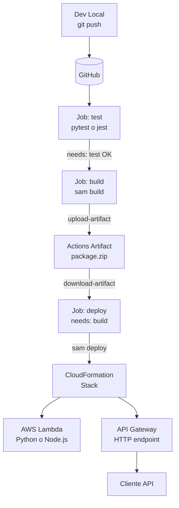

# Caso 05 — Lambda + API Gateway


---

## 🎯 Objetivo

Primer backend real. Introduce el patrón **test → build → deploy** con jobs
encadenados y artefactos compartidos entre ellos.

---

## 🔑 Lo que introduce

### En AWS

| Servicio | Para qué |
|:---|:---|
| **AWS Lambda** | Función serverless Python/Node.js |
| **API Gateway** | Endpoint HTTP público que invoca la Lambda |
| **AWS SAM** | Framework de despliegue serverless (IaC declarativo) |

### En GitHub Actions

| Capacidad nueva | Descripción |
|:---|:---|
| `needs:` | Secuenciación explícita de jobs (test debe pasar antes de build) |
| `actions/upload-artifact` | El job `build` sube el paquete SAM compilado |
| `actions/download-artifact` | El job `deploy` descarga y usa ese mismo paquete |
| `workflow_dispatch` con `inputs` | Deploy manual con selección de entorno como parámetro |

---

## 🏗️ Arquitectura proyectada



## 🔄 Flujo multi-job (objetivo)

```text
workflow trigger (push o dispatch)
  │
  ├── job: test (pytest)
  │     └── ✅ tests pasan
  │
  ├── job: build (needs: test)
  │     └── sam build → artefacto .zip
  │         └── upload-artifact → guardado en Actions
  │
  └── job: deploy (needs: build)
        └── download-artifact
            └── sam deploy --no-confirm-changeset
                └── Lambda + API Gateway actualizados
```

> **Principio clave:** El artefacto que se prueba es el mismo que llega a producción.
> No hay "build de prod" diferente al "build de tests".

---

## 📋 Implementación proyectada — pasos clave

> Guia detallada con comandos exactos, errores comunes y verificaciones: **[AWS_PASO_A_PASO.md](./AWS_PASO_A_PASO.md)**

1. **Escribir la Lambda** → función Python/Node.js con handler estándar + `requirements.txt` o `package.json`
2. **Crear `template.yaml` SAM** → define `AWS::Serverless::Function` + `AWS::Serverless::Api`
3. **Job `test`** → `pytest` o `jest` sobre la función — el job de build solo se ejecuta si pasan
4. **Job `build`** → `sam build` compila el paquete → `actions/upload-artifact` guarda el `.zip`
5. **Job `deploy`** → `actions/download-artifact` descarga el paquete → `sam deploy --no-confirm-changeset --capabilities CAPABILITY_IAM`
6. **Verificar** → CloudFormation crea el stack automáticamente · API Gateway genera la URL del endpoint

> **Principio clave:** El artefacto que se prueba en el job `test` es el mismo `.zip` que llega a producción. No hay re-build en producción.

---

## 📜 Certificaciones relevantes


| Certificación | Temas que cubre este caso |
|:---|:---|
| **DVA-C02** | Lambda lifecycle, API Gateway types, SAM templates, packaging |
| **SAA-C03** | Serverless vs EC2 trade-offs, API Gateway REST vs HTTP |
| **SOA-C02** | Automated deployment pipelines, artifact management |

---

## ⬅️ Anterior · Siguiente ➡️

| | Caso |
|:---|:---|
| ⬅️ Anterior | [Caso 04 — Environments](../caso-04-environments-approvals/README.md) |
| ➡️ Siguiente | [Caso 06 — DynamoDB + Matrix](../caso-06-dynamodb-matrix/README.md) |
