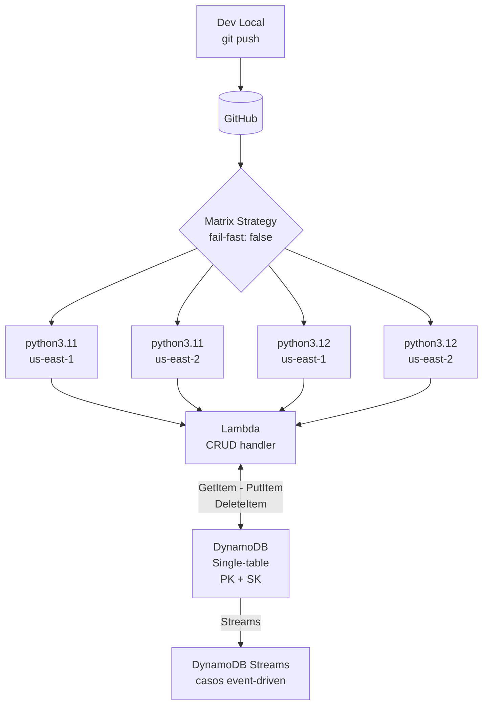

# Caso 06 — DynamoDB + Matrix Builds


---

## 🎯 Objetivo

Añadir persistencia real (DynamoDB) y demostrar **matrix strategy**:
el mismo código probado en múltiples runtimes y regiones en paralelo.

---

## 🔑 Lo que introduce

### En AWS

| Servicio | Para qué |
|:---|:---|
| **DynamoDB** | Base de datos NoSQL serverless (CRUD real desde Lambda) |
| **DynamoDB Streams** | Eventos de cambio para futuros casos event-driven |
| **IAM** | Política mínima necesaria para que Lambda acceda a DynamoDB |

### En GitHub Actions

| Capacidad nueva | Descripción |
|:---|:---|
| `strategy.matrix` | Define combinaciones: runtimes × regiones |
| `fail-fast: false` | Una celda que falla no cancela las demás |
| Matrix output en summary | Tabla de resultados por combinación en el workflow summary |

---

## 🏗️ Arquitectura proyectada



## 🔄 Matrix en acción (objetivo)

```yaml
strategy:
  fail-fast: false
  matrix:
    runtime: [python3.11, python3.12]
    region:  [us-east-1, us-east-2]

# Resultado: 4 jobs en paralelo
# python3.11 × us-east-1   ✅
# python3.11 × us-east-2   ✅
# python3.12 × us-east-1   ✅
# python3.12 × us-east-2   ✅
```

---

## 🗄️ Modelo de datos DynamoDB

```json
{
  "PK":        "USER#vladimir",
  "SK":        "PROJECT#caso-06",
  "title":     "DynamoDB Matrix Demo",
  "status":    "active",
  "createdAt": "2026-Q3"
}
```

---

## 📋 Implementación proyectada — pasos clave

> Guia detallada con comandos exactos, errores comunes y verificaciones: **[AWS_PASO_A_PASO.md](./AWS_PASO_A_PASO.md)**

1. **Crear tabla DynamoDB** → `On-demand` capacity mode · PK: `PK` (String) + SK: `SK` (String) · habilitar Streams
2. **Lambda con permisos mínimos** → IAM policy con solo `dynamodb:GetItem`, `dynamodb:PutItem`, `dynamodb:DeleteItem`, `dynamodb:Query` sobre esta tabla
3. **Definir la matrix en el workflow:**

   ```yaml
   strategy:
     fail-fast: false
     matrix:
       runtime: [python3.11, python3.12]
       region:  [us-east-1, us-east-2]
   ```

4. **`${{ matrix.runtime }}`** y **`${{ matrix.region }}`** como variables en el step de deploy
5. **Revisar el workflow summary** → GitHub muestra tabla de resultados por combinación
6. **Verificar DynamoDB** → AWS Console → `Explore items` → confirmar items escritos por la Lambda

> **Principio clave:** `fail-fast: false` es fundamental — una región fallida no cancela las pruebas en las demás.

---

## 📜 Certificaciones relevantes


| Certificación | Temas que cubre este caso |
|:---|:---|
| **DVA-C02** | DynamoDB data modeling, partition keys, capacity modes, Streams |
| **SAA-C03** | DynamoDB vs RDS trade-offs, single-table design, global tables |
| **SOA-C02** | DynamoDB monitoring (CloudWatch), backup & point-in-time recovery |

---

## ⬅️ Anterior · Siguiente ➡️

| | Caso |
|:---|:---|
| ⬅️ Anterior | [Caso 05 — Lambda + API GW](../caso-05-lambda-api-gateway/README.md) |
| ➡️ Siguiente | [Caso 07 — Reusable Workflows](../caso-07-reusable-workflows/README.md) |
