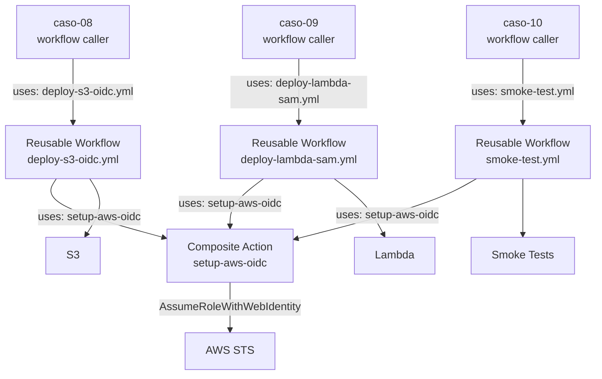

# Caso 07 — Reusable Workflows + Composite Actions


---

## 🎯 Objetivo

Eliminar duplicación entre casos. Extraer la lógica común de deploy a una
**librería interna de GitHub Actions** reutilizable por todos los casos futuros.

---

## 🔑 Lo que introduce

### En GitHub Actions

| Capacidad nueva | Descripción |
|:---|:---|
| `workflow_call` | Convierte un workflow en una función llamable desde otros workflows |
| Composite Action | Agrupa steps repetidos en una acción reutilizable (`.github/actions/`) |
| `inputs` y `outputs` | Tipado y validación de parámetros entre caller y callee |
| `secrets: inherit` | Pasa secrets del caller al reusable workflow de forma segura |

---

## 🏗️ Arquitectura proyectada



## 🏗️ Estructura objetivo

```text
.github/
├── workflows/
│   ├── deploy-s3-oidc.yml        ← Reusable: deploy a S3 con OIDC
│   ├── deploy-lambda-sam.yml     ← Reusable: deploy Lambda con SAM
│   └── smoke-test.yml            ← Reusable: smoke tests post-deploy
└── actions/
    ├── setup-aws-oidc/
    │   └── action.yml            ← Composite: configura OIDC en 1 step
    └── notify-deploy/
        └── action.yml            ← Composite: notificación post-deploy
```

### Uso desde cualquier caso futuro

```yaml
# En caso-08, caso-09, caso-10...
jobs:
  deploy:
    uses: ./.github/workflows/deploy-s3-oidc.yml@main
    with:
      bucket: ${{ vars.BUCKET_PROD }}
      environment: production
    secrets: inherit
```

---

## 📋 Implementación proyectada — pasos clave

> Guia detallada con comandos exactos, errores comunes y verificaciones: **[AWS_PASO_A_PASO.md](./AWS_PASO_A_PASO.md)**

1. **Crear Composite Action** → `.github/actions/setup-aws-oidc/action.yml` con los steps de `aws-actions/configure-aws-credentials` encapsulados; recibe `role-to-assume` como `input`
2. **Crear Reusable Workflow** → `.github/workflows/deploy-s3-oidc.yml` con trigger `on: workflow_call` · define `inputs` (bucket, environment) y `secrets: inherit`
3. **Refactorizar casos existentes** → los workflows de caso-08, caso-09, caso-10 reemplazan sus steps de OIDC por `uses: ./.github/actions/setup-aws-oidc`
4. **Llamar al reusable workflow** desde cualquier caso:

   ```yaml
   jobs:
     deploy:
       uses: ./.github/workflows/deploy-s3-oidc.yml@main
       with:
         bucket: ${{ vars.BUCKET_PROD }}
       secrets: inherit
   ```

5. **Verificar DRY** → cualquier cambio en la lógica de OIDC se actualiza en un solo lugar

> **Resultado:** Los casos 08-11 no repiten la configuración de OIDC ni los steps de deploy — solo los llaman como funciones.

---

## 📜 Certificaciones relevantes


| Certificación | Temas que cubre este caso |
|:---|:---|
| **DVA-C02** | CI/CD pipelines reutilizables, modularización de infraestructura |
| **SOA-C02** | Automatización de operaciones, estandarización de deploys |

---

## ⬅️ Anterior · Siguiente ➡️

| | Caso |
|:---|:---|
| ⬅️ Anterior | [Caso 06 — DynamoDB + Matrix](../caso-06-dynamodb-matrix/README.md) |
| ➡️ Siguiente | [Caso 08 — Containers + GHCR](../caso-08-containers-ghcr/README.md) |
