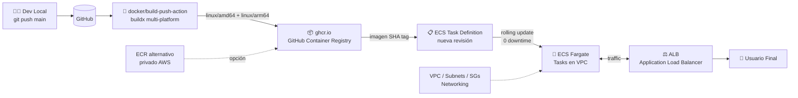

# Caso 08 — Containers + GitHub Container Registry (GHCR)


---

## 🎯 Objetivo

Containerizar la aplicación del Caso 05, publicarla en **GitHub Container Registry**
(GHCR — gratuito para repos públicos) y desplegarla en **ECS Fargate**.

---

## 🔑 Lo que introduce

### En AWS
| Servicio | Para qué |
|:---|:---|
| **ECS Fargate** | Runtime de containers sin gestionar servidores |
| **ECR** (alternativo a GHCR) | Registry privado de AWS si se prefiere sobre GHCR |
| **VPC / Subnets** | Networking básico para el task Fargate |
| **ALB** | Application Load Balancer frente al servicio ECS |

### En GitHub Actions
| Capacidad nueva | Descripción |
|:---|:---|
| `docker/build-push-action` | Build y push de imagen en un step |
| `docker/metadata-action` | Genera tags automáticos (SHA, semver, latest) |
| Multi-platform build | `linux/amd64` + `linux/arm64` en paralelo con buildx |
| GHCR login | `docker/login-action` con `GITHUB_TOKEN` — sin secrets extra |

---

## 🏗️ Arquitectura proyectada



## 🔄 Flujo (objetivo)

```
Push a main (cambios en caso-08/**)
  │
  ├── Build multi-platform image
  │     ├── linux/amd64
  │     └── linux/arm64
  │
  ├── Push a ghcr.io/vladimiracunadev-create/caso-08:sha-abc123
  │
  └── Update ECS task definition → new image tag
        └── ECS rolling update (0 downtime)
```

---

## 📋 Implementación proyectada — pasos clave

1. **Crear cluster ECS Fargate** → definir Task Definition con CPU/memory + image placeholder
2. **Login a GHCR en el workflow** → `docker/login-action` con `registry: ghcr.io` y `GITHUB_TOKEN` — sin secrets extra
3. **Build multi-platform con buildx:**
   ```yaml
   - uses: docker/setup-buildx-action@v3
   - uses: docker/build-push-action@v5
     with:
       platforms: linux/amd64,linux/arm64
       push: true
       tags: ghcr.io/${{ github.repository }}/caso-08:${{ github.sha }}
   ```
4. **Actualizar Task Definition** → `aws ecs register-task-definition` con la nueva imagen tag (SHA)
5. **Rolling update** → `aws ecs update-service --force-new-deployment` → ECS reemplaza tasks sin downtime
6. **Smoke test post-deploy** → `curl` al ALB endpoint + assert HTTP 200

> **Por qué GHCR y no ECR:** Para repos públicos, GHCR es gratuito y el `GITHUB_TOKEN` ya tiene permisos de push — cero configuración extra.

---

## 💡 GHCR vs ECR

| | GHCR | ECR |
|:---|:---|:---|
| **Costo** | Gratis (repo público) | $0.10/GB/mes |
| **Auth** | `GITHUB_TOKEN` | IAM (OIDC) |
| **Integración** | Nativa con GitHub | Nativa con AWS |
| **Cuándo usar** | Repo público, imagen pública | Imagen privada, mejor latencia en AWS |

---

## 📜 Certificaciones relevantes


| Certificación | Temas que cubre este caso |
|:---|:---|
| **DVA-C02** | ECS task definitions, container lifecycle, ECR image management |
| **SAA-C03** | ECS Fargate vs EC2 launch type, ALB target groups, VPC networking |
| **SOA-C02** | Container monitoring con CloudWatch Container Insights |

---

## ⬅️ Anterior · Siguiente ➡️

| | Caso |
|:---|:---|
| ⬅️ Anterior | [Caso 07 — Reusable Workflows](../caso-07-reusable-workflows/README.md) |
| ➡️ Siguiente | [Caso 09 — FinOps + Scheduled](../caso-09-finops-scheduled/README.md) |
