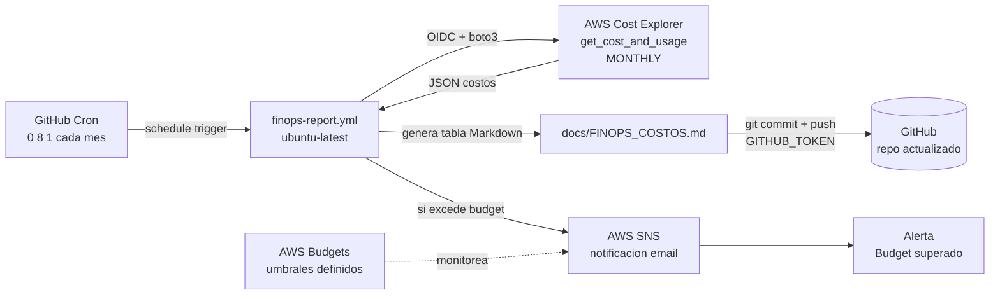

# Caso 09 — FinOps + Scheduled Workflows


---

## 🎯 Objetivo

Visibilidad automática de costos. Un workflow programado (cron) extrae datos
de AWS Cost Explorer y actualiza `docs/FINOPS_COSTOS.md` directamente en el repo.

---

## 🔑 Lo que introduce

### En AWS
| Servicio | Para qué |
|:---|:---|
| **AWS Cost Explorer** | API de análisis de costos por servicio, región y etiqueta |
| **AWS Budgets** | Alarmas cuando el gasto supera umbrales definidos |
| **SNS** | Notificaciones de alerta de presupuesto a email/Slack |

### En GitHub Actions
| Capacidad nueva | Descripción |
|:---|:---|
| `schedule` con cron | `0 8 1 * *` — primer día del mes a las 08:00 UTC |
| Workflow que commitea | El pipeline escribe un archivo y hace commit automático |
| `GITHUB_TOKEN` para commit | Sin secrets extra — usa el token nativo del workflow |

---

## 🏗️ Arquitectura proyectada



## 🔄 Flujo (objetivo)

```
1° de cada mes, 08:00 UTC — cron trigger
  └── Script Python con boto3
      └── ce.get_cost_and_usage(granularity='MONTHLY')
          └── Genera tabla Markdown con costos reales
              └── git commit "chore: actualizar costos [mes]"
                  └── git push → docs/FINOPS_COSTOS.md actualizado
```

---

## 📋 Implementación proyectada — pasos clave

1. **Política IAM mínima para Cost Explorer** → `ce:GetCostAndUsage`, `ce:GetDimensionValues` — solo lectura
2. **Script Python** con `boto3` → `ce.get_cost_and_usage(TimePeriod=..., Granularity='MONTHLY', GroupBy=...)` → formatea resultado en tabla Markdown
3. **Workflow con cron trigger:**
   ```yaml
   on:
     schedule:
       - cron: '0 8 1 * *'   # 1° de cada mes, 08:00 UTC
     workflow_dispatch:       # también manual
   ```
4. **Commit automático** → el workflow configura git user + hace commit del `.md` actualizado usando `GITHUB_TOKEN` — sin secrets extra
5. **Crear AWS Budget** → umbral en $ → suscripción SNS → email/Slack al superar el límite
6. **Verificar** → ejecutar `workflow_dispatch` manualmente → revisar `docs/FINOPS_COSTOS.md` actualizado en el repo

> **Resultado:** El repositorio se auto-documenta con costos reales cada mes. No requiere intervención manual.

---

## 📊 Output esperado (en FINOPS_COSTOS.md)

```
Período: 2026-03 | Total: $12.47 USD
├── Amazon S3           $0.002
├── AWS Lambda          $0.000
├── Amazon CloudFront   $0.018
├── Amazon ECS          $8.90
└── Amazon EKS          $0.000 (apagado)
```

---

## 📜 Certificaciones relevantes


| Certificación | Temas que cubre este caso |
|:---|:---|
| **SAA-C03** | AWS Budgets, Cost Explorer, etiquetado de recursos para FinOps |
| **SOA-C02** | Monitoreo de costos, alertas de billing, optimización de recursos |
| **DVA-C02** | Automatización con scheduled workflows, boto3, OIDC para Cost API |

---

## ⬅️ Anterior · Siguiente ➡️

| | Caso |
|:---|:---|
| ⬅️ Anterior | [Caso 08 — Containers + GHCR](../caso-08-containers-ghcr/README.md) |
| ➡️ Siguiente | [Caso 10 — Multi-región + DR](../caso-10-multiregion-dr/README.md) |
