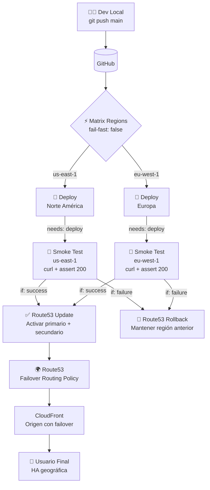

# Caso 10 — Multi-región + Disaster Recovery


---

## 🎯 Objetivo

Alta disponibilidad geográfica real. Deploy paralelo a dos regiones AWS con
validación de salud por región antes de actualizar el DNS con Route53.

---

## 🔑 Lo que introduce

### En AWS
| Servicio | Para qué |
|:---|:---|
| **Route53** | DNS con failover routing policy entre regiones |
| **Health Checks** | Route53 monitorea disponibilidad de cada endpoint |
| **S3 Multi-region** | Buckets en `us-east-1` y `eu-west-1` con contenido idéntico |
| **CloudFront** | CDN global con origen-failover configurado |

### En GitHub Actions
| Capacidad nueva | Descripción |
|:---|:---|
| Matrix sobre regiones | Deploy simultáneo a `us-east-1` y `eu-west-1` |
| Smoke tests como job | Validación de disponibilidad antes de actualizar DNS |
| Rollback condicional | Si smoke tests fallan → `aws route53 change-resource-record-sets` revierte |

---

## 🏗️ Arquitectura proyectada



## 🔄 Flujo (objetivo)

```
Push a main
  │
  ├── [matrix] Deploy → us-east-1   ✅
  ├── [matrix] Deploy → eu-west-1   ✅
  │
  ├── [needs: deploy] Smoke test us-east-1  → curl + assert 200
  ├── [needs: deploy] Smoke test eu-west-1  → curl + assert 200
  │
  └── [needs: smoke-tests, if: success]
        └── Route53 update: activar ambas regiones como primary/secondary

  └── [needs: smoke-tests, if: failure]
        └── Route53 rollback: mantener región anterior activa
```

---

## 📋 Implementación proyectada — pasos clave

1. **Crear buckets S3 en dos regiones** → `us-east-1` y `eu-west-1` — mismo contenido, mismo nombre de dominio
2. **Crear distribuciones CloudFront** por región con `Origin Failover` configurado
3. **Configurar Route53** → `Failover Routing Policy` → record `PRIMARY` (us-east-1) + record `SECONDARY` (eu-west-1) · habilitar `Health Checks`
4. **Matrix en el workflow** → deploy simultáneo a ambas regiones en paralelo:
   ```yaml
   strategy:
     matrix:
       region: [us-east-1, eu-west-1]
   ```
5. **Smoke tests por región** → job `needs: deploy` → `curl https://endpoint-${region}` + assert HTTP 200
6. **Rollback condicional** → `if: steps.smoke.outcome == 'failure'` → `aws route53 change-resource-record-sets` revierte el DNS

> **Patrón implementado:** Warm Standby — ambas regiones activas, Route53 conmuta en segundos si una falla.

---

## 🌍 Patrones de DR (Disaster Recovery)

| Patrón | RTO | RPO | Costo | Este caso |
|:---|:---:|:---:|:---:|:---:|
| Backup & Restore | Horas | Horas | 💲 | ❌ |
| Pilot Light | ~10 min | Minutos | 💲💲 | ❌ |
| Warm Standby | ~1 min | Segundos | 💲💲💲 | ✅ |
| Multi-site Active/Active | ~0 | ~0 | 💲💲💲💲 | 🔜 futuro |

---

## 📜 Certificaciones relevantes


| Certificación | Temas que cubre este caso |
|:---|:---|
| **SAA-C03** | Route53 routing policies, DR strategies (RTO/RPO), multi-region design |
| **SOA-C02** | Health checks, failover automation, business continuity |

---

## ⬅️ Anterior · Siguiente ➡️

| | Caso |
|:---|:---|
| ⬅️ Anterior | [Caso 09 — FinOps](../caso-09-finops-scheduled/README.md) |
| ➡️ Siguiente | [Caso 11 — EKS + GitOps](../caso-11-eks-gitops/README.md) |
