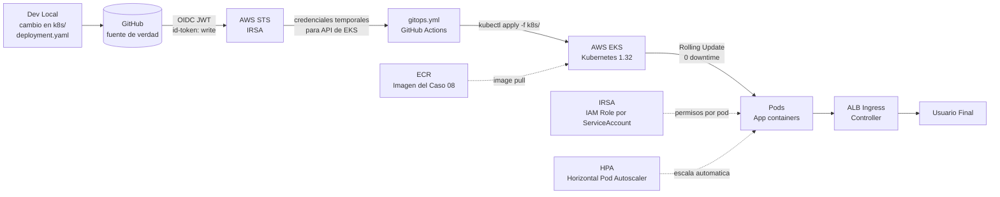

# Caso 11 — EKS + GitOps con GitHub Actions


---

## 🎯 Objetivo

Cierre del viaje. **GitHub Actions como controlador GitOps**: cambios en manifiestos
Kubernetes de este repositorio disparan reconciliación automática sobre un cluster EKS.

---

## 🔑 Lo que introduce

### En AWS

| Servicio | Para qué |
|:---|:---|
| **EKS** (v1.32) | Cluster Kubernetes gestionado por AWS |
| **ECR** | Registry privado para las imágenes del Caso 08 |
| **IRSA** | IAM Roles for Service Accounts (OIDC para pods K8s) |
| **ALB Ingress** | AWS Load Balancer Controller para exponer servicios |

### En GitHub Actions

| Capacidad nueva | Descripción |
|:---|:---|
| `kubectl apply` via OIDC | Autenticación al API de K8s sin kubeconfig estático |
| GitOps pattern | El repo ES la fuente de verdad — lo que está en Git = lo que corre |
| Progressive delivery | `workflow_dispatch` con input de porcentaje de canary |
| Self-hosted runner (concepto) | Runner dentro de la VPC para acceder al cluster privado |

---

## 🏗️ Arquitectura proyectada



## 🔄 Flujo GitOps (objetivo)

```text
Cambio en caso-11-eks-gitops/k8s/deployment.yaml
  └── GitHub Actions detecta el cambio
      └── Autentica contra EKS via OIDC (IRSA)
          └── kubectl apply -f k8s/
              └── EKS reconcilia el estado deseado
                  ├── Rolling update (0 downtime por defecto)
                  └── Smoke test post-deploy
                      ├── ✅ Deploy exitoso → merge PR automático
                      └── ❌ Falla → rollback + alerta
```

---

## 📋 Implementación proyectada — pasos clave

1. **Provisionar cluster EKS** con Terraform → `eks-cluster.tf` crea cluster + managed node group · habilitar OIDC provider del cluster
2. **Configurar IRSA** → `irsa.tf` crea IAM Role con trust policy vinculada al ServiceAccount de la app — permisos AWS por pod sin credenciales en el contenedor
3. **Instalar AWS Load Balancer Controller** → `alb-controller.tf` · necesario para que `Ingress` cree ALBs automáticamente
4. **En el workflow de GitHub Actions** → `permissions: id-token: write` + `aws-actions/configure-aws-credentials` → `aws eks update-kubeconfig` → `kubectl apply -f k8s/`
5. **Actualizar imagen** → el workflow de Caso 08 hace push a ECR → actualiza `deployment.yaml` con el nuevo tag → commit en el repo → el workflow de Caso 11 detecta el cambio y reconcilia
6. **Smoke test post-deploy** → `kubectl rollout status` + `curl` al ALB endpoint → si falla, `kubectl rollout undo`

> **Patrón GitOps:** El repositorio es la única fuente de verdad. No hay `kubectl apply` manuales — todo pasa por el workflow. Lo que está en Git = lo que corre en el cluster.

---

## 📁 Estructura objetivo

```text
caso-11-eks-gitops/
├── k8s/
│   ├── namespace.yaml
│   ├── deployment.yaml       ← fuente de verdad del estado del cluster
│   ├── service.yaml
│   ├── ingress.yaml          ← ALB Ingress Controller
│   └── hpa.yaml              ← Horizontal Pod Autoscaler
├── terraform/
│   ├── eks-cluster.tf        ← Cluster + node groups
│   ├── irsa.tf               ← IAM Roles for Service Accounts
│   └── alb-controller.tf     ← AWS Load Balancer Controller
└── README.md                 ← este archivo
```

---

## 🔗 Complementariedad con GitLab

El [Caso K del repositorio GitLab](https://gitlab.com/vladimir.acuna.dev-group/proyectos-aws-gitlab)
también implementa EKS, pero desde la perspectiva del **aprovisionamiento** (Terraform + kubectl).

Este caso lo complementa desde la perspectiva del **flujo GitOps**: cómo GitHub Actions
puede actuar como el sistema de reconciliación, sin ArgoCD ni Flux.

---

## 📜 Certificaciones relevantes


| Certificación | Temas que cubre este caso |
|:---|:---|
| **SAA-C03** | EKS architecture, worker node groups, managed node groups vs Fargate |
| **DVA-C02** | Container orchestration, rolling updates, health probes |
| **SOA-C02** | EKS cluster operations, node group scaling, CloudWatch Container Insights |

---

## ⬅️ Anterior · Fin del viaje

| | Caso |
|:---|:---|
| ⬅️ Anterior | [Caso 10 — Multi-región + DR](../caso-10-multiregion-dr/README.md) |
| 🏁 Inicio | [README del repositorio](../README.md) |
| 📖 Narrativa completa | [GitHub Actions Journey](../GITHUB_ACTIONS_JOURNEY.md) |
