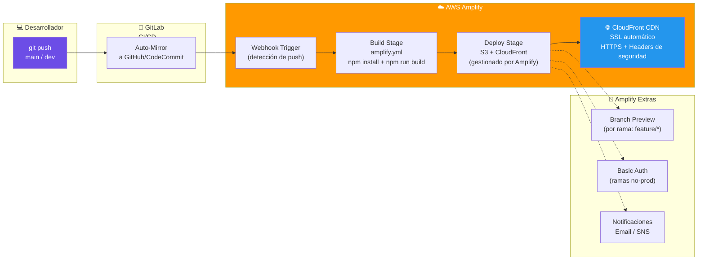
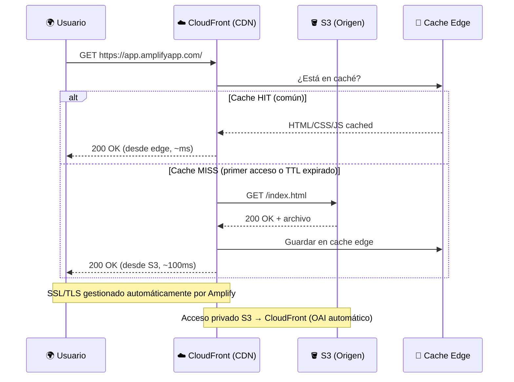
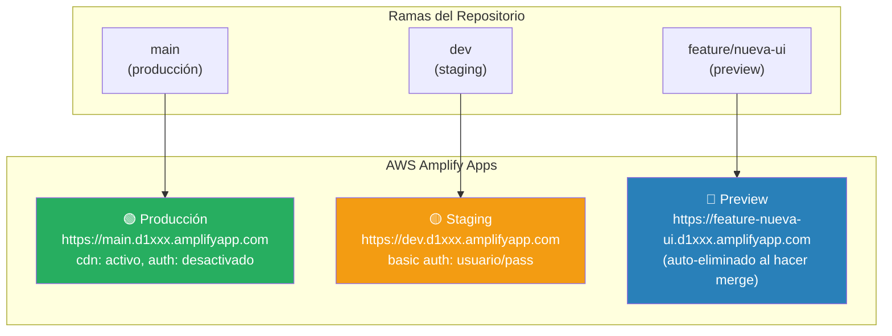

# 🏗️ Arquitectura: Caso A — AWS Amplify (CI/CD Nativo)

> **Stack**: AWS Amplify + GitLab Auto-Mirroring
> **Nivel**: 0 — Fundamentos de Deploy Continuo

---

## 🎯 Visión General

El Caso A demuestra la forma más accesible de llevar una aplicación web a producción en AWS:
**cero configuración de servidores, cero gestión de certificados SSL, cero CDN manual**.
Amplify lo resuelve todo de forma nativa.

El patrón de **GitLab → espejo en GitHub/CodeCommit → Amplify** es común en organizaciones
que ya tienen pipelines en GitLab pero quieren aprovechar la integración nativa de Amplify.

---

## 📐 Diagrama 1: Flujo de Deploy Completo

---

## 📐 Diagrama 2: Flujo de Request del Usuario Final

---

## 📐 Diagrama 3: Estrategia Multi-Rama (Branch Deploys)

---

## 🔧 Componentes y Roles

| Componente | Servicio | Función | Costo |
|---|---|---|---|
| **Build Engine** | AWS Amplify | Ejecuta `amplify.yml`, instala dependencias, genera build | Free Tier: 1000 min/mes |
| **Storage** | S3 (oculto) | Almacena el artefacto de build (HTML/CSS/JS) | Free Tier: 5GB |
| **CDN** | CloudFront (oculto) | Distribuye el contenido globalmente con caché edge | Free Tier: 1TB transfer/mes |
| **SSL** | ACM (automático) | Certificado HTTPS sin configuración manual | Gratis |
| **DNS** | Route 53 (opcional) | Dominio propio (ej: `app.tudominio.com`) | $0.50/zona/mes |
| **Mirroring** | GitLab CI | Sincroniza GitLab → repositorio compatible con Amplify | Gratis |

---

## 💡 Por Qué Este Patrón

| Ventaja | Detalle |
|---|---|
| **Zero Config** | No gestionas servidores, balanceadores ni certificados |
| **Deploy automático** | Push a `main` → en producción en ~2 minutos |
| **Branch previews** | Cada rama tiene su propia URL pública para QA |
| **Escalamiento automático** | CloudFront escala a millones de requests sin intervención |
| **Rollback instantáneo** | Amplify guarda historial de deploys, rollback en 1 click |

---

## 🔗 Referencias

- [README del Caso A](../README.md)
- [Guía Paso a Paso AWS](../AWS_PASO_A_PASO.md)
- [Documentación oficial Amplify](https://docs.aws.amazon.com/amplify/latest/userguide/)
