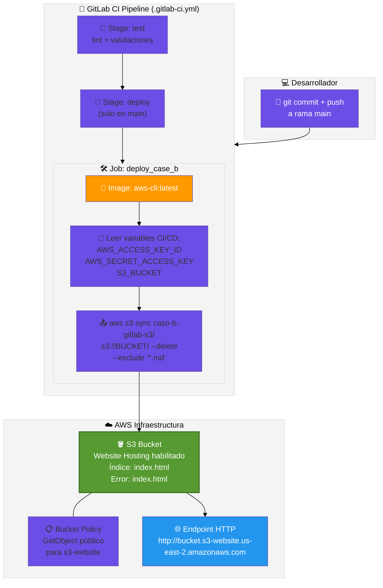
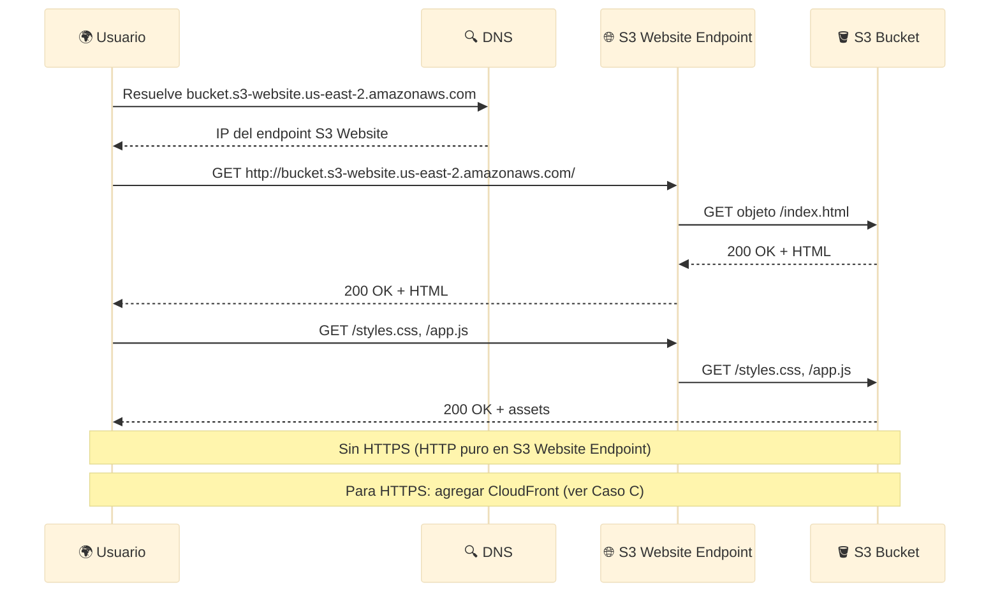
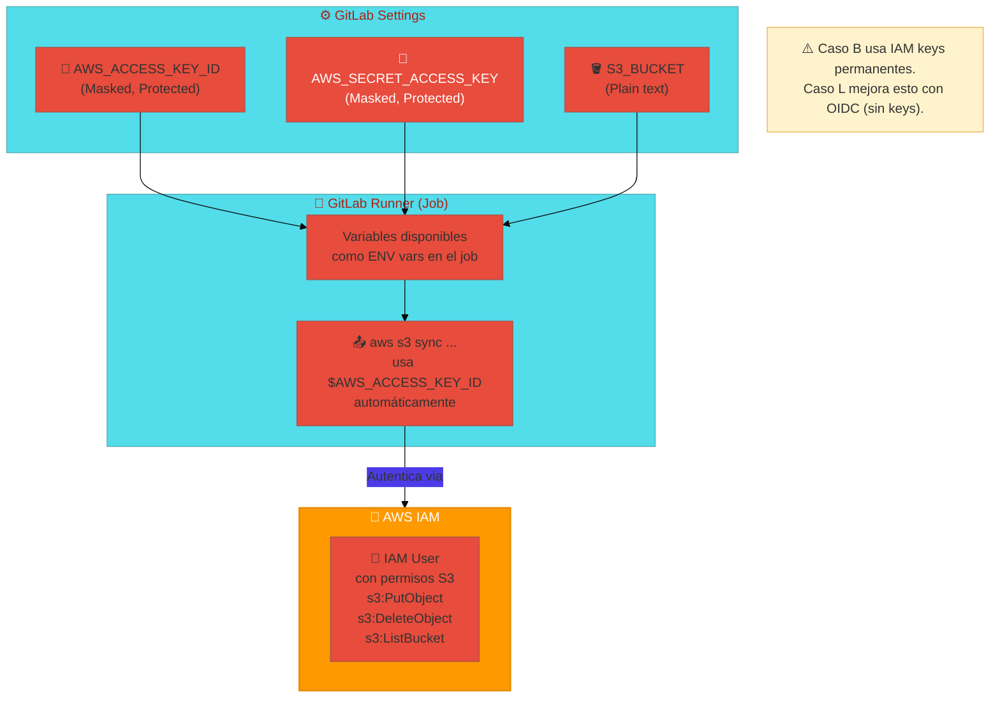

# 🏗️ Arquitectura: Caso B — S3 + GitLab CI (Pipeline Artesanal)

> **Stack**: GitLab Runners + AWS CLI + S3 Website Hosting
> **Nivel**: 1 — Pipelines Manuales y Control Total

---

## 🎯 Visión General

El Caso B expone **todo lo que Amplify oculta**: la sincronización manual de archivos a S3,
la gestión de políticas de bucket, y la configuración de hosting estático paso a paso.
Es el puente entre "magia automática" y "entiendo lo que pasa bajo el capó".

El patrón GitLab CI → AWS CLI → S3 es el fundamento de decenas de pipelines empresariales.

---

## 📐 Diagrama 1: Pipeline GitLab → S3

---

## 📐 Diagrama 2: Flujo de Request del Usuario Final

---

## 📐 Diagrama 3: Gestión de Secretos en GitLab CI

---

## 🔧 Componentes y Roles

| Componente | Servicio | Función | Diferencia con Caso A |
|---|---|---|---|
| **Pipeline** | GitLab CI | Orquesta el deploy manualmente | En Caso A Amplify lo hace automático |
| **CLI** | AWS CLI | Sincroniza archivos con `aws s3 sync` | En Caso A oculto dentro de Amplify |
| **Storage** | S3 | Almacena y sirve el sitio web estático | Igual, pero configuras tú todo |
| **Hosting** | S3 Website Endpoint | HTTP (sin HTTPS nativo) | Caso A usa CloudFront automático con HTTPS |
| **Secretos** | Variables GitLab CI | IAM keys permanentes (masked) | Caso L mejora con OIDC |

---

## ⚠️ Limitaciones Conocidas de Este Patrón

| Limitación | Impacto | Solución |
|---|---|---|
| Sin HTTPS | El endpoint S3 es HTTP puro | Agregar CloudFront (ver Caso C) |
| IAM keys permanentes | Riesgo de filtración si se exponen | Migrar a OIDC (ver Caso L) |
| Sin CDN | Latencia varía según región del usuario | Agregar CloudFront (ver Caso C) |
| Sin caché | S3 sirve directo cada request | Headers de caché en `aws s3 sync` |

---

## 🔗 Referencias

- [README del Caso B](../README.md)
- [Guía Paso a Paso AWS](../AWS_PASO_A_PASO.md)
- [Siguiente nivel → Caso C (CloudFront + Terraform)](../../caso-c-terraform-s3/docs/architecture.md)
