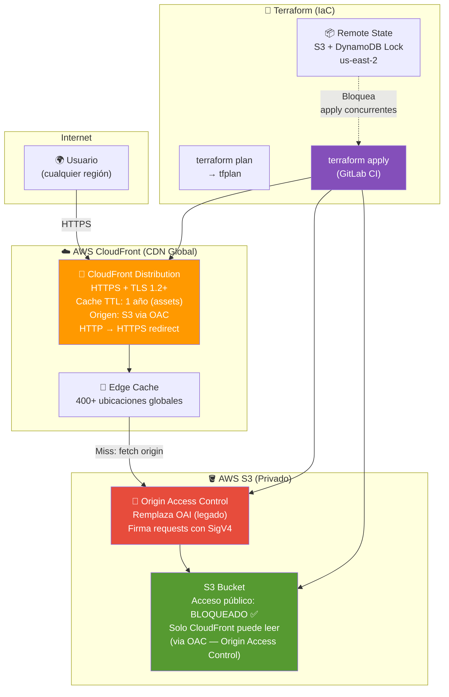
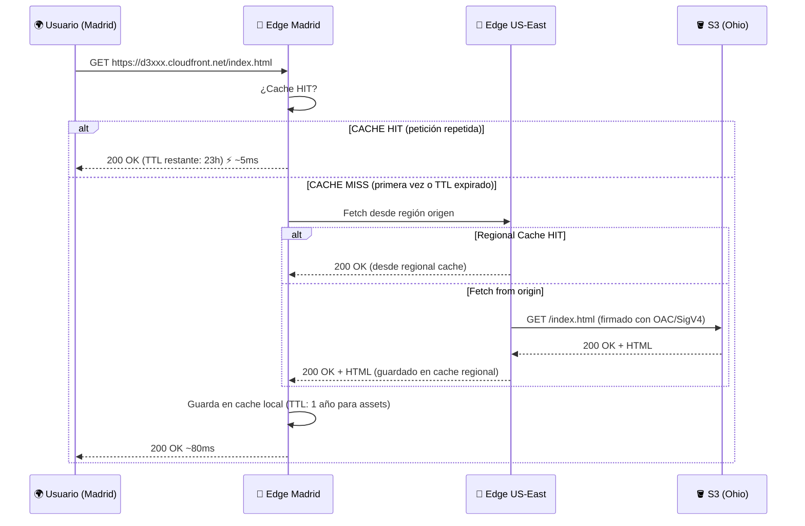
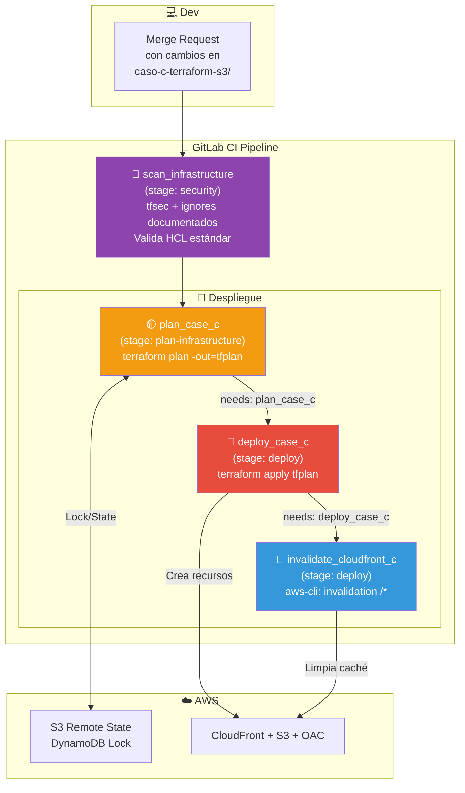

# 🏗️ Arquitectura: Caso C — Terraform + CloudFront + S3 (IaC Profesional)

> **Stack**: Terraform + S3 (OAC) + CloudFront + Remote State
> **Nivel**: 2 — Infraestructura como Código (IaC)

---

## 🎯 Visión General

El Caso C eleva el Caso B al estándar profesional en tres dimensiones:

1. **Seguridad**: S3 privado con **Origin Access Control (OAC)** — nadie accede al bucket
   directamente, solo CloudFront.
2. **Performance**: CDN global con caché en edge locations — latencia < 50ms para usuarios
   en cualquier continente.
3. **Reproducibilidad**: Toda la infraestructura declarada en Terraform — se puede destruir
   y recrear en minutos, sin clicks manuales.

---

## 📐 Diagrama 1: Arquitectura Completa (Terraform Managed)

---

## 📐 Diagrama 2: Flujo de Request con CloudFront Cache

---

## 📐 Diagrama 3: Flujo de Terraform en GitLab CI

---

## 🔧 Componentes y Roles

| Componente | Servicio | Función | Por Qué es Mejor que Caso B |
|---|---|---|---|
| **CDN** | CloudFront | Cache global, HTTPS, redirect HTTP→HTTPS | Caso B no tiene CDN |
| **OAC** | CloudFront Origin Access Control | S3 privado, solo CloudFront accede | Caso B: bucket público |
| **IaC** | Terraform | Infraestructura reproducible y versionada | Caso B: config manual |
| **Security Scan** | tfsec | Auditoría estática (shift-left security) | Caso B: sin análisis |
| **CD Automation** | GitLab CI | Pipeline multi-stage (Scan -> Plan -> Apply -> Invalidate) | Caso B: sync directo |

---

## 🔐 Seguridad: Decisiones de Diseño (Trade-offs)

En este proyecto de **portafolio**, se han tomado decisiones conscientes para balancear seguridad y costos:

1. **S3 Block Public Access**: El bucket es 100% privado.
2. **OAC (Origin Access Control)**: Se eliminó el uso de OAI (legado) por OAC (estándar actual).
3. **tfsec Ignores**: Se utilizan `#tfsec:ignore` para controles que implican costos fijos (WAF, KMS) o infraestructura adicional compleja (Logging buckets), manteniendo la transparencia técnica.
4. **HCL Estándar**: Se corrigió el uso de sintaxis experimental (`action` blocks) por HCL 1.0/2.0 compatible, garantizando estabilidad.

---

## 🔗 Referencias

- [README del Caso C](../README.md)
- [Guía Paso a Paso AWS](../AWS_PASO_A_PASO.md)
- [Ver Demo en Vivo](https://d3otfpeykrm536.cloudfront.net/)
