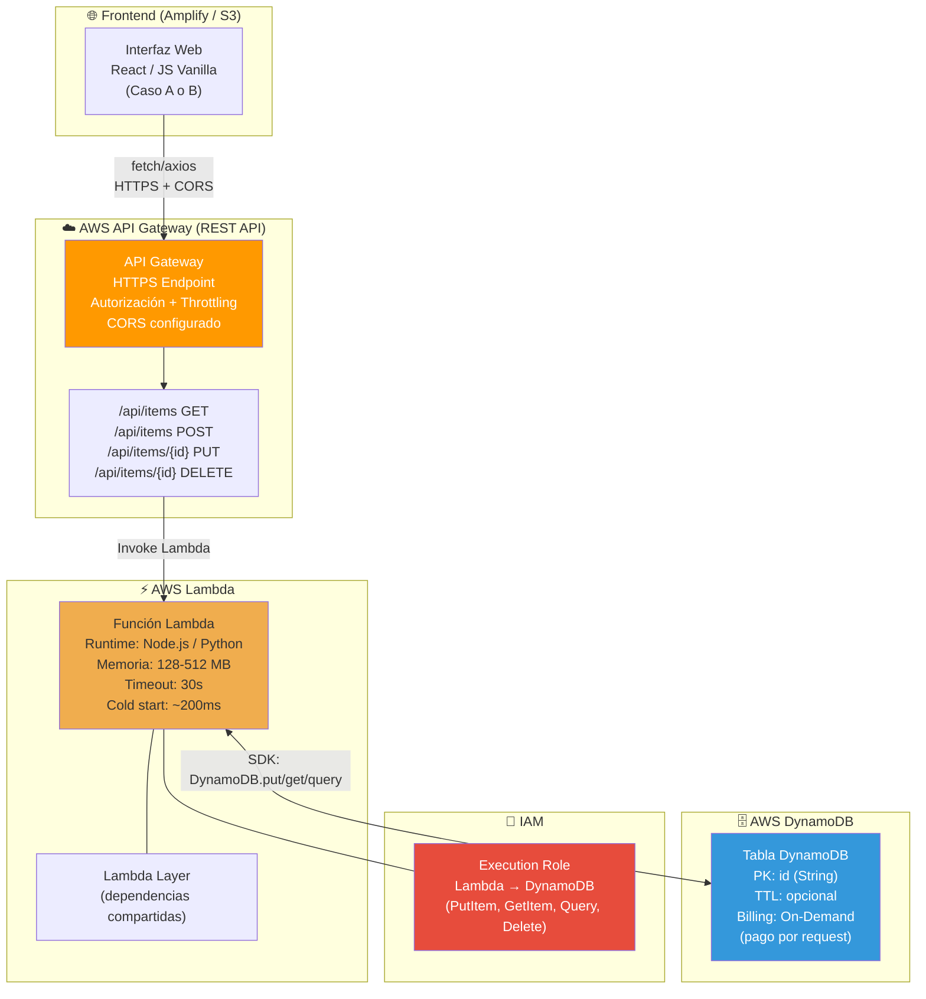
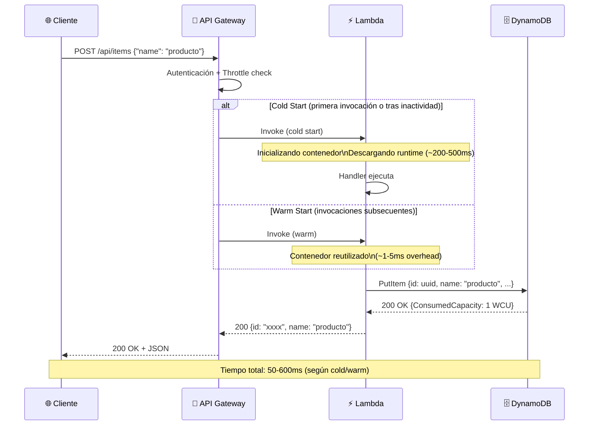
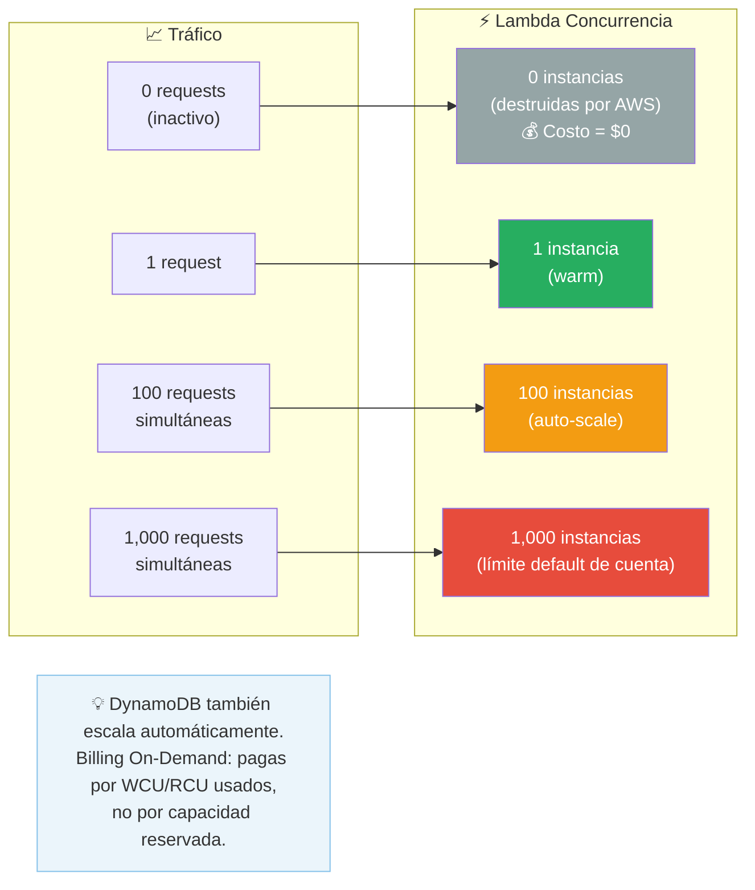
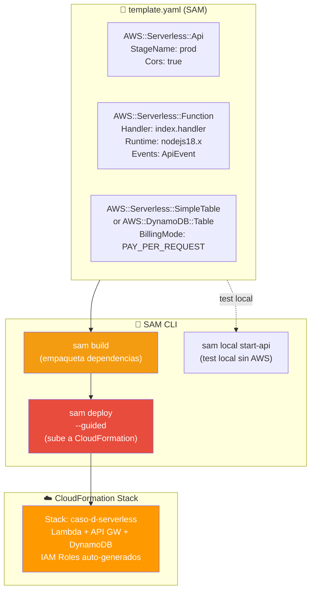

# 🏗️ Arquitectura: Caso D — Serverless API (SAM + Lambda + DynamoDB)

> **Stack**: API Gateway + AWS Lambda + DynamoDB + AWS SAM
> **Nivel**: 3 — Backend Reactivo sin Servidores

---

## 🎯 Visión General

El Caso D introduce el paradigma **serverless**: no hay servidores que gestionar, no hay
capacidad que aprovisionar. La aplicación escala a cero cuando no hay tráfico (costo = $0)
y escala automáticamente bajo demanda.

AWS SAM (Serverless Application Model) es la capa de IaC específica para funciones Lambda,
APIs y tablas DynamoDB — equivalente a Terraform pero optimizado para serverless.

---

## 📐 Diagrama 1: Arquitectura Completa Serverless

---

## 📐 Diagrama 2: Ciclo de Vida de una Request (con Cold Start)

---

## 📐 Diagrama 3: Escalamiento Automático Lambda

---

## 📐 Diagrama 4: AWS SAM — Definición de Infraestructura

---

## 🔧 Componentes y Roles

| Componente | Servicio | Función | Costo |
|---|---|---|---|
| **API Gateway** | REST API | Endpoint HTTPS, routing, auth, throttling | Free Tier: 1M requests/mes |
| **Compute** | Lambda | Ejecuta lógica de negocio (stateless) | Free Tier: 1M invocaciones/mes |
| **Base de Datos** | DynamoDB | Persistencia NoSQL clave-valor | Free Tier: 25GB + 25 WCU/RCU |
| **IaC** | AWS SAM | Define Lambda + API + DDB en YAML | Gratis |
| **Deploy** | CloudFormation | Orquesta la creación de recursos desde SAM | Gratis |

---

## 💡 Cuándo Usar Serverless vs Contenedores

| Criterio | Serverless (Caso D) | Contenedores (Caso J/K) |
|---|---|---|
| **Latencia** | 50-600ms (cold start) | < 10ms (warm always) |
| **Costo bajo tráfico** | 💰 Muy bajo (pay per use) | 💸 Fijo aunque sin tráfico |
| **Estado** | Stateless obligatorio | Puede ser stateful |
| **Duración máxima** | 15 minutos | Sin límite |
| **Observabilidad** | CloudWatch Logs automático | Requiere setup |

---

## 🔗 Referencias

- [README del Caso D](../README.md)
- [Guía Paso a Paso AWS](../AWS_PASO_A_PASO.md)
- [Ver Demo](https://staging.d3oq987bpa7ls7.amplifyapp.com/)
