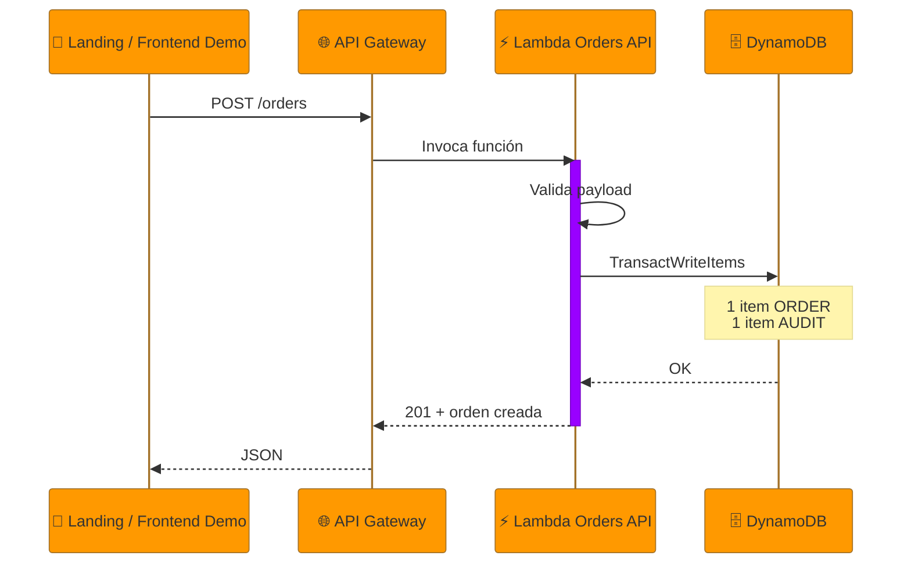
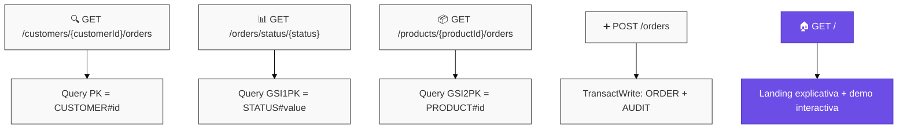
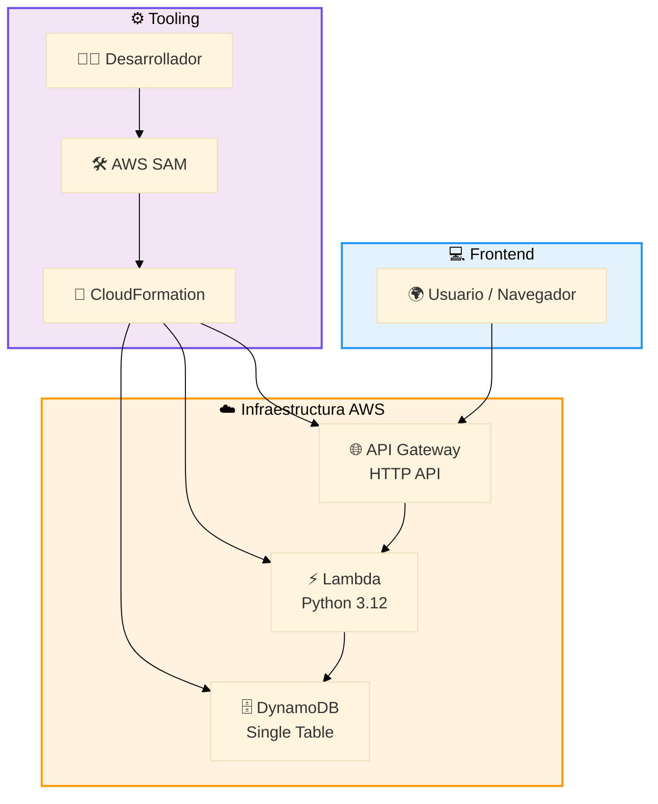

# Arquitectura: Caso E - DynamoDB Persistence Pro

> Stack: API Gateway + Lambda + DynamoDB + AWS SAM
> Nivel: 4 - Persistencia NoSQL y modelado por patrones de acceso

---

## Visión general

Este caso demuestra un enfoque de **persistencia orientada a consultas**. En lugar de modelar
entidades separadas con relaciones tipo SQL, se diseña una sola tabla que soporta las preguntas
que la aplicación necesita responder:

- qué órdenes tiene un cliente
- qué órdenes están en un estado dado
- qué órdenes existen para un producto

Además, la raíz de la API (`/`) devuelve una landing HTML que explica el caso y permite ejecutar
pruebas reales contra la misma infraestructura desplegada.

---

## 📐 Diagrama 1: Flujo principal de escritura

---

## 📐 Diagrama 2: Single Table Design

```mermaid
%%{init: {'theme': 'base', 'themeVariables': { 'primaryColor': '#E74C3C', 'secondaryColor': '#27AE60', 'tertiaryColor': '#f9f9f9', 'fontsize': '16px' }}}%%
graph TB
    subgraph Table["🗄️ DynamoDB table: persistence_pro_orders"]
        direction TB
        PKSK["🔑 PK / SK"]
        GSI1["⚡ GSI1: gsi1pk / gsi1sk"]
        GSI2["⚡ GSI2: gsi2pk / gsi2sk"]
    end

    subgraph EntityOrder["📦 Item ORDER"]
        direction TB
        OrderPK["PK = CUSTOMER#cust-001"]
        OrderSK["SK = ORDER#2026-03-11T12:00:00Z#ord-123"]
        OrderGSI1["GSI1PK = STATUS#PENDING"]
        OrderGSI1SK["GSI1SK = 2026-03-11T12:00:00Z#ord-123"]
        OrderGSI2["GSI2PK = PRODUCT#prod-erp"]
        OrderGSI2SK["GSI2SK = 2026-03-11T12:00:00Z#ord-123"]
    end

    subgraph EntityAudit["📜 Item AUDIT"]
        direction TB
        AuditPK["PK = ORDER#ord-123"]
        AuditSK["SK = EVENT#2026-03-11T12:00:00Z"]
    end

    PKSK --> OrderPK
    PKSK --> OrderSK
    PKSK --> AuditPK
    PKSK --> AuditSK
    GSI1 --> OrderGSI1
    GSI1 --> OrderGSI1SK
    GSI2 --> OrderGSI2
    GSI2 --> OrderGSI2SK

    style Table fill:#f4f4f4,stroke:#333,stroke-width:2px
    style EntityOrder fill:#e1f5fe,stroke:#01579b,stroke-width:2px
    style EntityAudit fill:#fff3e0,stroke:#e65100,stroke-width:2px
```

---

## 📐 Diagrama 3: Patrones de acceso soportados

---

## 📐 Diagrama 4: Arquitectura completa AWS

---

## Claves de diseño

| Decisión | Motivo |
|---|---|
| Tabla única | Reduce joins y permite consultas predecibles a gran escala. |
| `PK=CUSTOMER#id` | Agrupa las órdenes por cliente para consultas secuenciales. |
| `GSI1=STATUS#x` | Permite paneles operativos por estado sin scans. |
| `GSI2=PRODUCT#x` | Permite analítica básica por producto. |
| Item `AUDIT` | Conserva historial de eventos sin otra tabla adicional. |
| `PAY_PER_REQUEST` | Encaja bien con cargas variables de laboratorio o demo. |
| Landing en `/` | Hace visible el caso sin obligar a conocer primero los endpoints. |

---

## Endpoints implementados

| Método | Ruta | Uso |
|---|---|---|
| `GET` | `/` | Landing pública y demo interactiva |
| `POST` | `/orders` | Crea orden y evento de auditoría |
| `GET` | `/customers/{customerId}/orders` | Lista órdenes del cliente |
| `GET` | `/orders/status/{status}` | Consulta por estado vía GSI1 |
| `GET` | `/products/{productId}/orders` | Consulta por producto vía GSI2 |

---

## Siguiente paso natural

Una extensión lógica para el Caso G es publicar un evento en EventBridge o SQS después de
persistir la orden, separando persistencia de procesamiento asíncrono.