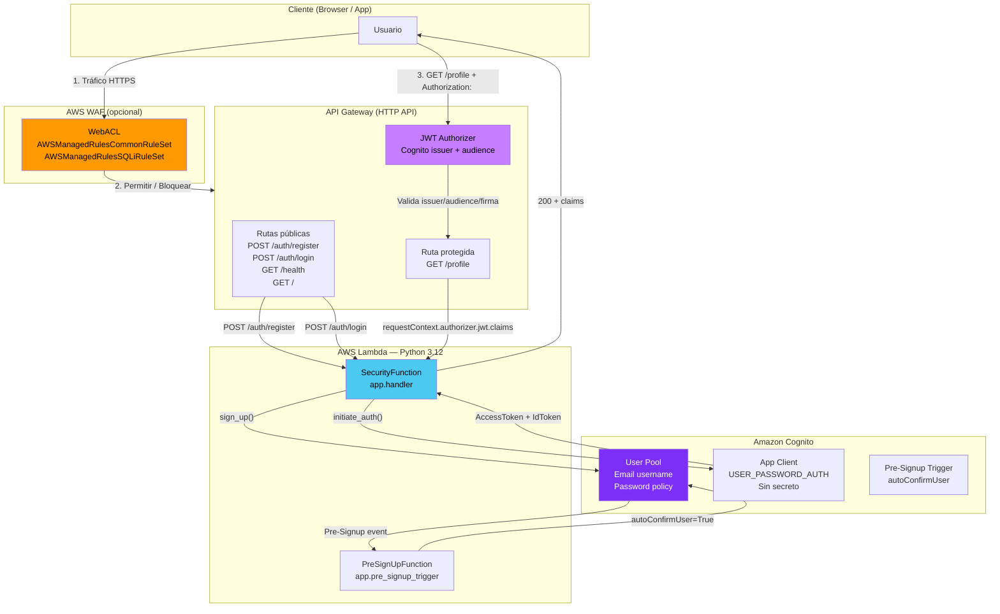

# Arquitectura — Caso F: Security First

## Diagrama de flujo



## Capas de seguridad

| Capa | Componente | Responsabilidad |
|------|-----------|-----------------|
| 1 — Perimetro | WAF WebACL | Bloquea SQLi, XSS, IPs maliciosas antes del API |
| 2 — Autenticacion | Cognito User Pool | Gestiona identidades, emite JWT estándar (RS256) |
| 3 — Autorizacion | API GW JWT Authorizer | Valida firma, issuer y audience sin código Lambda |
| 4 — Lógica | Lambda SecurityFunction | Lee claims inyectados, nunca valida el token |

## Flujo de registro y login

```
Cliente          API Gateway         Lambda           Cognito
   |                  |                 |                 |
   |-- POST /register -->               |                 |
   |                  |-- invoke ------>|                 |
   |                  |                 |-- sign_up() -->|
   |                  |                 |                 |-- PreSignUp trigger -->
   |                  |                 |                 |<-- autoConfirmUser=True --
   |                  |                 |<-- UserSub ----|
   |<-- 201 {ok,sub} -|                 |                 |
   |                  |                 |                 |
   |-- POST /login -->|                 |                 |
   |                  |-- invoke ------>|                 |
   |                  |                 |-- initiate_auth() -->
   |                  |                 |<-- AccessToken + IdToken + RefreshToken --
   |<-- 200 {tokens} -|                 |                 |
   |                  |                 |                 |
   |-- GET /profile + Bearer token -->  |                 |
   |                  |-- validate JWT (issuer + audience + firma RS256)
   |                  |-- inject claims into requestContext
   |                  |-- invoke ------>|                 |
   |                  |                 |-- read claims --|
   |<-- 200 {email, sub} --------------|                 |
```

## Notas de coste

- **Cognito**: gratuito hasta 50 000 MAU (Monthly Active Users).
- **WAF**: ~$5 USD/mes base + $1 por millón de requests. Por eso `DeployWAF=false` por defecto en demos.
- **Lambda + API GW**: capa gratuita cubre demos sin costo.
