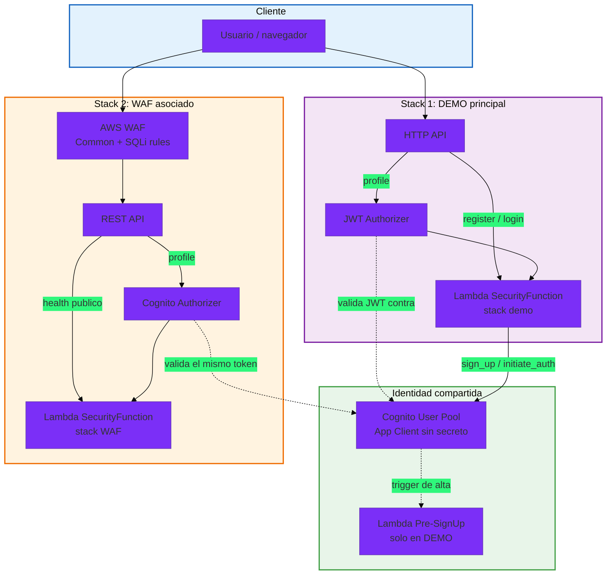
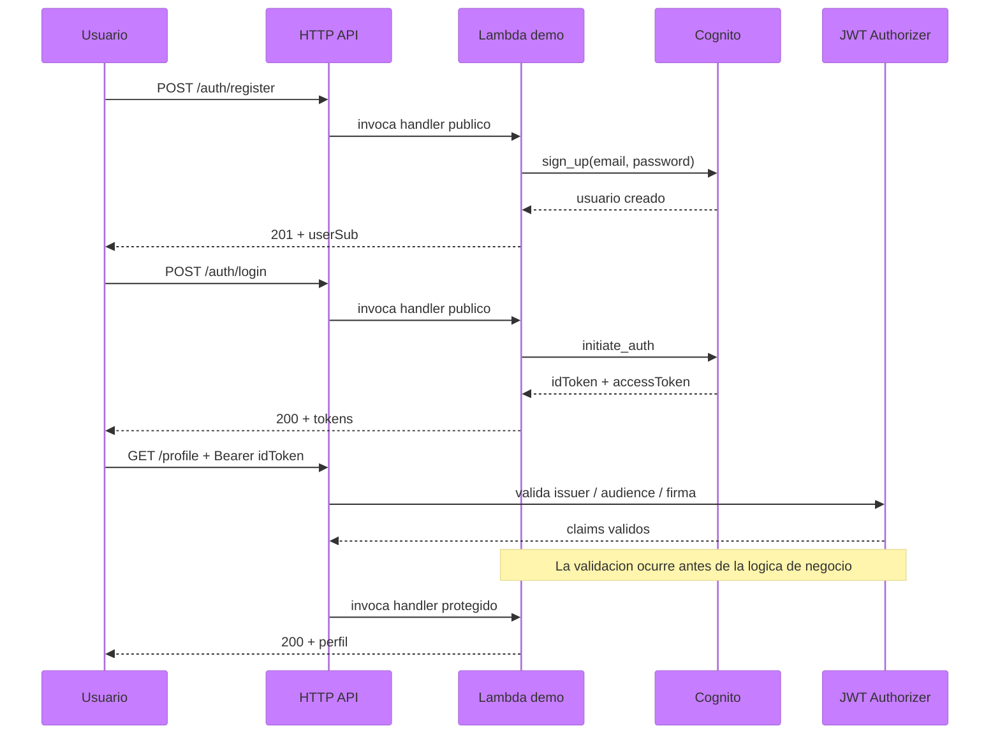
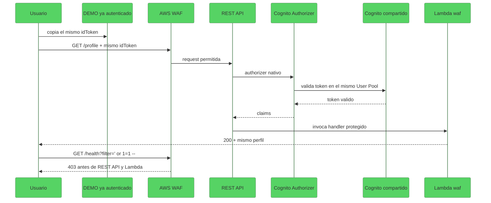
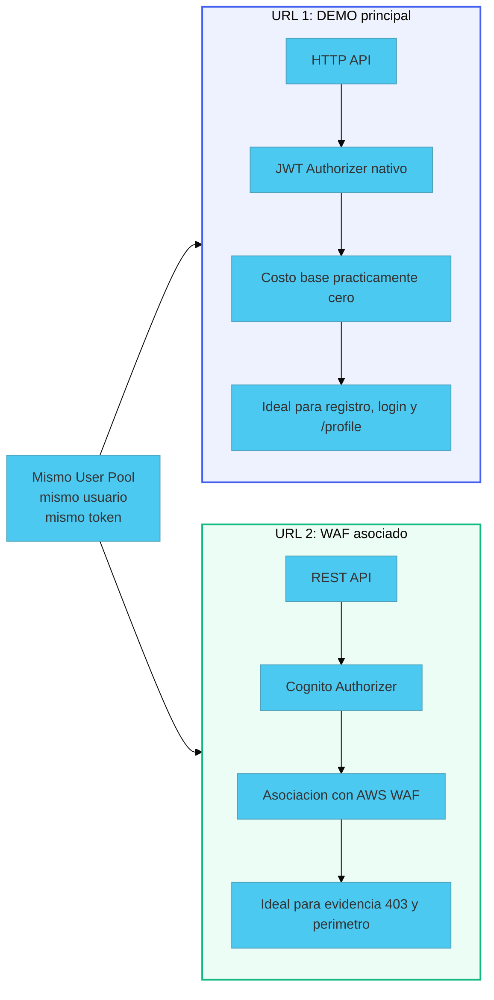

# Arquitectura: Caso F - identidad primero, perimetro despues

> Stack: Cognito User Pool + HTTP API + JWT Authorizer + REST API + Cognito Authorizer + AWS WAF + AWS SAM
> Nivel: 5 - Identidad administrada y defensa perimetral

---

## Vision general

El Caso F cuenta una sola historia tecnica, pero la reparte en dos puertas de entrada:

- el `DEMO` prueba identidad, login y acceso privado
- la pagina WAF prueba perimetro y bloqueo de trafico sospechoso

No son dos productos distintos. Son dos despliegues coordinados del mismo aprendizaje.

La razon tecnica es concreta:

- `HTTP API` es la forma mas barata y clara de mostrar `JWT Authorizer` nativo
- `AWS WAF` se asocia a `REST API`, no al mismo front door que usamos para el `DEMO`

---

## Que cambio con la version actual

Este documento si debia cambiar con los ultimos ajustes del Caso F.

La arquitectura correcta ahora es:

- la pagina WAF ya no crea otro `User Pool`
- la pagina WAF reutiliza el mismo `User Pool` y el mismo `App Client` del `DEMO`
- el mismo `idToken` emitido en el `DEMO` debe funcionar en `/profile` del WAF
- el WAF queda como capa opcional y costosa, no como producto paralelo

Si el diagrama mostrara dos identidades separadas o una sola API con WAF encima del `HTTP API`, quedaria desactualizado.

---

## Diagrama 1: Producto completo

---

## Diagrama 2: Flujo del DEMO

---

## Diagrama 3: Flujo del WAF con el mismo token

---

## Diagrama 4: Por que existen dos URLs

---

## Claves de diseno

| Decision | Motivo |
|---|---|
| `User Pool` compartido entre ambos stacks | Refuerza que no hay dos productos ni dos identidades separadas |
| `HTTP API` para el `DEMO` | Es la forma mas simple y barata de ensenar `JWT Authorizer` nativo |
| `REST API` para el WAF | Permite asociar `AWS WAF` y mostrar defensa perimetral real |
| Dos Lambdas desplegadas desde el mismo codigo fuente | Mantiene comportamiento coherente sin mezclar responsabilidades en una sola URL |
| `Pre-SignUp` solo en el `DEMO` | El alta de usuarios pertenece a la capa de identidad, no al stack WAF |
| Reutilizar el mismo `idToken` en ambas paginas | Hace visible la diferencia entre autenticacion y perimetro |
| Mantener `VISUALIZATION.md` aunque exista el `DEMO` | El WAF tiene costo fijo y puede destruirse despues de capturas |

---

## Que debe mirar un novato primero

1. abrir el `DEMO`
2. crear usuario y hacer login
3. llamar a `/profile`
4. copiar el mismo `idToken`
5. abrir la pagina WAF
6. probar `/profile` con el mismo token
7. ejecutar la prueba SQLi controlada y observar el `403`

Si ese recorrido no se entiende en ese orden, la arquitectura esta mal contada.

---

## Que demuestra esta arquitectura

- identidad administrada por AWS en vez de autenticacion casera
- validacion de token antes de Lambda
- separacion clara entre autenticacion y perimetro
- criterio FinOps: dejar estable el `DEMO` y tratar el WAF como capa temporal de evidencia

---

## Siguiente paso natural

Las extensiones mas logicas despues de este caso serian:

- agregar metricas de autenticacion y bloqueos WAF al Caso H
- incorporar secretos rotados o MFA como mejora futura
- conectar esta base de identidad con un caso que exponga usuarios reales en otra API
