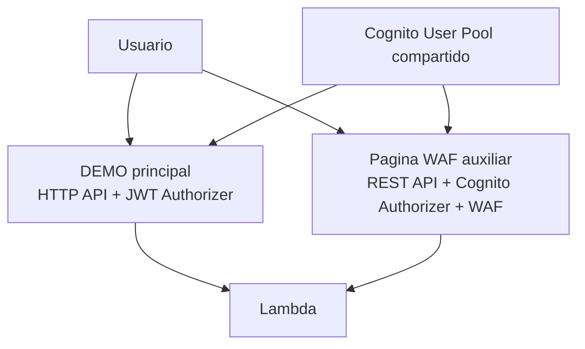
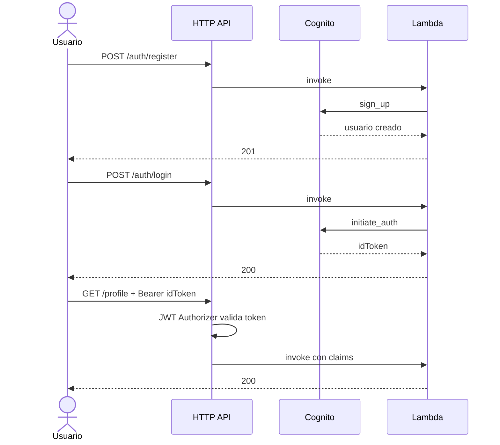
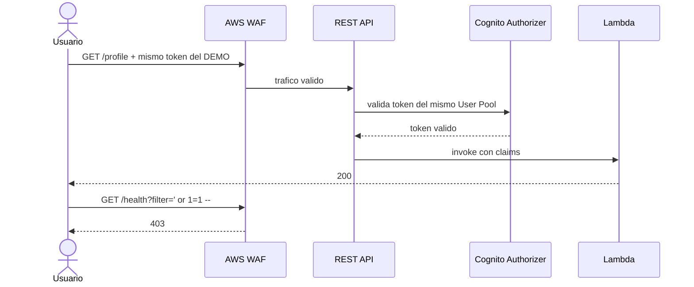

# Arquitectura: Caso F - identidad primero, perimetro despues

## Idea central

El Caso F tiene una sola historia tecnica:

- primero demuestras identidad
- despues demuestras perimetro

Eso se reparte en dos despliegues porque AWS no permite exactamente la misma combinacion en una sola puerta de entrada:

- `HTTP API` soporta muy bien `JWT Authorizer`
- `AWS WAF` se asocia a `REST API`

## Regla de lectura

| Pieza | Pregunta que responde |
|---|---|
| `DEMO` | `quien eres` |
| Pagina WAF | `que trafico ni siquiera deberia entrar` |

## Diagrama 1: producto completo

## Diagrama 2: lo que prueba el DEMO

## Diagrama 3: lo que prueba la pagina WAF

## Que cambia y que no cambia

| Elemento | DEMO | Pagina WAF |
|---|---|---|
| Usuario | igual | igual |
| User Pool | igual | igual |
| Token | igual | igual |
| Tipo de API | HTTP API | REST API |
| Authorizer | JWT Authorizer | Cognito Authorizer |
| WAF | no | si |

## Conclusiones

- El `DEMO` no compite con la pagina WAF; la prepara.
- La pagina WAF no repite el producto; completa la explicacion de seguridad.
- La relacion correcta para un novato es: mismo usuario, mismo token, otra puerta de entrada, segunda capa de defensa.
