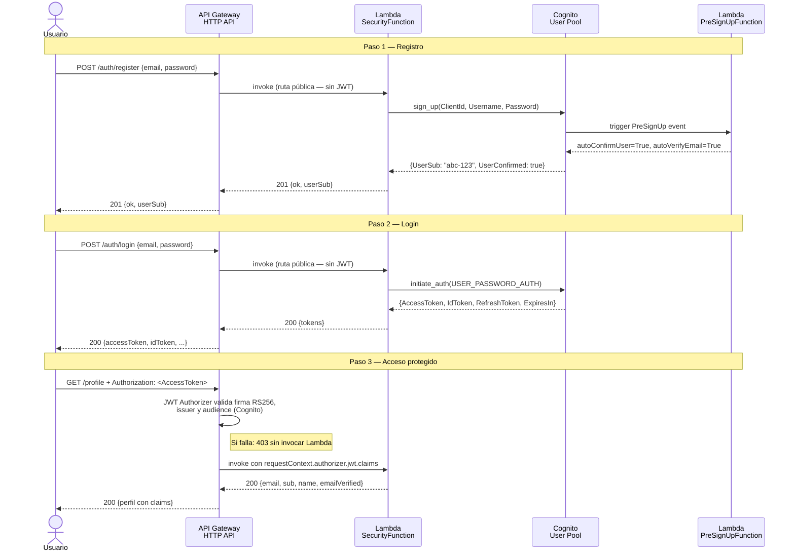
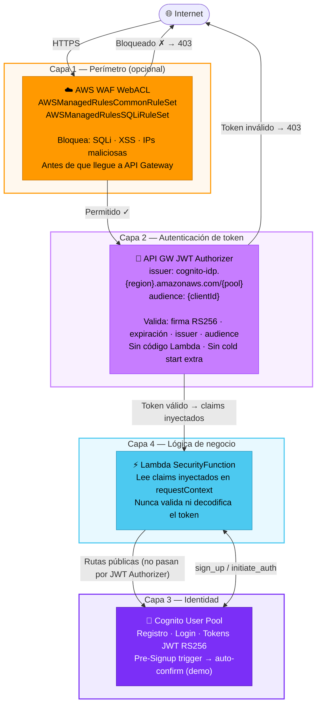
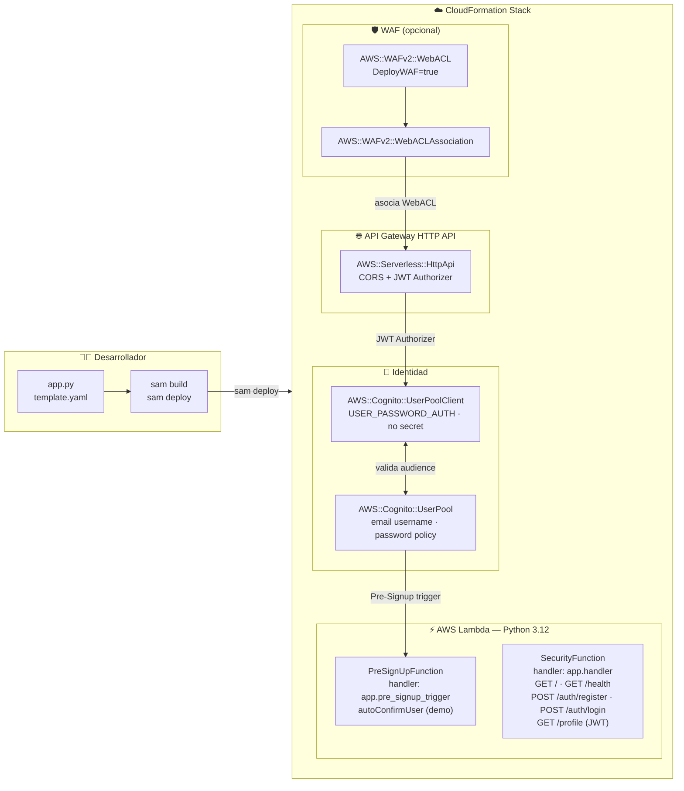
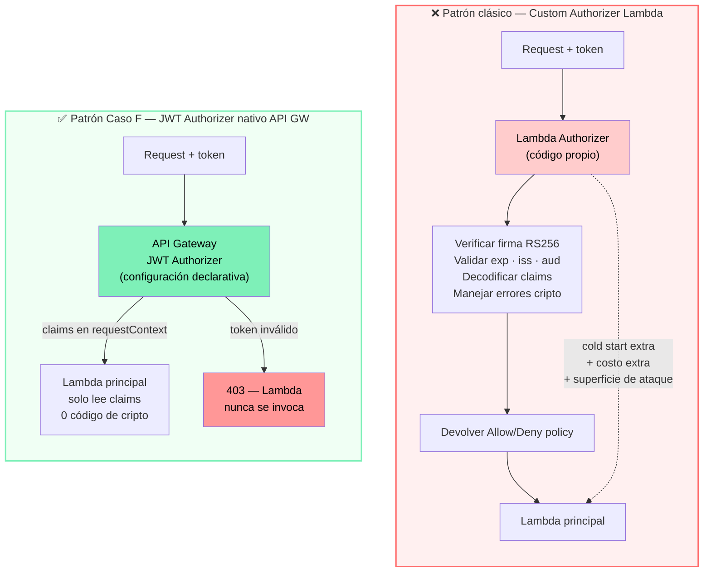

# 🔐 Arquitectura: Caso F — Security First (Cognito + JWT + WAF)

> **Stack**: AWS Cognito + API Gateway JWT Authorizer + WAF opcional + AWS SAM
> **Nivel**: 5 — Seguridad Perimetral e Identidad

---

## Visión general

Este caso implementa el principio **"seguridad como infraestructura"**: ninguna capa de
defensa vive en el código de la Lambda, todo está declarado en el SAM template y gestionado
por servicios administrados de AWS.

El modelo se organiza en cuatro capas independientes:

1. **WAF** filtra tráfico malicioso antes de que llegue al API (opcional, ~$5/mes)
2. **API Gateway** valida el token JWT criptográficamente sin ejecutar código propio
3. **Cognito** gestiona identidades: registro, login y emisión de tokens RS256
4. **Lambda** solo lee claims ya validados — nunca toca ni verifica el token

El resultado es una superficie de ataque mínima: si el token es inválido, la Lambda
nunca se invoca. Si el tráfico es malicioso, WAF lo absorbe antes del API.

---

## 📐 Diagrama 1: Flujo completo de autenticación (registro → login → perfil)

---

## 📐 Diagrama 2: Las cuatro capas de defensa

---

## 📐 Diagrama 3: Arquitectura completa AWS (SAM stack)

---

## 📐 Diagrama 4: Por qué el JWT Authorizer no necesita código Lambda

---

## 🔧 Componentes y roles

| Componente | Servicio AWS | Función | Costo demo |
|---|---|---|---|
| **WAF WebACL** | WAFv2 | Bloquea SQLi, XSS, IPs maliciosas antes del API | ~$0.35/día (evitar en demo) |
| **JWT Authorizer** | API Gateway HTTP API | Valida firma RS256, issuer y audience — sin código | Gratis (incluido en API GW) |
| **User Pool** | Cognito | Gestiona identidades, emite tokens JWT estándar | Gratis hasta 50.000 MAU |
| **App Client** | Cognito | Credencial sin secreto para `USER_PASSWORD_AUTH` | Gratis |
| **SecurityFunction** | Lambda Python 3.12 | Registro, login, perfil, health — lee claims | Free tier cubre demos |
| **PreSignUpFunction** | Lambda Python 3.12 | Auto-confirma usuarios sin verificación de email | Free tier cubre demos |
| **SAM template** | CloudFormation | IaC declarativo — el stack nace y muere junto | Gratis |

---

## 💡 Decisiones de diseño

| Decisión | Motivo |
|---|---|
| JWT Authorizer nativo en lugar de Custom Authorizer Lambda | Elimina código de criptografía propio, cold start extra y superficie de ataque. La infraestructura valida, no el código. |
| `USER_PASSWORD_AUTH` en lugar de `SRP_AUTH` | SRP (Secure Remote Password) es más seguro pero incompatible con curl y smoke tests. En producción usar SRP; en demo, `USER_PASSWORD_AUTH` sobre HTTPS es aceptable. |
| Pre-Signup trigger con `autoConfirmUser=True` | Elimina el paso de verificación de email para facilitar la demo. Documentado explícitamente — **nunca en producción**. |
| `DeployWAF=false` por defecto | WAF tiene costo fijo de ~$5/mes independiente del tráfico. Para portafolio/demo es innecesario. Se activa con un solo parámetro SAM cuando se necesita validar el perímetro. |
| App Client sin secreto de cliente | Necesario para que `initiate_auth` funcione desde Lambda sin almacenar secretos en código. El secreto de cliente exige HMAC en cada llamada — innecesario con `USER_PASSWORD_AUTH`. |
| Claims leídos desde `requestContext` (no del token) | API Gateway inyecta los claims ya validados en el contexto. La Lambda no necesita importar ni `PyJWT` ni `cryptography`. |
| Rutas públicas con `Auth: Authorizer: NONE` | SAM aplica el JWT Authorizer por defecto a todas las rutas. Las rutas de auth y health se eximen explícitamente para que no exijan token. |

---

## 🎓 Qué aprende un reclutador de este caso

- Que separas **autenticación** (quién eres — Cognito) de **autorización** (si puedes — JWT Authorizer).
- Que usas servicios administrados de AWS para validar tokens: cero código de criptografía en Lambda.
- Que entiendes el flujo completo OAuth2/OIDC: sign_up → confirm → initiate_auth → tokens → claims.
- Que aplicas **defensa en profundidad**: WAF → API GW → Cognito → Lambda, cuatro capas independientes.
- Que declaras la seguridad como IaC (SAM/CloudFormation), no como clics manuales en la consola.
- Que conoces el costo real de WAF y decides cuándo activarlo con un parámetro SAM.
- Que este caso es el prerequisito directo del Caso I (GenAI Bedrock), donde los endpoints de IA no pueden quedar públicos.

---

## ➡️ Siguiente paso natural

El complemento inmediato de este caso es:

- **Caso I (GenAI Bedrock)**: proteger los endpoints de Bedrock con el mismo JWT Authorizer de Cognito. Sin Caso F, los endpoints de IA quedan públicos.
- **Caso H (Observability)**: añadir métricas CloudWatch de intentos de registro fallidos, logins erróneos y rechazos JWT para detectar ataques de fuerza bruta.
- **Producción**: sustituir `autoConfirmUser=True` en el trigger por un flujo real de verificación de email con SES. Cambiar `USER_PASSWORD_AUTH` a `SRP_AUTH` para que la contraseña nunca viaje en la red.

---

## 🔗 Referencias

- [README del Caso F](../README.md)
- [Guía Paso a Paso AWS](../AWS_PASO_A_PASO.md)
- [SAM template](../backend/template.yaml)
- [Handler Lambda](../backend/src/app.py)
