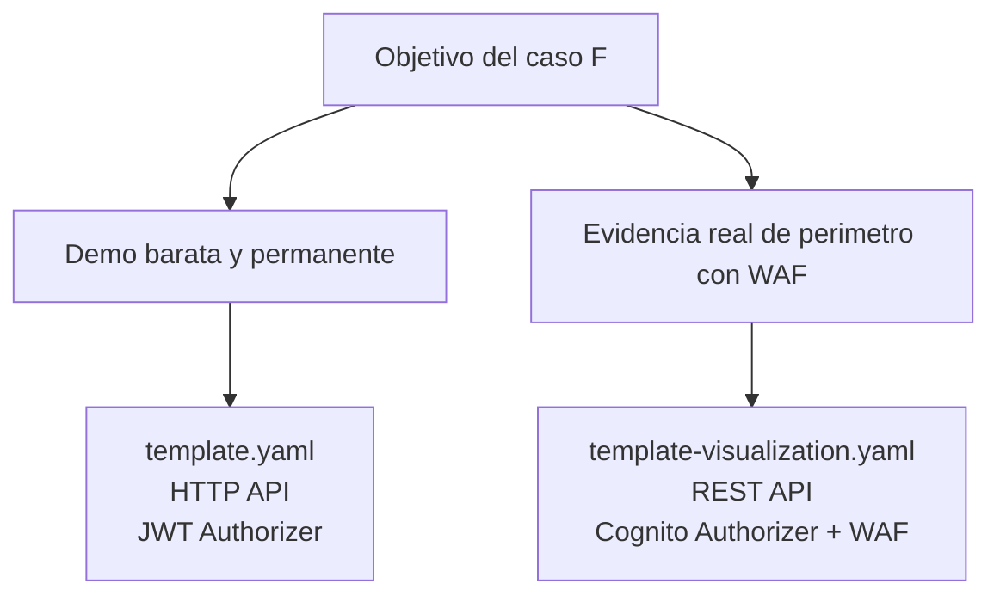
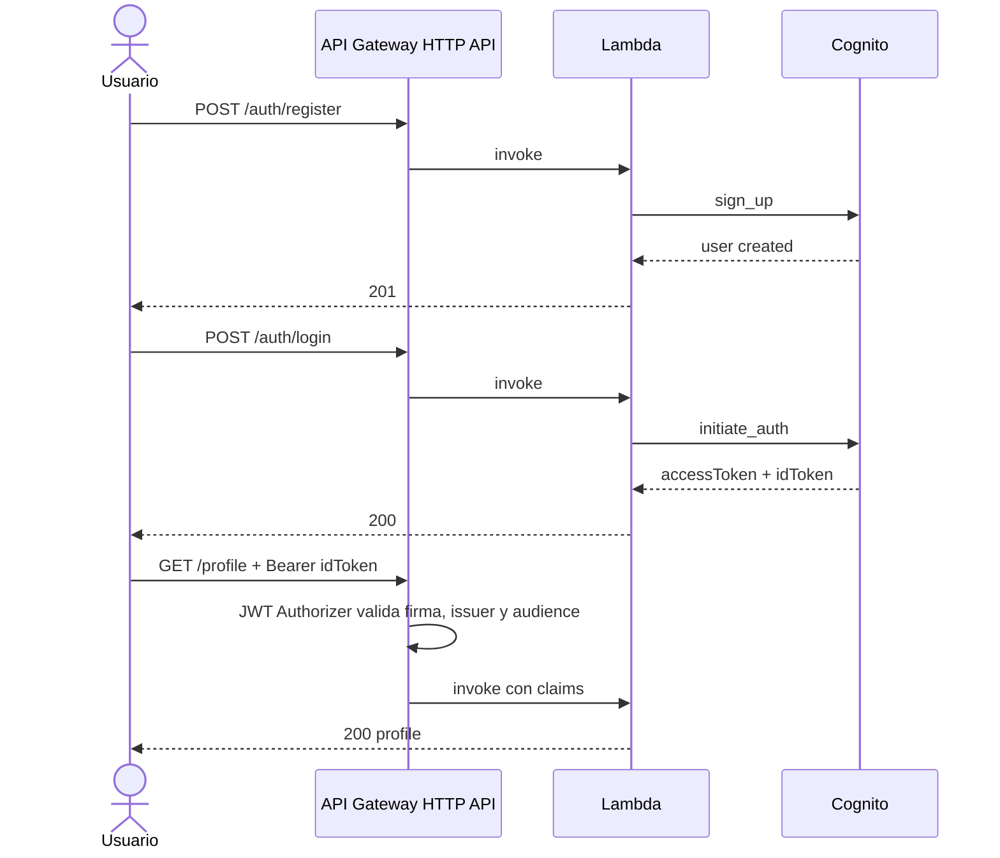
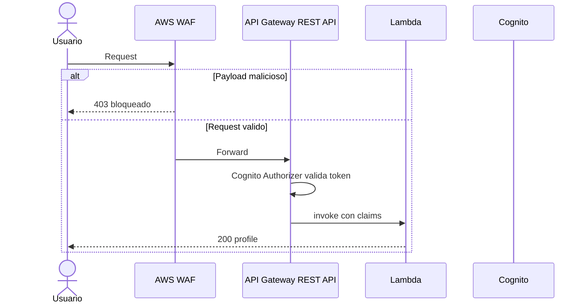
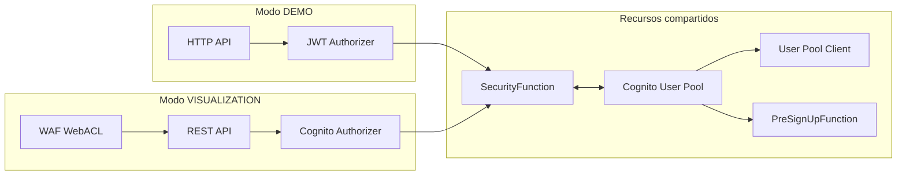

# Arquitectura: Caso F - Security First

> Stack compartido: Cognito + Lambda + API Gateway  
> Modalidades: DEMO (HTTP API) y VISUALIZATION (REST API + WAF)

## Decision principal

El Caso F usa **dos arquitecturas hermanas** porque hay una restriccion real de AWS:

- `HTTP API` soporta JWT Authorizer nativo y es la mejor opcion para demo barata.
- `AWS WAF` se asocia a `REST API`, no a `HTTP API`.

La solucion final no intenta forzar una combinacion imposible. En vez de eso, separa el caso en:

1. `DEMO`: despliegue vivo, costo base cero, HTTP API + JWT Authorizer.
2. `VISUALIZATION`: despliegue temporal, evidencia y capturas, REST API + Cognito Authorizer + WAF.

## Diagrama 1: Decision de arquitectura

## Diagrama 2: Modalidad DEMO

## Diagrama 3: Modalidad VISUALIZATION

## Diagrama 4: Componentes compartidos

## Beneficios del diseno

- No hay codigo de validacion criptografica dentro de Lambda.
- La demo sigue viva sin costo base.
- WAF se prueba de forma autentica cuando se necesita evidencia.
- El frontend funciona en ambos modos porque resuelve automaticamente la base path.
- El mismo handler soporta eventos de HTTP API v2 y REST API v1.

## Riesgos controlados

| Riesgo | Mitigacion |
|---|---|
| Mezclar WAF con HTTP API | Separamos templates |
| Mostrar claims incompletos | `/profile` usa `idToken` |
| Romper la landing en REST API por el stage `/Prod` | El frontend calcula la base URL en runtime |
| Mantener costo fijo por WAF | `VISUALIZATION.md` documenta deploy -> capture -> destroy |

## Referencias

- [README del Caso F](../README.md)
- [Paso a paso AWS](../AWS_PASO_A_PASO.md)
- [Reporte de visualization](../VISUALIZATION.md)
- [Template DEMO](../backend/template.yaml)
- [Template VISUALIZATION](../backend/template-visualization.yaml)
