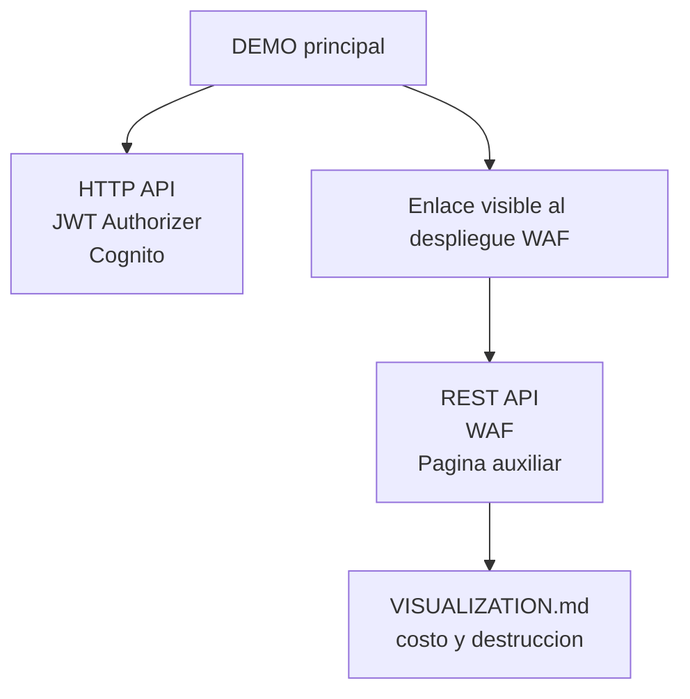
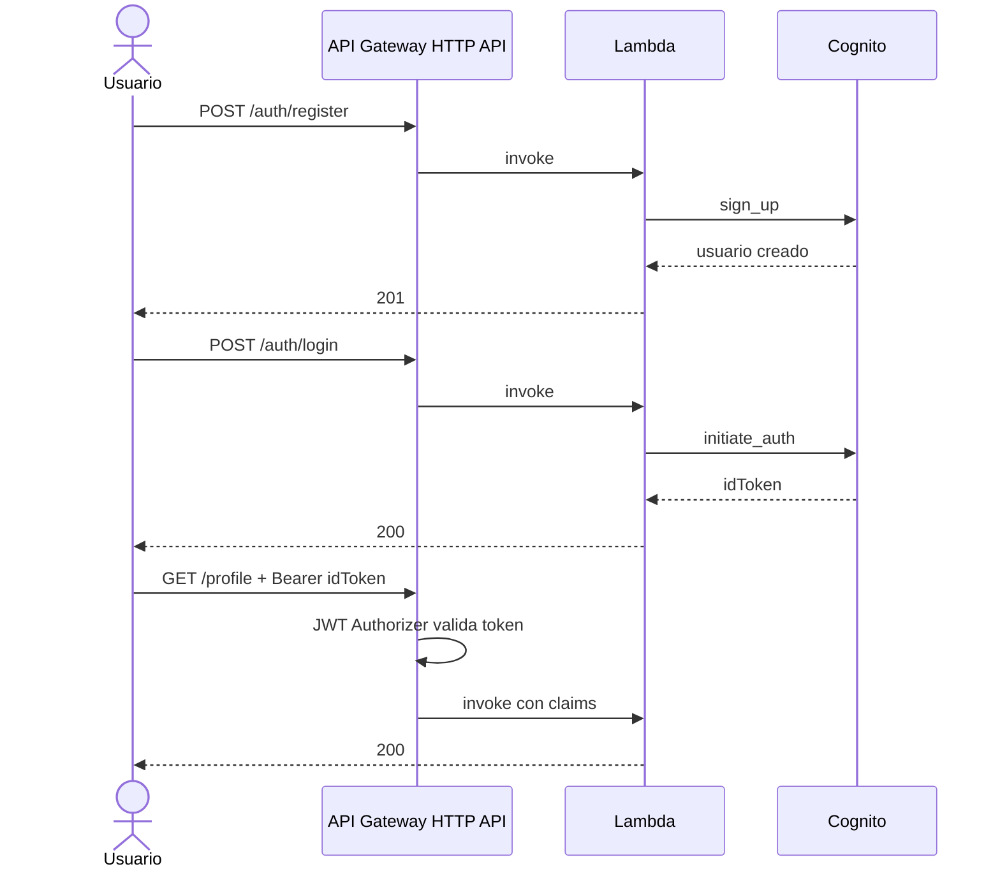
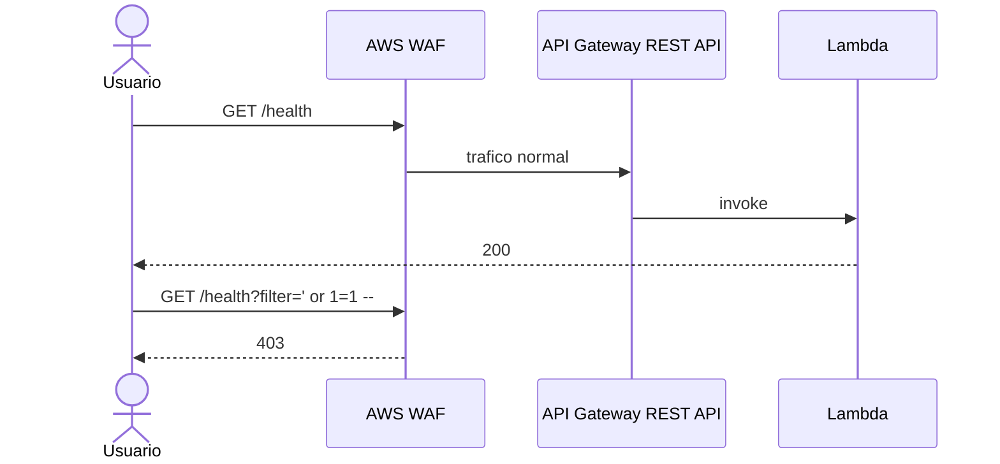

# Arquitectura: Caso F - DEMO principal + pagina WAF auxiliar

## Idea central

El Caso F tiene un solo producto principal:

- `DEMO` con Cognito + HTTP API + JWT Authorizer

Y un despliegue complementario:

- pagina WAF auxiliar con REST API + WAF para explicar y validar el perimetro

`VISUALIZATION.md` no es otro despliegue. Es la bitacora de costo y cierre seguro del stack WAF.

## Por que se separa

- `HTTP API` es la opcion mas barata y simple para el DEMO
- `AWS WAF` se asocia a `REST API`
- separar el perimetro en una pagina auxiliar evita confundir el producto principal

## Diagrama 1: Vista general

## Diagrama 2: Flujo del DEMO

## Diagrama 3: Flujo de la pagina WAF

## Que resuelve cada pieza

| Pieza | Rol |
|---|---|
| `template.yaml` | producto principal del caso |
| `template-visualization.yaml` | pagina WAF enlazada desde el DEMO |
| `VISUALIZATION.md` | control de costo y destruccion del stack WAF |

## Resultado esperado

- el usuario entiende el producto apenas abre el DEMO
- el DEMO muestra el flujo funcional completo
- el enlace WAF abre una pagina separada y explicativa
- el stack WAF se destruye despues de la ventana de evidencia
