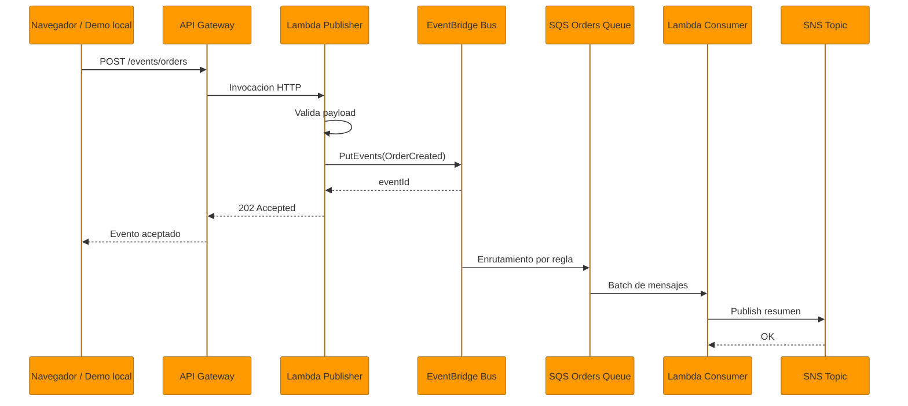
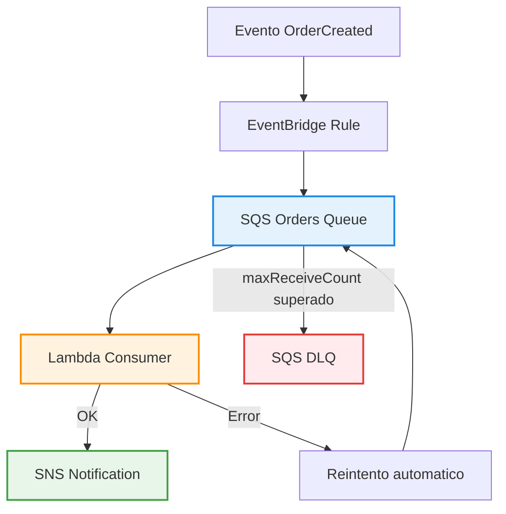
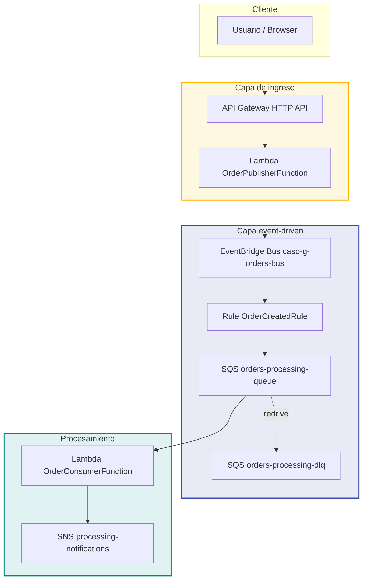
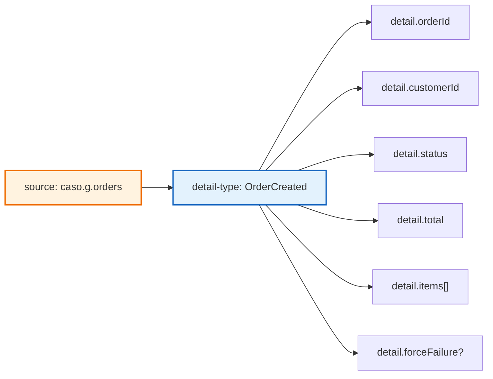

# Arquitectura: Caso G - Event Driven

> Stack: API Gateway + Lambda + EventBridge + SQS + SNS + AWS SAM
> Nivel: 6 - Integracion asincrona y desacoplamiento por eventos

---

## Vision general

Este caso modela una arquitectura donde la escritura inicial y el procesamiento posterior ya no
ocurren en la misma transaccion ni en el mismo servicio. El productor solo publica un hecho de
negocio. A partir de ahi, el bus de eventos y la cola desacoplan tiempos, reintentos y errores.

El escenario representado es simple pero muy util para entrevistas y aprendizaje:

- una orden es creada
- el health check puede leerse como HTML o como JSON segun quien lo consuma
- el evento se publica en EventBridge
- una regla lo enruta a SQS
- una Lambda lo consume y emite una notificacion
- si algo falla repetidamente, el mensaje termina en DLQ

---

## Diagrama 1: Flujo principal de publicacion

---

## Diagrama 2: Ruta de error y DLQ

---

## Diagrama 3: Arquitectura completa AWS

---

## Diagrama 4: Contrato del evento

---

## Decisiones de diseno

| Decision | Motivo |
|---|---|
| EventBridge como bus principal | Permite publicar eventos sin conocer a los consumidores. |
| SQS entre regla y consumidor | Absorbe picos de carga y desacopla el ritmo de procesamiento. |
| DLQ separada | Facilita troubleshooting sin perder mensajes problematicos. |
| Lambda publisher separada de consumer | Hace visible la diferencia entre ingesta y procesamiento. |
| SNS al final del flujo | Permite extender notificaciones o fan-out sin tocar el productor. |
| `202 Accepted` en la API | Refuerza el modelo asincrono: aceptar no significa procesar de inmediato. |
| `/health` con HTML y JSON | Permite explicar el chequeo a humanos sin romper scripts y monitoreo. |

---

## Que aprende un reclutador de este caso

- que sabes diferenciar integracion sincrona de asincrona
- que entiendes reintentos, redrive policy y DLQ
- que puedes modelar contratos de eventos
- que sabes preparar una base para observabilidad real

---

## Siguiente paso natural

El paso natural es complementar este caso con:

- metricas de profundidad de cola
- alarmas sobre DLQ
- correlacion por `eventId`
- dashboards y trazas distribuidas en el futuro Caso H
