# Reporte de Visualizacion y Resultados - Caso H (Observability & Health)

## Por que existe este documento?
El Caso H demuestra observabilidad como codigo, pero cambia el modelo de costo del portafolio porque crea un recurso fijo: el dashboard `caso-h-observability` en Amazon CloudWatch.

Mientras los casos serverless puros pueden quedar publicados por largos periodos, aqui el costo ya no depende solo del trafico:

- `CloudWatch Dashboard`: ~`$3 USD/mes` por dashboard activo.
- `X-Ray`, `Lambda`, `API Gateway` y alarmas: costo bajo o cubierto por free tier en ventana de laboratorio.
- `CloudWatch Logs`: consumo variable, normalmente marginal en este caso.

Por esa razon, este caso se documenta con una estrategia **Deploy -> Validar -> Capturar -> Destroy**. La evidencia visual reemplaza a la demo permanente y permite justificar la decision FinOps sin perder valor tecnico para entrevistas o revision del portafolio.

**Ultima URL validada del laboratorio**: `https://z7evf8mrzf.execute-api.us-east-2.amazonaws.com/`

---

## Resumen de la implementacion
Se construyo un stack SAM autocontenido que publica una landing interactiva, un health check HTML/JSON, metricas custom y trazas X-Ray, todo conectado a un dashboard CloudWatch y dos alarmas declaradas en CloudFormation.

### Logros tecnicos
- Observabilidad definida como IaC con `AWS::CloudWatch::Dashboard` y `AWS::CloudWatch::Alarm`.
- Lambda con `Tracing: Active` para generar trazas en X-Ray.
- Endpoint `POST /metrics` que publica `CasoH/HealthChecks` en CloudWatch.
- Landing HTML con estados interactivos para demostrar trazas y metricas sin herramientas externas.
- Estrategia FinOps documentada para eliminar el stack sin afectar otros casos del repositorio.

> [!CAUTION]
> **ESTRATEGIA FINOPS**
>
> El dashboard `caso-h-observability` tiene costo fijo aunque el trafico sea bajo. Por eso este caso no debe quedar publicado de forma indefinida.
>
> **Decision arquitectonica**: mantener el codigo, el reporte de evidencia y el procedimiento de re-despliegue, pero destruir el stack una vez terminadas las capturas del laboratorio.

---

## Preparacion de la sesion de captura

Antes de tomar capturas, despliega el caso y recupera los outputs reales:

```bash
cd caso-h-observability/backend
sam build
sam deploy --stack-name caso-h-observability --region us-east-2 --resolve-s3 --capabilities CAPABILITY_IAM --no-confirm-changeset --no-fail-on-empty-changeset

aws cloudformation describe-stacks \
  --stack-name caso-h-observability \
  --region us-east-2 \
  --query "Stacks[0].Outputs"
```

Necesitaras estos datos:

- `ApiBaseUrl`
- `FunctionName`
- `DashboardUrl`

### Orden recomendado de ventanas
No intentes documentar la landing o el dashboard con una sola captura completa. Este caso tiene **mas de un estado visual** y requiere evidencia separada por ventana:

1. **Ventana A**: `GET /` recien cargado, parte superior de la landing.
2. **Ventana B**: `GET /` desplazado hasta "Demo en vivo", sin hacer clic.
3. **Ventana C**: nueva pestana `GET /`, luego clic en `Probar health check`.
4. **Ventana D**: nueva pestana `GET /`, luego clic en `Publicar metrica custom`.
5. **Ventana E**: `GET /health` HTML.
6. **Ventana F**: `GET /health?format=json`.
7. **Consola AWS 1**: CloudWatch Dashboard `caso-h-observability`.
8. **Consola AWS 2**: X-Ray `Service map` y `Traces`.
9. **Consola AWS 3**: CloudFormation, Lambda y API Gateway.

> [!IMPORTANT]
> El panel de respuesta de la landing cambia de estado despues de cada boton. Si reutilizas la misma pestana para todo, perderas evidencia del estado anterior. Duplica pestanas para congelar cada estado visual.

---

## Galeria de evidencias (flujo de despliegue)

### 1. Stack base desplegado (AWS CloudFormation)
> **Instrucciones paso a paso**:
> 1. Ve a la **Consola de AWS** y busca el servicio **CloudFormation**.
> 2. En el menu izquierdo, entra a **Stacks**.
> 3. Busca el stack llamado `caso-h-observability`.
> 4. Haz clic en el stack y deja visible la seccion **Overview** u **Outputs**.
> 5. **Captura**: toma la imagen donde se vea:
>    - `Stack name: caso-h-observability`
>    - `Status: CREATE_COMPLETE` o `UPDATE_COMPLETE`
>    - la region `us-east-2`
>    - al menos el output `ApiBaseUrl` o `DashboardUrl`

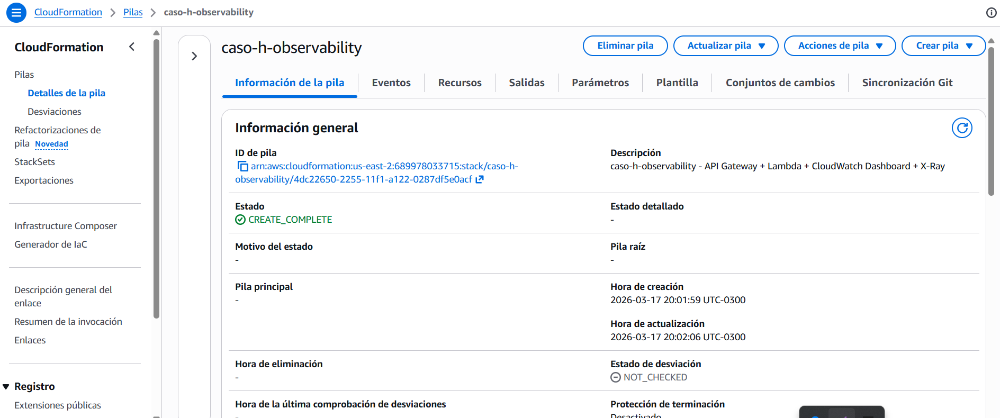

### 2. API Gateway HTTP API y rutas publicas
> **Instrucciones paso a paso**:
> 1. Busca el servicio **Amazon API Gateway**.
> 2. Ve a **APIs** y entra al HTTP API creado por el stack `caso-h-observability`.
> 3. En el menu del API, abre **Routes**.
> 4. **Captura**: toma la foto donde se vean exactamente estas rutas:
>    - `GET /`
>    - `GET /health`
>    - `POST /metrics`
>    - el stage `$default`

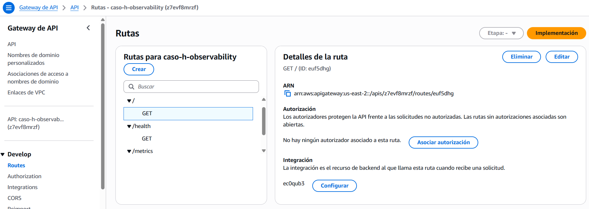

### 3. Lambda instrumentada con X-Ray
> **Instrucciones paso a paso**:
> 1. Busca el servicio **AWS Lambda**.
> 2. Entra a **Functions** y abre la funcion cuyo nombre fisico aparece en el output `FunctionName`.
> 3. Ve a **Configuration**.
> 4. Si tu consola muestra el bloque **Monitoring and operations tools**, dejalo visible. Si no, usa **General configuration** y **Environment variables**.
> 5. **Captura**: toma la foto donde se vea:
>    - `Runtime: Python 3.12`
>    - `Timeout: 15 sec`
>    - `Memory: 256 MB`
>    - `Tracing: Active`
>    - variables `STACK_NAME=caso-h-observability` y `METRIC_NAMESPACE=CasoH` si caben en la vista

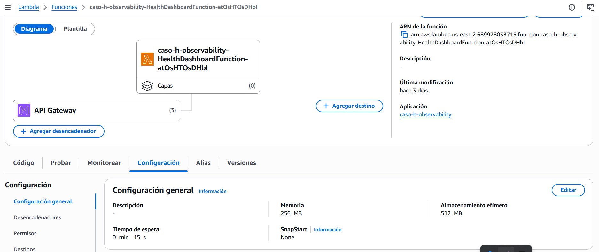

### 4. Landing principal - Ventana A (parte superior, estado inicial)
> **Instrucciones paso a paso**:
> 1. Abre en el navegador `ApiBaseUrl/`.
> 2. No hagas clic en ningun boton todavia.
> 3. Deja visible solo la parte superior de la landing.
> 4. **Captura**: toma la foto donde se vea:
>    - el titulo `Convierte tu infraestructura en una caja de cristal`
>    - el subtitulo del caso
>    - el bloque `Los tres pilares`
>    - el bloque `Estado del despliegue`

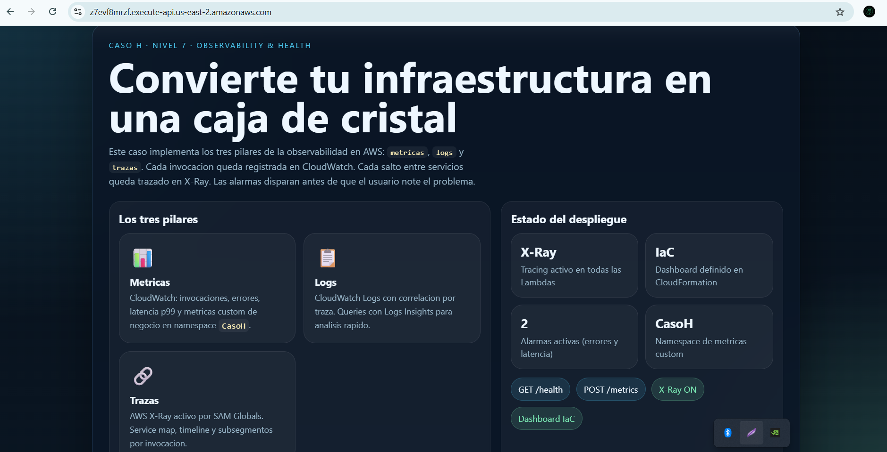

### 5. Landing principal - Ventana B (seccion interactiva en espera)
> **Instrucciones paso a paso**:
> 1. Abre una nueva pestana en `ApiBaseUrl/`.
> 2. Desplazate hasta la seccion **Demo en vivo** y el panel **Respuesta**.
> 3. No presiones ningun boton.
> 4. **Captura**: toma la foto donde se vea:
>    - el boton `Probar health check`
>    - el boton `Publicar metrica custom`
>    - los enlaces `Health HTML` y `Health JSON`
>    - el badge `Esperando accion`
>    - el texto `Esperando acciones...`

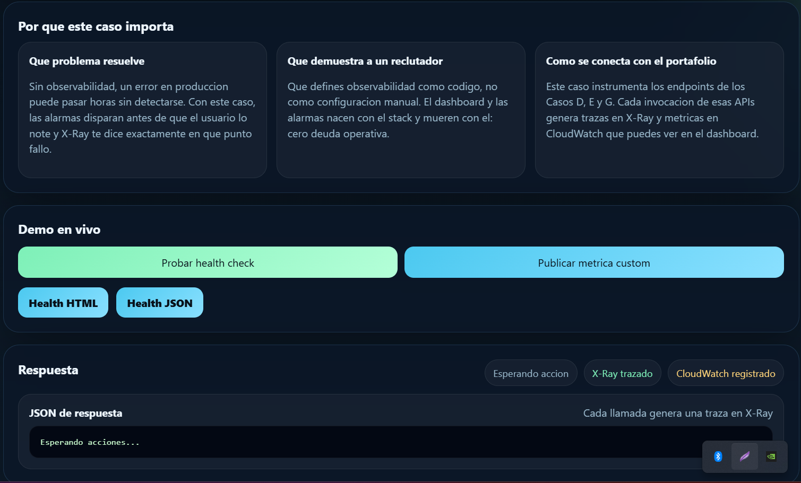

### 6. Landing principal - Ventana C (estado despues de `Probar health check`)
> **Instrucciones paso a paso**:
> 1. Abre otra pestana nueva en `ApiBaseUrl/`.
> 2. Desplazate hasta **Demo en vivo**.
> 3. Haz clic en **Probar health check**.
> 4. Espera a que el badge cambie a `Health OK - traza registrada en X-Ray`.
> 5. **Captura**: toma la foto donde se vea:
>    - el badge verde del health
>    - el JSON con `status`, `service`, `xray` y `metricNamespace`
>    - el bloque `JSON de respuesta`

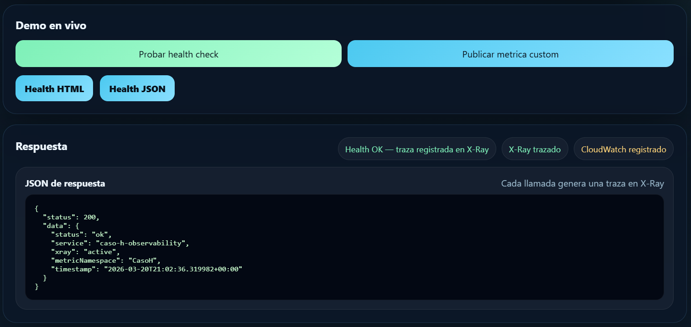

### 7. Landing principal - Ventana D (estado despues de `Publicar metrica custom`)
> **Instrucciones paso a paso**:
> 1. Abre una cuarta pestana nueva en `ApiBaseUrl/`.
> 2. Desplazate hasta **Demo en vivo**.
> 3. Haz clic en **Publicar metrica custom**.
> 4. Espera a que el badge cambie a `Metrica publicada en CasoH/HealthChecks`.
> 5. **Captura**: toma la foto donde se vea:
>    - el badge de publicacion exitosa
>    - el JSON con `namespace`, `metricName`, `service` y `timestamp`
>    - el estado visual posterior a la accion

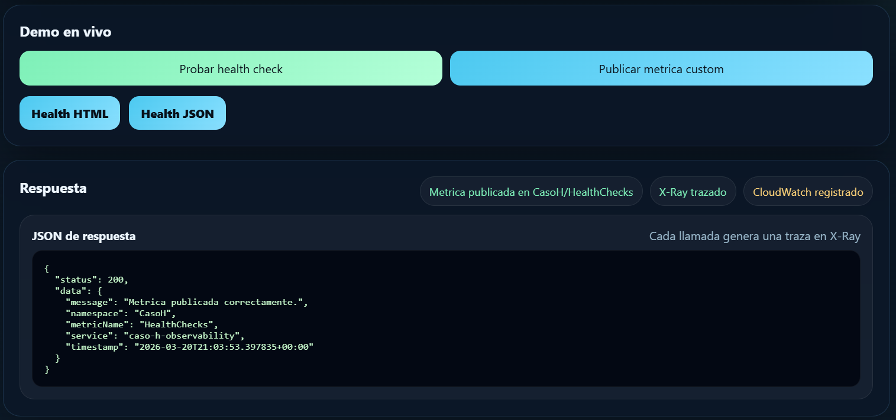

### 8. Endpoint `/health` como pagina HTML
> **Instrucciones paso a paso**:
> 1. Abre una nueva pestana en `ApiBaseUrl/health`.
> 2. No agregues `?format=json`.
> 3. **Captura**: toma la foto donde se vea:
>    - el titulo `Estado operativo del servicio de observabilidad`
>    - la tarjeta `ok`
>    - `X-Ray active`
>    - `CasoH`
>    - `us-east-2`
>    - el bloque JSON renderizado al pie

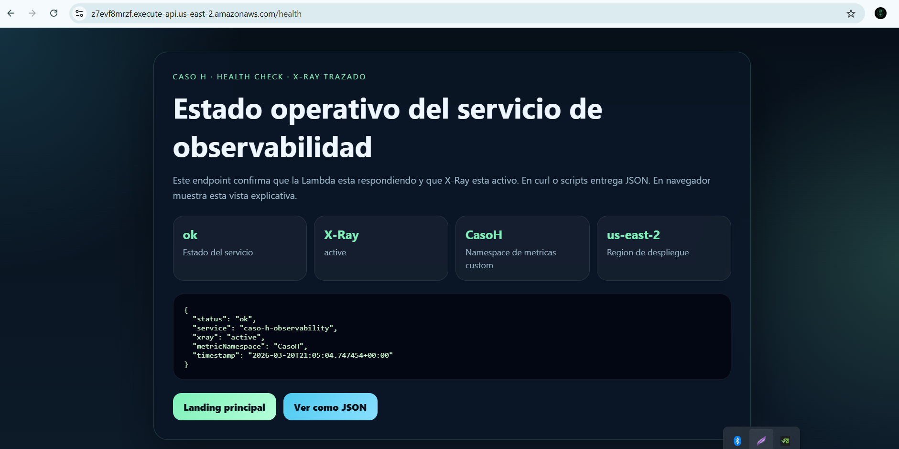

### 9. Endpoint `/health?format=json` como salida cruda
> **Instrucciones paso a paso**:
> 1. Abre una nueva pestana en `ApiBaseUrl/health?format=json`.
> 2. Si el navegador muestra JSON crudo, dejalo asi. Si lo descarga, usa la vista de red del navegador o una terminal con `curl`.
> 3. **Captura**: toma la foto donde se vea el payload JSON con:
>    - `status: ok`
>    - `service: caso-h-observability`
>    - `xray: active`
>    - `metricNamespace: CasoH`

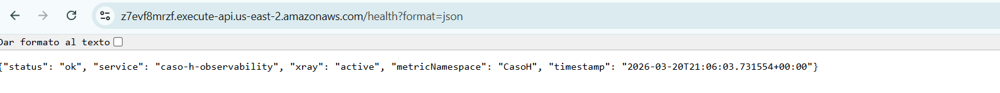

### 10. CloudWatch Dashboard - mitad superior
> **Instrucciones paso a paso**:
> 1. Busca el servicio **Amazon CloudWatch**.
> 2. Ve a **Dashboards**.
> 3. Abre el dashboard `caso-h-observability`.
> 4. Ajusta el rango de tiempo a **Last 1 hour** o **Last 3 hours**.
> 5. Asegurate de haber ejecutado antes los pasos 6 y 7 para tener trafico y metricas.
> 6. **Captura**: toma la foto de la mitad superior donde se vean estos widgets:
>    - `Lambda Invocaciones y Errores`
>    - `Lambda Duracion (ms)`
>    - `Metricas Custom - HealthChecks`

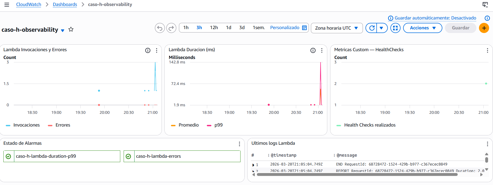

### 11. CloudWatch Dashboard - mitad inferior
> **Instrucciones paso a paso**:
> 1. En el mismo dashboard `caso-h-observability`, desplaza hacia abajo.
> 2. **Captura**: toma la foto donde se vea:
>    - el widget `Estado de Alarmas`
>    - el widget `Ultimos logs Lambda`
>    - los nombres `caso-h-lambda-errors` y `caso-h-lambda-duration-p99`
>    - al menos una linea reciente de logs

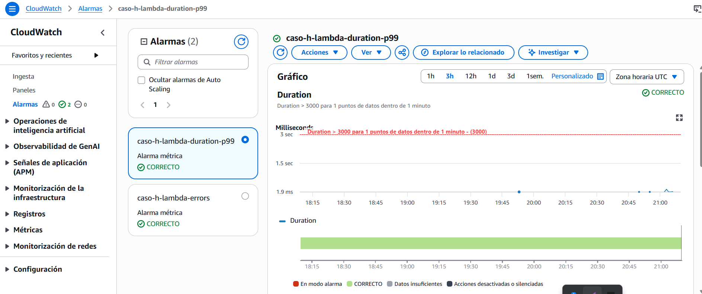

### 12. Metricas custom en detalle (`CasoH / HealthChecks`)
> **Instrucciones paso a paso**:
> 1. En **Amazon CloudWatch**, entra a **Metrics**.
> 2. Selecciona **All metrics**.
> 3. Entra a **Custom namespaces** y luego a `CasoH`.
> 4. Abre la dimension `Service`.
> 5. Selecciona el recurso `caso-h-observability` y la metrica `HealthChecks`.
> 6. **Captura**: toma la foto donde se vea al menos un datapoint generado por el boton `Publicar metrica custom`.

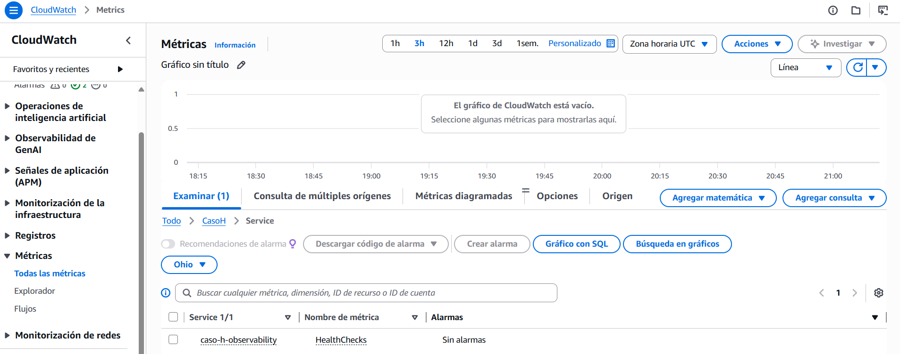

### 13. Alarmas CloudWatch en estado OK
> **Instrucciones paso a paso**:
> 1. En **Amazon CloudWatch**, entra a **Alarms** > **All alarms**.
> 2. Filtra por `caso-h-`.
> 3. **Captura**: toma la foto donde se vea:
>    - `caso-h-lambda-errors`
>    - `caso-h-lambda-duration-p99`
>    - `State: OK`

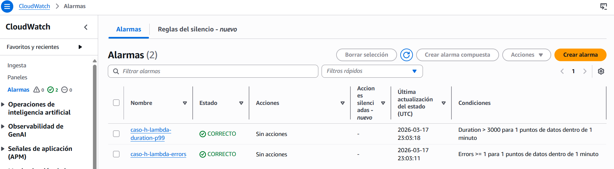

#### 13.1 Estado alternativo opcional: ALARM simulado
Si quieres demostrar los dos estados posibles del despliegue final, puedes forzar una alarma temporalmente:

```bash
aws cloudwatch set-alarm-state \
  --alarm-name "caso-h-lambda-errors" \
  --state-value ALARM \
  --state-reason "Prueba manual de alarma" \
  --region us-east-2

aws cloudwatch set-alarm-state \
  --alarm-name "caso-h-lambda-errors" \
  --state-value OK \
  --state-reason "Restaurado tras evidencia" \
  --region us-east-2
```

> **Captura opcional**: toma una imagen adicional mostrando el estado `ALARM`, luego restaura a `OK` antes de destruir el stack.

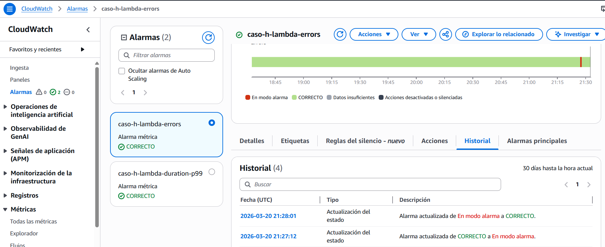

### 14. X-Ray Service Map
> **Instrucciones paso a paso**:
> 1. Busca el servicio **AWS X-Ray**.
> 2. Entra a **Service map**.
> 3. Ajusta el tiempo a los ultimos **15 minutos**.
> 4. Antes de capturar, ejecuta una llamada a `GET /health` y una a `POST /metrics`.
> 5. **Captura**: toma la foto donde se vea al menos:
>    - el nodo del servicio del Caso H
>    - la relacion con la entrada HTTP/Lambda
>    - si ya aparece, el nodo aguas abajo hacia CloudWatch despues de `POST /metrics`

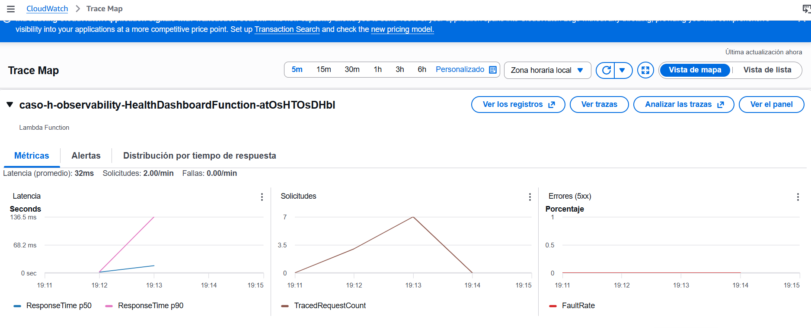

### 15. X-Ray detalle de una traza
> **Instrucciones paso a paso**:
> 1. En **AWS X-Ray**, entra a **Traces**.
> 2. Selecciona una traza reciente del endpoint `/metrics` (preferible) o `/health`.
> 3. Abre el detalle completo de la traza.
> 4. **Captura**: toma la foto donde se vea:
>    - el `Response code 200`
>    - el timeline de la traza
>    - la duracion
>    - los segmentos o subsegmentos visibles

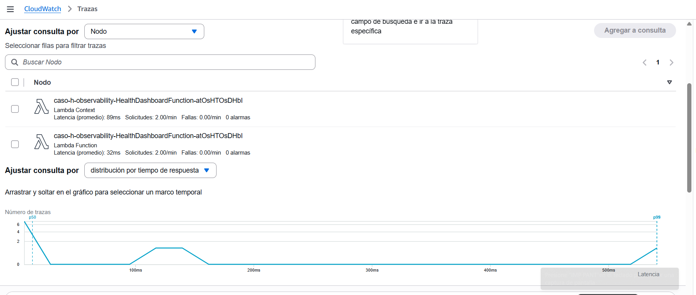

### 16. CloudWatch Logs Insights
> **Instrucciones paso a paso**:
> 1. Ve a **Amazon CloudWatch** > **Logs Insights**.
> 2. Selecciona el log group `/aws/lambda/<FunctionName>` del Caso H.
> 3. Ejecuta esta query:
>
> ```sql
> fields @timestamp, @message
> | sort @timestamp desc
> | limit 20
> ```
>
> 4. **Captura**: toma la foto donde se vean invocaciones recientes del `GET /health` y/o `POST /metrics`.

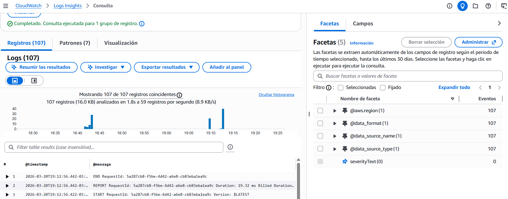

---

## Tabla de validacion final

| Hito | Estado esperado | Metodo de validacion |
| :--- | :--- | :--- |
| Stack `caso-h-observability` | OK | CloudFormation |
| Rutas `GET /`, `GET /health`, `POST /metrics` | OK | API Gateway |
| Lambda con `Tracing: Active` | OK | Lambda Configuration |
| Landing inicial | OK | Navegador - Ventana A |
| Landing en espera | OK | Navegador - Ventana B |
| Estado `Health OK` | OK | Navegador - Ventana C |
| Estado `Metrica publicada` | OK | Navegador - Ventana D |
| Dashboard con widgets llenos | OK | CloudWatch Dashboard |
| Metrica `CasoH/HealthChecks` | OK | CloudWatch Metrics |
| Alarmas en `OK` | OK | CloudWatch Alarms |
| Trazas visibles | OK | X-Ray Service Map + Traces |
| Baja FinOps documentada | CRITICO | Seccion de cierre cumplida |

---

## Instrucciones de cierre (baja del servicio)

### Alcance seguro de la baja
La destruccion del Caso H es segura porque el stack `caso-h-observability` es **autocontenido**. Segun `backend/template.yaml`, solo administra estos recursos:

- 1 HTTP API propio
- 1 Lambda propia (`HealthDashboardFunction`)
- 1 CloudWatch Dashboard (`caso-h-observability`)
- 2 alarmas (`caso-h-lambda-errors`, `caso-h-lambda-duration-p99`)
- 1 IAM Role asociado a la Lambda

**No** destruye recursos de:

- `caso-d-serverless-basic`
- `caso-e-dynamodb-persistence`
- `caso-g-event-driven`

Aunque el Caso H conceptualmente se apoya en esos casos como prerequisito de madurez, el stack actual del repositorio **no comparte propiedad CloudFormation** con ellos.

### Opcion A: via Makefile (recomendada)
Desde la raiz del proyecto:

```bash
make case-h-destroy
```

### Opcion B: via AWS SAM directo

```bash
cd caso-h-observability/backend
sam delete --stack-name caso-h-observability --region us-east-2 --no-prompts
```

### Verificacion manual obligatoria
Despues del comando, verifica manualmente en AWS:

1. **CloudFormation > Stacks**: `caso-h-observability` debe desaparecer o quedar en `DELETE_COMPLETE`.
2. **API Gateway > APIs**: el HTTP API del Caso H ya no debe existir.
3. **Lambda > Functions**: la funcion fisica del Caso H ya no debe aparecer.
4. **CloudWatch > Dashboards**: el dashboard `caso-h-observability` ya no debe existir.
5. **CloudWatch > Alarms**: las dos alarmas `caso-h-*` ya no deben existir.
6. **CloudWatch > Log groups**: si quedo el grupo `/aws/lambda/<FunctionName>`, puedes borrarlo manualmente para limpieza total.

### Limpieza opcional de logs
Solo si confirmaste el nombre exacto de la funcion del Caso H:

```bash
aws logs delete-log-group \
  --log-group-name "/aws/lambda/<FunctionName>" \
  --region us-east-2
```

> [!WARNING]
> No borres log groups, Lambdas ni alarmas usando filtros genericos como `caso-*`. Haz la limpieza solo sobre el nombre exacto del Caso H para no tocar otros laboratorios del portafolio.

### Que puede seguir visible y por que no rompe otros casos
- Historico de trazas X-Ray por retencion temporal.
- Datapoints historicos en CloudWatch Metrics.
- Evidencia local en este documento y en `./img/`.

Eso es normal y **no rompe** ni altera los Casos D, E o G. Lo importante para cortar el costo fijo es eliminar el dashboard y el stack administrado.

---

*Documentacion de evidencia estatica para el portafolio. Mantener el stack activo solo durante ventanas controladas de despliegue y captura.*
