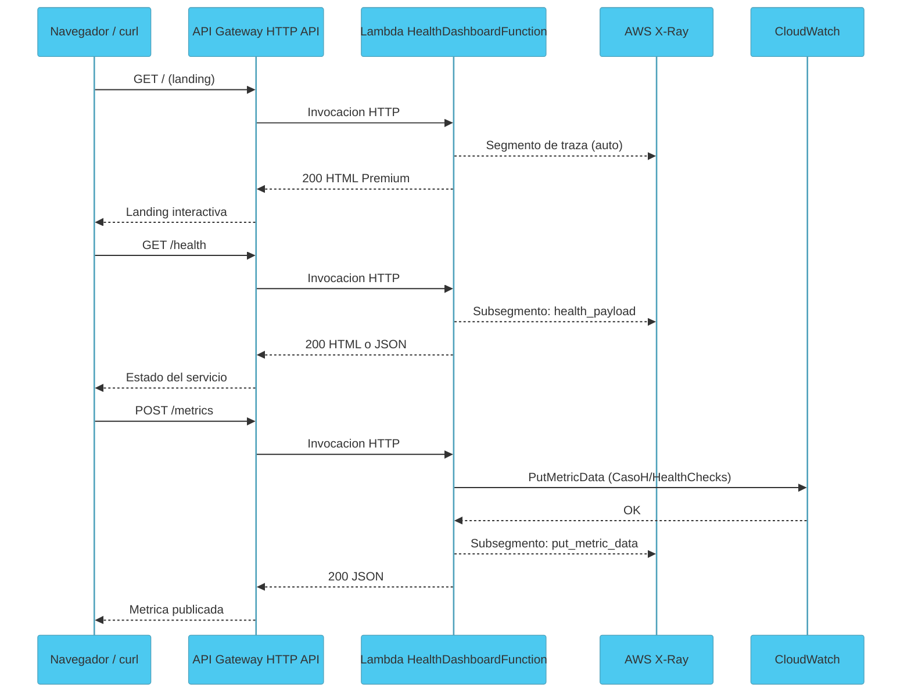
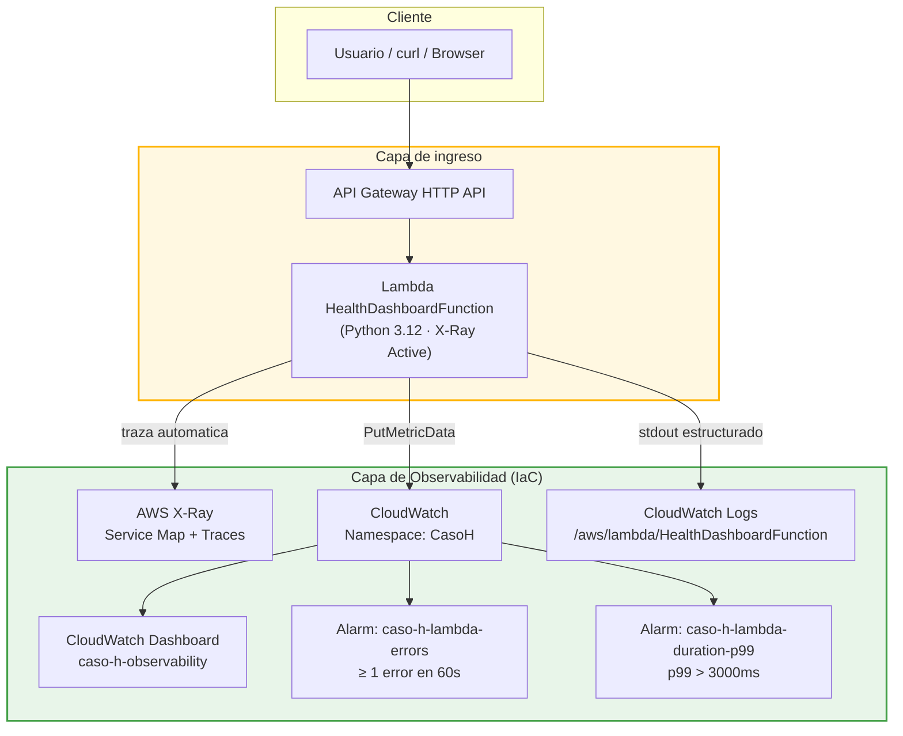
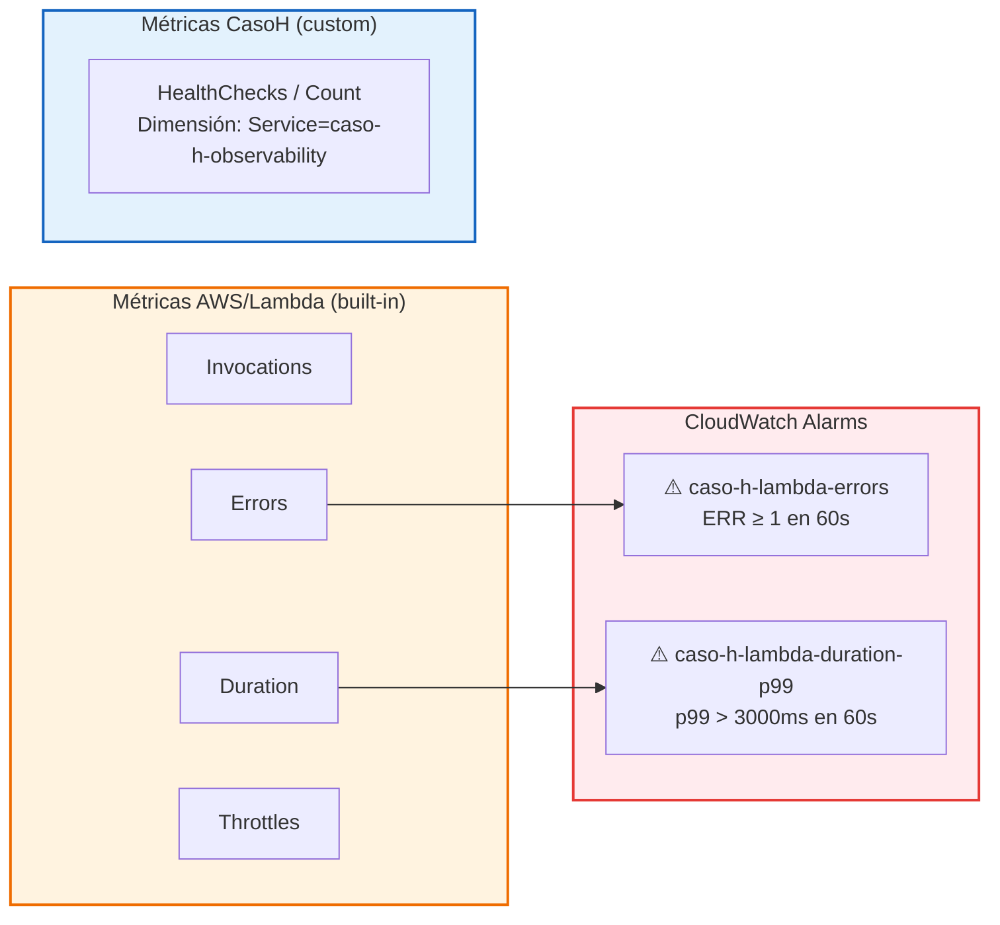
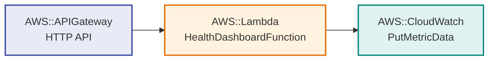

# Arquitectura: Caso H — Observability & Health

> Stack: API Gateway + Lambda + AWS X-Ray + CloudWatch Dashboard + CloudWatch Alarms
> Nivel: 7 — Observabilidad como código

---

## Vision general

Este caso implementa los tres pilares de observabilidad sobre la infraestructura serverless
ya existente. No despliega nueva lógica de negocio: instrumenta lo que ya existe con
trazas (X-Ray), métricas (CloudWatch custom) y alertas proactivas (CloudWatch Alarms).

El principio rector: **la observabilidad es código, no configuración manual**.
El dashboard y las alarmas nacen con el stack SAM y mueren con él.

---

## Diagrama 1: Flujo principal con X-Ray

---

## Diagrama 2: Arquitectura AWS completa

---

## Diagrama 3: Mapa de métricas y alarmas

---

## Diagrama 4: X-Ray Service Map (esperado post-deploy)

---

## Decisiones de diseño

| Decisión | Motivo |
|---|---|
| `Tracing: Active` en SAM Globals | Instrumenta todas las Lambdas sin modificar el código |
| Dashboard inline en CloudFormation | Se crea y destruye con el stack; cero deuda operativa |
| Namespace custom `CasoH` | Separa métricas de negocio de las métricas built-in de AWS |
| Alarma sobre `Errors` Sum(60s) ≥ 1 | Detecta cualquier error inmediatamente |
| Alarma sobre `Duration p99` > 3000ms | Detecta degradación de latencia antes que el usuario |
| `/health` HTML + JSON | Consistencia con Caso G; funciona para humanos y scripts |
| `PutMetricData` desde Lambda | Demuestra la integración activa con CloudWatch desde código |

---

## Qué aprende un reclutador

- Que defines observabilidad como código (IaC), no clics en la consola.
- Que entiendes los tres pilares: métricas, logs y trazas.
- Que differencias métricas técnicas (errores, latencia) de métricas de negocio.
- Que las alarmas son proactivas, no reactivas.
- Que X-Ray permite correlacionar una petición a través de múltiples servicios.

---

## Siguiente paso natural

El paso lógico después de este caso es:

- Conectar X-Ray con los stacks del Caso G (EventBridge) para ver el service map completo.
- Añadir métricas de cola SQS en el dashboard (profundidad, mensajes en DLQ).
- Implementar el Caso F (Cognito) para añadir métricas de autenticación.
