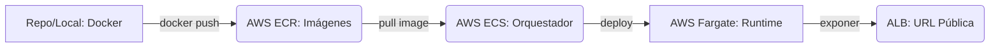

# 🐳 Caso J: Dockerización (Empaquetado Industrial)

[]()
[]()

Empaquetar aplicaciones es el estándar de la industria moderna. Este caso demuestra cómo crear un entorno aislado y reproducible que corre igual en tu PC que en AWS ECS/Fargate, ahora con una interfaz **Premium Dashboard**.

---

## ✨ Evolución: De API JSON a Dashboard Premium
Originalmente, este caso entregaba una respuesta JSON técnica. Lo hemos evolucionado a una experiencia visual completa que incluye:
*   **Interfaz Glassmorphism**: Diseño moderno con efectos de cristal y desenfoque.
*   **Micro-animaciones**: Fondo dinámico con blobs animados y transiciones suaves.
*   **Estado en Tiempo Real**: Tarjetas que muestran la salud del contenedor y datos vivos de la API interna.
*   **Arquitectura Híbrida**: Servidor Express que gestiona tanto el contenido estático como los endpoints de datos.

---
## 🔍 Claridad Conceptual: Docker vs AWS

Es común preguntarse: **¿Por qué Docker está en el repositorio y no "dentro" de AWS?**

### 1. Docker como el "Plano de Construcción" (Blueprint)
El archivo `Dockerfile` y el código viven en tu repositorio para garantizar la **Portabilidad e Isolation**. Docker no es un servicio de nube, es un lenguaje estándar que dice: *"No importa dónde corra esto, estas son las instrucciones para construir mi app"*.

### 2. AWS como la "Fábrica" de Ejecución
AWS ofrece servicios que **entienden** este estándar Docker:
*   **ECR (Elastic Container Registry):** Actúa como el almacén. Tu PC (con Docker instalado) "empuja" la imagen construida aquí.
*   **ECS Cluster:** Es el director de la orquesta. No tiene servidores fijos; él decide cuándo y dónde ejecutar tus contenedores.
*   **Fargate:** Es el "servidor invisible" que pone el CPU y la RAM.

### 🔄 Flujo de Comunicación


---

## 🎯 Objetivo
Portabilidad absoluta. Aprenderás a escribir Dockerfiles eficientes, gestionar registros de imágenes (**ECR**) y desplegar servicios que pueden escalar de forma masiva.

## 🛠️ Stack Tecnológico
- **Docker**: Motor de contenedores.
- **Estado**: ✅ COMPLETADO
- **Nivel**: Intermedio-Avanzado
- **Tiempo estimado**: 45-60 minutos
- **Tecnologías**: Docker, AWS ECS (Fargate), AWS ECR, Terraform

## 🔗 Ver Demo en Vivo
[Aplicación Desplegada en ECS](http://vladimir-case-j-alb-683413891.us-east-2.elb.amazonaws.com/)

## 🚀 Uso rápido
```bash
# 1. Login en ECR (Token expira en 12h)
aws ecr get-login-password --region us-east-2 | docker login --username AWS --password-stdin 689978033715.dkr.ecr.us-east-2.amazonaws.com

# 2. Construir imagen
docker build -t vladimir-case-j-repo .

# 3. Etiquetar con URL del registro
docker tag vladimir-case-j-repo:latest 689978033715.dkr.ecr.us-east-2.amazonaws.com/vladimir-case-j-repo:latest

# 4. Subir imagen
docker push 689978033715.dkr.ecr.us-east-2.amazonaws.com/vladimir-case-j-repo:latest

# 5. Actualizar servicio (Forzar nuevo despliegue)
aws ecs update-service --cluster vladimir-case-j-cluster --service vladimir-case-j-service --force-new-deployment --region us-east-2
```

## ☁️ Despliegue en AWS (Terraform)

Este caso incluye una configuración completa de Terraform para desplegar en ECS Fargate con Load Balancer.

### Prerrequisitos
- AWS CLI configurado (`aws configure`)
- Terraform instalado

### Comandos Disponibles
Simplemente ejecuta desde la raíz del proyecto:

1. **Inicializar Infraestructura**:
   ```bash
   make case-j-init
   ```

2. **Crear Recursos (ECR, ECS, ALB)**:
   ```bash
   make case-j-apply
   ```

3. **Subir Imagen a ECR**:
   (Solo funciona después de aplicar la infraestructura, ya que necesita la URL del repo)
   ```bash
   make docker-login
   make docker-push
   ```

4. **Verificar**:
   Obtén la URL del balanceador de carga:
   ```bash
   cd caso-j-containers-ecs/terraform && terraform output alb_dns_name
   ```

5. **Destruir Todo**:
   ¡Importante para evitar costos!
   ```bash
   make case-j-destroy
   ```


## 🔗 Enlaces Relacionados
- ⬅️ **[Regresar al Roadmap Principal](../README.md)**
- 🚀 **[Guía de Instalación](../docs/INSTALL.md)**
- ☁️ **[Guía Paso a Paso AWS](./AWS_PASO_A_PASO.md)**
