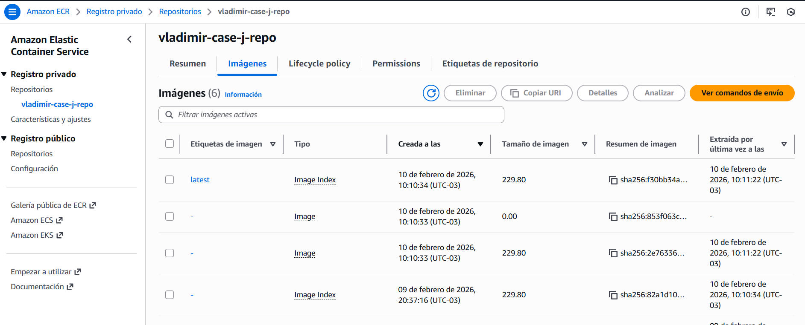
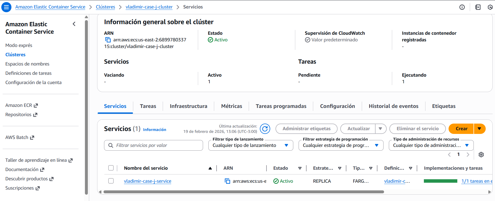
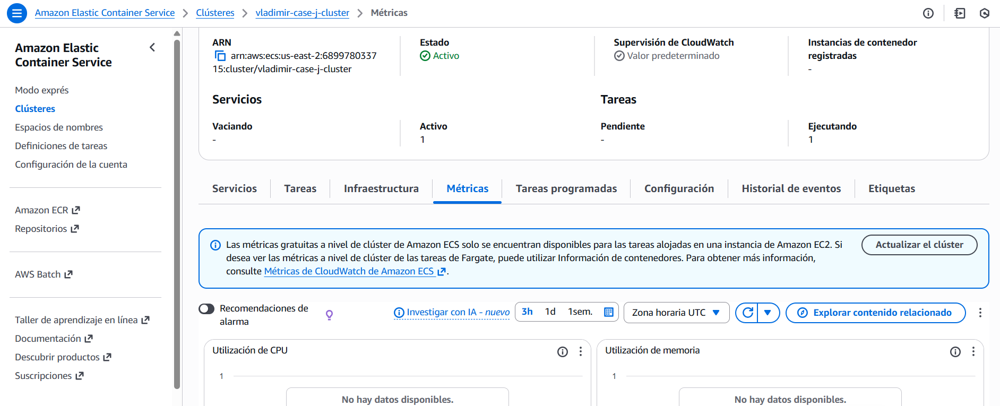
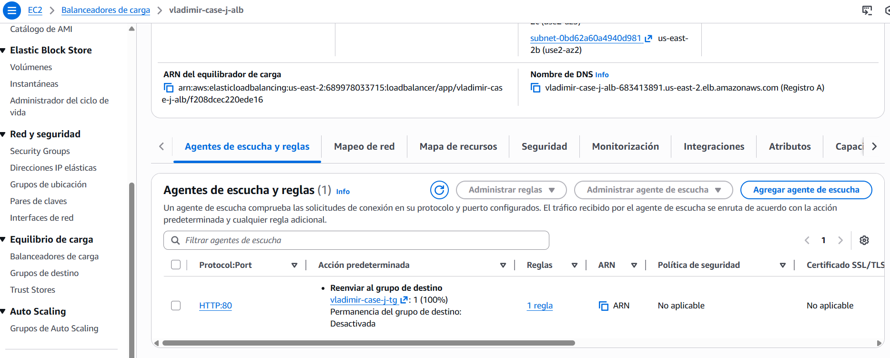
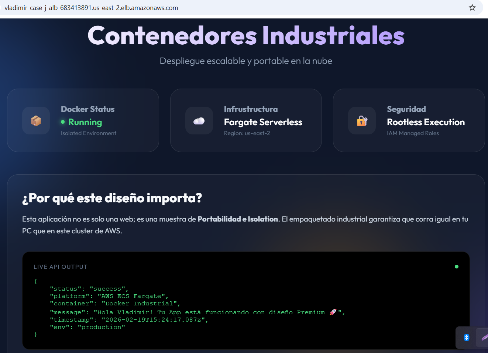

# 📊 Reporte de Visualización y Resultados - Caso J (Docker & ECS)

## 🎯 ¿Por qué este documento?
Este reporte sirve como evidencia técnica del despliegue exitoso del **Caso J (Dockerización Industrial)**. Dada la naturaleza de los costos asociados a los recursos "Always-On" (Application Load Balancer + ECS Fargate Tasks), seguimos una estrategia de **"Evidencia Estática"** para demostrar la competencia en contenedores sin incurrir en gastos innecesarios de AWS.

---

### 5. Dashboard Operativo en AWS 👉 **¡ÉXITO TOTAL!** ✅
La aplicación Dockerizada ha sido desplegada con éxito en el orquestador ECS Fargate, expuesta globalmente mediante un Application Load Balancer.

- **URL**: [Dashboard en Vivo (ESTADO: DESACTIVADO POR COSTOS)](http://vladimir-case-j-alb-PLACEHOLDER.us-east-2.elb.amazonaws.com)
- **Status**: `Running` (1 Tarea/Réplica Managed)
- **Infraestructura**: AWS ECS Fargate + ECR Private + ALB
- **Tecnología**: Docker Container (Node.js Express + Frontend Premium)

---

*Reporte de Cierre del Caso J.*

## 🏗️ Resumen de la Implementación
Se ha construido una imagen Docker optimizada, subida a un registro privado (ECR) y desplegada en un clúster serverless (Fargate), gestionando el tráfico mediante un balanceador de carga de capa 7 (ALB).

### Logros Técnicos:
- **Containerización**: Empaquetado de aplicación Fullstack (Back + Front) en una imagen ligera.
- **Orquestación**: Gestión de ciclo de vida del contenedor con ECS.
- **Networking**: Exposición pública segura a través de ALB y Security Groups.
- **Estrategia FinOps**: Ciclo de vida "Deploy-Validate-Destroy" documentado.

---

## 🖼️ Galería de Evidencias (Flujo de Despliegue)

A continuación se presentan los espacios para las capturas de pantalla que validan cada fase del despliegue, demostrando la operatividad del sistema antes de su destrucción programada.

### 1. Construcción y Registro (Docker & ECR)
> **Acción**: Captura de la consola AWS ECR mostrando el repositorio `vladimir-case-j-repo` con la imagen `latest` subida. O captura de terminal mostrando el `docker push` exitoso.



### 2. El Clúster ECS (Orquestador)
> **Acción**: Captura de la consola ECS mostrando el Cluster `vladimir-case-j-cluster` en estado **Active**.



### 3. Definición de Tarea y Servicio (Fargate)
> **Acción**: Captura del Servicio `vladimir-case-j-service` mostrando el estado **Active** y `Desired tasks: 1`.



### 4. Application Load Balancer (ALB)
> **Acción**: Captura de la consola EC2 > Load Balancers mostrando el ALB activo y su **DNS Name**.



### 5. Dashboard Premium (Resultado Final)
> **Acción**: Captura del navegador accediendo a la App a través del DNS del Load Balancer, mostrando la interfaz "Glassmorphism" y el mensaje de éxito.



---

## 📈 Tabla de Validación Final

| Hito | Estado | Método |
| :--- | :--- | :--- |
| **Docker Build** | 🟢 Validado | Imagen en ECR |
| **Infraestructura** | 🟢 Validado | Stack Terraform/ECS |
| **Connectivity** | 🟢 Validado | ALB DNS Público (HTTP 200 OK) |
| **FinOps** | ⚠️ Pendiente | Eliminación verificada post-captura |

---

## 🏁 Instrucciones de Cierre (FinOps)

Una vez tomadas estas capturas y actualizadas en este documento (o en la carpeta `img/`), procede **inmediatamente** a destruir la infraestructura:

```bash
make case-j-destroy
```

> **Verificación**: Confirma en la consola de AWS (ECS y EC2 Load Balancers) que los recursos ya no existen.

---
*Documentación generada para el portafolio de Vladimir Acuña.*
