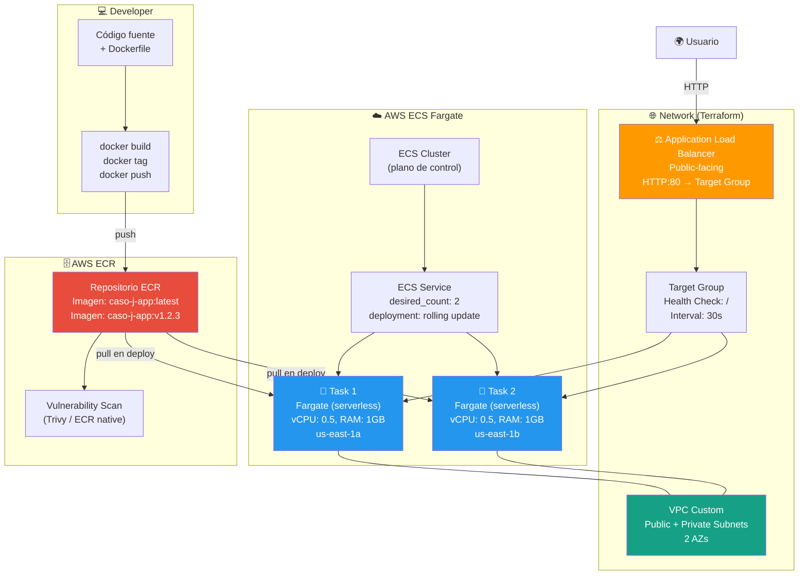
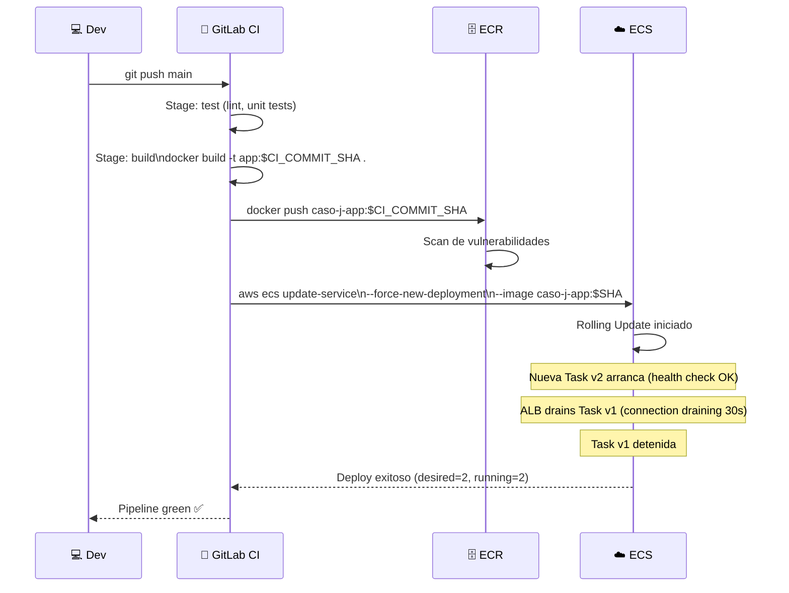
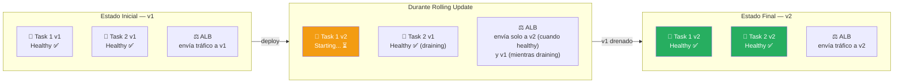
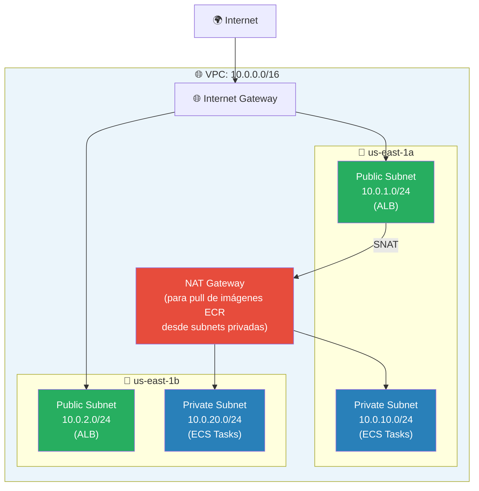

# 🏗️ Arquitectura: Caso J — Dockerización con ECS Fargate + ECR

> **Stack**: Docker + ECS Fargate + ECR + ALB + Terraform
> **Nivel**: 9 — Contenedores en Producción

---

## 🎯 Visión General

El Caso J representa el salto de "código en mi máquina" a **contenedores industriales en AWS**.
ECS Fargate elimina la gestión de servidores (EC2): tú defines cuántos recursos necesita tu
contenedor, AWS se encarga de dónde y cómo correrlo.

El patrón `ECR → ECS Fargate → ALB` es el estándar de facto en empresas que migran de
on-premise a AWS sin querer gestionar Kubernetes directamente.

---

## 📐 Diagrama 1: Arquitectura Completa ECS Fargate

---

## 📐 Diagrama 2: Pipeline CI/CD Docker → ECR → ECS

---

## 📐 Diagrama 3: Rolling Update (Zero Downtime Deploy)

---

## 📐 Diagrama 4: VPC y Modelo de Red (Terraform)

---

## 🔧 Componentes y Roles

| Componente | Servicio | Función | Diferencia con Serverless |
|---|---|---|---|
| **Registry** | ECR | Almacena imágenes Docker privadas | Lambda usa código directo, no imagen |
| **Orquestador** | ECS | Decide dónde corren los contenedores | Lambda es auto-orquestado |
| **Cómputo** | Fargate | Corre contenedores sin gestionar EC2 | Lambda: runtime managed |
| **LB** | ALB | Distribuye tráfico a tasks saludables | API GW en serverless |
| **IaC** | Terraform | VPC + ECS + ECR + ALB declarativo | SAM para serverless |

---

## 🔗 Referencias

- [README del Caso J](../README.md)
- [Guía Paso a Paso AWS](../AWS_PASO_A_PASO.md)
- [Reporte de Resultados](../VISUALIZATION.md)
