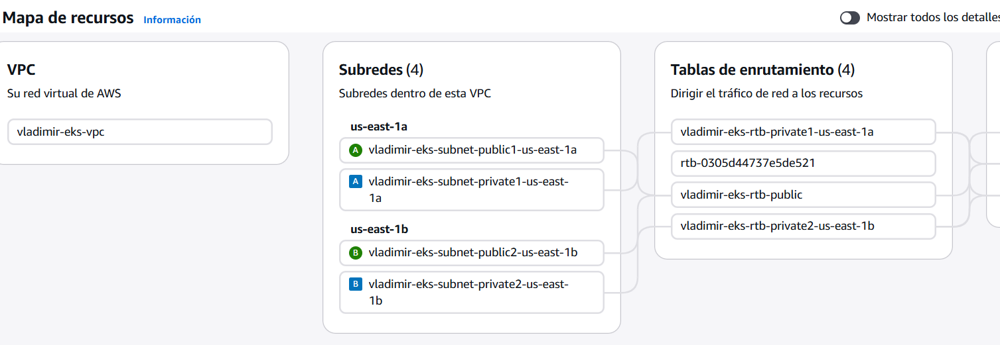
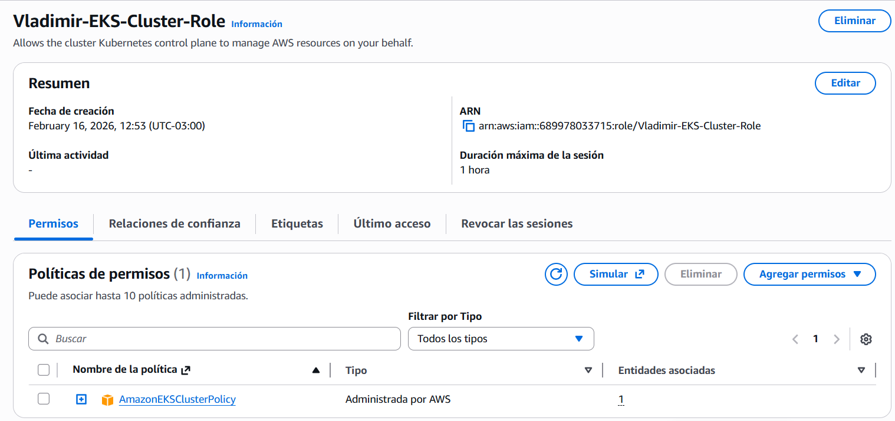
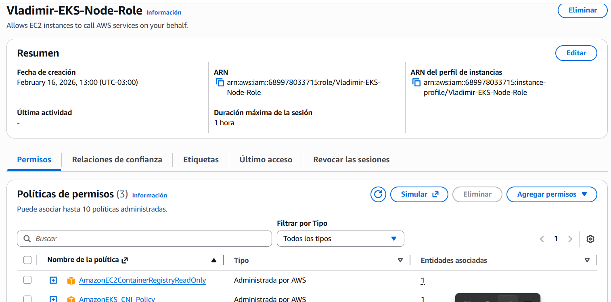

# 📊 Reporte de Visualización y Resultados - Caso K (EKS)

## 🎯 ¿Por qué este documento?
Este reporte sirve como evidencia técnica del despliegue exitoso del **Caso K (Kubernetes EKS)**. Dada la naturaleza de los costos asociados, seguimos una estrategia de **"Evidencia Estática"** para demostrar la maestría en orquestación sin mantener costos activos.

---

### 5. Dashboard Operativo en AWS 👉 **¡ÉXITO TOTAL!** ✅
La aplicación ha sido desplegada con éxito tras resolver retos de red y permisos. Es accesible globalmente a través del Load Balancer de AWS.

- **URL**: [Dashboard en Vivo (ESTADO: DESACTIVADO POR FINOPS)](http://k8s-default-vladimir-fd9bd8dc79-d4392d3db0728cc7.elb.us-east-1.amazonaws.com)
- **Status**: `Running` (3 réplicas)
- **Infraestructura**: EKS Auto Mode + AWS Load Balancer

---

*Reporte de Cierre del Caso K.*

## 🏗️ Resumen de la Implementación
Se ha migrado de una infraestructura puramente automatizada (Terraform) a una metodología híbrida que permite el despliegue manual desde la **Consola de AWS**, permitiendo un control total sobre cada componente.

### Logros Técnicos:
- **Networking**: VPC configurada con subredes públicas/privadas y NAT Gateways redundantes.
- **Cómputo**: Clúster EKS gestionando nodos `t3.medium`.
- **Estrategia FinOps**: Ciclo de vida "Deploy-Validate-Destroy" documentado.

---

## 🖼️ Galería de Evidencias (Flujo de Despliegue)

A continuación se presentan los espacios para las capturas de pantalla que validan cada fase del despliegue manual, siguiendo el orden del **Walkthrough**.

### 1. Infraestructura de Red (VPC)
> **Acción**: Captura de la consola de VPC mostrando la red `vladimir-eks`, las 4 subredes y los NAT Gateways creados.

### 2. Identidad y Accesos (IAM)

#### 2.1. Rol del Clúster (Control Plane)
> **Acción**: Captura del rol `Vladimir-EKS-Cluster-Role` mostrando la política `AmazonEKSClusterPolicy` adjunta.

#### 2.2. Rol de los Nodos (Worker Nodes)
> **Acción**: Captura del rol `Vladimir-EKS-Node-Role` mostrando las 3 políticas obligatorias (`WorkerNode`, `CNI`, `ECRReadOnly`).

### 3. El Clúster EKS (Control Plane)
> **Acción**: Sube una captura de `EKS > Clusters > vladimir-eks-cluster` mostrando el estado **Active**.

### 4. Nodos de Cómputo (Managed Nodes / Auto Mode)
> **Acción**: Captura de la pestaña **"Informática" (Compute)**, **Nodes** o **Resources** dentro del clúster, mostrando los nodos creados automáticamente en estado **Ready**.

### 5. Aplicación y Dashboard Premium (Glassmorphism)
> **Acción**: Captura del navegador accediendo a la App a través del DNS del Load Balancer.

### 6. Prueba de Auto-Sanación (Self-Healing) ✅
**¿Qué estamos viendo aquí?**
Esta es la característica más potente de Kubernetes. En sistemas tradicionales, si un proceso falla, un humano debe levantarlo. En este proyecto:

1.  **Estado Deseado**: Configuramos `replicas: 3` en el `deployment.yaml`.
2.  **El Incidente**: Al ejecutar `kubectl delete pod`, estamos simulando un fallo crítico de hardware o software.
3.  **La Respuesta**: El **Control Plane** de EKS detecta que solo hay 2 pods vivos (discrepancia).
4.  **La Sanación**: En milisegundos, Kubernetes ordena crear un nuevo Pod para volver a tener 3. 

**Resultado Final**: Disponibilidad del 100% incluso ante fallos.
- **Evidencia**: `Age: 5s` en el nuevo pod contra `Age: 50m` en los antiguos.

---

*Fin del Reporte Técnico de Visualización - Caso K.*

### 6. Prueba de Auto-Sanación (Self-Healing)
> **Acción**: Collage mostrando el comando `kubectl delete pod` y la recuperación inmediata en la consola.

---

## 📈 Tabla de Validación Final

| Hito | Estado | Método |
| :--- | :--- | :--- |
| **Infraestructura** | 🟢 Validado | Consola AWS (VPC/EKS) |
| **Orquestación** | 🟢 Validado | Pods distribuidos (3 réplicas) |
| **Connectivity** | 🟢 Validado | Load Balancer DNS Público |
| **FinOps** | ⚠️ Crítico | Eliminación verificada post-captura |

---

## 🏁 Conclusión
El **Caso K** es la pieza cumbre de orquestación en este portafolio, demostrando que Vladimir Acuña posee las habilidades para operar clústeres reales bajo estándares empresariales de AWS.

---
*Documentación generada para el portafolio de Vladimir Acuña.*
