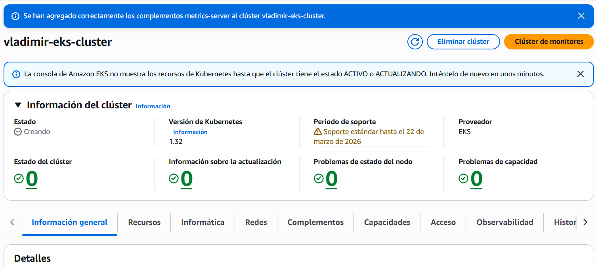
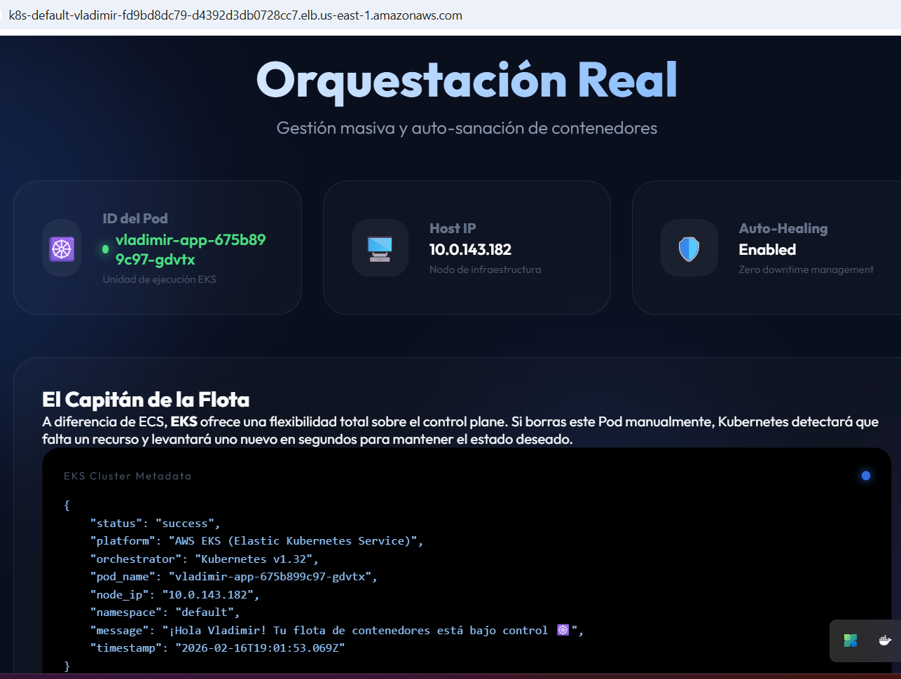
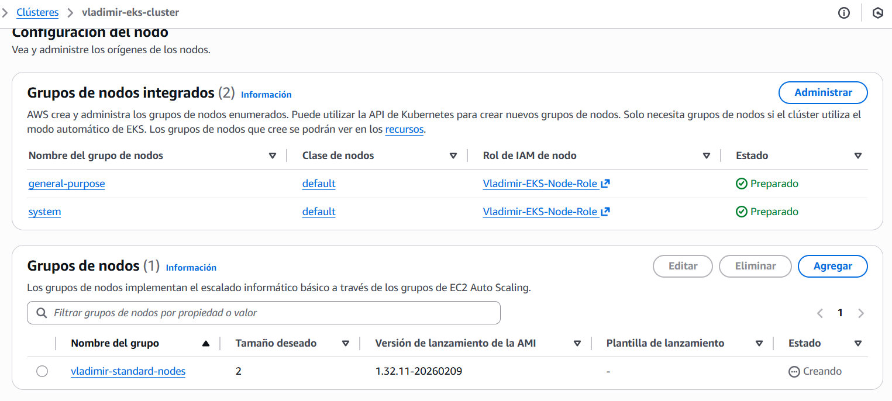
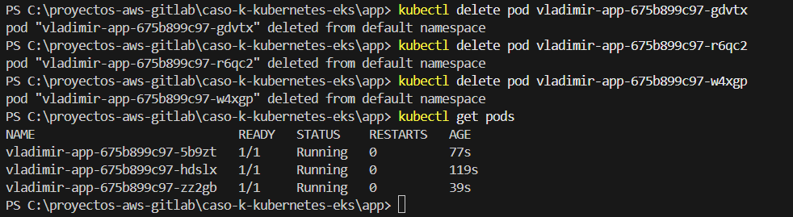

# 📊 Reporte de Visualización y Resultados - Caso K (EKS)

## 🎯 ¿Por qué este documento?
Este reporte sirve como evidencia técnica del despliegue exitoso del **Caso K (Kubernetes EKS)**. Dada la naturaleza de los costos asociados, seguimos una estrategia de **"Evidencia Estática"** para demostrar la maestría en orquestación sin mantener costos activos.

---

## 🏗️ Resumen de la Implementación
Se ha migrado de una infraestructura puramente automatizada (Terraform) a una metodología híbrida que permite el despliegue manual desde la **Consola de AWS**, permitiendo un control total sobre cada componente.

### Logros Técnicos:
- **Networking**: VPC configurada con subredes públicas/privadas y NAT Gateways redundantes.
- **Cómputo**: Clúster EKS gestionando nodos `t3.medium`.
- **Estrategia FinOps**: Ciclo de vida "Deploy-Validate-Destroy" documentado.

---

## 🖼️ Galería de Evidencias (Para Cargar)

A continuación se presentan los espacios para las capturas de pantalla que validan la implementación manual. 

### 1. Estado del Clúster EKS
> **Acción**: Sube una captura de `EKS > Clusters > vladimir-eks-cluster` mostrando el estado **Active**.

### 2. Dashboard Premium (Glassmorphism)
> **Acción**: Sube una captura de la interfaz web accediendo a través del DNS del Load Balancer.
> **Ruta**: `EC2 > Load Balancers`.

### 3. Salud de los Nodos (Managed Node Groups)
> **Acción**: Captura de la pestaña **Compute** dentro del clúster, mostrando los nodos en estado **Ready**.

### 4. Prueba de Auto-Sanación (Self-Healing)
> **Acción**: Collage mostrando el comando `kubectl delete pod` y cómo Kubernetes levanta uno nuevo instantáneamente en la consola de AWS.

---

## 📈 Tabla de Validación Final

| Hito | Estado | Método |
| :--- | :--- | :--- |
| **Infraestructura** | 🟢 Validado | Consola AWS (VPC/EKS) |
| **Orquestación** | 🟢 Validado | Pods distribuidos (3 réplicas) |
| **Connectivity** | 🟢 Validado | Load Balancer DNS Público |
| **FinOps** | ⚠️ Crítico | Eliminación verificada post-captura |

---

## 🏁 Conclusión
El **Caso K** es la pieza cumbre de orquestación en este portafolio, demostrando que Vladimir Acuña posee las habilidades para operar clústeres reales bajo estándares empresariales de AWS.

---
*Documentación generada para el portafolio de Vladimir Acuña.*
