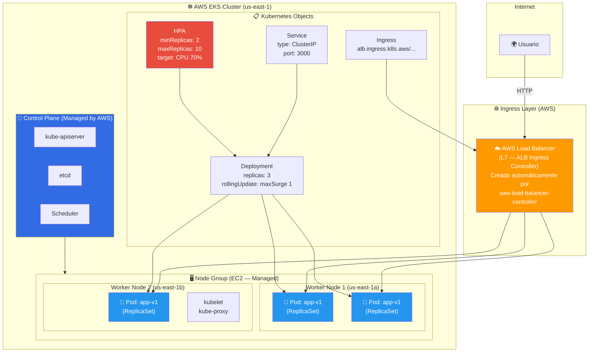
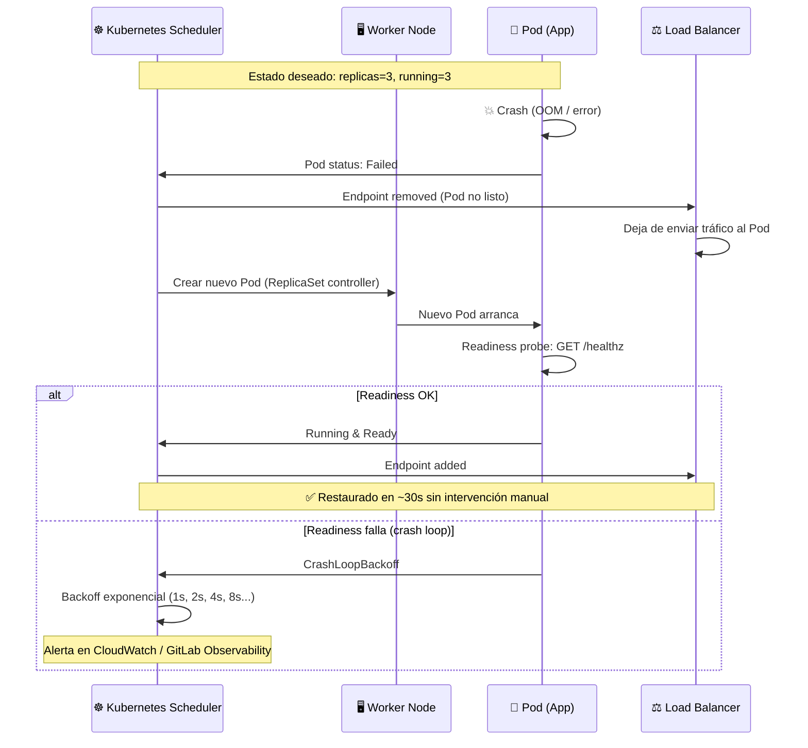
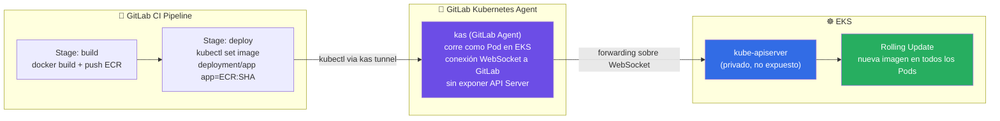
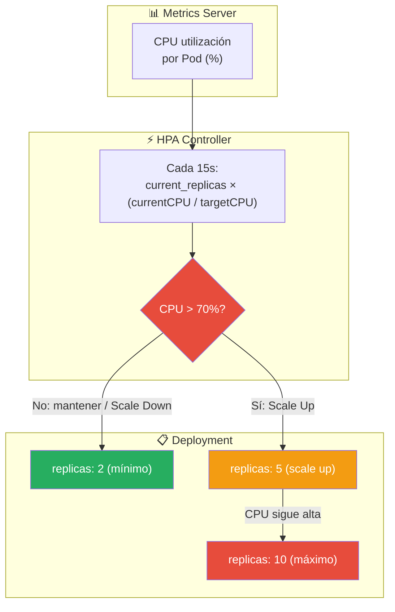

# 🏗️ Arquitectura: Caso K — Kubernetes en AWS (EKS)

> **Stack**: AWS EKS + kubectl + YAML Manifests + Terraform + GitLab K8s Agent
> **Nivel**: 10 — Orquestación Enterprise

---

## 🎯 Visión General

El Caso K es el nivel más complejo de orquestación de contenedores: **Kubernetes gestionado
en AWS**. EKS (Elastic Kubernetes Service) entrega el plano de control managed, y tú gestionas
los worker nodes y los manifests YAML.

¿Por qué Kubernetes sobre ECS? Cuando necesitas: scheduling avanzado, self-healing declarativo,
portable multi-cloud, Helm para apps complejas, o tu empresa ya tiene skills de K8s.

---

## 📐 Diagrama 1: Arquitectura EKS Completa

---

## 📐 Diagrama 2: Self-Healing Automático (K8s vs. ECS)

---

## 📐 Diagrama 3: Deploy GitLab → EKS (GitLab Kubernetes Agent)

---

## 📐 Diagrama 4: Horizontal Pod Autoscaler (HPA)

---

## 🔧 Componentes y Roles

| Componente | Servicio | Función | vs. ECS Fargate |
|---|---|---|---|
| **Control Plane** | EKS | kube-apiserver gestionado por AWS | ECS: plano de control nativo AWS |
| **Worker Nodes** | EC2 (Managed Node Group) | Corren los Pods | Fargate: sin gestión de EC2 |
| **Scheduling** | kube-scheduler | Ubica Pods según recursos/affinity | ECS: scheduling más simple |
| **Ingress** | AWS LBC (ALB) | L7 routing con anotaciones K8s | ECS: ALB via Terraform |
| **Self-Healing** | ReplicaSet + K8s Controllers | Reinicia Pods caídos automáticamente | ECS: también lo hace |
| **Escalamiento** | HPA + Cluster Autoscaler | Pods y Nodes escalan automáticamente | ECS: Service auto scaling |

---

## 💰 Nota de Costos (Importante)

> EKS cobra **$0.10 USD/hora** (~$72/mes) solo por el plano de control,
> más los EC2 de los worker nodes, NAT Gateway y LB.
>
> Estrategia: **Deploy → Validar → `terraform destroy`** inmediatamente.
> Ver [VISUALIZATION.md](../VISUALIZATION.md) para resultados sin mantener el cluster activo.

---

## 🔗 Referencias

- [README del Caso K](../README.md)
- [Guía Paso a Paso AWS](../AWS_PASO_A_PASO.md)
- [Reporte de Resultados](../VISUALIZATION.md)
