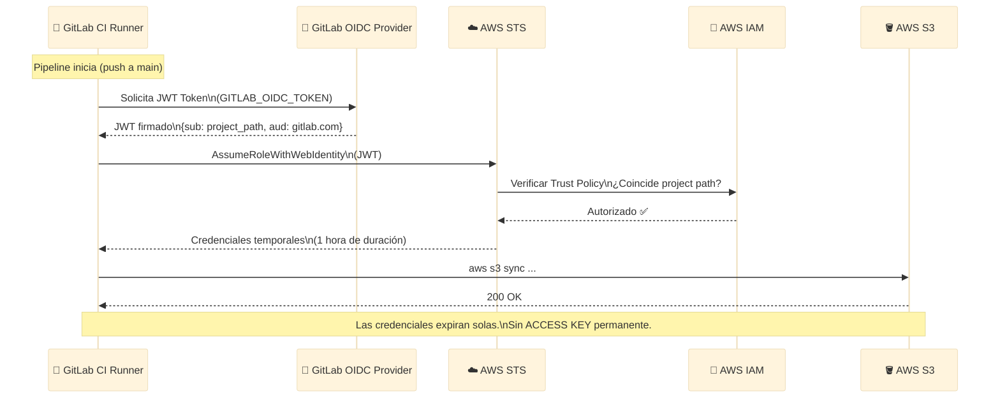
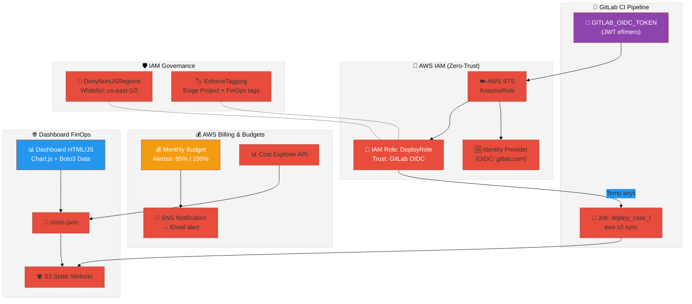
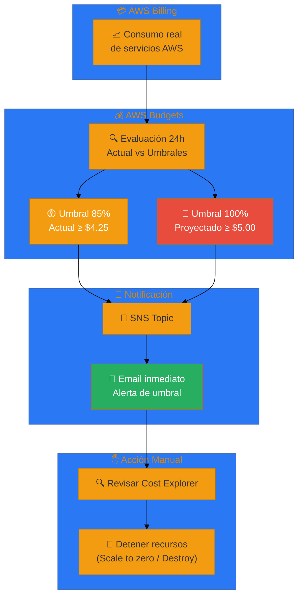
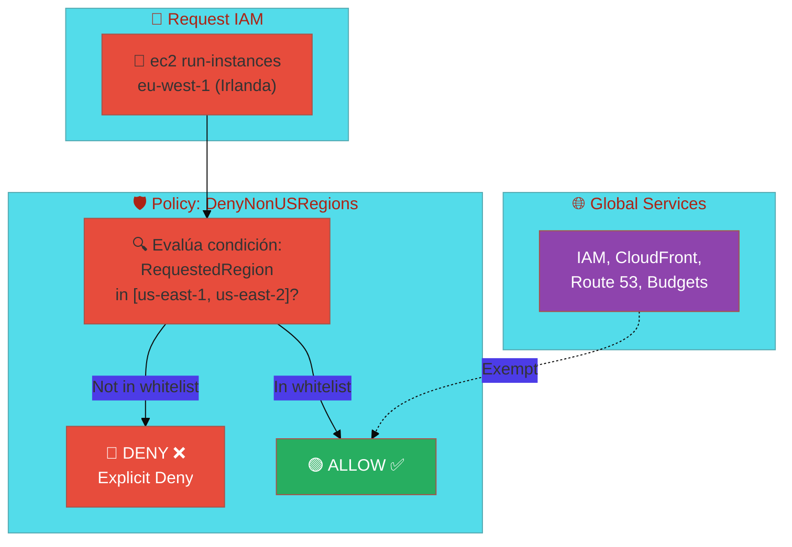

# 🏗️ Arquitectura: Caso L — FinOps & Governance (Excelencia Operativa)

> **Stack**: AWS Budgets + GitLab OIDC + IAM Governance + S3 Hosting
> **Nivel**: 11 — Gobernanza Financiera y Zero-Trust

---

## 🎯 Visión General

El Caso L no construye una nueva aplicación: **asegura y gobierna todo lo que ya existe**.
Es la capa de madurez que toda organización necesita antes de escalar:

1. **¿Cuánto gastas?** → AWS Budgets con alertas proactivas.
2. **¿Quién tiene acceso?** → IAM Governance con privilegio mínimo y restricciones de región.
3. **¿Cómo se autentica el pipeline?** → OIDC (Zero-Trust, sin keys permanentes).

---

## 📐 Diagrama 1: Autenticación OIDC — GitLab CI → AWS (Zero-Trust)

---

## 📐 Diagrama 2: Arquitectura Completa FinOps & Governance

---

## 📐 Diagrama 3: Flujo de Alertas de Presupuesto

---

## 📐 Diagrama 4: IAM Governance (Restricción de Región)

---

## 🔧 Componentes y Roles

| Componente | Servicio | Función |
|---|---|---|
| **OIDC IdP** | IAM Identity Provider | Permite a GitLab asumir roles sin keys permanentes |
| **Rol de Deploy** | IAM Role | Credenciales temporales (1h) para el pipeline |
| **Presupuesto** | AWS Budgets | Alerta antes de que el gasto se dispare |
| **Dashboard** | S3 + HTML/JS | Visualiza costos reales en tiempo casi-real |
| **Datos** | Cost Explorer + Budgets API | Fuente de verdad de costos (via boto3) |
| **Governance** | IAM Policies | Bloquea regiones no autorizadas y exige tags |

---

## 💡 Por Qué OIDC es Superior a IAM Keys Permanentes

| Característica | IAM Keys (Caso B) | OIDC (Caso L) |
|---|---|---|
| **Duración** | Permanentes (hasta rotar) | 1 hora (expire automático) |
| **Almacenamiento** | Variable GitLab (riesgo) | No se almacena nada |
| **Auditoría** | Difícil de rastrear | CloudTrail muestra `role-session-name: GitLabRunner-{pipelineId}` |
| **Rotación** | Manual (olvidable) | No aplica (son efímeras) |
| **Blast radius** | Keys filtradas = cuenta comprometida | Token expirado = inútil |

---

## 🔗 Referencias

- [README del Caso L](../README.md)
- [Guía Paso a Paso AWS](../AWS_PASO_A_PASO.md)
- [Ver Demo en Vivo](http://finops-vladimir-portfolio-case-l.s3-website.us-east-2.amazonaws.com)
