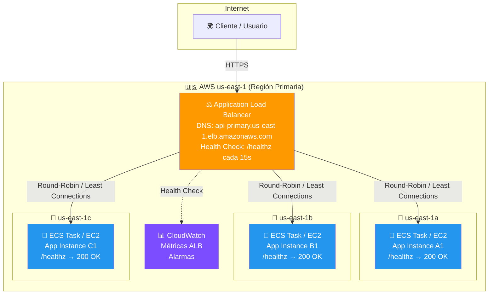
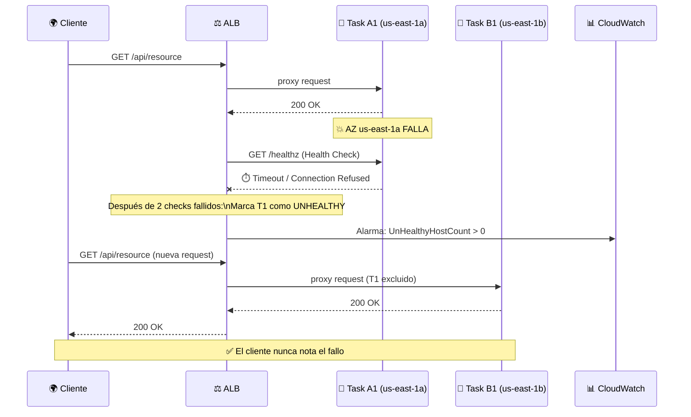
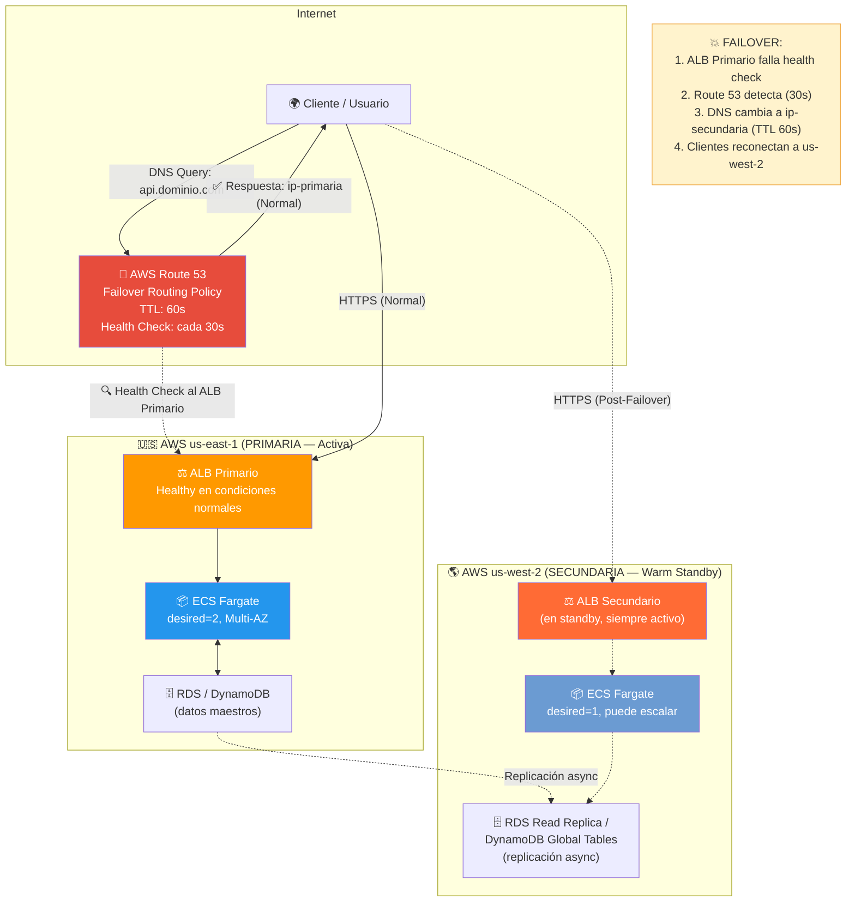
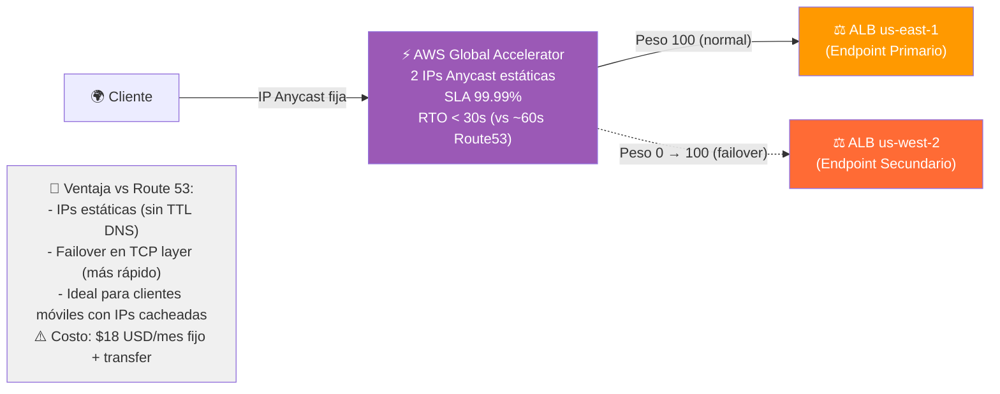

# 🏗️ Arquitectura Objetivo: Caso M (Resiliencia & Failover)

> **Estado**: Documentación de arquitectura futura. No hay recursos AWS desplegados en Fase 0.
> Esta arquitectura es la **meta** que se implementará en Fases 1-3.

---

## 🎯 Visión General

La arquitectura del Caso M se basa en el principio de **eliminar todo Single Point of Failure
(SPOF)** en capas:

1. **Capa de Cómputo**: Múltiples instancias/tasks distribuidos en múltiples AZs.
2. **Capa de Red/Balanceo**: ALB distribuyendo tráfico entre AZs con health checks activos.
3. **Capa de DNS/Routing Global**: Route 53 con Failover Routing Policy detectando fallos
   regionales y redirigiendo automáticamente.
4. **Capa de Datos**: (Fase 3) Replicación cross-region de datos críticos.

---

## 📐 Diagrama 1: Arquitectura Multi-AZ (Nivel A — Fase 1)

### Flujo de Fallo Multi-AZ

---

## 📐 Diagrama 2: Arquitectura Multi-Región (Nivel B — Fase 2)

---

## 📐 Diagrama 3: Opción Alternativa con Global Accelerator (Fase 3)

---

## 📊 Consideraciones RTO/RPO

### Definiciones (en lenguaje simple)

| Término | Definición | Analogía |
|---|---|---|
| **RTO** (Recovery Time Objective) | ¿Cuánto tiempo puede estar caído el sistema? | "Cuánto tardamos en reabrir la tienda tras un corte de luz" |
| **RPO** (Recovery Point Objective) | ¿Cuántos datos podemos perder? | "¿Desde qué hora del último backup volvemos?" |

### Objetivos por Fase

| Fase | Escenario | RTO Objetivo | RPO Objetivo | Mecanismo |
|---|---|---|---|---|
| **Fase 1** | Caída de 1 instancia/task | < 30 segundos | 0 (stateless) | ALB Health Check + auto-replace |
| **Fase 1** | Caída de 1 AZ completa | < 60 segundos | 0 (stateless) | ALB Multi-AZ routing |
| **Fase 2** | Caída de región primaria | < 120 segundos | < 5 minutos | Route 53 Failover + Warm Standby |
| **Fase 3** | Caída de región (con GA) | < 30 segundos | < 1 minuto | Global Accelerator + DynamoDB Global Tables |

### Por Qué Esto Importa para un Reclutador

> **Un SRE mide su éxito en segundos, no en horas.**
>
> La diferencia entre un sistema con RTO de 4 horas (restaurar desde backup) y uno con RTO de
> 60 segundos (failover automático) es exactamente lo que separa un hobby project de un sistema
> que soporta millones de usuarios 24/7. Este caso demuestra el segundo.

---

## 🔧 Componentes de la Arquitectura

| Componente | Servicio AWS | Propósito | Costo Referencial |
|---|---|---|---|
| **Balanceo de Carga** | Application Load Balancer (ALB) | Distribuir tráfico entre AZs + health checks | ~$16/mes |
| **Cómputo** | ECS Fargate / EC2 ASG | Ejecutar la aplicación (sin estado) | ~$10-30/mes |
| **Imágenes** | ECR (Elastic Container Registry) | Almacenar imágenes Docker | Free Tier: 500MB |
| **DNS & Failover** | Route 53 | Resolución DNS + Failover automático | $0.50/zona + $0.75/HC |
| **Monitoreo** | CloudWatch | Métricas, alarmas, dashboards | Free Tier generoso |
| **IaC** | Terraform | Infraestructura reproducible | Gratis |
| **(Fase 3) Routing** | Global Accelerator | RTO < 30s, IPs estáticas | $18/mes + transfer |
| **(Fase 3) DB Global** | DynamoDB Global Tables | Replicación multi-región automática | Por uso |

---

## 🔗 Referencias

- [AWS Well-Architected: Reliability Pillar](https://docs.aws.amazon.com/wellarchitected/latest/reliability-pillar/)
- [Route 53 Failover Routing](https://docs.aws.amazon.com/Route53/latest/DeveloperGuide/routing-policy-failover.html)
- [ALB Health Checks](https://docs.aws.amazon.com/elasticloadbalancing/latest/application/target-group-health-checks.html)
- [AWS Global Accelerator](https://docs.aws.amazon.com/global-accelerator/latest/dg/what-is-global-accelerator.html)
- [DynamoDB Global Tables](https://docs.aws.amazon.com/amazondynamodb/latest/developerguide/GlobalTables.html)
