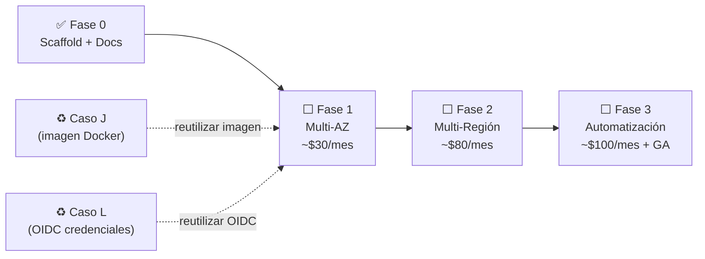

# 🗺️ Roadmap Detallado: Caso M (Resiliencia & Failover)

> Este roadmap complementa el [README del caso](../README.md) con criterios de entrada,
> estimaciones de esfuerzo y dependencias entre fases.

---

## Estado Actual: Fase 0 ✅

**Completado en esta iteración**:

- [x] Scaffold de carpeta `caso-m-resiliencia-failover/`.
- [x] `README.md` con propósito, comparativa, roadmap y DoD.
- [x] `docs/architecture.md` con diagramas Mermaid (Multi-AZ + Multi-Región + GA).
- [x] `docs/runbook-failover.md` con procedimientos de simulación y failback.
- [x] `docs/roadmap.md` (este archivo).
- [x] `infra/terraform/` — módulos skeleton (sin `apply`).
- [x] `scripts/` — placeholders de simulación.
- [x] Entrada en `README.md` principal del repo.
- [x] Entrada en `ROADMAP.md` global.
- [x] Job CI `case_m_validate` (manual, `allow_failure: true`).

**No se ha tocado ningún recurso AWS en esta fase.**

---

## Fase 1: Multi-AZ en Región Única

### Criterio de Entrada

- Presupuesto aprobado para ~$30-50 USD/mes (o modo "deploy & destroy" en horas).
- Imagen Docker de la aplicación disponible (puede reutilizarse del Caso J).
- Credenciales AWS configuradas (OIDC via GitLab CI, heredado del Caso L).

### Objetivo

Demostrar que la aplicación sobrevive la caída de **instancias individuales** y **AZs completas**
dentro de `us-east-1`, con **0 downtime observable desde el cliente**.

### Tareas

```markdown
- [ ] Completar módulo Terraform `modules/alb/` (listener, target group, health check).
- [ ] Completar módulo Terraform `modules/ecs-service/` (desired_count=2, spread AZ).
- [ ] Implementar endpoint `/healthz` en la app (retorna JSON con az/region/status).
- [ ] Ejecutar `terraform plan` → revisar → `terraform apply` en cuenta de lab.
- [ ] Ejecutar `scripts/check.sh` como baseline (100% éxito antes del drill).
- [ ] Ejecutar `scripts/drill-failover.sh --mode task` (bajar 1 task ECS).
- [ ] Capturar evidencia: screenshots CloudWatch + output de check.sh.
- [ ] Documentar RTO real medido en `VISUALIZATION.md`.
- [ ] Ejecutar `terraform destroy` para evitar costos continuos.
```

### Estimación de Esfuerzo

| Actividad | Esfuerzo |
|---|---|
| Completar Terraform + Apply | 2-4 horas |
| Ejecución del GameDay Multi-AZ | 1-2 horas |
| Documentación de resultados | 1 hora |
| **Total** | **4-7 horas** |

---

## Fase 2: Warm Standby Multi-Región + Route 53 Failover

### Criterio de Entrada

- Fase 1 completada y documentada.
- Dominio registrado (o Hosted Zone existente en Route 53).
- Presupuesto para ~$50-100 USD (o sesión GameDay de 2h).
- Módulos Terraform de Fase 1 funcionando.

### Objetivo

Demostrar que un fallo **regional completo** (us-east-1 cae) causa un failover automático hacia
`us-west-2` en menos de **120 segundos**, sin intervención manual.

### Tareas

```markdown
- [ ] Crear módulo Terraform `modules/route53-failover/` (HC + Failover Records).
- [ ] Replicar arquitectura de Fase 1 en provider `us-west-2` (Warm Standby, desired=1).
- [ ] Configurar TTL=60 en el registro Route 53 de la API.
- [ ] Actualizar `scripts/drill-failover.sh` para modo `--mode regional`.
- [ ] Ejecutar GameDay completo (ver runbook-failover.md, Sección 4).
- [ ] Medir y documentar RTO real.
- [ ] Ejecutar failback (Sección 5 del runbook).
- [ ] Post-mortem: completar checklist de Sección 6.
- [ ] `terraform destroy` en ambas regiones.
```

### Estimación de Esfuerzo

| Actividad | Esfuerzo |
|---|---|
| Terraform multi-región + Route 53 | 3-5 horas |
| GameDay Multi-Región | 2-3 horas |
| Post-mortem y documentación | 1-2 horas |
| **Total** | **6-10 horas** |

---

## Fase 3: Automatización GameDay + Observabilidad + (Opcional) ARC

### Criterio de Entrada

- Fase 2 completada con RTO < 120s demostrado.
- Tiempo disponible para inversión en automatización y observabilidad.

### Objetivo

Elevar el nivel del caso de "demuestra que funciona" a "demuestra que se opera en producción":

- GameDay automatizable con scripts parametrizados.
- Dashboards CloudWatch listos para la sesión.
- Evaluación de Global Accelerator o ARC como mejora del RTO.

### Tareas

```markdown
- [ ] CloudWatch Dashboard "Caso M: Resilience" (widgets de health, latencia, errores).
- [ ] Alarmas SNS para `UnHealthyHostCount > 0` y `HealthCheckStatus` cambios.
- [ ] Parametrizar `drill-failover.sh` (--mode, --duration, --target-az).
- [ ] Integrar AWS Fault Injection Simulator (FIS) para escenarios más reales.
- [ ] Evaluar Global Accelerator (costo vs. beneficio en RTO).
- [ ] Si se implementa GA: crear módulo Terraform y actualizar runbook.
- [ ] Documentar "Runbook Automatizado" para GameDay recurrente (trimestral).
```

### Estimación de Esfuerzo

| Actividad | Esfuerzo |
|---|---|
| CloudWatch Dashboards + Alarmas | 2-3 horas |
| Scripts automatizados + FIS | 4-6 horas |
| Global Accelerator (opcional) | 3-4 horas |
| **Total** | **9-13 horas** |

---

## 📌 Dependencias entre Fases



---

## 💡 Decisiones de Diseño Claves

| Decisión | Alternativa Descartada | Razón |
|---|---|---|
| Route 53 Failover (Fase 2) | Global Accelerator desde el inicio | GA cuesta $18/mes fijo. Route 53 es suficiente para portfolio. GA evaluar en Fase 3. |
| Warm Standby (no Active-Active) | Active-Active bi-regional | Active-Active requiere sincronización de datos en tiempo real. Mayor complejidad y costo. Warm Standby es el estándar mínimo para DR. |
| Terraform (no CDK) | AWS CDK | El repo ya usa Terraform en Casos C, J, K, L. Consistencia es más importante que la elección óptima. |
| TTL=60s en Route 53 | TTL=5s | TTL muy bajo aumenta costo de queries Route 53 y carga en resolvers. 60s es el balance adecuado para RTO < 120s. |

---

_Última actualización: 2026-03-05 | Estado: Fase 0 Completada_
