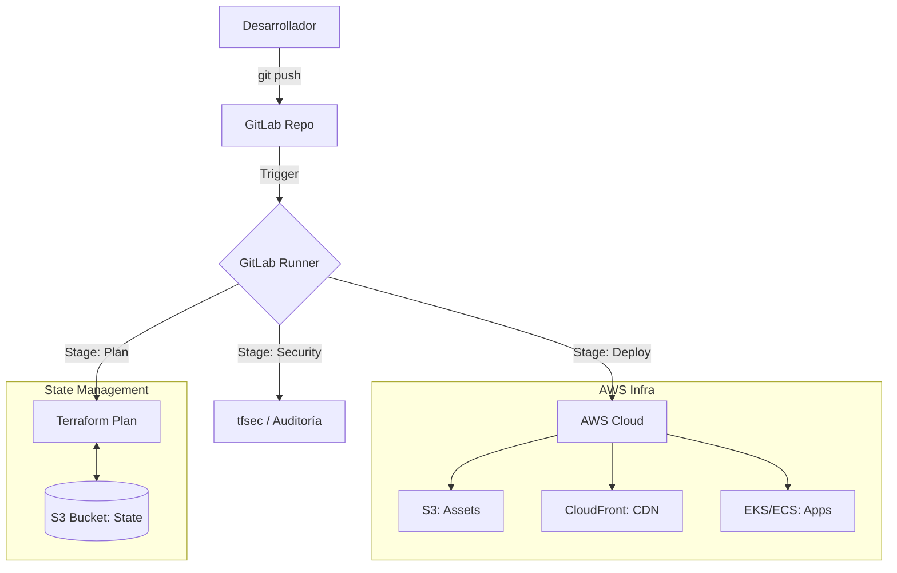

# 🏗️ Arquitectura del Sistema

Este documento describe la estructura técnica y el flujo de datos del proyecto Monorepo AWS-GitLab.

---

## 🛰️ Visión General
El proyecto utiliza una arquitectura de **Monorepo**, donde múltiples casos de uso (desde S3 estático hasta Kubernetes) coexisten y comparten herramientas de automatización.

##  diagrama Mermaid: Flujo de Despliegue

## 🐳 Cadena de Suministro de Imágenes (Docker)

A diferencia de los archivos estáticos, el código de aplicaciones empaquetadas sigue un flujo de **Contenerización Industrial**:

1.  **Construcción (Local/CI)**: El `Dockerfile` define el entorno. Se genera una imagen inmutable.
2.  **Registro (AWS ECR)**: La imagen se sube al registro privado de AWS.
3.  **Orquestación (AWS ECS)**: El clúster monitorea el estado deseado y extrae la imagen de ECR.
4.  **Ejecución (Fargate)**: La aplicación corre en infraestructura Serverless, aislada y escalable.

### ⚖️ ECS vs EKS: ¿Cuándo usar cada uno?
- **AWS ECS (Caso J)**: Ideal para equipos pequeños que buscan simplicidad y rapidez sin gestionar la complejidad de Kubernetes.
- **AWS EKS (Caso K)**: El estándar para aplicaciones que requieren portabilidad total, ecosistema nativo de Kubernetes (Helm, Operators) y control absoluto sobre la orquestación. Es la opción de "Nivel 10" por su curva de aprendizaje y potencia ilimitada.

---

## 🛠️ Stack Tecnológico
- **Infraestructura**: Terraform (IaC), AWS SAM, Kubernetes Manifests.
- **Servicios Cloud**: S3, CloudFront, Lambda, API Gateway, EKS, ECS.
- **Automatización**: Makefile, GitLab CI/CD, Docker (DevContainers).
- **Calidad**: ESLint, Prettier, HTMLHint, tfsec, gitleaks.

## 🔐 Estrategia de Seguridad
1.  **Auditoría Estática**: Escaneo automático de planos de infraestructura antes de cada cambio.
2.  **Manejo de Secretos**: Uso de variables enmascaradas en GitLab (Evolución recomendada: OIDC).
3.  **Privacidad**: Bloqueo de acceso público a buckets de S3 mediante OAC (Origin Access Control) en CloudFront.
