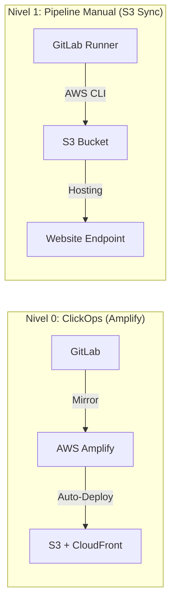
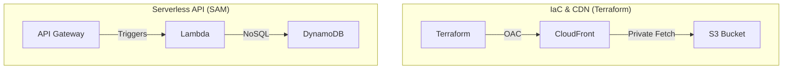
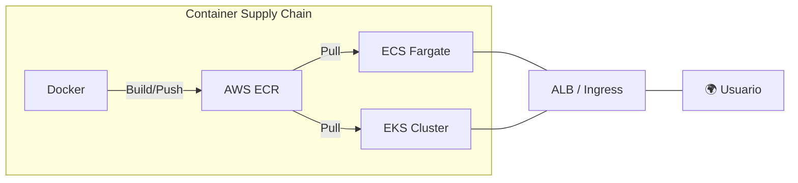
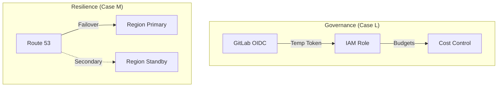

# 🏗️ Arquitectura Integral del Sistema: AWS-GitLab Monorepo

Este documento constituye la **fuente de verdad técnica** del repositorio. Describe la evolución desde fundamentos de hosting hasta arquitecturas empresariales de alta disponibilidad, unificando todos los casos de estudio.

---

## 🛰️ Visión Ejecutiva

El proyecto sigue una arquitectura de **Monorepo Evolutivo**, diseñado para demostrar la madurez de un Ingeniero Cloud a través de 5 niveles de complejidad. Cada nivel resuelve problemas específicos de escalabilidad, seguridad y costos utilizando el stack estándar de la industria.

### 🛡️ Pilares de Excelencia
- **IaC Primero**: Todo recurso en AWS tiene una definición declarativa (Terraform, SAM, YAML).
- **Security Left**: Auditoría estática y escaneo de secretos integrado en el pipeline.
- **Observabilidad**: Telemetría activa para toma de decisiones (FinOps y Resiliencia).
- **Zero Trust**: Identidades efímeras vía OIDC para despliegues seguros.

---

## 🗺️ Mapa de Evolución Arquitectónica

El sistema se divide en **Tiers de Madurez**, cada uno representando un hito tecnológico:

### 🟢 Tier 1: Fundamentos y Hosting Estático (Casos A, B)
*Enfoque: Velocidad de entrega y automatización básica.*

### 🔵 Tier 2: Infraestructura como Código y Serverless (Casos C, D)
*Enfoque: Reproducibilidad, CDN Profesional y Computación bajo demanda.*

### 🔴 Tier 3: Contenedores y Orquestación (Casos J, K)
*Enfoque: Portabilidad industrial y gestión de flotas.*

### 🟣 Tier 4: Gobernanza, FinOps y Resiliencia (Casos L, M)
*Enfoque: Excelencia operativa y continuidad de negocio.*

---

## 🏗️ Patrones de Diseño Estándar

### 1. Professional Deployment Tier (Job Splitting)
Para todos los casos de nivel IaC (C en adelante), implementamos un pipeline de 4 etapas:
- **Scan**: `tfsec` valida que no existan errores de seguridad graves.
- **Plan**: `terraform plan` genera un artefacto inmutable.
- **Apply**: `terraform apply` despliega el artefacto aprobado.
- **Invalidate**: Un job especializado con `aws-cli` limpia la caché de CloudFront para asegurar consistencia visual inmediata.

### 2. Zero-Trust Identity (OIDC)
Eliminamos el uso de llaves IAM permanentes (`ACCESS_KEY_ID`). Los pipelines se autentican mediante federación de identidades, obteniendo credenciales temporales que expiran automáticamente en 1 hora.

---

## ⚡ Comparativa de Runtimes (Cómputo)

| Criterio | Serverless (Lambda) | ECS Fargate | EKS (Kubernetes) |
|---|---|---|---|
| **Escalamiento** | Instantáneo (a cero) | Rápido (Rolling) | Industrial (HPA/CA) |
| **Costo** | Pago por uso | Por tiempo de Task | Fijo + Worker Nodes |
| **Complexidad** | Baja (Código puro) | Media (Docker) | Alta (Orquestación) |
| **Caso de Uso** | APIs ligeras, Eventos | Apps Industriales | Microservicios Masivos |

---

## 🛡️ Estrategia de Seguridad Integral

1.  **Protección de Datos**: Uso de **Origin Access Control (OAC)** para que los buckets de S3 sean 100% privados, permitiendo acceso solo a través de identidades firmadas de CloudFront.
2.  **Shift-Left Security**: La seguridad se valida en el commit inicial. Si `tfsec` detecta una configuración crítica, el código no llega a la fase de Plan.
3.  **Gobernanza de Región**: Políticas de SCP/IAM que restringen la creación de recursos fuera de las regiones autorizadas (`us-east-1`, `us-east-2`), minimizando el radio de impacto de posibles ataques o errores de configuración.

---

## 💰 Modelo FinOps

La arquitectura está optimizada para el **Costo $0** o **Costo Controlado**:
- **AWS Budgets**: Alarmas al alcanzar el 85% del presupuesto mensual ($5.00 USD).
- **TTL en DynamoDB**: Los datos temporales se auto-eliminan para evitar crecimiento infinito del almacenamiento.
- **Lifecycle Policies**: Los artefactos antiguos de S3 se mueven a clases de almacenamiento más baratas o se eliminan.

---

## 📈 Confiabilidad (Target RTO/RPO)

| Escenario | Mecanismo | RTO (Tiempo de Recuperación) | RPO (Punto de Recuperación) |
|---|---|---|---|
| **Fallo de Instancia** | ECS/K8s Restart | < 30 Segundos | 0 (Stateless) |
| **Caída de AZ** | Multi-AZ (ALB) | < 60 Segundos | 0 (Stateless) |
| **Caída de Región** | Route 53 Failover | < 120 Segundos | < 5 Minutos (Async) |

---

> **Mantenido por Vladimir Acuña — Stack de Ingeniería Cloud Senior.**
> *Este documento se actualiza con cada nuevo nivel de madurez alcanzado en el repositorio.*
