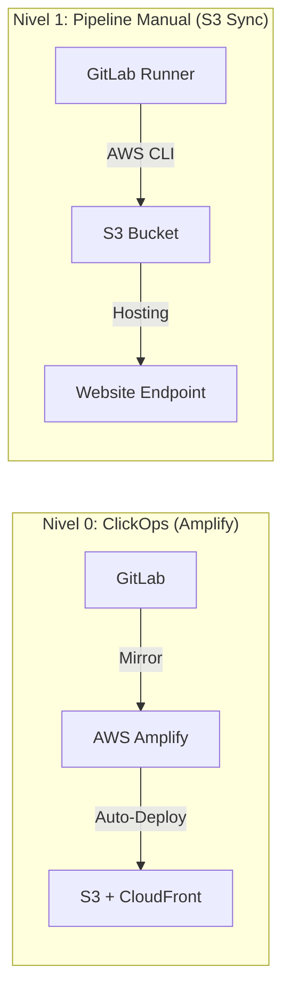
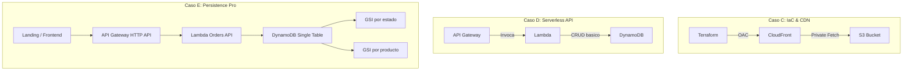
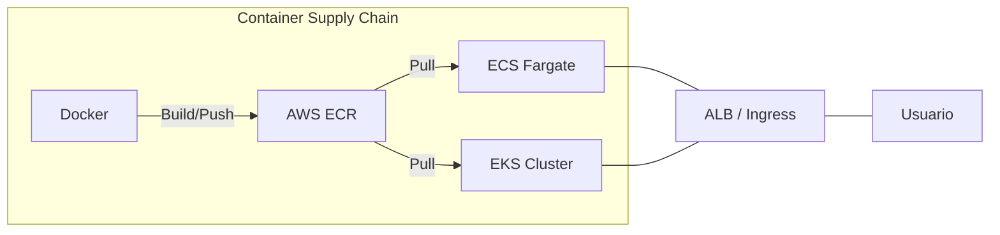
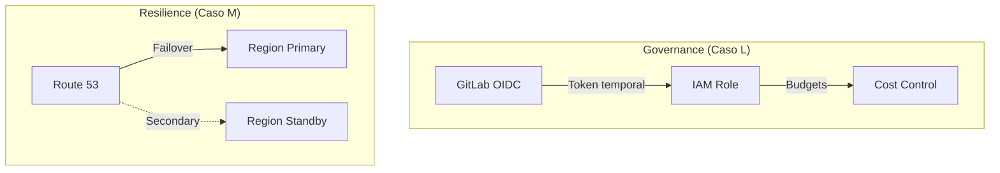

# Arquitectura Integral del Sistema: AWS-GitLab Monorepo

Este documento es la **fuente de verdad tecnica** del repositorio. Describe la evolucion desde hosting estatico hasta arquitecturas empresariales de alta disponibilidad, unificando los casos ya implementados y los siguientes niveles planificados.

---

## Vision ejecutiva

El proyecto sigue una arquitectura de **Monorepo Evolutivo**, disenado para demostrar la madurez de un Ingeniero Cloud a traves de niveles de complejidad crecientes. Cada nivel resuelve problemas concretos de escalabilidad, seguridad, persistencia, costos y continuidad operacional usando servicios administrados de AWS.

### Pilares de excelencia

- **IaC primero**: Todo recurso relevante en AWS tiene una definicion declarativa (`Terraform`, `SAM`, `YAML`).
- **Seguridad desde el inicio**: Analisis estatico, escaneo de secretos y minimizacion de privilegios.
- **Observabilidad y costo**: La operacion incluye FinOps, trazabilidad y decision tecnica orientada a impacto.
- **Evolucion por casos**: Cada carpeta agrega una capacidad nueva sobre la anterior, no un ejercicio aislado.

---

## Mapa de evolucion arquitectonica

### Tier 1: Fundamentos y hosting estatico (Casos A, B)

*Enfoque: velocidad de entrega y automatizacion basica.*

### Tier 2: IaC, serverless y persistencia NoSQL (Casos C, D, E)

*Enfoque: reproducibilidad, backend reactivo y modelado de datos por patrones de acceso.*

### Tier 3: Contenedores y orquestacion (Casos J, K)

*Enfoque: portabilidad industrial y gestion de flotas.*

### Tier 4: Gobernanza, FinOps y resiliencia (Casos L, M)

*Enfoque: excelencia operativa y continuidad de negocio.*

---

## Donde encaja el Caso E

El `Caso E` ya no es una idea futura: es el modulo de persistencia avanzada que demuestra como pasar de una API serverless simple a un backend con modelado NoSQL real.

Capacidades ya resueltas:

- tabla unica con `pk/sk`
- consultas por cliente, estado y producto sin scans completos
- escritura transaccional de `ORDER + AUDIT`
- landing publica en `/` para explicar y probar el caso
- despliegue validado en AWS en `us-east-2`

Esto lo convierte en el puente natural entre el `Caso D` y el futuro `Caso G`.

---

## Patrones de diseno estandar

### 1. Professional Deployment Tier

Para los casos de infraestructura y backend:

- **Scan**: validaciones de seguridad y consistencia
- **Plan/Build**: generacion de artefactos reproducibles
- **Deploy**: despliegue controlado en AWS
- **Validation**: smoke tests, links operativos y documentacion

### 2. Persistencia orientada a consultas

El `Caso E` introduce una decision clave del monorepo: en NoSQL se modela por preguntas de negocio, no por normalizacion relacional.

Patrones resueltos:

- cliente -> ordenes
- estado -> ordenes
- producto -> ordenes
- orden -> eventos de auditoria

### 3. Zero-Trust Identity

La direccion objetivo del repositorio es operar con credenciales efimeras via `OIDC`, reduciendo el uso de llaves IAM permanentes en pipelines y automatizaciones.

---

## Comparativa de runtimes

| Criterio | Lambda | ECS Fargate | EKS |
|---|---|---|---|
| **Escalamiento** | Instantaneo (a cero) | Rapido | Industrial |
| **Costo** | Pago por uso | Por tiempo de task | Base fija + nodos |
| **Complejidad** | Baja | Media | Alta |
| **Caso ideal** | APIs, eventos, integracion | Apps empaquetadas | Plataformas de microservicios |

---

## Estrategia de seguridad integral

1. **Proteccion de datos**: CloudFront privado con OAC donde aplica, y persistencia en servicios gestionados.
2. **Shift-left security**: El pipeline detecta errores de seguridad antes del despliegue.
3. **Gobernanza regional**: Preferencia operativa por `us-east-2`, con restricciones y control de costos.
4. **Segregacion por patron**: En `Caso E`, las lecturas operativas se resuelven por GSIs en vez de scans masivos.

---

## Modelo FinOps

La arquitectura prioriza costo bajo o controlado:

- `Lambda` para cargas esporadicas y costo cercano a cero cuando no hay trafico.
- `DynamoDB PAY_PER_REQUEST` para no sobredimensionar capacidad.
- `TTL` para expiracion automatica de datos temporales cuando corresponda.
- entornos de contenedores hibernados cuando no estan en uso.

---

## Confiabilidad

| Escenario | Mecanismo | RTO esperado | RPO esperado |
|---|---|---|---|
| Fallo de funcion | Reintento serverless / nueva invocacion | Segundos | 0 o minimo |
| Caida de AZ | Multi-AZ en servicios administrados | < 60 segundos | 0 o minimo |
| Caida de region | Route 53 Failover (futuro Caso M) | < 120 segundos | < 5 minutos |

---

> Mantenido por Vladimir Acuna.
> Este documento debe reflejar siempre el estado real del repositorio, no un estado aspiracional.
