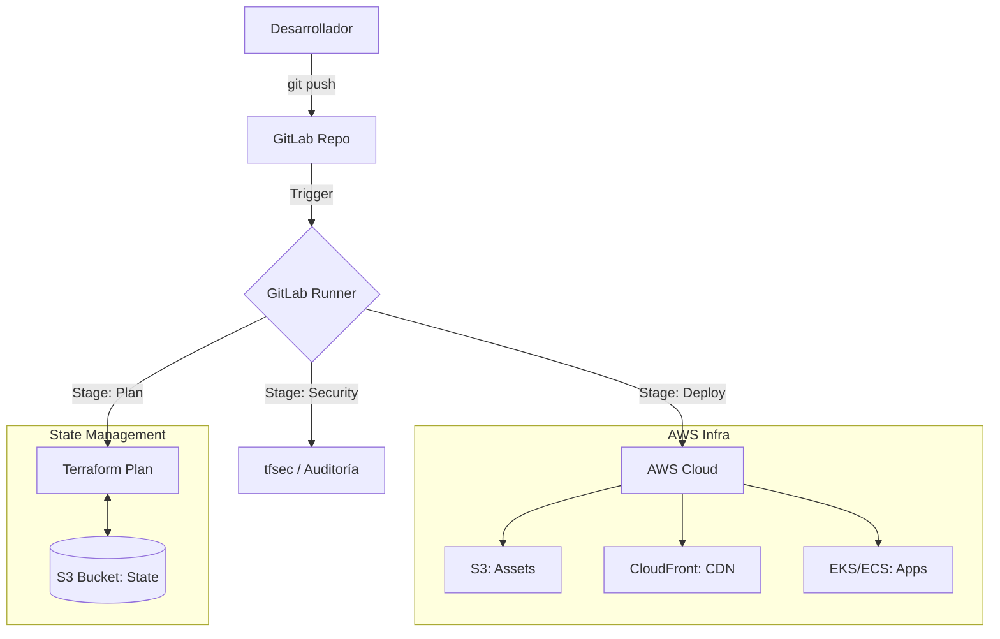

# 🏗️ Arquitectura del Sistema

Este documento describe la estructura técnica y el flujo de datos del proyecto Monorepo AWS-GitLab.

---

## 🛰️ Visión General
El proyecto utiliza una arquitectura de **Monorepo**, donde múltiples casos de uso (desde S3 estático hasta Kubernetes) coexisten y comparten herramientas de automatización.

##  diagrama Mermaid: Flujo de Despliegue

## 🛠️ Stack Tecnológico
- **Infraestructura**: Terraform (IaC), AWS SAM, Kubernetes Manifests.
- **Servicios Cloud**: S3, CloudFront, Lambda, API Gateway, EKS, ECS.
- **Automatización**: Makefile, GitLab CI/CD, Docker (DevContainers).
- **Calidad**: ESLint, Prettier, HTMLHint, tfsec.

## 🔐 Estrategia de Seguridad
1.  **Auditoría Estática**: Escaneo automático de planos de infraestructura antes de cada cambio.
2.  **Manejo de Secretos**: Uso de variables enmascaradas en GitLab (Evolución recomendada: OIDC).
3.  **Privacidad**: Bloqueo de acceso público a buckets de S3 mediante OAC (Origin Access Control) en CloudFront.
