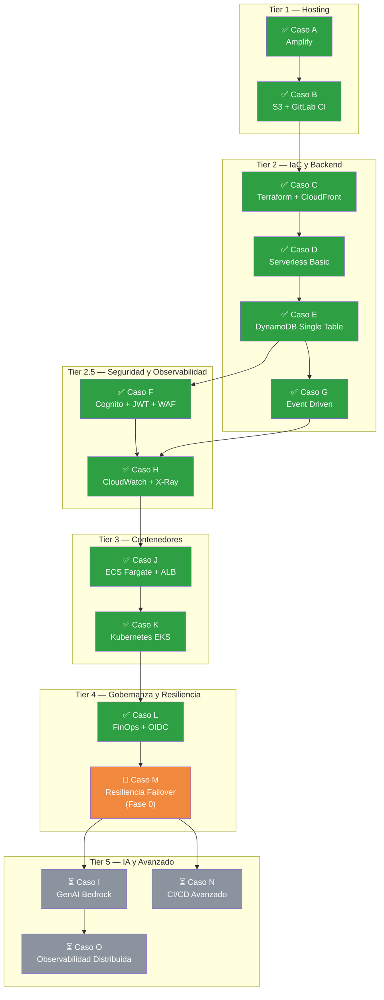
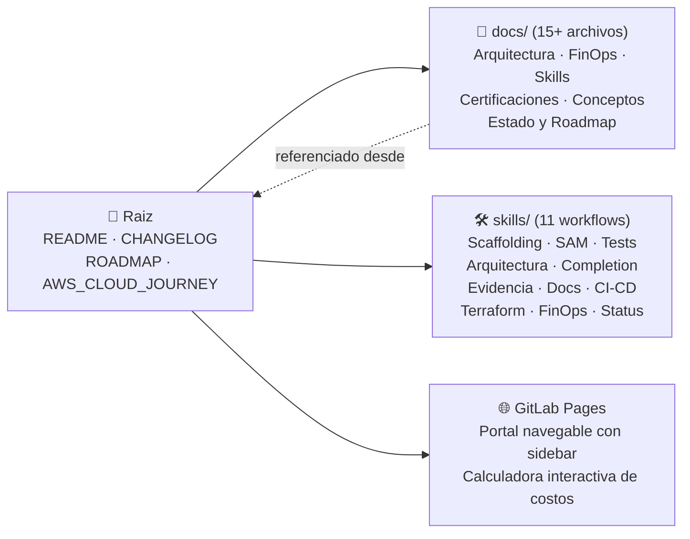
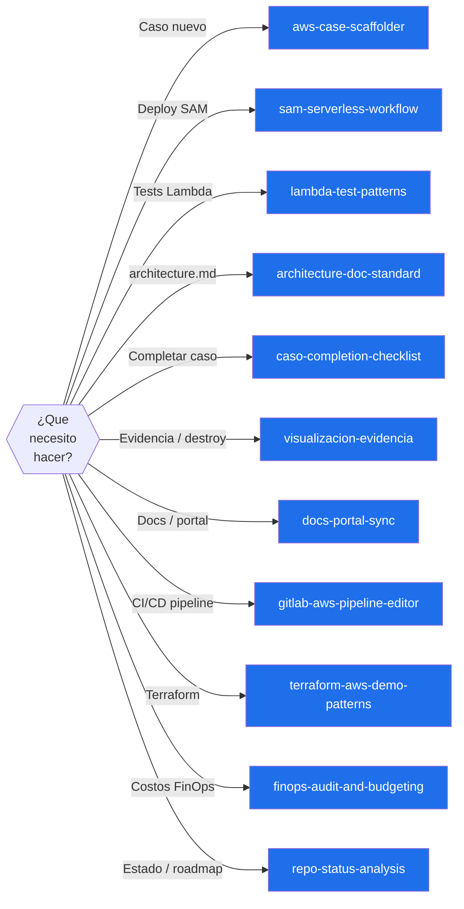
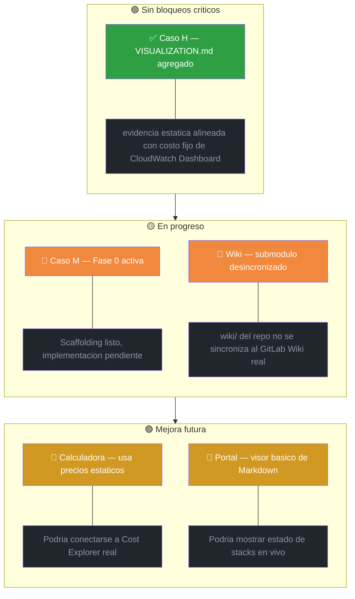
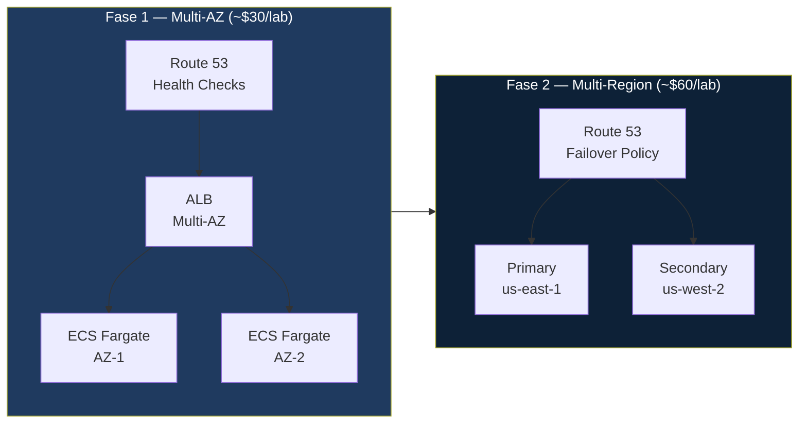
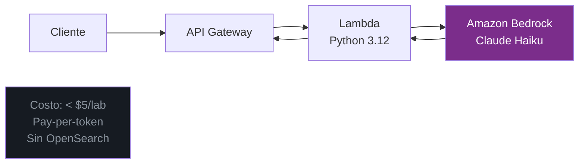
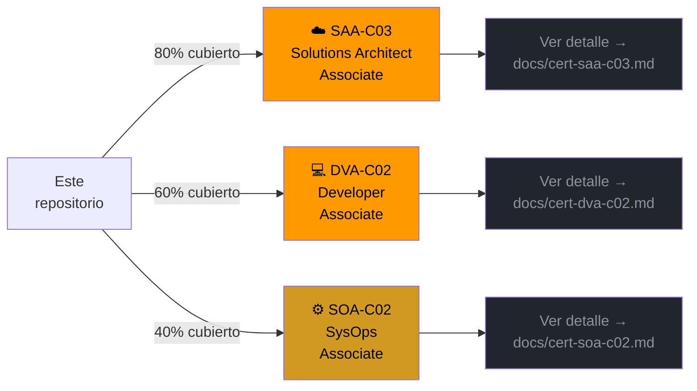

# 📍 Estado Actual y Hoja de Ruta

> **Autor:** Vladimir Acuna
> **Ultima actualizacion:** 20 de marzo de 2026
> **Proposito:** Radiografia del repositorio — que hay, que falta, que viene, en que orden.

---

## Estado general

```
Madurez técnica:     ████████░░  80%  — 11/~13 casos core completados
Documentación:       █████████░  90%  — completa, actualizada, navegable
Skills y flujos:     █████████░  95%  — 11 skills cubren todos los workflows
FinOps:              ████████░░  80%  — falta conectar datos reales en calculadora
Evidencia visual:    ██████████  100%  — Casos H, J y K con reportes de evidencia
Casos futuros:       ████░░░░░░  40%  — M en Fase 0, I proyectado
```

---

## Mapa de progresion de casos



---

## Lo que esta solido hoy

### Casos completados (11)

| Caso | Nombre | Tecnologia principal | Demo / Evidencia |
|---|---|---|---|
| A | AWS Amplify | Amplify Hosting | Demo en vivo |
| B | S3 + GitLab CI | S3 Website + CI/CD | Demo en vivo |
| C | Terraform + CloudFront | Terraform IaC + CDN | Demo en vivo |
| D | Serverless Basic | Lambda + API GW + DynamoDB | Demo en vivo |
| E | DynamoDB Persistence | Single Table + GSI + Transacciones | Demo en vivo |
| F | Security First | Cognito + JWT Authorizer + WAF | Demo en vivo |
| G | Event Driven | EventBridge + SQS + DLQ + SNS | Demo en vivo |
| H | Observability | CloudWatch + X-Ray + Dashboard IaC | Reporte de evidencia |
| J | Contenedores ECS | Docker + ECR + Fargate + ALB | Reporte de evidencia |
| K | Kubernetes EKS | EKS + kubectl + Terraform | Reporte de evidencia |
| L | FinOps Governance | Budgets + OIDC + Cost Explorer | Demo en vivo |

### Infraestructura de documentacion



### Sistema de skills (11)



---

## Lo que esta pendiente o incompleto

### Gaps actuales



---

## Mejoras futuras — ordenadas por impacto

### Prioridad Alta

#### 1. Caso M Fase 1 — Resiliencia Multi-AZ



Estrategia: deploy → validar failover real → destroy. Prerequisito: Caso K completado.

#### 2. Caso I — GenAI Bedrock (sin RAG)



Claude Haiku via Bedrock en Lambda. Costo < $5 por laboratorio. **Sin OpenSearch Serverless** (minimo $350/mes — evitar).

---

### Prioridad Media

#### 3. Portal GitLab Pages mejorado

Estado actual vs estado futuro:

| Capacidad | Hoy | Futuro |
|---|---|---|
| Ver docs markdown | ✅ | ✅ |
| Calcular costos | ✅ (estatico) | ✅ (Cost Explorer real) |
| Estado de stacks | ❌ | ✅ via Lambda + API |
| CI status badges | ❌ | ✅ via GitLab API |
| Smoke test results | ❌ | ✅ desde artefactos CI |

#### 4. Calculadora de costos con datos reales

Conectar la calculadora de GitLab Pages a un endpoint Lambda que lea AWS Cost Explorer y devuelva el gasto real del mes. El Caso L ya tiene OIDC configurado — la infraestructura de autenticacion existe.

#### 5. Script de deploy-evidence-destroy automatizado

Para casos J y K, un script bash interactivo que:
1. Hace `terraform apply`
2. Espera confirmacion del usuario (las capturas)
3. Hace `terraform destroy` automaticamente tras confirmacion
4. Genera el resumen de costos del lab en el VISUALIZATION.md

---

### Prioridad Baja / Largo plazo

#### 6. Caso N — CI/CD avanzado

Pipelines multi-stage con ambientes reales (dev/staging/prod), deployment protection rules, revisiones de PR como gates de despliegue. Completaria el stack DevOps del repositorio.

#### 7. Caso O — Observabilidad distribuida

Trazas X-Ray entre multiples Lambdas en cadena, dashboards operacionales complejos, alertas con integracion externa. Prerequisito: Caso M completado.

#### 9. Ruta hacia certificacion AWS



Cada certificacion tiene su propio documento con dominios, temas requeridos y cobertura exacta por caso:
- 📄 [SAA-C03 — Solutions Architect Associate](cert-saa-c03.md): 80% cubierto — la más cercana
- 📄 [DVA-C02 — Developer Associate](cert-dva-c02.md): 60% cubierto — fuerte en Lambda y CI/CD
- 📄 [SOA-C02 — SysOps Associate](cert-soa-c02.md): 40% cubierto — requiere M y O para completar

---

## Tabla consolidada de mejoras

| # | Mejora | Prioridad | Esfuerzo | Costo lab | Prerequisito |
|---|---|---|---|---|---|
| 1 | Caso M Fase 1 Multi-AZ | 🔴 Alta | 1-2 dias | ~$30 | Caso K ✅ |
| 2 | Caso I GenAI Bedrock | 🔴 Alta | 1 dia | < $5 | Caso H ✅ |
| 3 | Portal mejorado (estado stacks) | 🟡 Media | 1 dia | $0 | Caso L ✅ |
| 4 | Calculadora con Cost Explorer real | 🟡 Media | 1 dia | $0 | Caso L ✅ |
| 5 | Script deploy-evidence-destroy | 🟡 Media | 2-3 horas | $0 | J ✅, K ✅ |
| 6 | Caso N CI/CD avanzado | 🟢 Baja | 2-3 dias | $0 | Todos anteriores |
| 7 | Caso O Observabilidad distribuida | 🟢 Baja | 2-3 dias | < $5 | Caso M |
| 8 | Ruta certificacion AWS | 🟢 Baja | Estudio paralelo | $300 (examen) | Ninguno |

---

## Proxima sesion recomendada

```
1. Ejecutar las capturas reales del Caso H con el nuevo VISUALIZATION.md y cerrar con `make case-h-destroy`
2. Comandos SAM del Caso F            ← pendiente de la sesion anterior
3. Planificar Caso M Fase 1           ← siguiente nivel tecnico
```

---

*Documento generado el 20 de marzo de 2026 — refleja el estado real del repositorio tras cerrar la evidencia estatica del Caso H y sincronizar la documentacion visible.*
