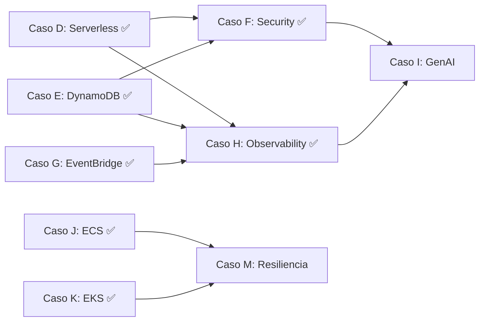

# 📊 Análisis de Casos PROYECTADO — Complejidad & Costos

> **Repositorio**: `proyectos-aws-gitlab` | **Última actualización**: 2026-03-17
> **Casos en scope**: F (Security), H (Observability), I (GenAI), M (Resiliencia)

---

## 🗺️ Estado de Partida

| Caso | Nombre | Estado Real | Scaffold existente |
|---|---|---|---|
| **F** | Security First (Cognito + WAF) | ✅ COMPLETADO | SAM + Lambda + tests + docs |
| **H** | Observability (CloudWatch + X-Ray) | ✅ COMPLETADO | SAM + Lambda + tests + docs |
| **I** | GenAI Bedrock | Solo README (~1KB) | ❌ Vacío |
| **M** | Resiliencia & Failover | Fase 0 completa | ✅ Docs + IaC skeletons |

---

## ⚙️ Análisis de Complejidad

> **Eje de complejidad**: Número de servicios AWS involucrados × profundidad de integración × superficie de configuración manual.

| Caso | Servicios AWS | Integración con casos existentes | Nuevos conceptos | **Score (1–10)** |
|---|---|---|---|---|
| **H — Observability** | CloudWatch, X-Ray, SNS | ✅ Alta — se monta sobre D, E, G (Lambdas ya existentes) | Dashboards, Traces, Alarms | **3 / 10** |
| **F — Security** | Cognito, WAF, IAM (avanzado) | 🟡 Media — requiere proteger endpoints ya existentes | User Pools, JWT, WebACL, MFA | **5 / 10** |
| **M — Resiliencia** | ALB, ECS Fargate, Route 53, CloudWatch, NAT GW | 🟡 Media — reutiliza patrón del Caso J (ECS) | Multi-AZ, Failover DNS, Health Checks, GameDay | **7 / 10** |
| **I — GenAI** | Bedrock, Lambda, API GW, S3, OpenSearch Serverless | ✅ Parcial — Lambda ya conocida | RAG, Embeddings, LangChain, Prompt Engineering | **8 / 10** |

### Detalle por caso

#### 🟢 Caso H — Baja complejidad

- CloudWatch Dashboards: configuración declarativa (JSON/YAML).
- X-Ray: añadir SDK a Lambdas ya existentes + activar tracing.
- Sin infraestructura nueva persistente (solo métricas y logs).
- **Riesgo técnico**: Bajo. El mayor reto es diseñar dashboards útiles.

#### 🔵 Caso F — Complejidad media

- Cognito User Pools tiene curva de aprendizaje en flujo de tokens JWT.
- WAF requiere entender reglas administradas vs. personalizadas.
- Integración con API Gateway de casos D/E para proteger endpoints.
- **Riesgo técnico**: Medio. La complejidad está en el flujo de autenticación E2E.

#### 🟠 Caso M — Complejidad alta estructural

- Dos regiones AWS activas simultáneamente (`us-east-1` + `us-west-2`).
- Terraform multi-región implica providers aliased y módulos reutilizables.
- Requiere dominio en Route 53 (Failover Routing + Health Checks).
- NAT Gateway obligatorio para tráfico de salida en subnets privadas.
- **Riesgo técnico**: Alto estructural, pero ya tiene scaffold documentado (Fase 0 ✅).

#### 🔴 Caso I — Complejidad máxima

- Amazon Bedrock requiere habilitación manual por región y modelo.
- RAG = Bedrock Knowledge Base + OpenSearch Serverless (**mínimo $350 USD/mes**).
- LangChain en Lambdas: gestión de dependencias y cold starts elevados.
- **Riesgo técnico**: Alto técnico + alto de costos no controlados.

---

## 💰 Análisis de Costos AWS (Precios reales 2025)

> Estimaciones para un portafolio de demostración (tráfico bajo, destruir tras validar).

| Caso | Componente | Costo / mes si está activo | Costo real demo (levantar → validar → destruir) |
|---|---|---|---|
| **H** | CloudWatch Dashboard (1 custom) | $3.00 | ~$0.10 (pocas horas) |
| **H** | X-Ray traces (free tier: 100K/mes) | $0.00 | **$0.00** |
| **H** | Alarmas CloudWatch (10 free) | $0.00 | **$0.00** |
| **H** | **TOTAL CASO H** | **~$3–5 / mes** | **< $1 demo** |
| | | | |
| **F** | Cognito Lite (10K MAUs free) | $0.00 | **$0.00** |
| **F** | WAF WebACL | $5.00 / mes | ~$0.35 (2 días) |
| **F** | WAF Custom Rules (x2) | $2.00 / mes | ~$0.15 |
| **F** | WAF Requests (<1M) | <$0.60 | ~$0.05 |
| **F** | **TOTAL CASO F** | **~$7–10 / mes** | **< $2 demo** |
| | | | |
| **M** | ALB (1 región) | ~$16.00 / mes | ~$2 GameDay (3h) |
| **M** | ALB (2 regiones) | ~$32.00 / mes | ~$4 GameDay (3h) |
| **M** | ECS Fargate (2 tasks) | ~$15.00 / mes | ~$1 GameDay |
| **M** | NAT Gateway ⚠️ | ~$65.00 / mes | ~$8 GameDay |
| **M** | Route 53 Hosted Zone | ~$0.50 / mes | $0.50 (obligatorio) |
| **M** | Route 53 Health Checks (x2) | ~$1.50 / mes | ~$0.15 GameDay |
| **M** | **TOTAL CASO M — Fase 1 (Multi-AZ)** | **~$95+ / mes** | **~$12–15 GameDay** |
| **M** | **TOTAL CASO M — Fase 2 (Multi-Región)** | **~$160+ / mes** | **~$25–30 GameDay** |
| | | | |
| **I** | Bedrock Claude 3 Haiku (on-demand) | Variable por uso | ~$0.50–2 demo |
| **I** | Lambda (incluido free tier) | $0.00 | **$0.00** |
| **I** | OpenSearch Serverless (RAG completo) | **~$350 / mes mínimo** | ⚠️ Evitar — usar alternativa |
| **I** | S3 Knowledge Base (sin OpenSearch) | ~$0.05 | ~$0.05 |
| **I** | **TOTAL CASO I (sin RAG complejo)** | **~$5–15 / mes** | **< $5 demo** |
| **I** | **TOTAL CASO I (con RAG full)** | **~$370+ / mes** | ⚠️ No recomendado sin presupuesto |

### 🚨 Alertas de costo crítico

> ⚠️ **NAT Gateway (Caso M)**: ~$32/mes **por AZ**. Si se dejan activos sin monitoreo
> se convierte en el gasto más alto del portafolio. Destruir SIEMPRE con `terraform destroy` después del GameDay.

> 🔴 **OpenSearch Serverless (Caso I / RAG)**: Mínimo **$350 USD/mes** solo por el clúster,
> incluso sin peticiones. Alternativas recomendadas: `pgvector en RDS`, `Pinecone` (free tier), o `ChromaDB` en Lambda (en memoria).

---

## 🔗 Mapa de Dependencias entre Casos



**Lectura**:

- **H** → Se monta sobre D, E, G ✅ ya existentes.
- **F** → Integra con D y E ✅ ya existentes.
- **M** → Extiende el patrón ECS del Caso J ✅ ya existente.
- **I** → Se beneficia de H (observabilidad) y F (seguridad) → ir último.

---

## 🏆 Orden Recomendado de Implementación

### Criterios de priorización

1. **Costo de Demo**: menor gasto para validar completamente
2. **Complejidad técnica**: empezar con lo que refuerza bases antes de lo avanzado
3. **Dependencias satisfechas**: aprovechar lo ya construido
4. **Valor de portafolio**: impacto en reclutadores y habilidades demostrables

---

### ✅ 1er lugar — Caso H: Observability (CloudWatch + X-Ray) — COMPLETADO

| Criterio | Valor |
|---|---|
| Complejidad | ⭐⭐⭐ (3/10) |
| Costo demo | < $1 USD |
| Dependencias | ✅ Todas satisfechas (D, E, G) |
| Estado | **✅ Desplegado y validado** |

**Por qué fue primero:**

- Costo prácticamente nulo (free tier de X-Ray cubre el 100% del demo).
- Se integra directamente sobre las Lambdas y APIs ya desplegadas.
- Genera **evidencia visual inmediata** (Dashboards + Traces) para el portafolio.
- Sentó las bases de observación que benefician a todos los casos siguientes.
- Demo activa: [Landing / API](https://z7evf8mrzf.execute-api.us-east-2.amazonaws.com/)

---

### ✅ 2do lugar — Caso F: Security First (Cognito + WAF) — COMPLETADO

| Criterio | Valor |
|---|---|
| Complejidad | ⭐⭐⭐⭐⭐ (5/10) |
| Costo demo | < $2 USD |
| Dependencias | ✅ Satisfechas (D, E) |
| Estado | **✅ Completado con tests y docs** |

**Por qué fue segundo:**

- Costo bajo y controlable (WAF se destruye al terminar).
- Cognito Lite: **10,000 MAUs gratuitos/mes** — ideal para portafolio.
- Integra y completa los casos D y E, haciéndolos más enterprise.
- El caso más exigido en roles **Cloud Security Engineer / Solutions Architect**.
- Habilitar F antes de I es estratégico: la IA necesita endpoints protegidos.

---

### 🥉 3er lugar — Caso M: Resiliencia & Failover (Multi-AZ + Multi-Región)

| Criterio | Valor |
|---|---|
| Complejidad | ⭐⭐⭐⭐⭐⭐⭐ (7/10) |
| Costo demo | ~$12–15 USD (Fase 1) / ~$30 USD (Fase 2) |
| Dependencias | ✅ Satisfechas (J, K) |
| Tiempo estimado | 2–3 días por fase |

**¿Por qué tercero?**

- Tiene el scaffold más avanzado (Fase 0 completa con Terraform, Runbooks, Roadmap).
- Costo acotado si se aplica la estrategia GameDay (levantar → validar → destruir en 3h).
- **Es el que más diferencia en entrevistas SRE/Platform Engineer** — demuestra madurez operativa.
- Plan de fases: Fase 1 (Multi-AZ, ~$12) → Fase 2 (Multi-Región, ~$30).

> **Estrategia de costo**: `terraform apply` → GameDay (3h) → `terraform destroy`.
> Costo total Fase 2 completa: **< $30 USD**.

---

### 4️⃣ 4to lugar — Caso I: GenAI Bedrock

| Criterio | Valor |
|---|---|
| Complejidad | ⭐⭐⭐⭐⭐⭐⭐⭐ (8/10) |
| Costo demo (sin RAG full) | < $5 USD |
| Costo demo (con RAG completo) | ⚠️ $350+ / mes |
| Dependencias | Ideal: H y F previos |
| Tiempo estimado | 3–5 días |

**¿Por qué último?**

- Requiere haber reforzado observabilidad (H) y seguridad (F) primero.
- La complejidad técnica es la más alta (RAG, embeddings, prompt engineering).
- El costo puede escalar si se usa OpenSearch Serverless — planificar alternativa.

**Estrategia de implementación en fases**:

1. **Fase Simple**: Lambda → Bedrock (Claude 3 Haiku) → sin RAG. Costo: < $1 demo.
2. **Fase Intermedia**: Añadir `pgvector` en lugar de OpenSearch (mucho más barato).
3. **Fase Completa**: RAG + Knowledge Base solo si hay presupuesto confirmado.

---

## 📋 Resumen Ejecutivo

```
Estado de implementación:

  ✅ H — Observability  → COMPLETADO | Complejidad 3/10 | Quick Win
  ✅ F — Security       → COMPLETADO | Complejidad 5/10 | Alto valor CV
  3. 🟠 M — Resiliencia    → Costo ~$15   | Complejidad 7/10 | Diferenciador SRE
  4. 🔴 I — GenAI Bedrock  → Costo < $5*  | Complejidad 8/10 | Innovación
                               * Sin RAG completo. Con RAG: $350+/mes ⚠️
```

| Caso | Costo Total Demo | Estado | Impacto Portafolio |
|---|---|---|---|
| H — Observability | < $1 USD | ✅ Completado | ⭐⭐⭐⭐ |
| F — Security | < $2 USD | ✅ Completado | ⭐⭐⭐⭐⭐ |
| M — Resiliencia | ~$15–30 USD | 🔄 Fase 0 completa | ⭐⭐⭐⭐⭐ |
| I — GenAI | < $5 USD* | ⏳ Proyectado | ⭐⭐⭐⭐⭐ |

> **Free Tier Mindset**: H y F son prácticamente gratuitos. M y I requieren disciplina
> con `terraform destroy`. Total para completar el portafolio completo: **< $50 USD** aplicando estrategia GameDay.

---

_Análisis generado por Antigravity — 2026-03-17_
